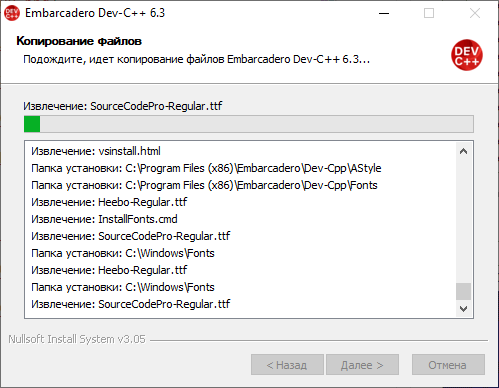
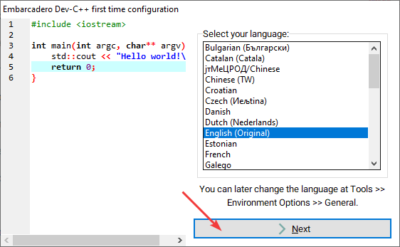
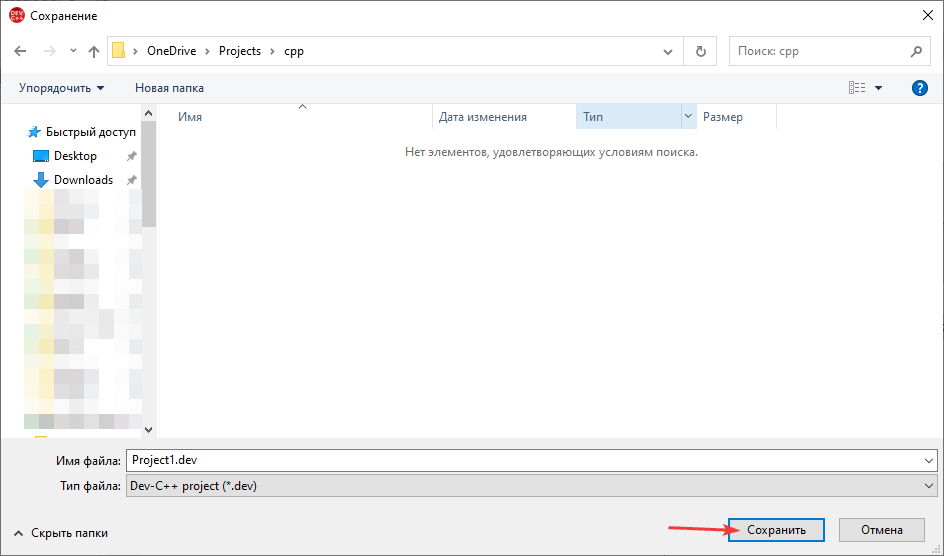

# Сложение двух чисел в Dev-C++ (консольное приложение)

В статье рассказывается как создать консольное приложения сложения двух чисел Win32 в Dev-C++.

## Установка программы

Скачиваем программу на сайте <https://sourceforge.net/projects/orwelldevcpp/>:


Под спойлером находится краткое описание установки программы.

---

**Установка Dev-C++** <!-- !details -->





Запускаем программу и настройки делаем по своему вкусу:




---

## Создание проекта (I способ)

Открываем программу `Dev-C++`:


Создаем новый проект:


Выбираем консольное приложение и название проекта:


Выбираем место, где сохраним проект:



Появится вот такая болванка:


## Создание проекта (II способ)

Если вы пользуетесь Dev C++ для обучения, то вам будет достаточно работать с одним файлом исходного кода. Для этого проект можно не создавать.

Создайте файл исходного кода:


Напишите болванку приложения:

```cpp
#include <iostream>

using namespace std;

int main () {

  return 0;
}
```

Сохраните где-нибудь файл:


## Написание кода

Добавим строчку:

```cpp
using namespace std;
```


Теперь в функции `main` добавьте код:

```cpp
int a, b, c;

cout << "Input first number" << endl;
cin >> a;

cout << "Input second number" << endl;
cin >> b;

c = a + b;

cout << "Sum " << c << endl;
```


Полный вид программы будет такой:

```cpp
#include <iostream>

/* run this program using the console pauser or add your own getch, system("pause") or input loop */

using namespace std;

int main(int argc, char** argv) {

  int a, b, c;

  cout << "Input first number" << endl;
  cin >> a;

  cout << "Input second number" << endl;
  cin >> b;

  c = a + b;

  cout << "Sum " << c << endl;

  return 0;
}
```

## Запуск программы

Вначале скомпилируем программу:


Компиляция должна пройти успешно:


А теперь запустим программу:


## Отличия от консольной программы Visual Studio

Так как данным гайдом будут пользоваться мои студенты, которые в основном будут программировать в Visual Studio, то ниже показано чем отличаются коды в двух программах, если всё описать максимально топорно и без объяснений.

Вам в программе не надо будет писать строчки:

```cpp
#include "stdafx.h"
```

```cpp
#include <windows.h>
```

Не обязательно в конце программы писать эту строчку (если запускать программу через Dev C++):

```cpp
system("pause");
```

Название главной функции в Visual Studio выглядит так:

```cpp
int _tmain(int argc, _TCHAR* argv[])
```

Название главной функции в Dev C++ выглядит так:

```cpp
int main(int argc, char** argv)
```

Или название главной функции в Dev C++ может выглядеть так:

```cpp
int main()
```
