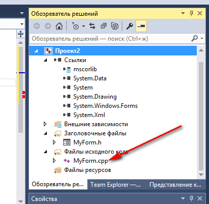

# Сложение двух чисел в Visual Studio 2015 на C++ (CLR приложение)

В статье рассказывается как создать CLR приложение сложения двух чисел в Visual Studio 2015 на C++.

## Создание проекта


## Подготовка проекта

В отличии от Visual Studio 2010 тут CLR приложения создаются пустыми без формы. Зачем они это сделали — непонятно. Будем добавлять форму самостоятельно.

Щелкаем по проекту правой кнопкой и следуем иллюстрациям:


Вполне возможно, что у вас возникнет вот такая картинка с ошибками:


Ничего страшного. Закройте и откройте форму:


Далее перейдем в файл `cpp` нашей формы:



Допишем там вот такой код после единственной строчки:

```cpp
using namespace System;
using namespace System::Windows::Forms;

[STAThread]
void Main(array<String^>^args)
{
Application::EnableVisualStyles();
Application::SetCompatibleTextRenderingDefault(false);

Проект2::MyForm form;
Application::Run(%form);
}:
```

Обратите внимание, что `Проект2` — это название вашего проекта в коде выше. Поэтому, если ваш проект называется по другому, то вставьте своё название проекта:


Щелкнем по проекту правой кнопкой и перейдем в его свойства:


В настройках компоновщика нужно в двух местах поменять настройки:


Жмем `OK`, и мы закончили прикручивать форму к нашему приложению.

Можете запустить приложение и проверить работоспособность. Если приложение скомпилируется и запустится, то всё норм. Иначе проверьте все шаги до этого:


## Интерфейс приложения

Перейдем на форму. Можно сделать двумя способами:


Обратите внимание, что код кнопок и сама форма прописывается в `h` файле, а не `cpp`.

Перетащите два `TextBox` на форму, в которые будем записывать наши числа:


Перетащите кнопку на форму:


Перетащите третий `TextBox` на форму, в которую мы будем выводить информацию:


Однострочные и многострочные текстовые поля задаются одним компонентом. Поэтому мы должны изменить параметры нашего `textBox3`, чтобы в нем можно было выводить много строк. Выделим наш `textBox3` и изменим его параметры:


Теперь мы можем его растянуть вниз:


## Написание кода основной программы

Щелкнете по кнопке двойным кликом:


Мы получили метод, в котором прописываем реакцию на клик нашей мыши:


В фигурных скобках пропишем код нашей программы по считыванию двух чисел, их сложении и выводе результата:

```cpp
int x, y, z;

//Считаем значение из первого lineEdit
String^ S1 = textBox1->Text;
//Переведем значение в число
x = Convert::ToInt32(S1);

//Считаем значение из второго lineEdit
String^ S2 = textBox2->Text;
//Переведем значение в число
y = Convert::ToInt32(S2);

//Посчитаем сумму
z = x + y;

//Выведем результат
textBox3->Text = z.ToString();
```


## Запуск программы

Я немного поменял размеры компонентов и изменил текст на кнопке. Поэтому ниже на скринах компоненты чуть по другому будут выглядеть:


Получаем наше приложение:


При вводе наших чисел получим вот это:


