# Запуск Qt приложений под Visual Studio .exe вне Qt Creator

В статье рассказывается как запускать приложения, созданные в Qt под Visual Studio без самого Qt Creator. Или же приложения должны запускаться на компах, где нет Qt.

Для версии Qt под компилятор MinGW читайте статью [Запуск Qt приложений .exe вне Qt Creator](https://github.com/Harrix/harrix.dev-blog-2014/blob/main/2014-01-28-run-qt-app-exe-outside-qt/2014-01-28-run-qt-app-exe-outside-qt.md).

Тут расскажу о самом механизме нахождения DLL, так как Qt активно развивается и регулярно новые версии выпускает и под каждую версию писать статью о новом наборе DLL накладно.

В качестве среды для разработки используется Qt 5.6.0 for Visual Studio 2015.

## Проблема

Допустим, мы создали простое приложение Qt Widgets.

При запуске приложения в самом Qt Creator (при нажатии на зеленую стрелку, или же через меню, или же иным способом) мы видим наше приложение:

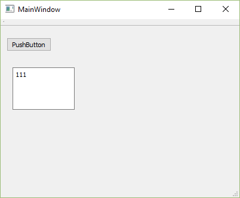

Когда мы создавали приложение, то мы видели следующее окно:

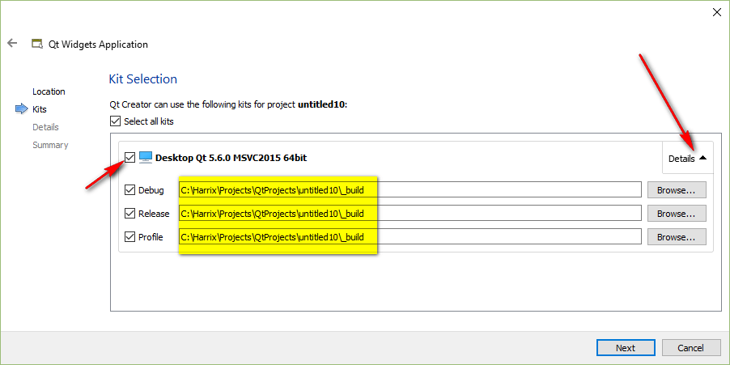

Указанные тут папки и есть папки, куда сохраняется наше приложение.

Если мы перейдем в папку `C:\Harrix\Projects\QtProjects\untitled10\_build` (у вас папка будет называться по-другому, так как я изменял путь в настройках программы), то увидим следующее:

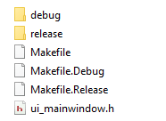

Зайдем в папку `debug` и найдем там наше приложение:

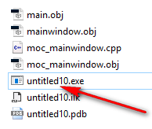

Если мы его запустим, то получим ошибку:

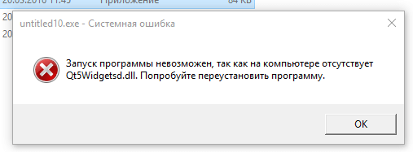

Как быть?

## Первый способ — Официальная утилита windeployqt

У Qt есть утилита `windeployqt`, которая поставляется с Qt и про которую можно прочитать тут <http://doc.qt.io/qt-5/windows-deployment.html>. Она решает ту же задачу, что и второй способ ниже.

**Update 2018.** Сейчас библиотека стала работать гораздо лучше. Поэтому ниже будет более подробная инструкция по использованию `windeployqt`.

Итак, в командной строке перейдите в папку `bin` того компилятора, под которым вы компилируете приложение в режиме `Release`. В этой папке должен быть файл `windeployqt.exe`. Например, у меня в данный момент для MinGW это папка `D:\Qt\5.12.0\mingw73_64\bin`, а для Visual Studio `D:\Qt\5.12.0\msvc2017_64\bin`.

Перейти можно с помощью команды `cd`:

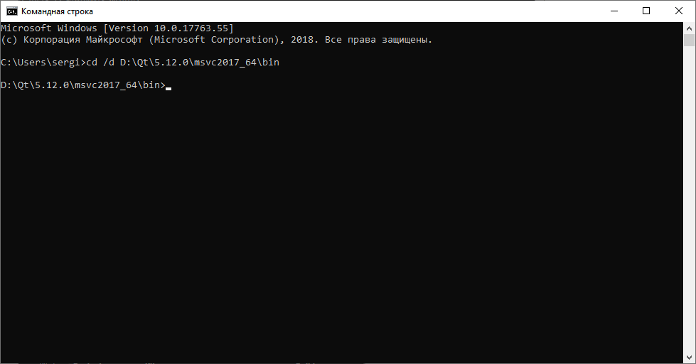

Скомпилируйте в режиме `Release` ваше приложение. Для примера я создал простое `Qt Widgets Application` и скомпилировал под Visual Studio компилятором:

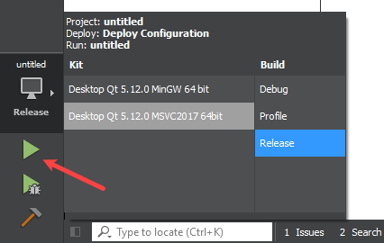

Найдите папку, в которой находится скомпилированный EXE файл. Например, в моем случае это папка `D:\Harrix\Projects\Qt\untitled\_build\release`:

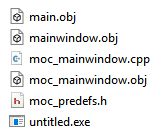

Теперь можно в командной строке вызвать `windeployqt` с указанием папки с EXE файлом:

```console
windeployqt D:\Harrix\Projects\Qt\untitled\_build\release --compiler-runtime
```

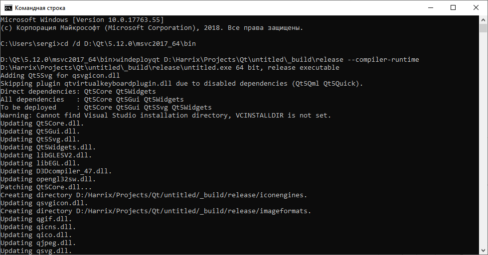

Теперь в папке добавились нужные файлы:

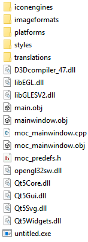

Если у вас приложение с использованием QML, то нужен параметр `--qmldir` с указанием папки, где хранятся `.qml` файлы:

```console
windeployqt --compiler-runtime --qmldir D:\Harrix\Projects\Qt\untitled D:\Harrix\Projects\Qt\untitled\_build\release
```

Стоит обратить внимание на то, что `windeployqt` может копировать лишние файлы. От них можно избавиться, потихоньку удаляя файлы из папки на чистом компьютере.

## Второй способ — Ручной

### Решение проблемы

Мы же хотим, чтобы приложение запускалось на других компах? Поэтому надо в «окончательном» виде выдавать приложение, а не в режиме отладки.

Внизу, над зеленым треугольником выбираем режим `Release`:

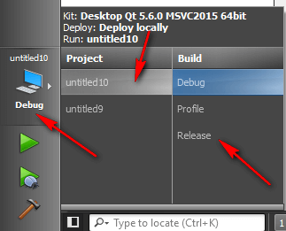

Запускаем приложение, нажатием на зеленый треугольник слева внизу Qt Creator.

Как видим, через некоторое время запустилось привычное нам приложение. Но теперь `*.exe` файл появился в папке, которое мы указывали для `Release`.

Заходим в эту папку (если в прошлый раз мы заходили в папку `debug`, то сейчас заходим в папку `release`). У меня это `C:\Harrix\Projects\QtProjects\untitled10\_build\release`:

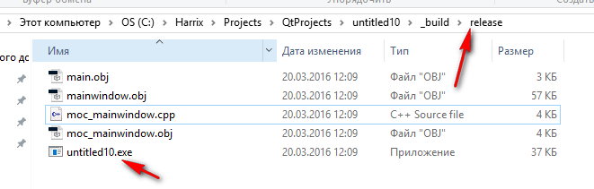

Кстати, для последующего распространения программы нам из папки нужен (из текущих файлов) только `*.exe` файл, поэтому файлы `main.obj`, `mainwindow.obj`, `moc_mainwindow.cpp`, `moc_mainwindow.obj` можно удалить без ущерба (это служебные файлы, которые при каждой компиляции будут появляться).

### Нахождение DLL и других файлов

Итак, приложение ругается на отсутствие библиотек. Где их искать?

Найдите папку, в которую устанавливался Qt. У меня это папка `C:\Qt\Qt5.6.0`

В ней найдите папку с номером версии вашего Qt. У меня это первая папка с названием `5.6`. У вас скорее всего будет немного по-другому называться:

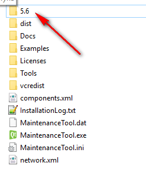

В ней будет папка компилятора Visual Studio (соответственно битности вашей версии Qt):

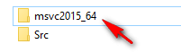

Переходим в неё:

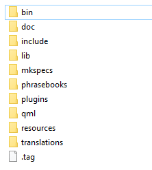

Вначале нам понабиться папка `plugins`.

Оттуда копируем в папку с EXE файлом папку `platforms`:

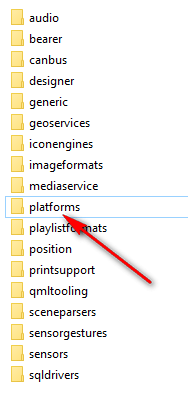

Из неё удаляем все файлы, кроме DLL и те DLL, название которых заканчивается на `d`. Это варианты библиотек для режима `Debug`:

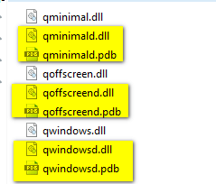

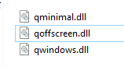

Аналогично вам потом могут понабиться файлы других подключаемых библиотек, которые вы можете использовать. Для обычного приложения вам будет нужна из папки `plugins` всего лишь папка библиотек для работы с Windows, которую мы только что скопировали.

Теперь переходим в папку с компилятором, где мы уже были. У меня это `C:\Qt\Qt5.6.0\5.6\msvc2015_64`. В ней находим главную папку `bin`:


Копируем оттуда все DLL, название которых не заканчивается на `d`, в папку с EXE файлом.

Кстати, вам может понабиться файл `qt.conf`, а может и нет.

Если приложение не запускается при этих файлах, то еще не скопировали DLL (например, из папки `plugins`). Если при этом запустится ваше приложение, то все библиотеки есть, но большинство — лишние.

После этого вас ждет «увлекательный» процесс по поочередному удалению DLL и запуску приложения. Оставьте только те, без которых программа не запустится. У меня для простейшего приложения потребовались лишь эти файлы:

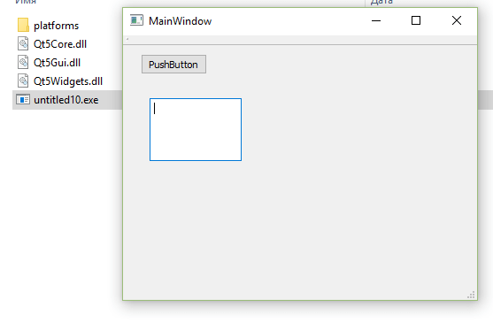

### Это еще не конец

Если у вас был бы Qt под MinGW, то на этом история закончилась, когда вы нашли все DLL и возможно добавили `qt.conf`. Но вы же работаете с Visual Studio.

Запустите приложение на чистой операционной системе (желательно Windows 7 или 8.1, а не Windows 10). И у вас программа скорее всего не запустится ввиду отсутствия некоторых DLL.

Например, я работал с Qt под Visual Studio 2015, и у меня потребовали библиотеку `VCRUNTIME140.dll`. В общем, вам нужны в операционной системе файлы под Visual Studio 2015 (или какой версии вы пользуйтесь).

Пакеты Visual C++ Redistributable для разных версий Visual Studio: <https://support.microsoft.com/ru-ru/help/2977003/the-latest-supported-visual-c-downloads>.

Например, для Visual Studio 2015 вам нужно установить пакет <https://www.microsoft.com/en-us/download/confirmation.aspx?id=48145>:

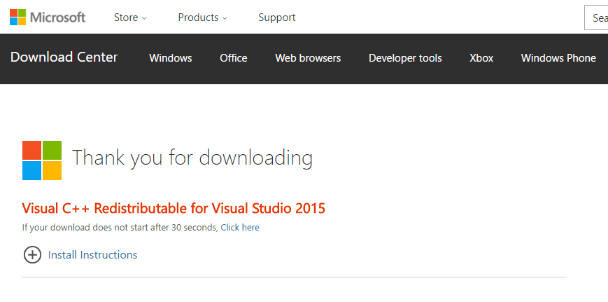

То есть вам нужно будет выбрать один из нескольких вариантов:

- обязать пользователя установить самому данный пакет (или установить всю Visual Studio) в инструкции по установке программы;
- поставлять файлы пакета со своей программой (ничего не могу сказать про лицензирование);
- встроить нужные файлы в установщик вашей программы (в этой статье не обсуждается).
