# Создание SQLite базы данных в DB Browser for SQLite

Базы данных [SQLite](https://ru.wikipedia.org/wiki/SQLite) очень удобны для работы с небольшими объемами данных как в Windows приложениях, так и в Android приложениях. В статье говорится, как создавать и подготавливать базы данных заранее.

Особенно SQLite удобен тем, что не нужно поднимать сервер СУБД перед использованием в приложениях.

## Установка DB Browser for SQLite

Итак, скачиваем версию без установщика `DB Browser for SQLite` (`SQLiteBrowser`): <http://sqlitebrowser.org>:

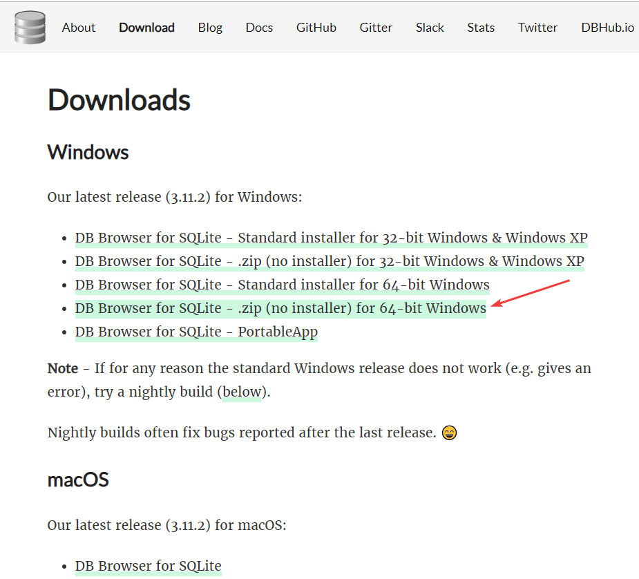

Просто распаковываем архив. В нем будет два EXE файла:

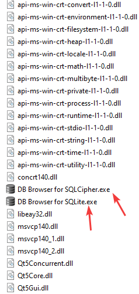

Файл `DB Browser for SQLite.exe` представляет обычную версию программы, а файл `DB Browser for SQLCipher.exe` позволяет работать с зашифрованными базами данных. И во второй программе есть вот такой пункт:

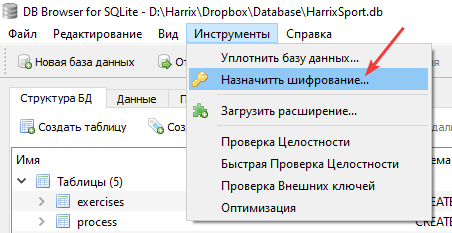

Окно программы:

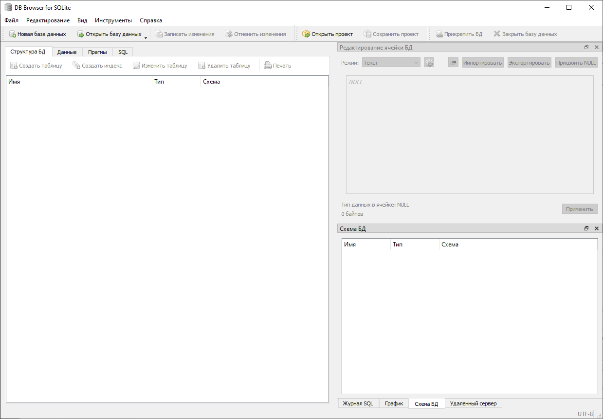

## Создание базы данных

Создадим простую базу данных `database` с одной таблицей и тремя столбцами:

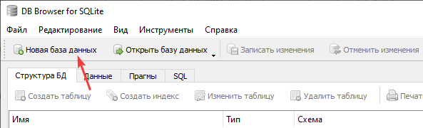

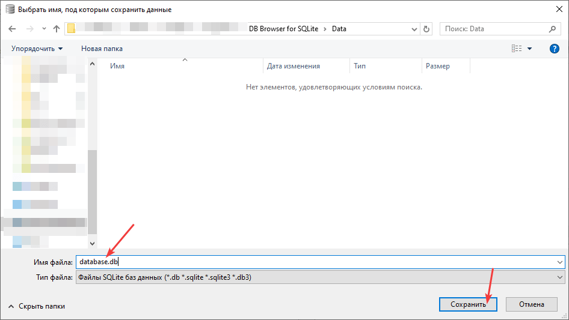

Появится окно создания таблицы в программе:

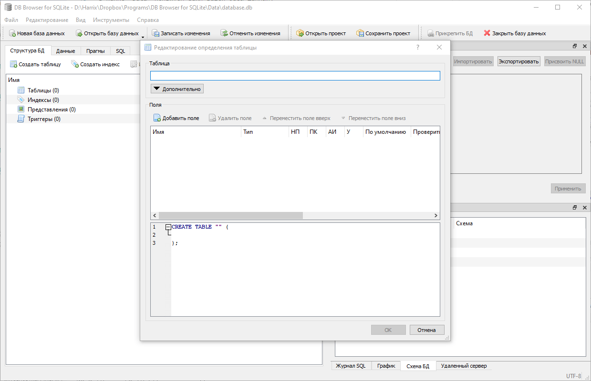

Создадим таблицу `People`:

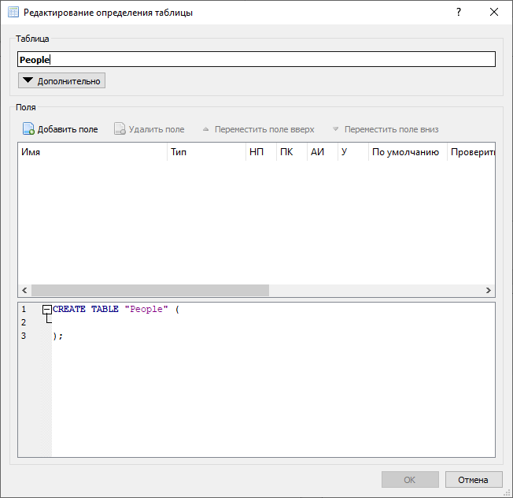

Ввиду того, что вдруг база данных будет использоваться в Android, то первым полем задавайте идентификатор по имени `_id`:

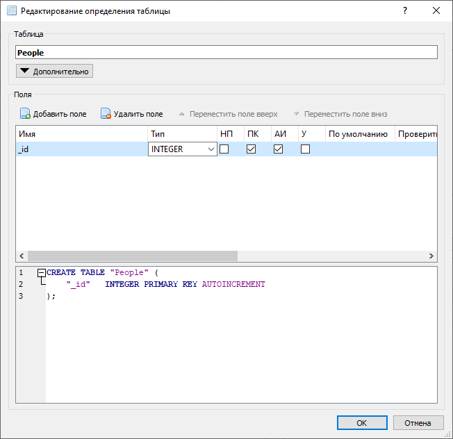

Добавим, например, поля `Name` и `Age`:

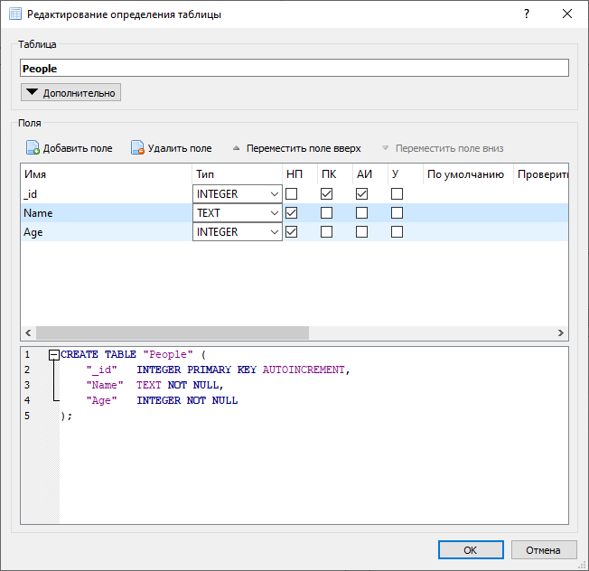

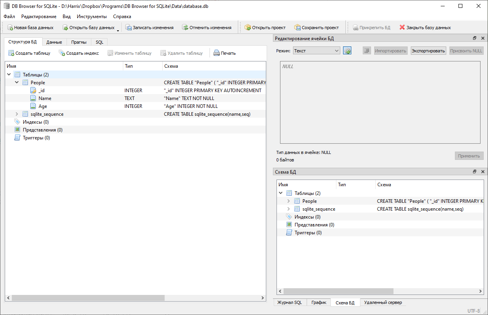

Во вкладке `Данные` можем вносить данные:

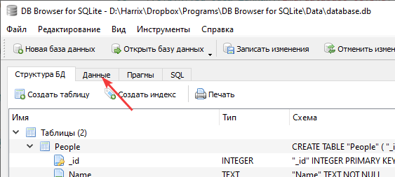

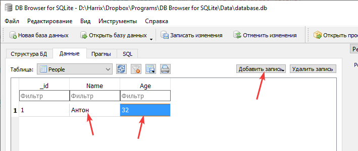

Сохраним изменения:

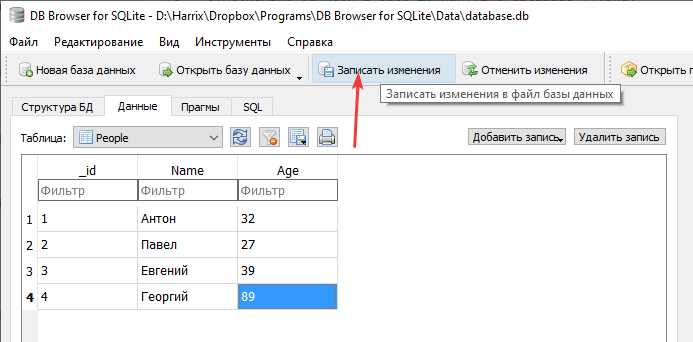

У вас есть готовая база данных SQLite, которую можете использовать, где вам нужно:

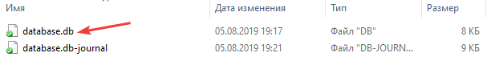
