# Сложение двух чисел в Delphi 10 Seattle на Pascal

В статье рассказывается как создать приложение сложения двух чисел в Delphi 10 Seattle.

## Создание нового приложения

Переходим в `File` → `New` → `VCL Form Application - Delphi`:

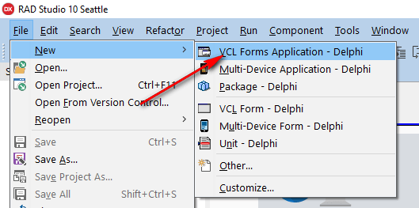

Появится вот такой вид:

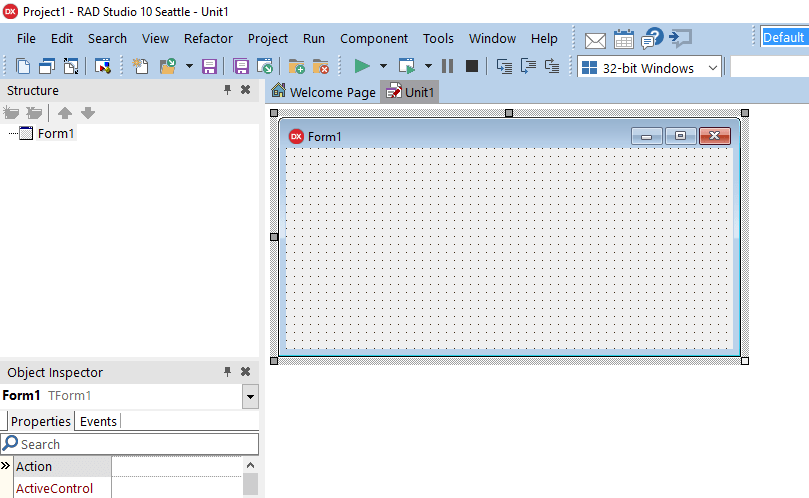

Сохраняем всё в папке новой:

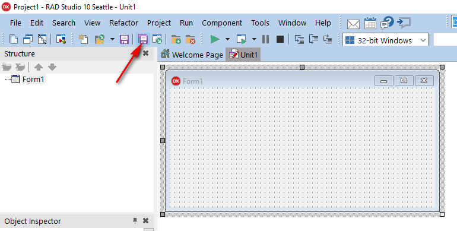

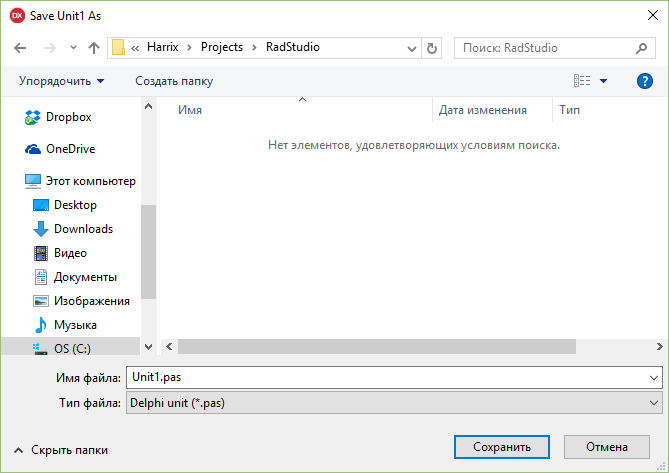

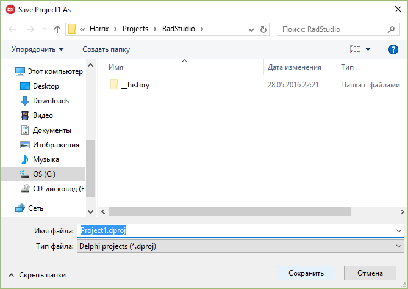

## Заполняем форму

На форму кидаем два поля ввода:

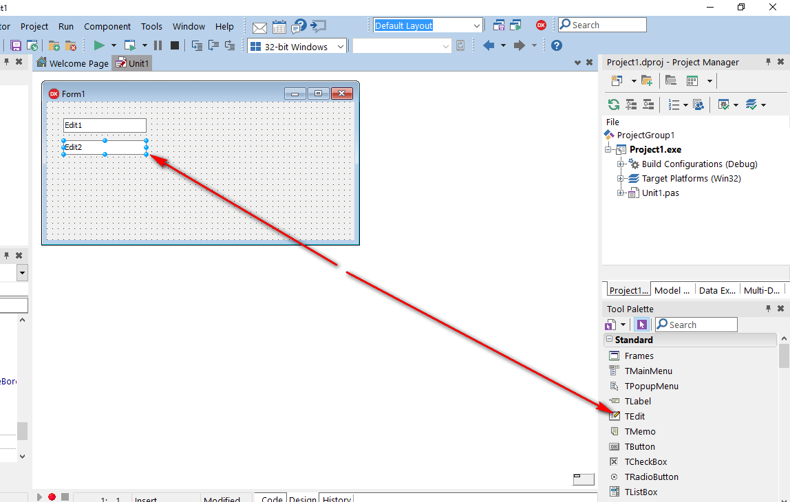

Кнопку:

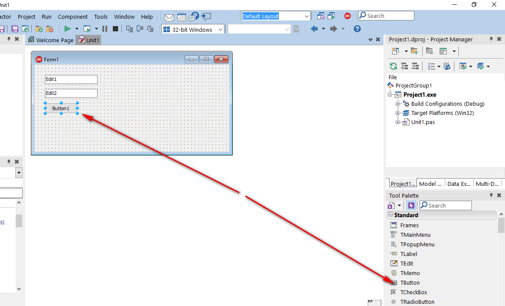

И поле для вывода многострочного текста:

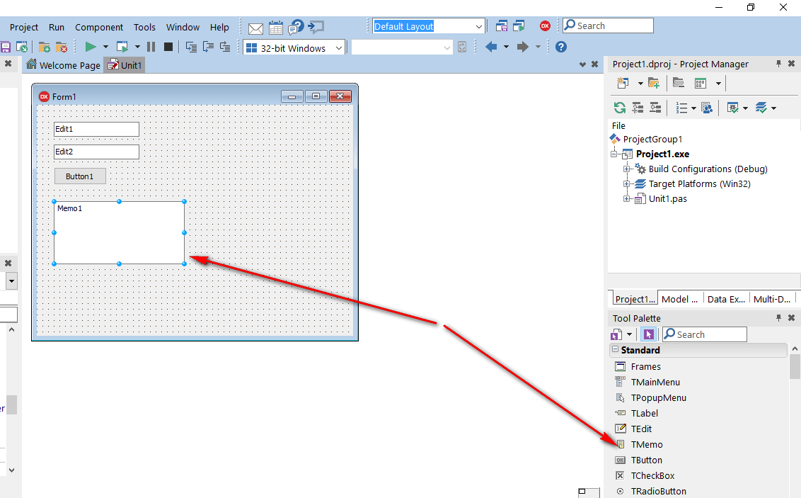

В поле для вывода `Memo1` удалим первоначальное содержимое:

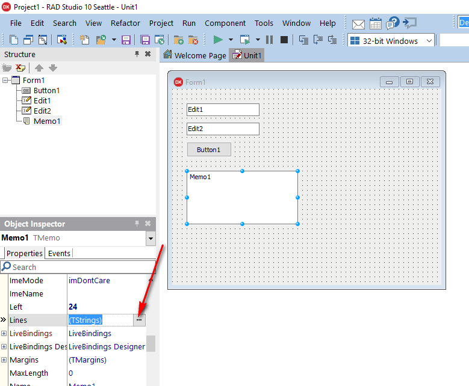

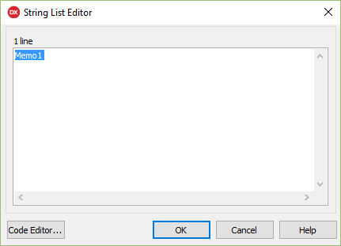

Также в поля ввода `Edit1` и `Edit2` введем первоначальное значение:

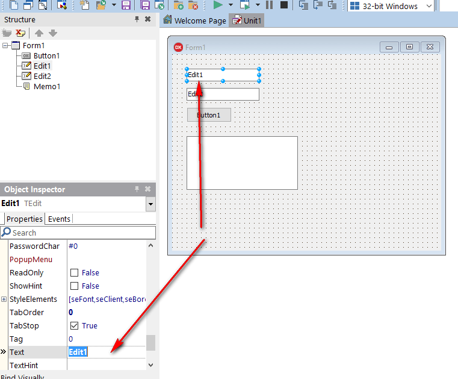

## Написание кода

Теперь можно переходить к написанию кода.

Двойной клик по кнопке:

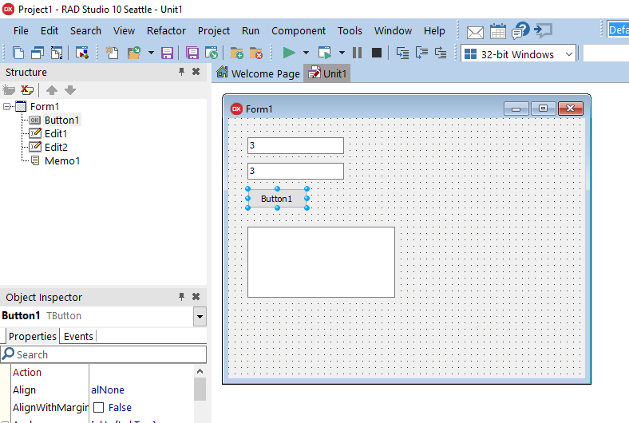

И видим это:

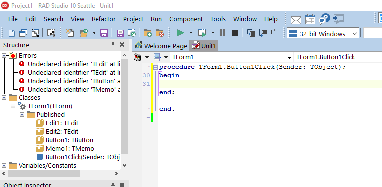

Добавьте переменные:

```pascal
a,b,c : Integer;
S1, S2: UnicodeString;
```

И вводим такой код:

```pascal
S1 := Edit1.Text;
S2 := Edit2.Text;

a := S1.ToInteger;
b := S2.ToInteger;

c := a + b;

Memo1.Lines.Add(IntToStr(a) + ' + ' + IntToStr(b) + ' = ' + IntToStr(c));:

```

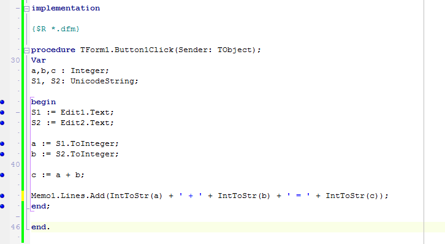

Теперь сохраняем всё и запускаем приложение:

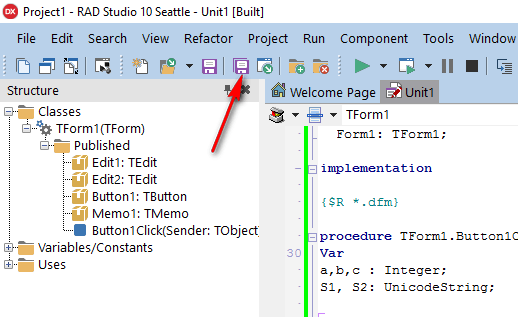

При нажатию на кнопку вы получите результат:

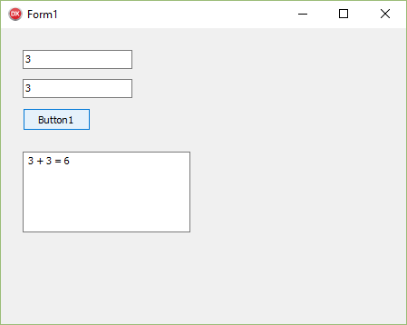
