# Сложение двух чисел в Free Pascal IDE на Pascal (консольное приложение)

В статье рассказывается как создать консольное приложения сложения двух чисел в Free Pascal IDE.

## Установка программы

Под спойлером находится краткое описание установки программы.

---

**Установка Free Pascal IDE** <!-- !details -->

Скачиваем программу тут: <https://sourceforge.net/projects/freepascal/files/?source=navbar>:

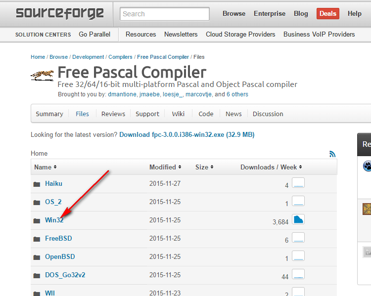

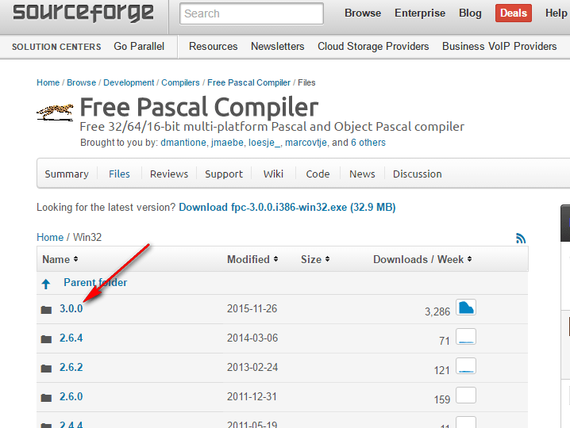

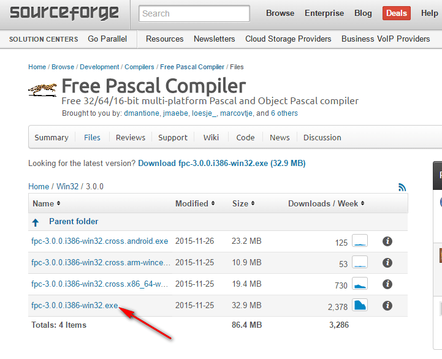

И устанавливаем:

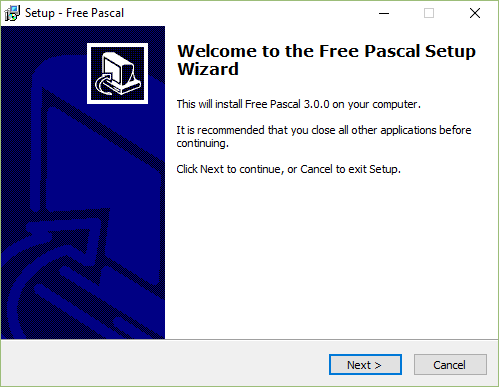

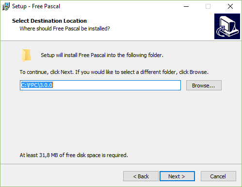

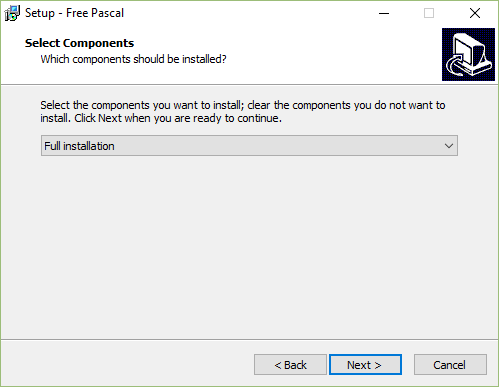

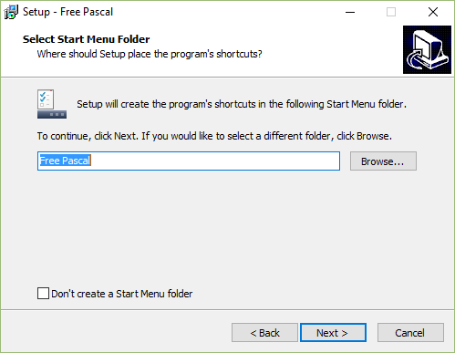

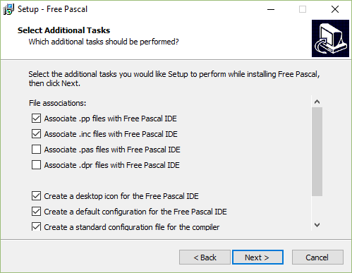

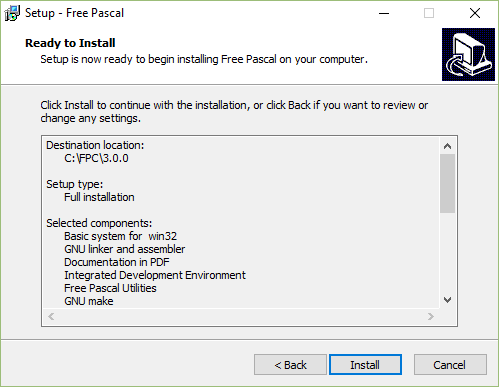

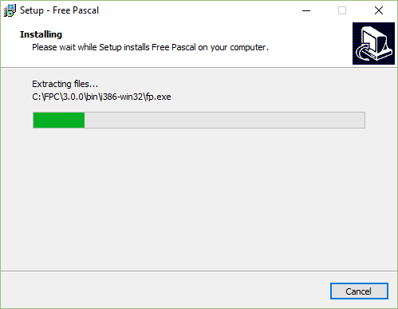

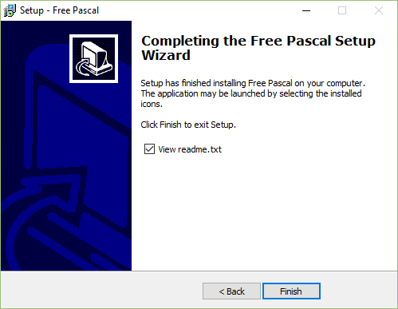

---

## Создаем проект

Создаем новый проект:

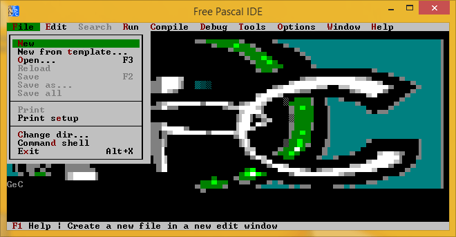

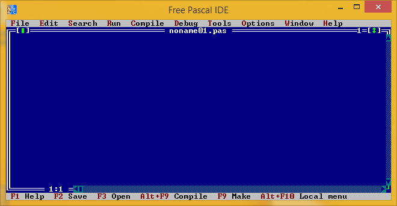

## Написание кода

Пропишите такой код:

```pascal
uses crt;
var
   a,b,c:integer;
begin
    clrscr;
    writeln('Input first number');
    readln(a);

    writeln('Input second number');
    readln(b);

    c := a + b;

    writeln('Sum ', c);

    readln();
end.
```

## Запуск программы

Вначале скомпилируем приложение:


Перед компиляцией попросит сохранить файл:

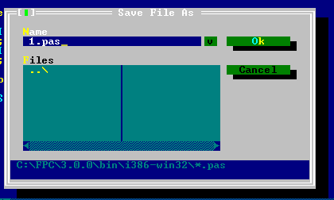

При успешном компилировании увидите вот такое окно:

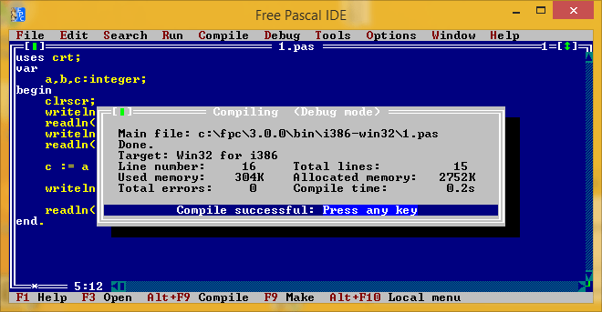

И запустим приложение:

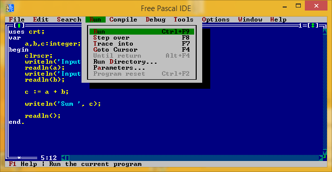

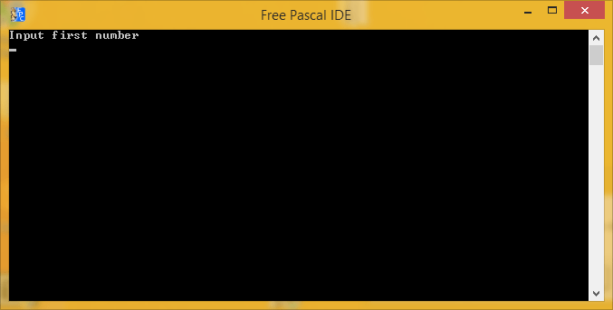

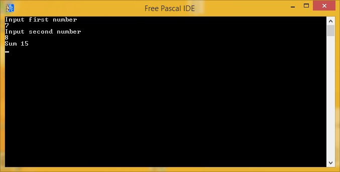
