# Сложение двух чисел в Visual Studio 2015 на C++/CLI (Windows 10 UWP приложение)

В статье рассказывается как создать приложение сложения двух чисел в Visual Studio 2015 на C++/CLI в виде универсального приложения под Windows 10 или Metro приложения приложения.

## Подготовка

При создании приложения Windows попросит перевести устройство в режим разработчика:

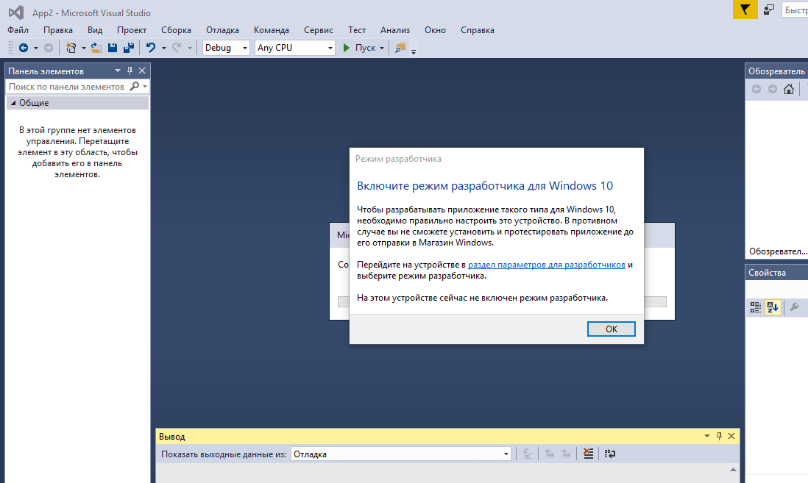

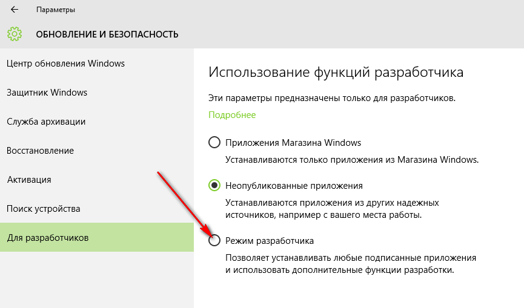

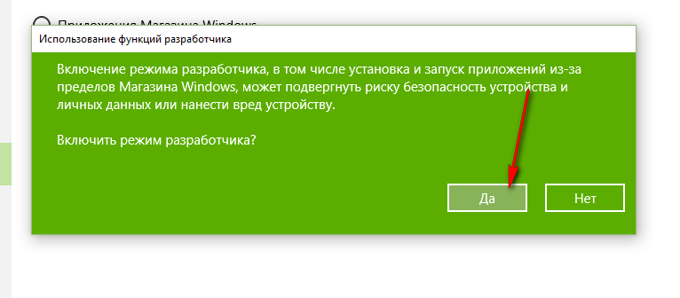

## Создание проекта

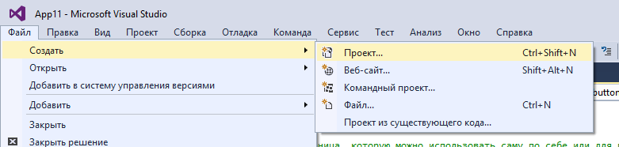

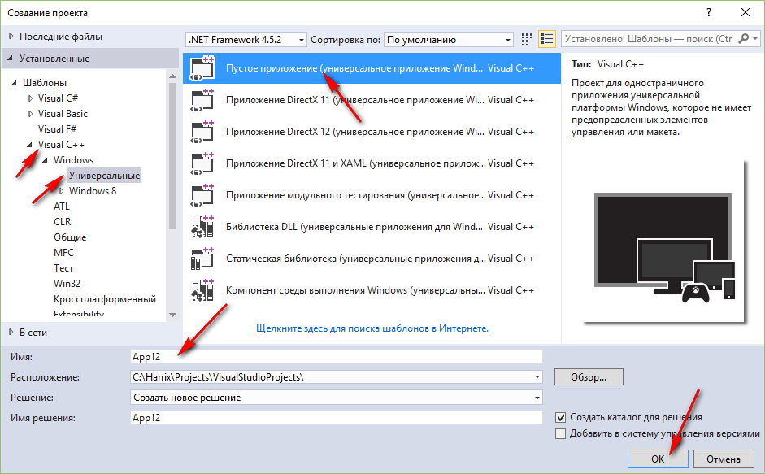

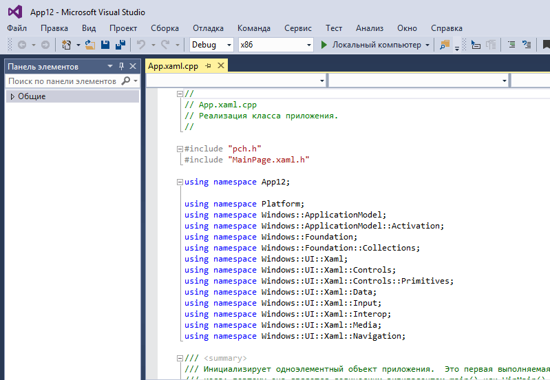

## Интерфейс приложения

Откройте файл `MainPage.xaml`:

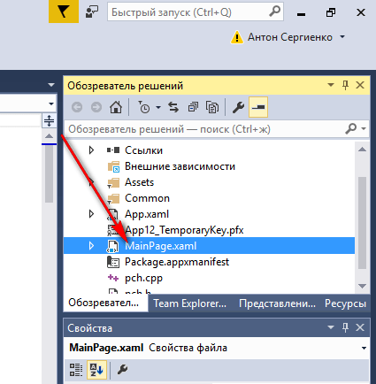

Если находитесь не в конструкторе, то перейдите в него. Конструктор открывается не очень быстро. В результате увидите это окно:

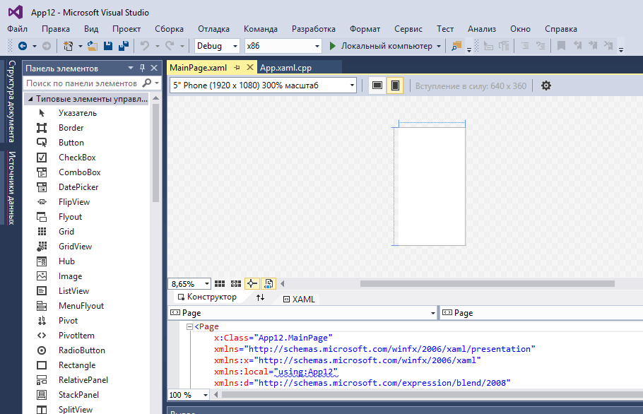

Пока мы не собираемся писать приложения под все платформы с адаптивным дизайном, поэтому в качестве платформы для конструктора выберете `Desktop`:

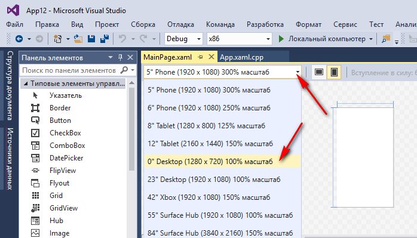

Перетащите два `textBox` на форму, в которые будем записывать наши числа:

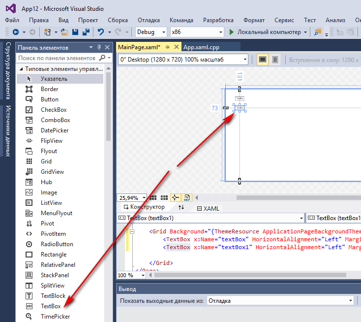

И поменяйте значения в этих полях ввода:

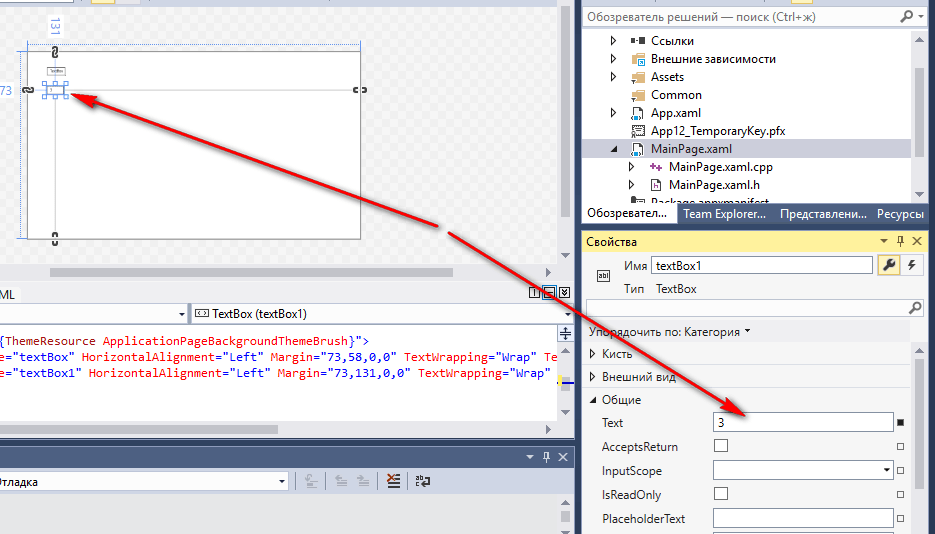

Перетащите кнопку на форму:

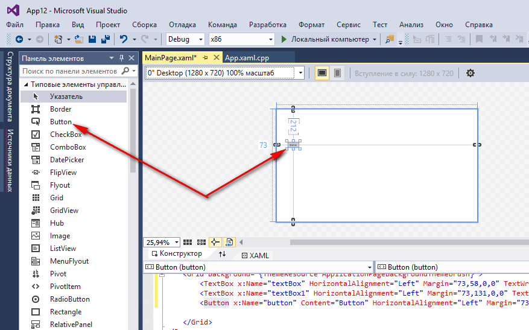

Перетащите третий `textBox` на форму, в которую мы будем выводить информацию, и растяните его:

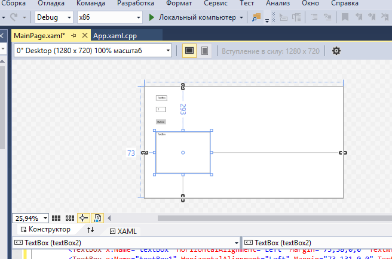

## Написание кода основной программы

Щелкнете по кнопке двойным кликом:

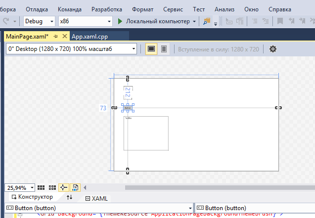

Мы получили метод, в котором прописываем реакцию на клик нашей мыши:

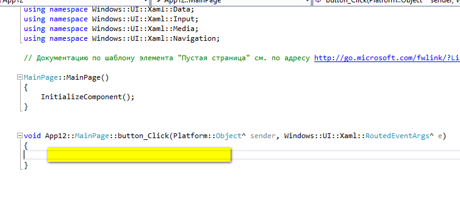

В фигурных скобках пропишем код нашей программы по считыванию двух чисел, их сложении и выводе результата:

```cpp
int x, y, z;
// Считаем значение из первого textBox
String^ S1 = textBox->Text;
// Переведем значение в число
wstring ws1(S1->Data());
wstringstream convertor;
convertor << ws1;
convertor >> x;

// Считаем значение из второго textBox
String^ S2 = textBox1->Text;
// Переведем значение в число
wstring ws2(S2->Data());
wstringstream convertor2;
convertor2 << ws2;
convertor2 >> y;

// Посчитаем сумму
z = x + y;

// Выведем результат
textBox2->Text = z.ToString();
```

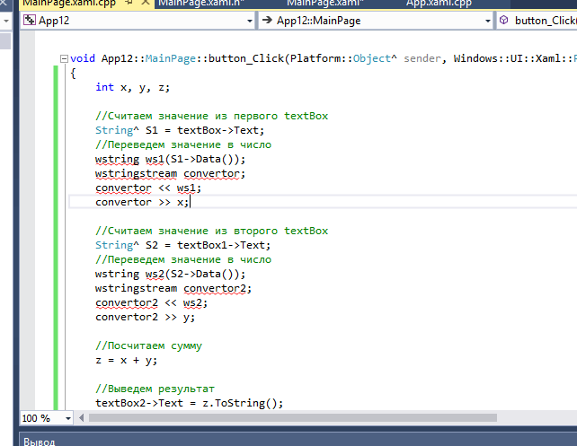

Обратите внимание на то, что приходится вот таким страшным способом переводить строчки в числа, так как стандартные функции `int::Parse(S2);` не работают.

Также сейчас нужно в этом файле прописать строчку:

```cpp
using namespace std;
```

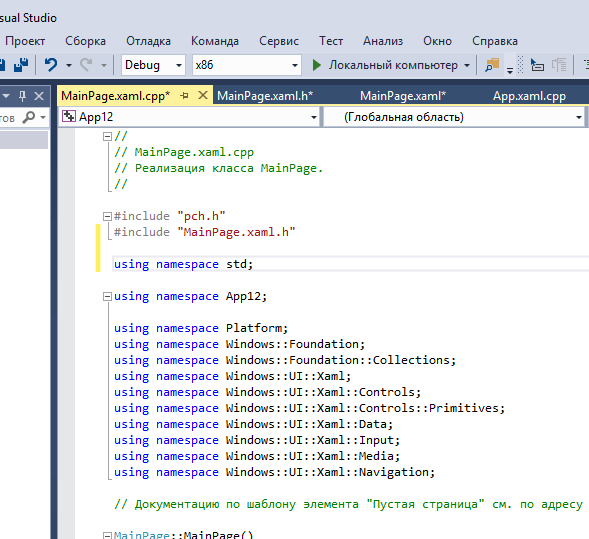

А также нужно перейти в файл `pch.h`:

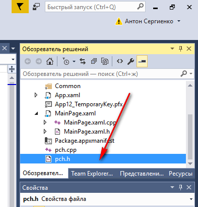

И там пропишите строчки:

```cpp
#include <stdlib.h>
#include <stdio.h>
#include <errno.h>
#include <iostream>
#include <sstream>
```

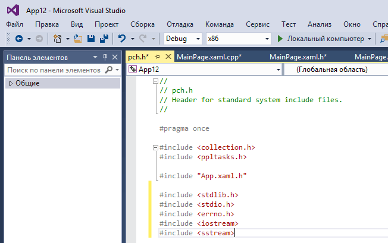

## Запуск программы

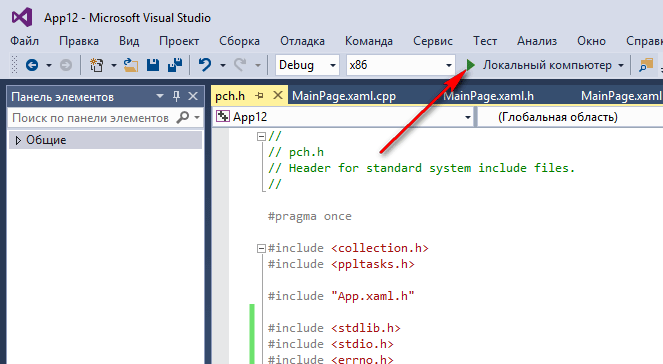

Получаем наше приложение:

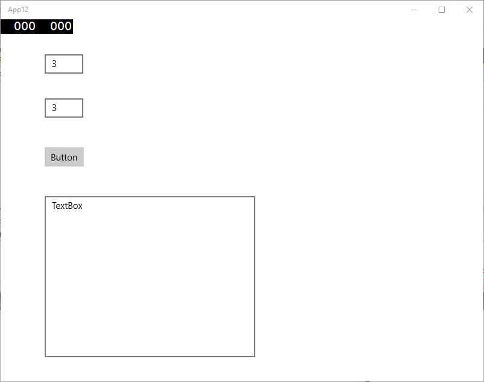

Чтобы не видеть служебной черной надписи вверху слева, то выберете режим не `Debug`, а `Release`:

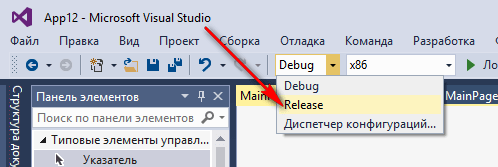

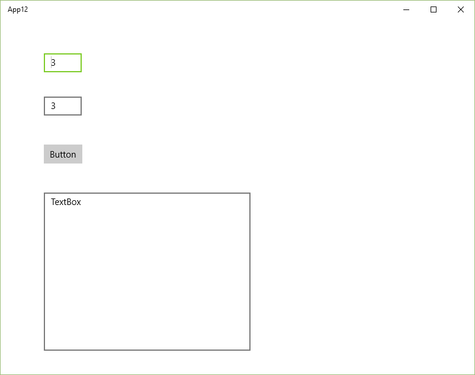

При вводе наших чисел и нажатии на кнопку получим вот это:

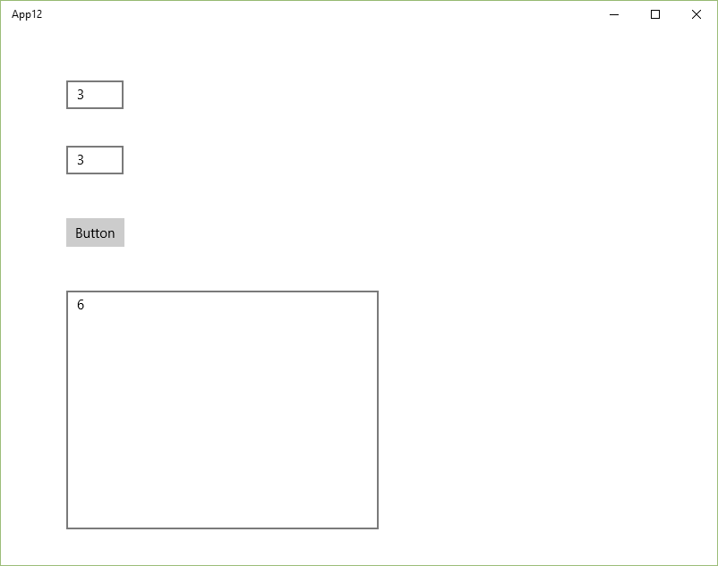
