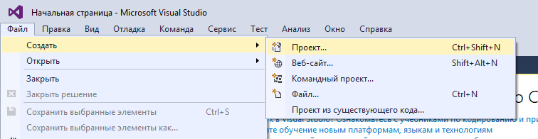
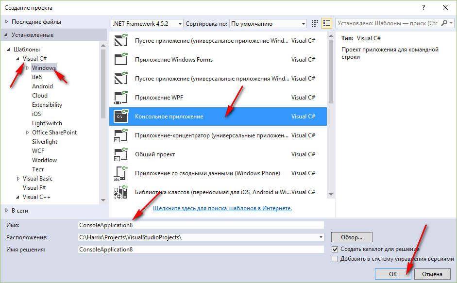
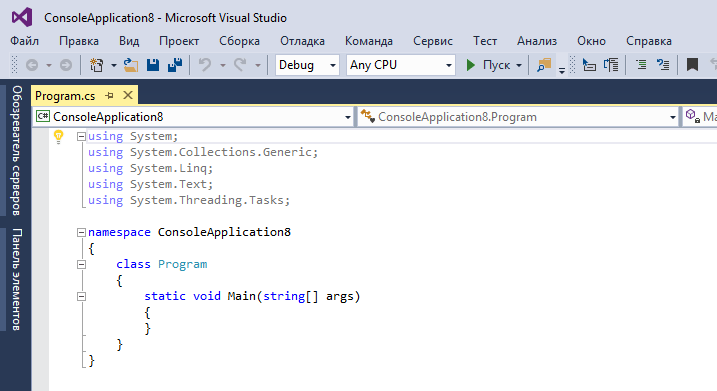
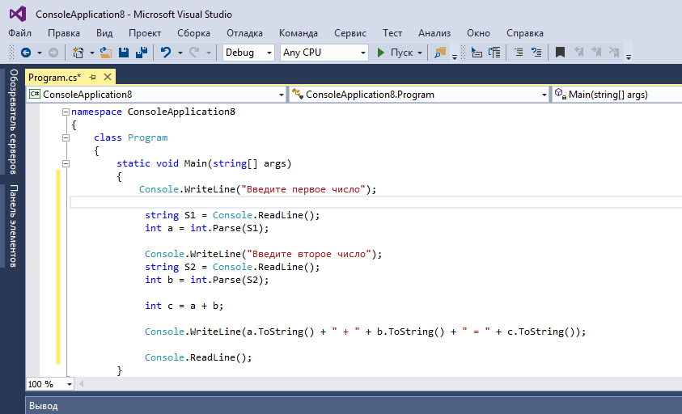
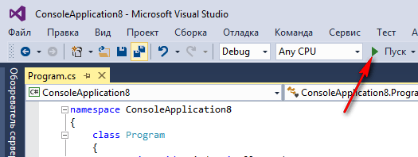
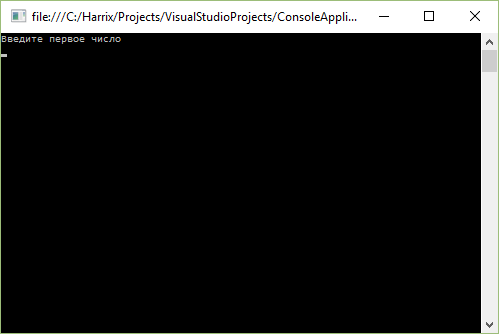
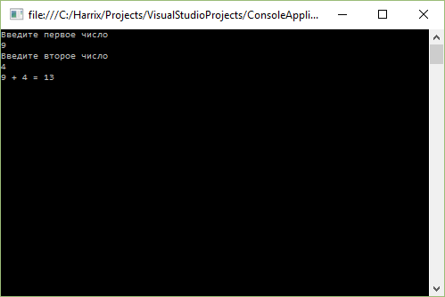

# Сложение двух чисел в Visual Studio 2015 на C# (консольное приложение)

В статье рассказывается как создать консольное приложения сложения двух чисел на C# в Visual Studio 2015.

## Создание проекта







## Написание кода основной программы

Пропишем в методе `Main` основного класса такой код:

```cs
Console.WriteLine("Введите первое число");

string S1 = Console.ReadLine();
int a = int.Parse(S1);

Console.WriteLine("Введите второе число");
string S2 = Console.ReadLine();
int b = int.Parse(S2);

int c = a + b;

Console.WriteLine(a.ToString() + " + " + b.ToString() + " = " + c.ToString());

Console.ReadLine();
```

Полная программа будет выглядеть так:

```cs
using System;
using System.Collections.Generic;
using System.Linq;
using System.Text;
using System.Threading.Tasks;

namespace ConsoleApplication8
{
    class Program
    {
        static void Main(string[] args)
        {
            Console.WriteLine("Введите первое число");

            string S1 = Console.ReadLine();
            int a = int.Parse(S1);

            Console.WriteLine("Введите второе число");
            string S2 = Console.ReadLine();
            int b = int.Parse(S2);

            int c = a + b;

            Console.WriteLine(a.ToString() + " + " + b.ToString() + " = " + c.ToString());

            Console.ReadLine();
        }
    }
}
```



## Запуск программы



Получаем наше приложение:




