# Сложение двух чисел в Visual Studio 2015 на C# (WPF приложение)

В статье рассказывается как создать приложение сложения двух чисел в Visual Studio 2015 на C# в виде WPF приложения.

## Создание проекта

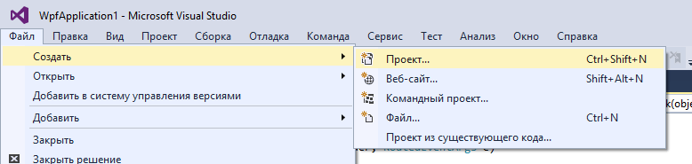

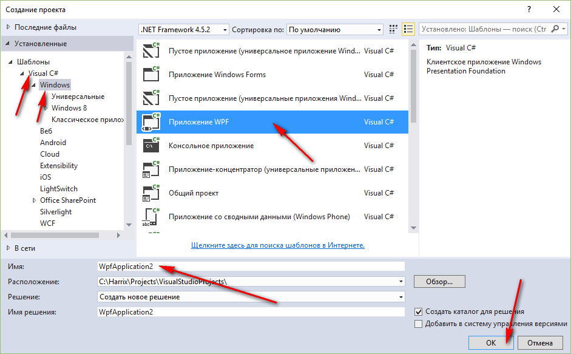

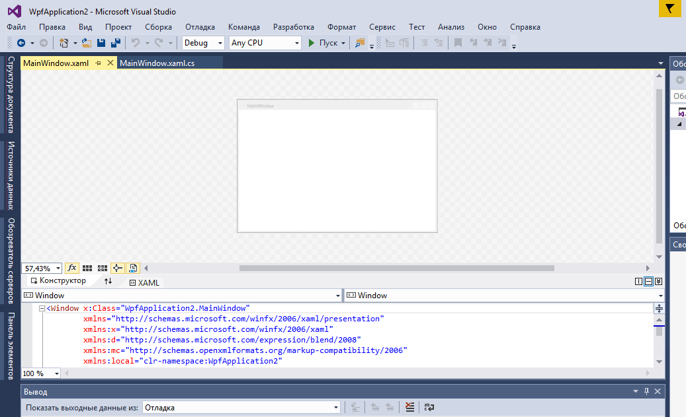

Откройте панель инструментов:

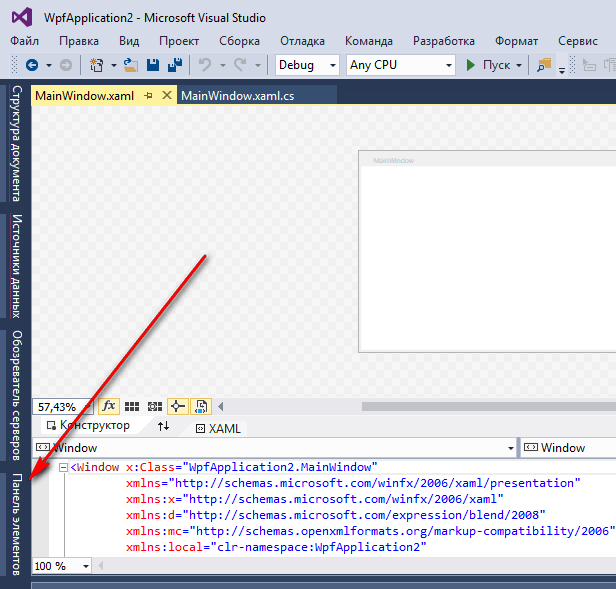

## Интерфейс приложения

Перетащите два `textBox` на форму, в которые будем записывать наши числа:

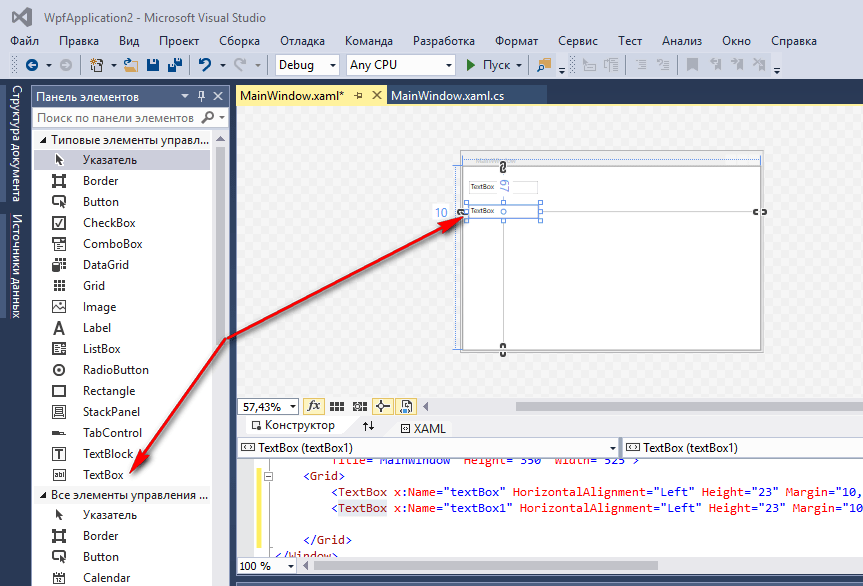

И поменяйте значения в этих полях ввода:

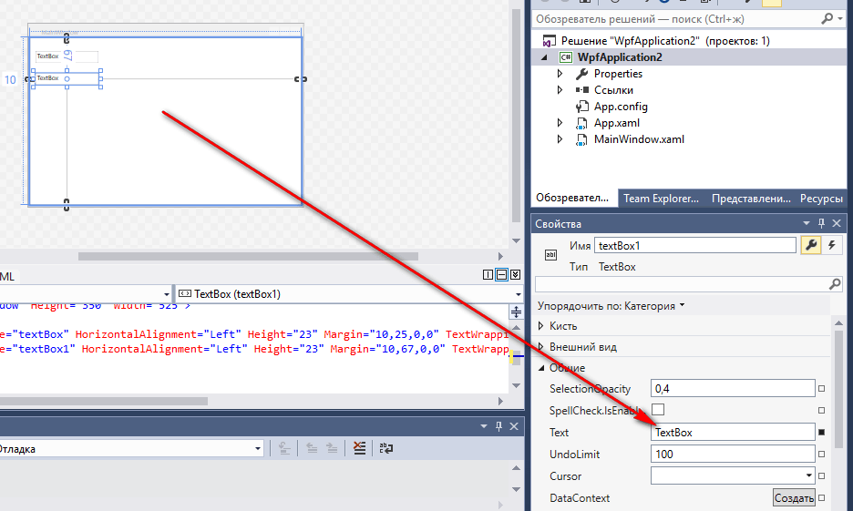

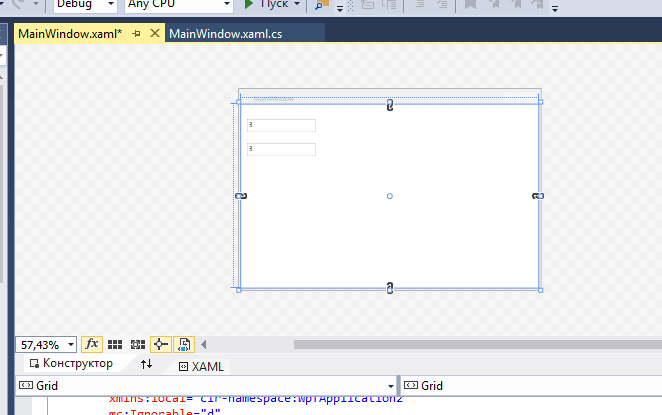

Перетащите кнопку на форму:

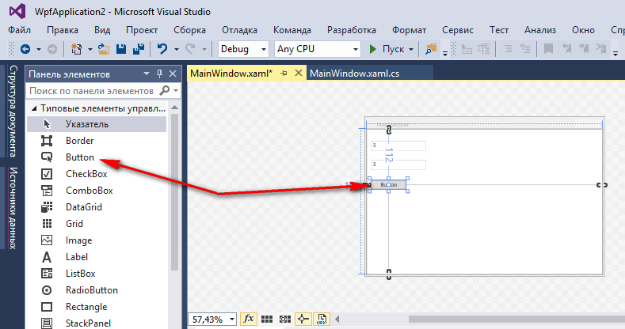

Перетащите третий `textBox` на форму, в которую мы будем выводить информацию, и растяните его:

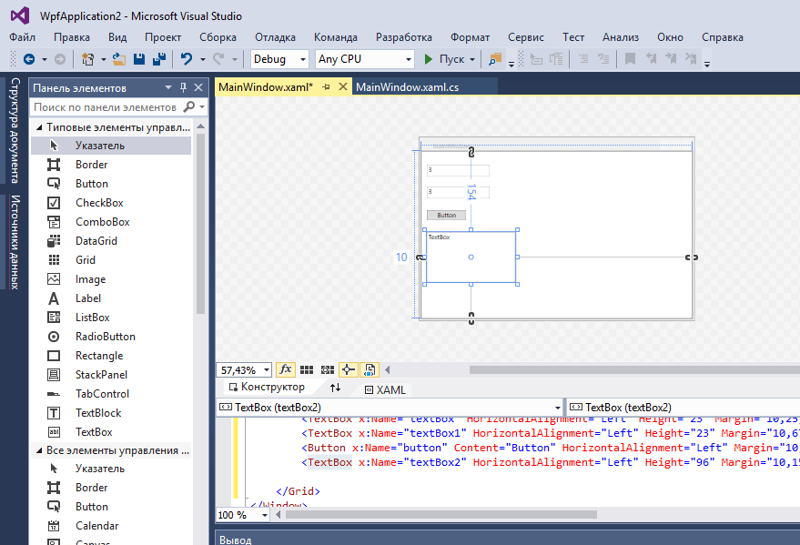

## Написание кода основной программы

Щелкнете по кнопке двойным кликом:

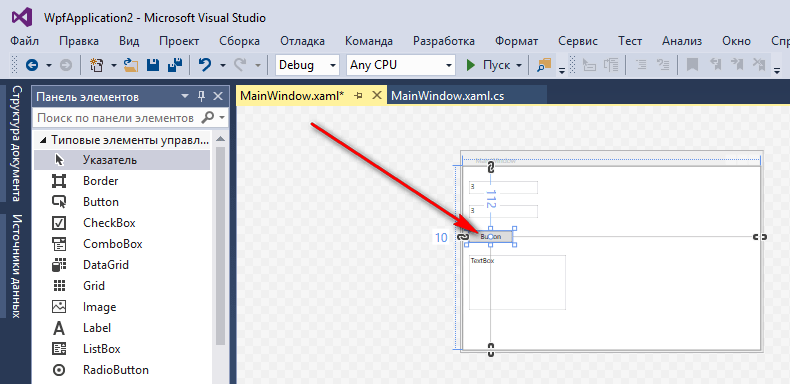

Мы получили метод, в котором прописываем реакцию на клик нашей мыши:

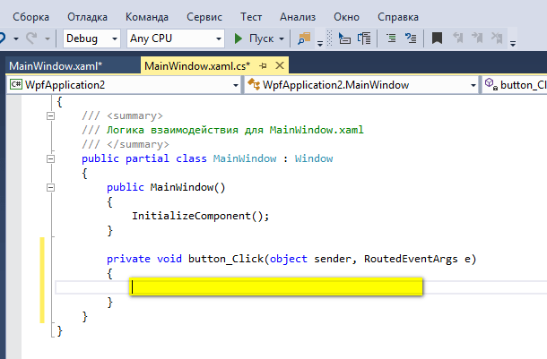

В фигурных скобках пропишем код нашей программы по считыванию двух чисел, их сложении и выводе результата:

```cs
int x, y, z;

// Считаем значение из первого lineEdit
string S1 = textBox.Text;
//Переведем значение в число
x = Convert.ToInt32(S1);

// Считаем значение из второго lineEdit
string S2 = textBox1.Text;
// Переведем значение в число
y = Convert.ToInt32(S2);

// Посчитаем сумму
z = x + y;

// Выведем результат
textBox2.Text = z.ToString();
```

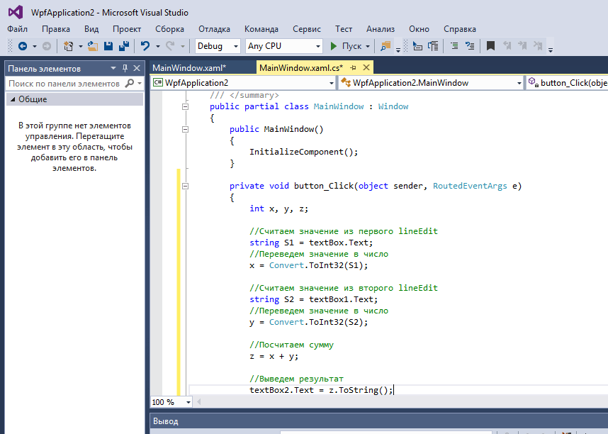

## Запуск программы

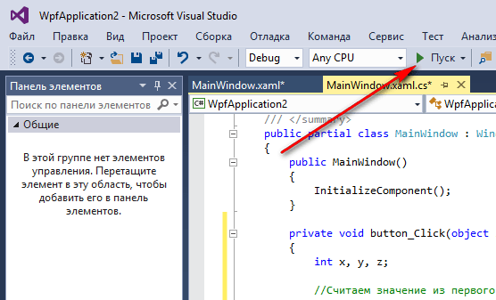

Получаем наше приложение:


При вводе наших чисел получим вот это:

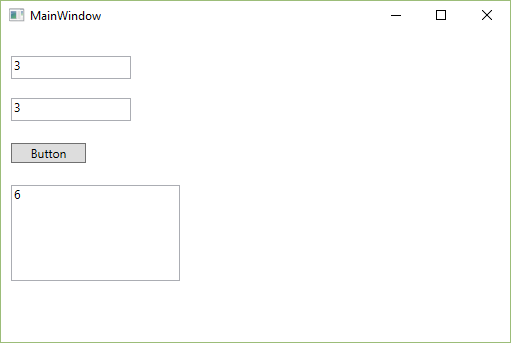
