# Сложение двух чисел в Visual Studio 2015 на C# (консольное приложение)

В статье рассказывается как создать приложение сложения двух чисел в Visual Studio 2015 на C#.

## Создание проекта


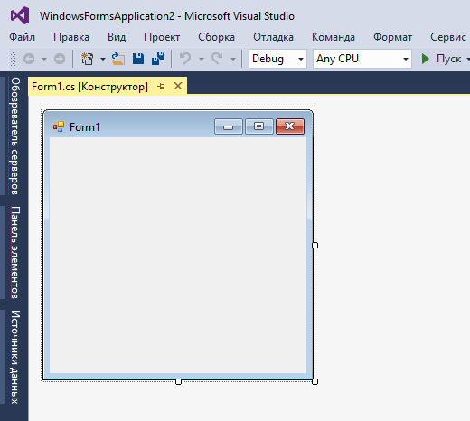

## Интерфейс приложения

Перетащите два `textBox` на форму, в которые будем записывать наши числа:

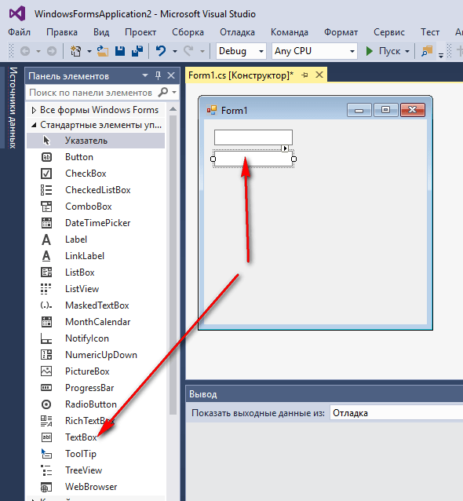

Перетащите кнопку на форму:


Перетащите третий `textBox` на форму, в которую мы будем выводить информацию. Также поменяем значение `Multiline` на `true`, чтобы можно было писать многострочные тексты:

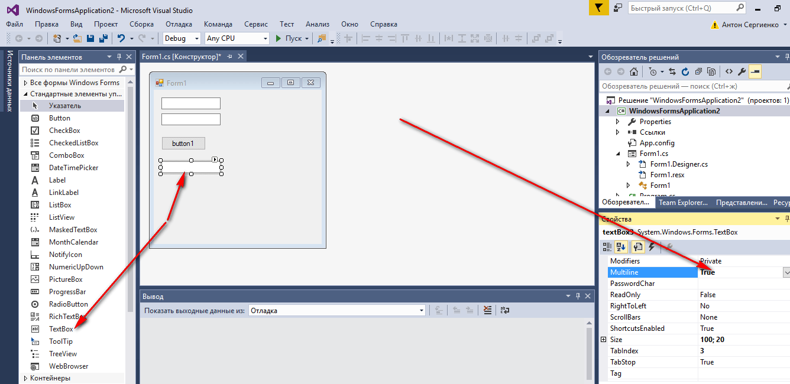

Теперь мы можем его растянуть вниз:

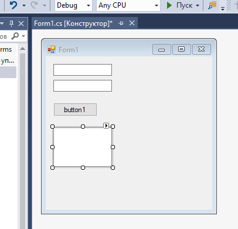

А в первых двух `textBox` поменяем начальное значение:

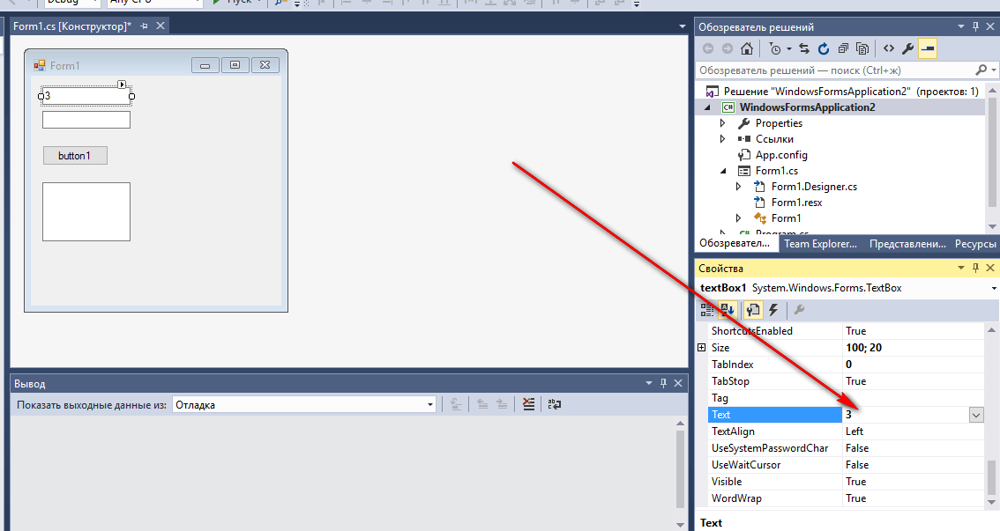

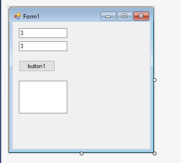

## Написание кода основной программы

Щелкнете по кнопке двойным кликом:

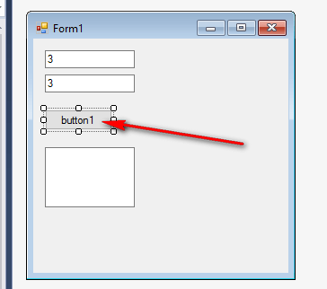

Мы получили метод, в котором прописываем реакцию на клик нашей мыши:

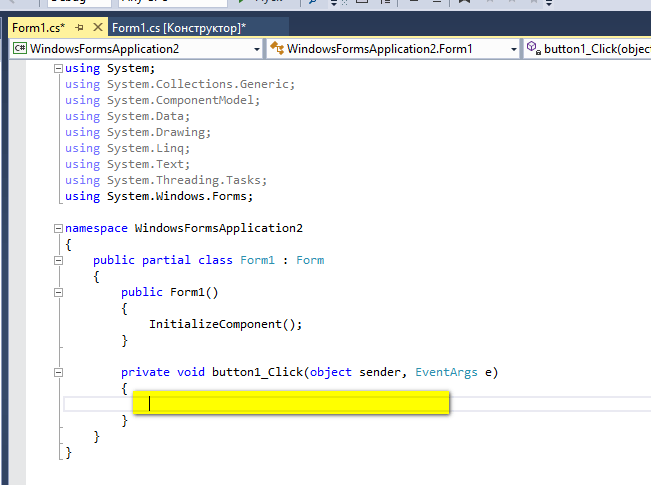

В фигурных скобках пропишем код нашей программы по считыванию двух чисел, их сложении и выводе результата:

```cs
int x, y, z;

// Считаем значение из первого lineEdit
string S1 = textBox1.Text;
// Переведем значение в число
x = Convert.ToInt32(S1);

// Считаем значение из второго lineEdit
string S2 = textBox2.Text;
// Переведем значение в число
y = Convert.ToInt32(S2);

// Посчитаем сумму
z = x + y;

// Выведем результат
textBox3.Text = z.ToString();
```

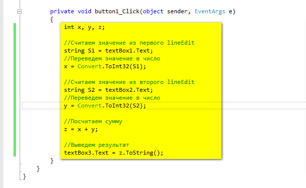

## Запуск программы

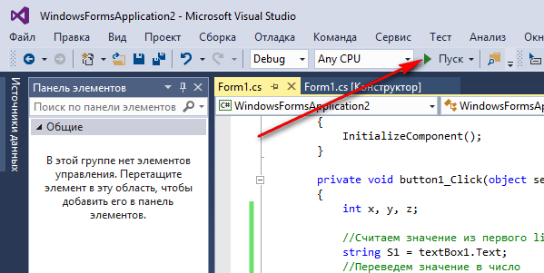

Получаем наше приложение:

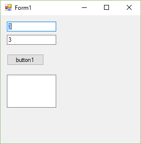

При вводе наших чисел получим вот это:

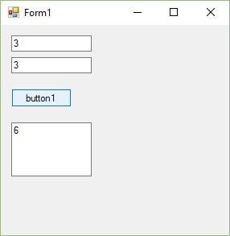
