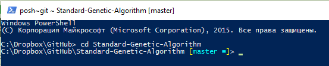
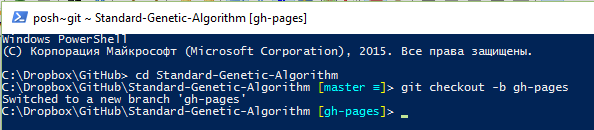
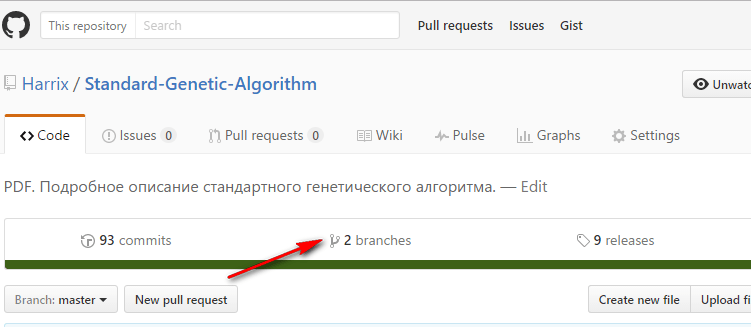
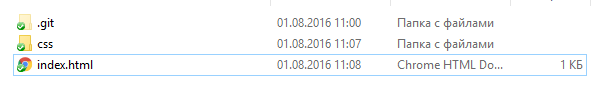
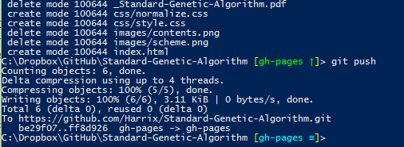
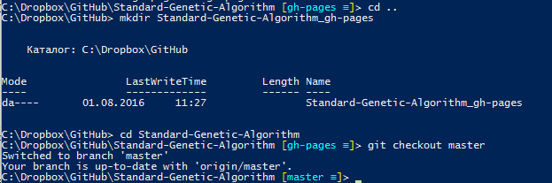
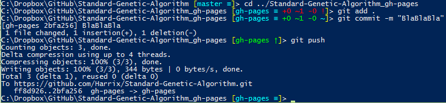

# Совмещаем gh-pages с git-worktree

GitHub pages — отличный способ публикации сайтов о ваших проектах на GitHub. Для этого нужно создать ветку в репозитории с названием gh-pages, где нужно разместить нужные HTML файлы. Однако это означает, что придется постоянно переключатся между двумя ветками, чтобы вносить изменения в репозиторий и на сайт о данном репозитории. Но на помощь приходит сравнительно новая команда worktree.

## Создание новой ветки

Покажу на примере одного из своего репозитории <https://github.com/Harrix/Standard-Genetic-Algorithm>.

На самом деле, не очень люблю консоль и предпочитаю GUI клиенты. Однако с командой `worktree` программа `GitHub Desktop` нормально работать не умеет, поэтому будем работать в консоли `Git Shell`:


Переходим в папку нашего проекта:

```console
cd RepositoryName
```

У меня это будет:

```console
cd Standard-Genetic-Algorithm
```



Создаем новую ветку с именем `gh-pages` (именно с таким именем, если хотим её публиковать на GitHub Pages):

```console
git checkout -b gh-pages
```



Отправляем ветку на сервер:

```console
git push -u origin gh-pages
```


Теперь в репозитории две ветки:



## Наполнение сайта

Удаляем всё из рабочей папки:


Вставляем HTML страницу с каким-нибудь наполнением:



Теперь командами делаем коммит и отправляем его на сервер:

```console
git add .
git commit -m "HTML Template"
git push
```



Теперь по адресу `https://harrix.github.io/Standard-Genetic-Algorithm/` (`harrix` — мой логин на GitHub, а `Standard-Genetic-Algorithm` — название репозитория) появится сайт репозитория:


Да, сейчас данный «сайт» не будет работать, так как он создавался только для написания статьи.

## Создание worktree

Всё хорошо, однако придется постоянно переключатся между ветками, чтобы работать то с сайтом, то с самим проектом. Было бы здорово, если бы на компе было сразу две папки с содержимым сайта и самим проектом. Что и сделаем.

В основной папке репозитория (у меня это `C:\Dropbox\GitHub\Standard-Genetic-Algorithm`) будем хранить ветку `master`. А в другой папке будем хранить ветку `gh-pages`.

Создадим эту новую папку уровнем выше. Предлагаю её называть так: `[Имя репозитория]_[Имя ветки]`.

Разумеется, что папку можно создать и обычным способом в Проводнике. Но раз мы в консоли, то там и сделаем, и вернемся обратно в нашу старую папку:

```console
cd ..
mkdir Standard-Genetic-Algorithm_gh-pages
cd Standard-Genetic-Algorithm
```


Переключимся на ветку `master`:

```console
git checkout master
```



Теперь в новую папку отправим ветку `gh-pages`:

```console
git worktree add ../Standard-Genetic-Algorithm_gh-pages gh-pages
```


Теперь в папке `Standard-Genetic-Algorithm_gh-pages` у нас находится содержимое ветки `gh-pages`:


А в папке `Standard-Genetic-Algorithm` находится основная ветка `master`:


## Как делать коммиты

Теперь мы можем одновременно работать с двумя папками, и не нужно будет переключаться постоянно между ветками. Однако вначале я помучился с понимаем того, а как делать коммиты в этих двух ветках.

В основной ветке всё просто:

```console
git add .
git commit -m "BlaBla"
git push
```

А вот изменения в ветке gh-pages не видятся, и переключение командой `git checkout gh-pages` не работает.

Всё просто. Нужно просто перейти в папку, где у нас находится эта ветка и там обычным способом создавать коммит:

```console
cd ../Standard-Genetic-Algorithm_gh-pages
git add .
git commit -m "BlaBlaBla"
git push
```



А потом, если нужно, опять переходим в папку основной ветки:

```console
cd ../Standard-Genetic-Algorithm
```

## Дополнительно

Командой `git worktree list` можно узнать список веток, выделенных под разные папки:


В GitHub Desktop в GUI режиме можно будет коммиты делать только для основной ветки. Коммиты для веток, вынесенных командой `worktree` придется делать в консоли.
