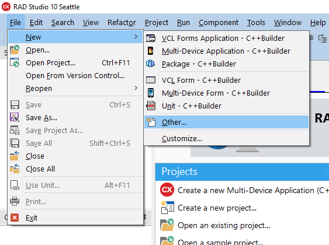
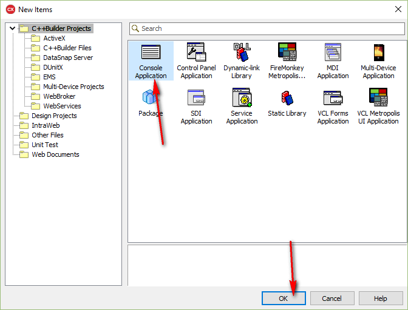
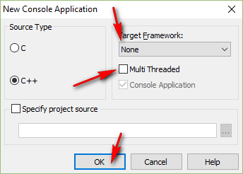
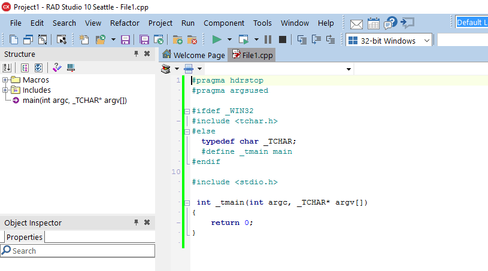
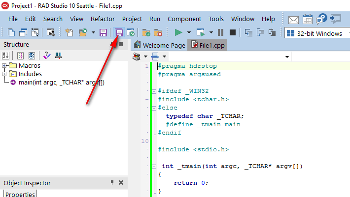
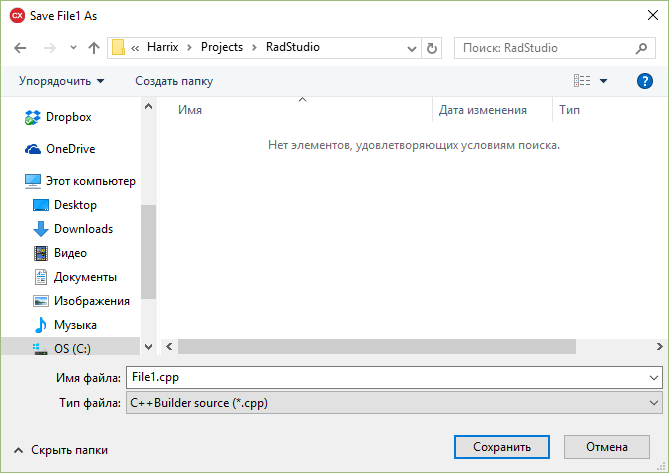
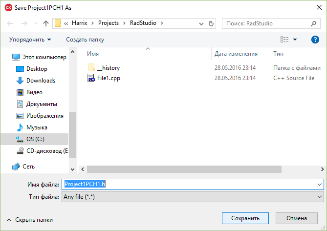
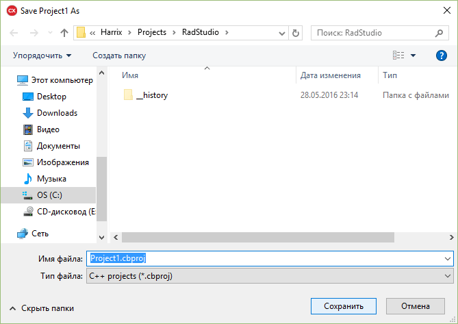
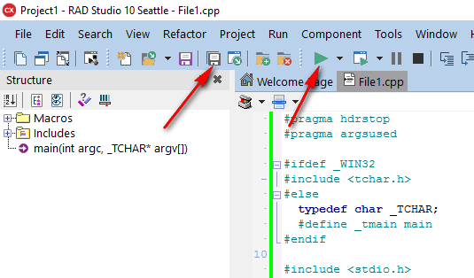
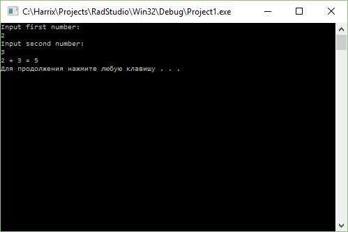

# Сложение двух чисел в C++ Builder 10 Seattle на C++ (консольное приложение)

В статье рассказывается как создать консольное приложение сложения двух чисел в C++ Builder 10 Seattle.

## Создание нового приложения







В итоге, появится вот такое окно:



Сохраните всё:









## Написание кода

Пропишите выше функции `main`:

```cpp
#include <iostream>

using namespace std;
```

А в самой функции `main` пропишите стандартный код:

```cpp
int a,b,c;

cout << "Input first number:"<<endl;
cin >> a;
cout << "Input second number:"<<endl;
cin >> b;

c = a + b;

cout << a << " + " << b << " = " << c << endl;

system("pause");
```

Общий код будет выглядеть так:

```cpp
#pragma hdrstop
#pragma argsused

#ifdef _WIN32
#include <tchar.h>
#else
  typedef char _TCHAR;
  #define _tmain main
#endif

#include <stdio.h>

#include <iostream>

using namespace std;

int _tmain(int argc, _TCHAR* argv[])
{
int a,b,c;

cout << "Input first number:"<<endl;
cin >> a;
cout << "Input second number:"<<endl;
cin >> b;

c = a + b;

cout << a << " + " << b << " = " << c << endl;

system("pause");
return 0;
}
```

Сохраните всё и запустите:




