# Сложение двух чисел в C++ Builder 10 Seattle на C++

В статье рассказывается как создать приложение сложения двух чисел в C++ Builder 10 Seattle.

## Создание нового приложения

Переходим в `File` → `New` → `VCL Form Application - C++ Builder`:

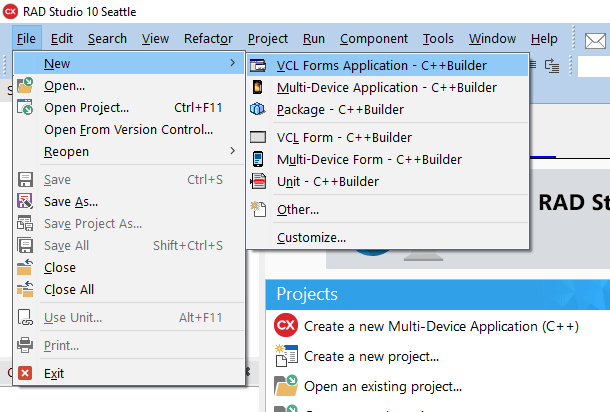

Появится вот такой вид:

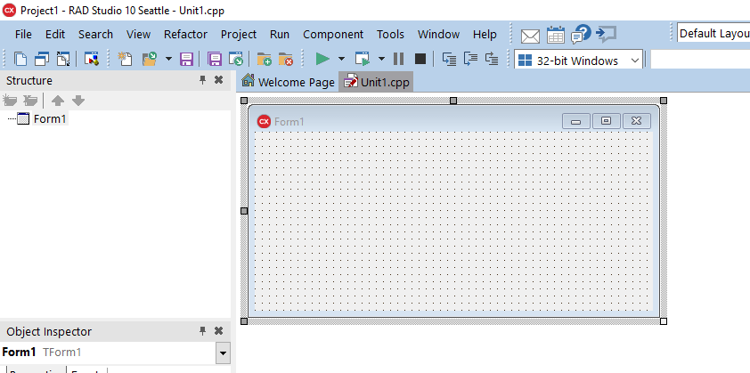

Сохраняем всё в папке новой:

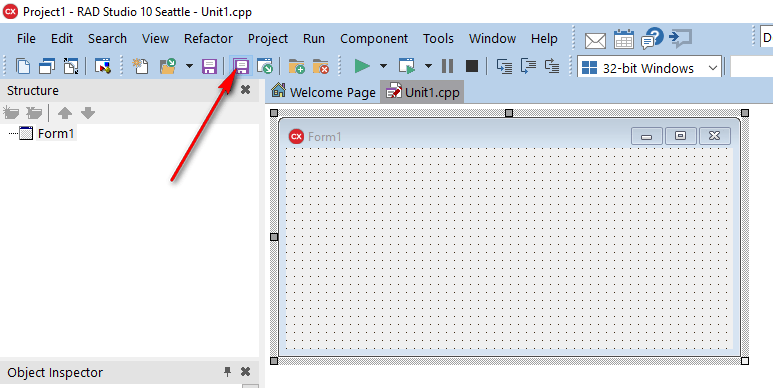

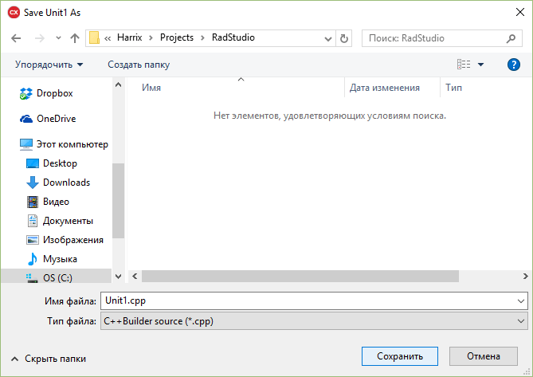

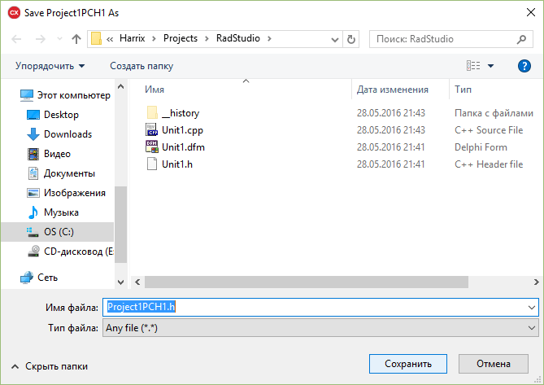

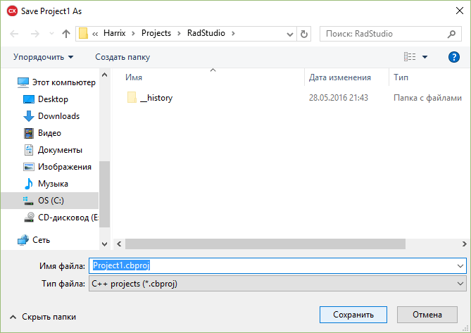

## Заполняем форму

На форму кидаем два поля ввода:

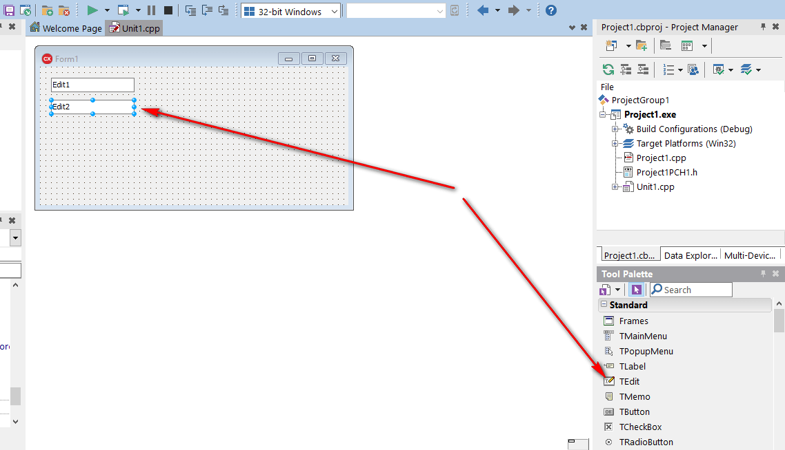

Кнопку:

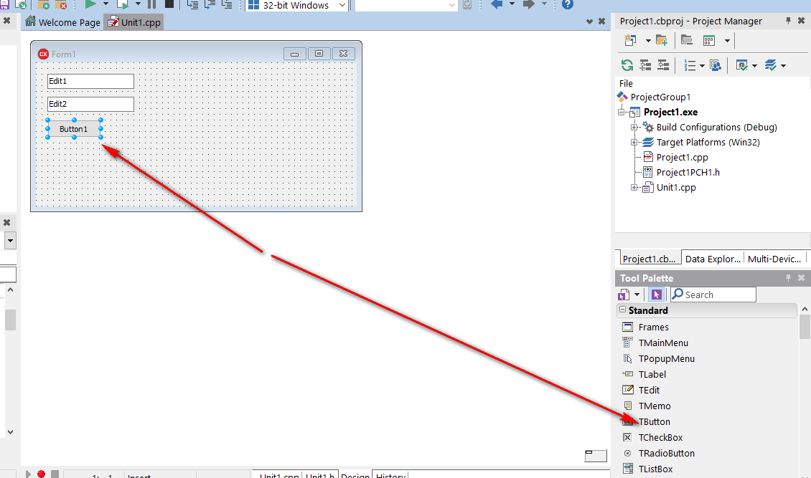

И поле для вывода многострочного текста:

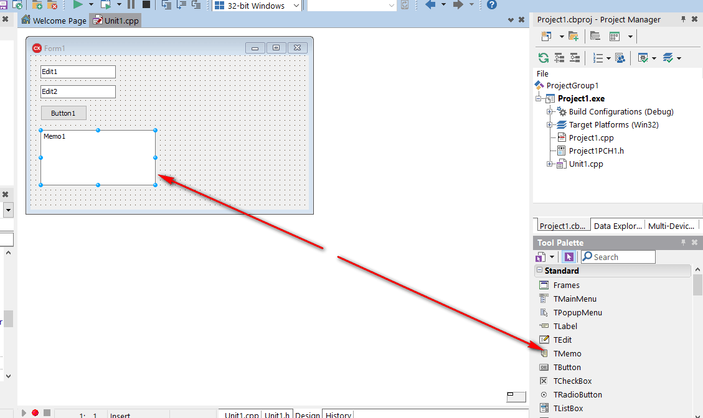

В поле для вывода `Memo1` удалим первоначальное содержимое:

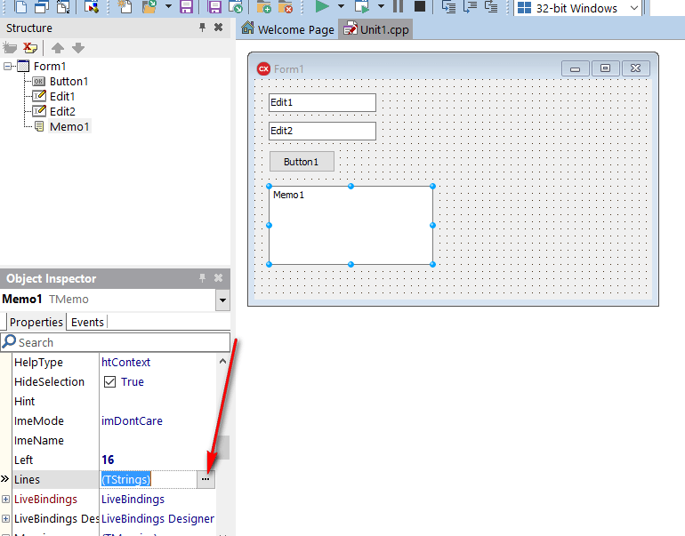

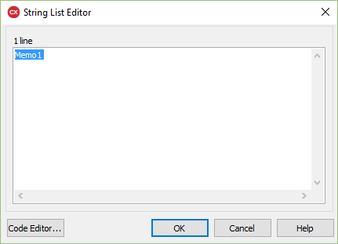

Также в поля ввода `Edit1` и `Edit2` введем первоначальное значение:

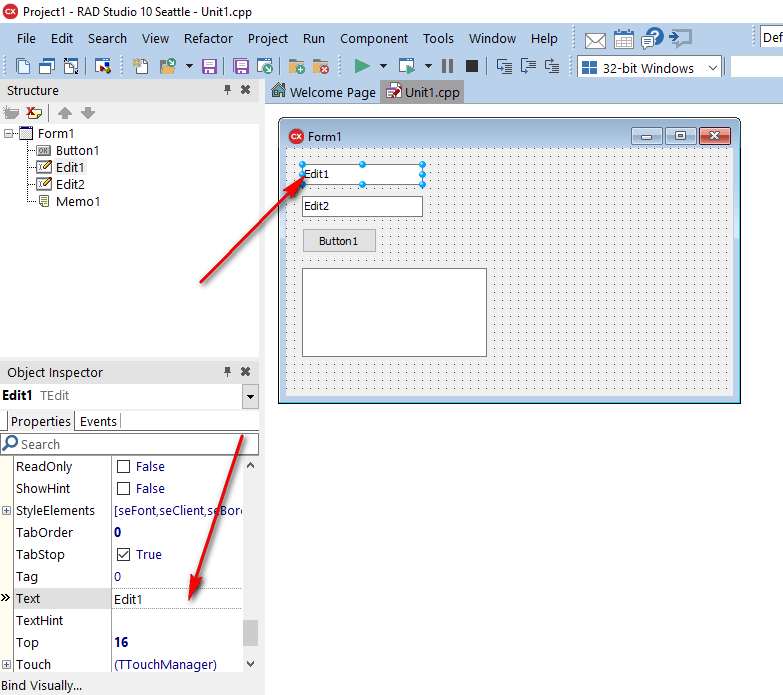

## Написание кода

Теперь можно переходить к написанию кода.

Двойной клик по кнопке:

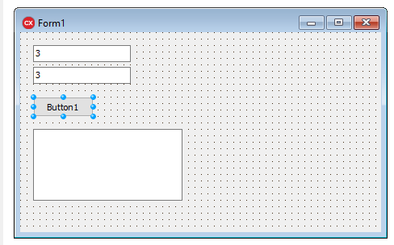

И видим это:

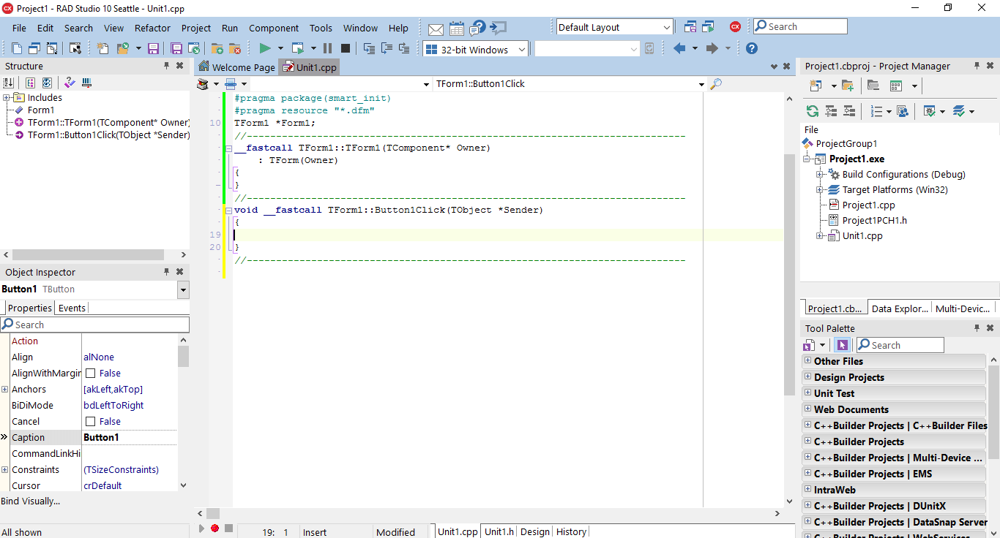

Вводим такой код:

```cpp
UnicodeString S1 = Edit1->Text;
UnicodeString S2 = Edit2->Text;

int a = S1.ToInt();
int b = S2.ToInt();

int c = a + b;

Memo1->Lines->Add(UnicodeString(a) + " + " + UnicodeString(b) + " = " + UnicodeString(c));
```

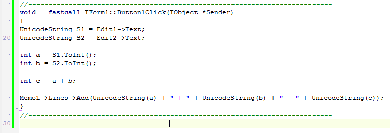

Теперь сохраняем всё и запускаем приложение:

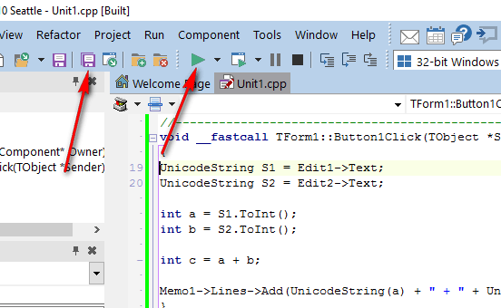

При нажатию на кнопку вы получите результат:

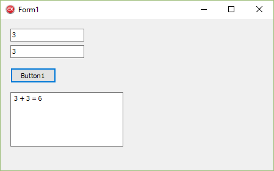
