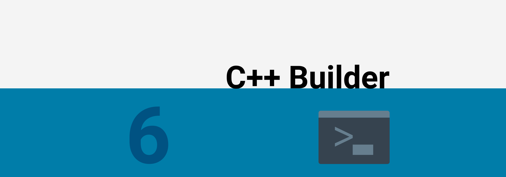

# Сложение двух чисел в C++ Builder 6 на C++ (консольное приложение)



В статье рассказывается как создать консольное приложение сложения двух чисел в древнем и старом C++ Builder 6.

- [Создание нового приложения](#создание-нового-приложения)
- [Написание кода](#написание-кода)

## Создание нового приложения


_Рисунок 1 — Выбор создание нестандартного проекта_


_Рисунок 2 — Вызов Console Wizard_


_Рисунок 3 — Выбор параметров проекта_


_Рисунок 4 — Подтверждение сохранения изменений предыдущего проекта_

В итоге, появится вот такое окно:


_Рисунок 5 — Созданный проект_

Сохраните всё:


_Рисунок 6 — Сохранение файла исходного кода_


_Рисунок 7 — Сохранения файла проекта_

## Написание кода

Пропишите выше функции `main`:

```cpp
#include <iostream>

using namespace std;
```

А в самой функции `main` пропишите стандартный код:

```cpp
int a,b,c;

cout << "Input first number:"<<endl;
cin >> a;
cout << "Input second number:"<<endl;
cin >> b;

c = a + b;

cout << a << " + " << b << " = " << c << endl;

system("pause");
return 0;
```

Общий код будет выглядеть так:

```cpp
//---------------------------------------------------------------------------

#pragma hdrstop

#include <iostream>

using namespace std;

//---------------------------------------------------------------------------

#pragma argsused
int main(int argc, char* argv[])
{
        int a,b,c;

        cout << "Input first number:"<<endl;
        cin >> a;
        cout << "Input second number:"<<endl;
        cin >> b;

        c = a + b;

        cout << a << " + " << b << " = " << c << endl;

        system("pause");
        return 0;
}
//---------------------------------------------------------------------------
```

Сохраните всё и запустите:


_Рисунок 8 — Запуск приложения_


_Рисунок 9 — Результат выполнения программы_
