# Сложение двух чисел в C++ Builder 6 на C++

В статье рассказывается о создании приложения сложения двух чисел в древнем и старом C++ Builder 6.

## Создание нового приложения

Переходим в `File` → `New` → `Application`:

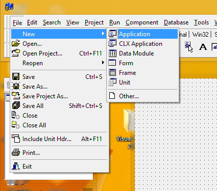

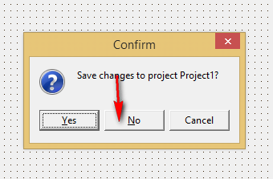

Появится вот такой вид:

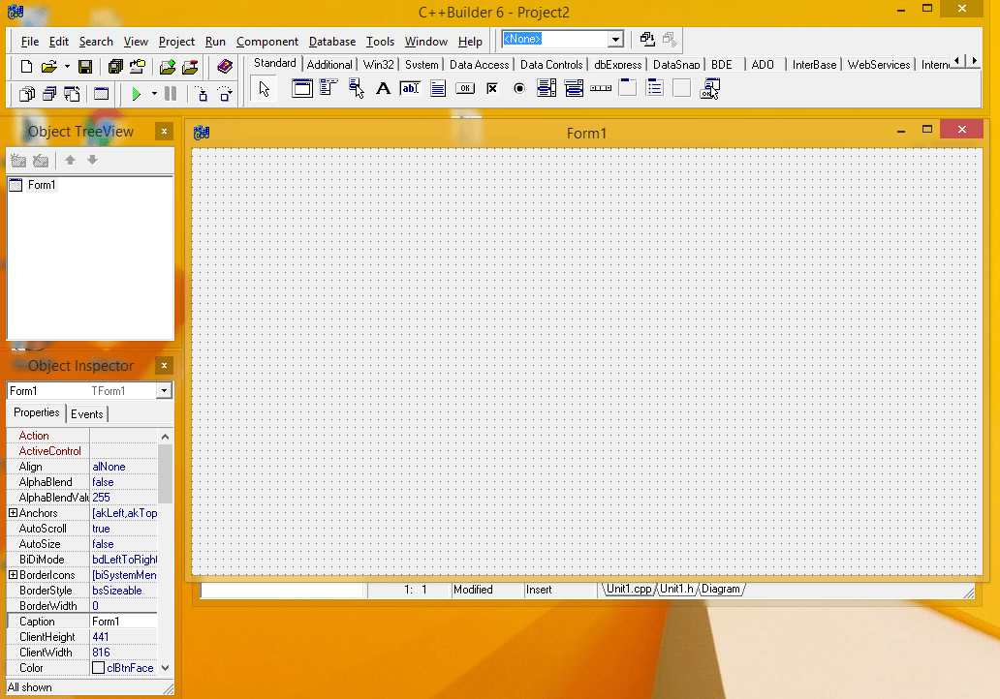

Сохраняем всё в папке новой:

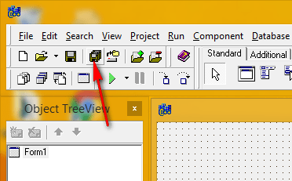

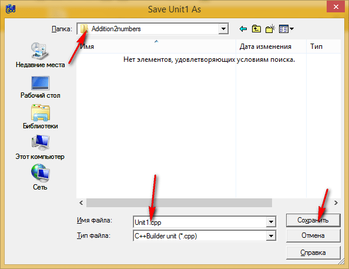

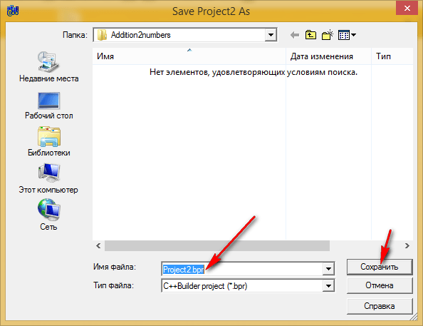

## Заполняем форму

На форму кидаем два поля ввода:

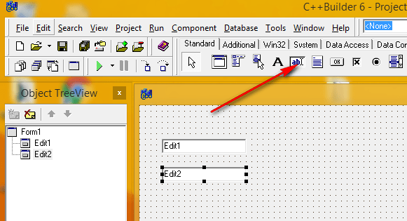

Кидаем на форму также кнопку:

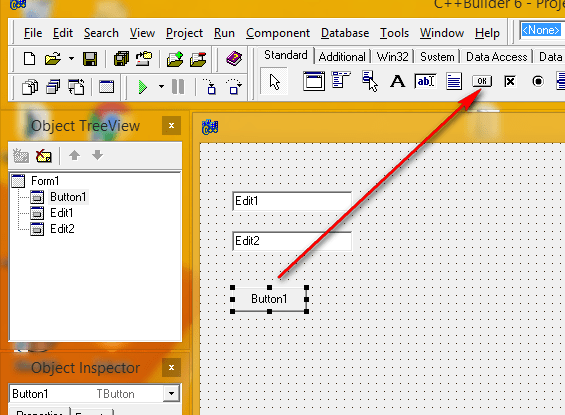

Еще кидаем поле для вывода многострочного текста:

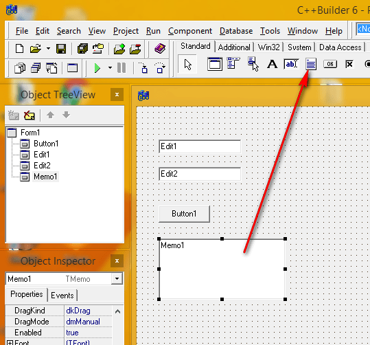

В поле для вывода `Memo1` удалим первоначальное содержимое:

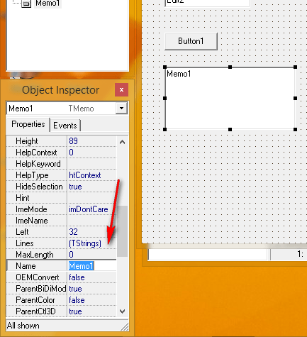

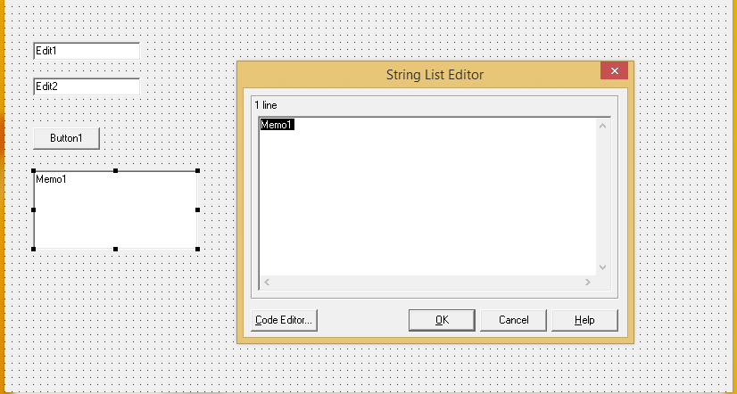

Также в поля ввода `Edit1` и `Edit2` введем первоначальное значение:

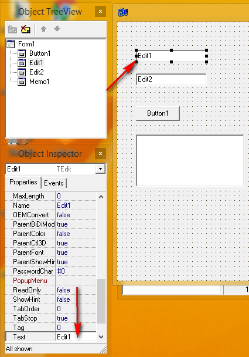

## Написание кода

Теперь можно переходить к написанию кода.

Двойной клик по кнопке:

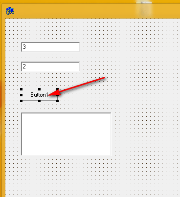

И видим это:

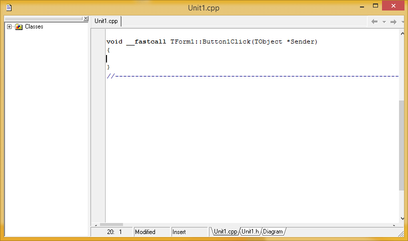

И вводим такой код:

```cpp
AnsiString S1 = Edit1->Text;
AnsiString S2 = Edit2->Text;

int a = S1.ToInt();
int b = S2.ToInt();

int c = a + b;

Memo1->Lines->Add(AnsiString(a) + " + " + AnsiString(b) + " = " + AnsiString(c));
```

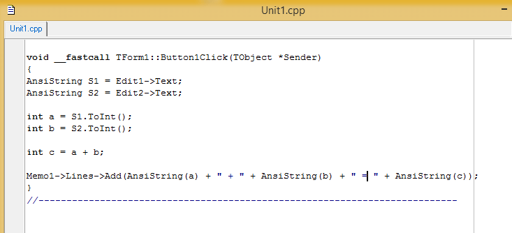

Теперь сохраняем всё и запускаем приложение:

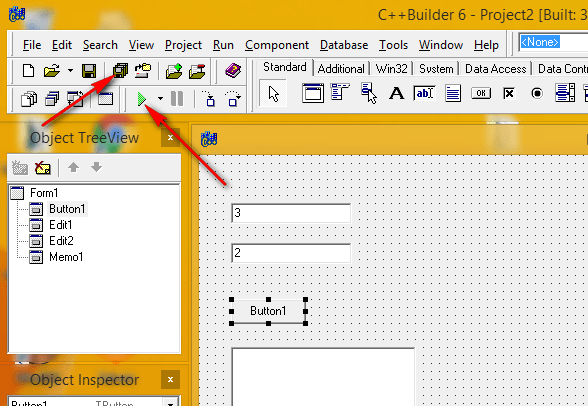

При нажатии на кнопку вы получите результат:

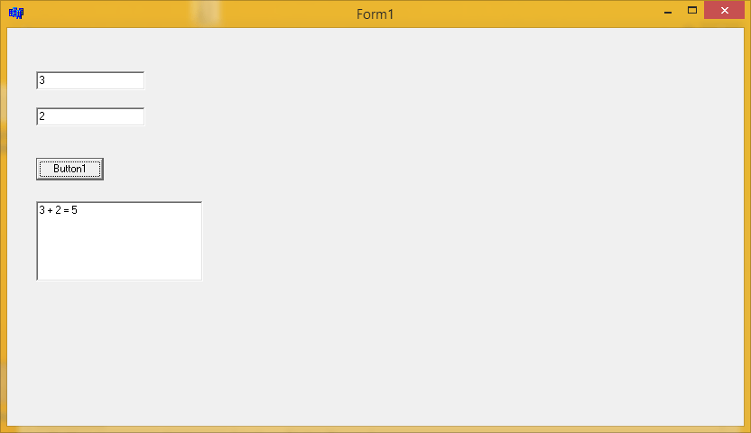

## Запуск приложения на компьютере без C++ Builder

Кстати, чтобы приложение EXE файл запускался без C++ Builder, сделайте это:

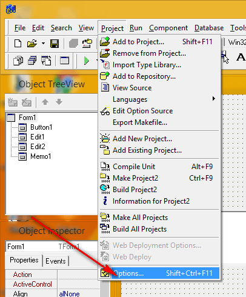

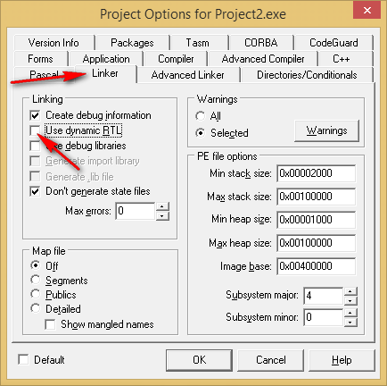

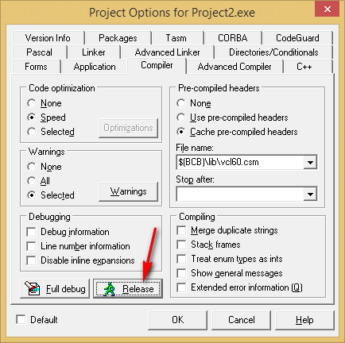

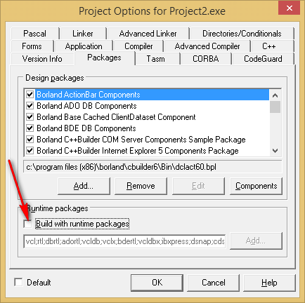
