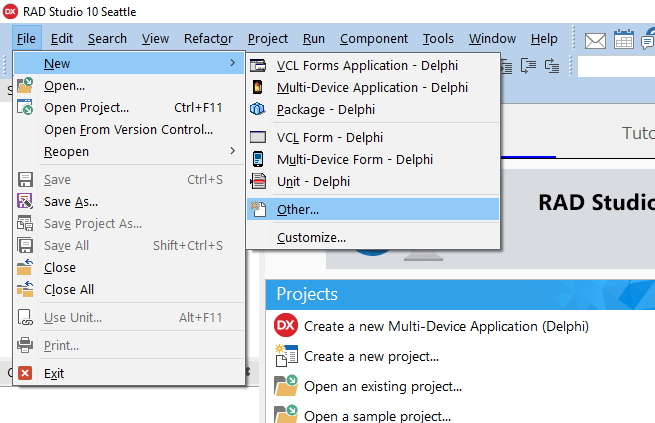
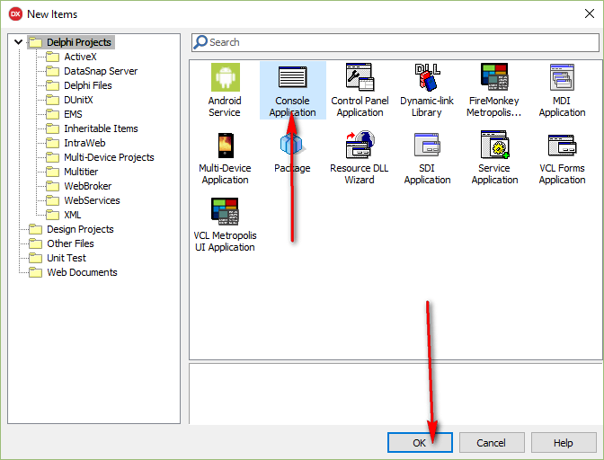
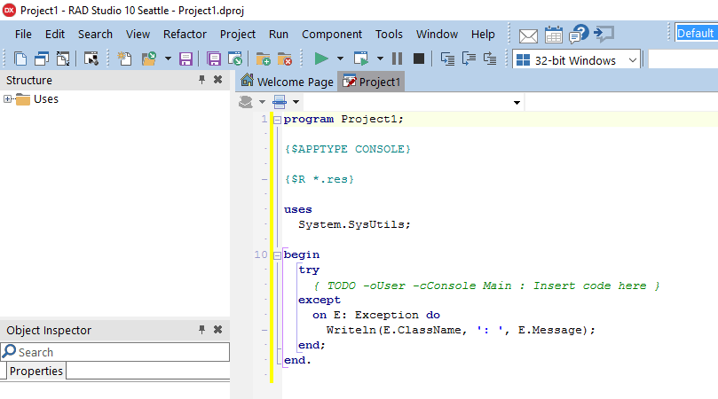
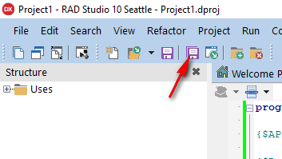
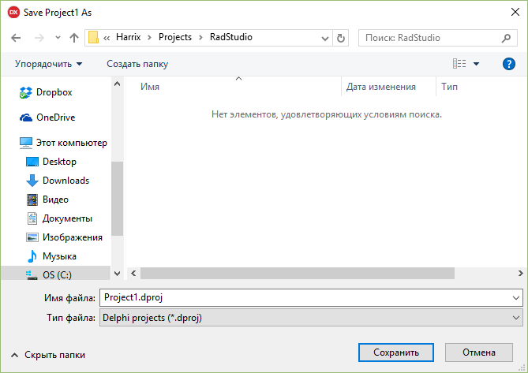
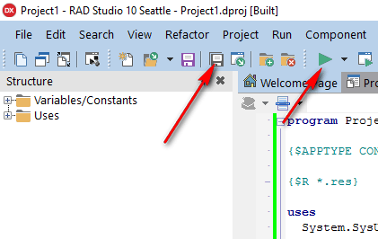
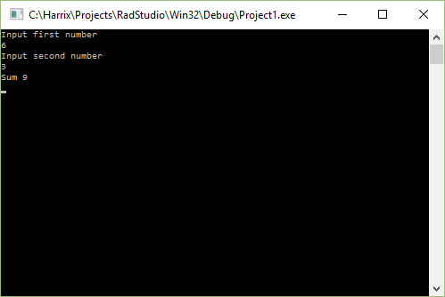

# Сложение двух чисел в Delphi 10 Seattle на C++ (консольное приложение)


В статье рассказывается как создать консольное приложение сложения двух чисел в Delphi 10 Seattle.

## Создание нового приложения



_Рисунок 1 — Создание нового проекта_



_Рисунок 2 — Выбор консольного типа проекта_

В итоге, появится вот такое окно:



_Рисунок 3 — Созданный проект_

Сохраните всё:



_Рисунок 4 — Сохранение проекта_



_Рисунок 5 — Сохранение файла проекта_

## Написание кода

Добавьте такие переменные:

```pascal
var
a,b,c:integer;
```

А тело программы замените на это:

```pascal
writeln('Input first number');
readln(a);

writeln('Input second number');
readln(b);

c := a + b;

writeln('Sum ', c);

readln(a);
```

Общий код будет выглядеть так:

```pascal
program Project1;

{$APPTYPE CONSOLE}

{$R *.res}

uses
  System.SysUtils;

  var
   a,b,c:integer;

begin
    writeln('Input first number');
    readln(a);

    writeln('Input second number');
    readln(b);

    c := a + b;

    writeln('Sum ', c);

    readln(a);
end.
```

Сохраните всё и запустите:



_Рисунок 6 — Запуск приложения_



_Рисунок 7 — Результат выполненной программы_
