# Сложение двух чисел в Delphi 10 Seattle на Pascal


В статье рассказывается как создать приложение сложения двух чисел в Delphi 10 Seattle.

<details>
<summary>📖 Содержание</summary>

## Содержание

- [Создание нового приложения](#создание-нового-приложения)
- [Заполняем форму](#заполняем-форму)
- [Написание кода](#написание-кода)

</details>

## Создание нового приложения

Переходим в `File` → `New` → `VCL Form Application - Delphi`:

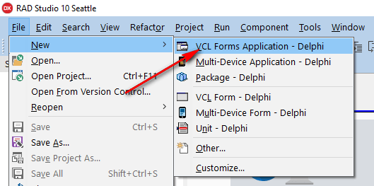

_Рисунок 1 — Создание нового проекта_

Появится вот такой вид:

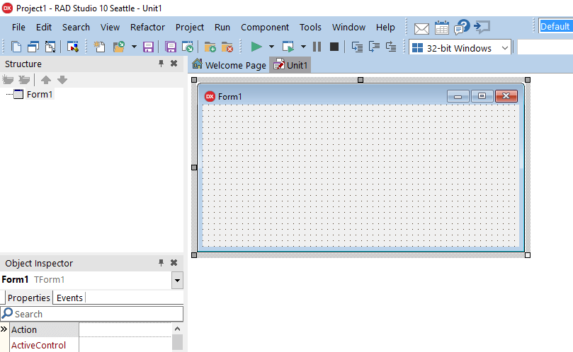

_Рисунок 2 — Созданный проект_

Сохраняем всё в папке новой:

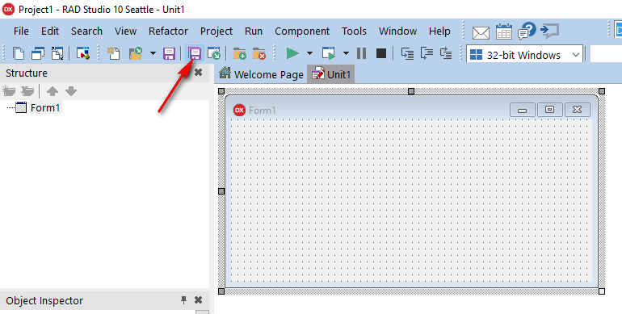

_Рисунок 3 — Сохранение проекта_

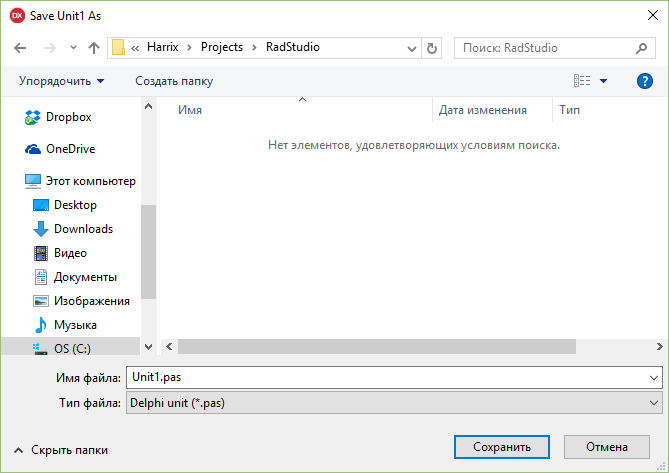

_Рисунок 4 — Сохранение файла исходного кода_

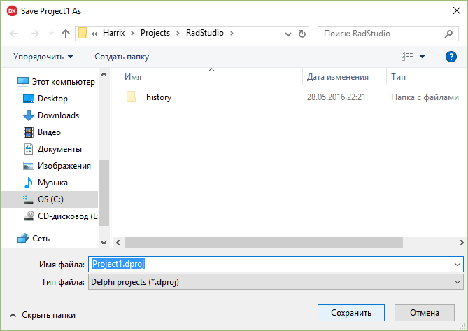

_Рисунок 5 — Сохранения файла проекта_

## Заполняем форму

На форму кидаем два поля ввода:

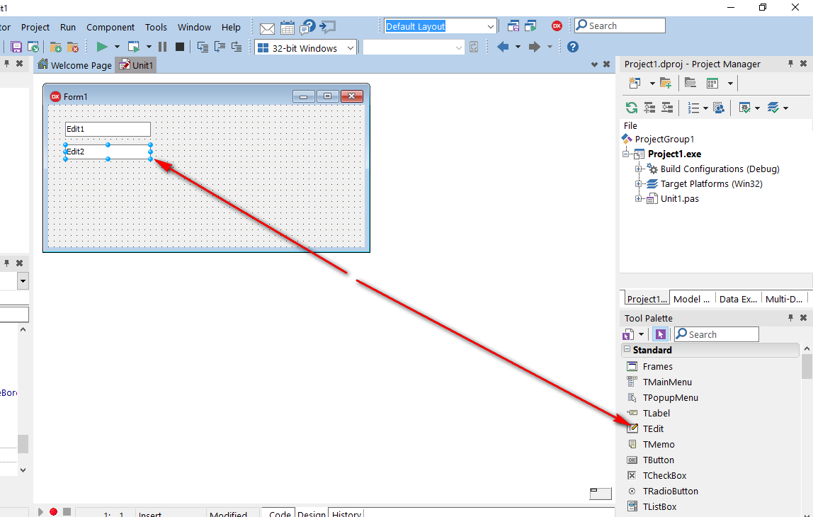

_Рисунок 6 — Добавление компонента TEdit_

Кнопку:

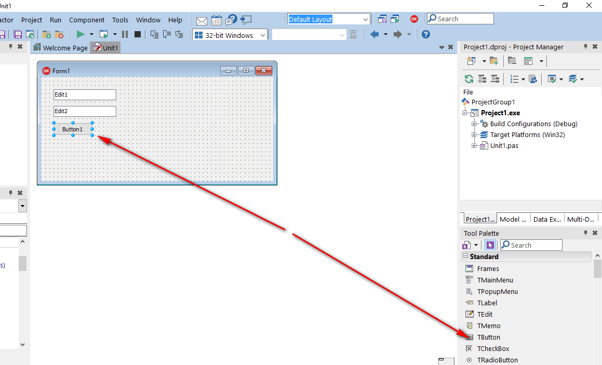

_Рисунок 7 — Добавление компонента TButton_

И поле для вывода многострочного текста:

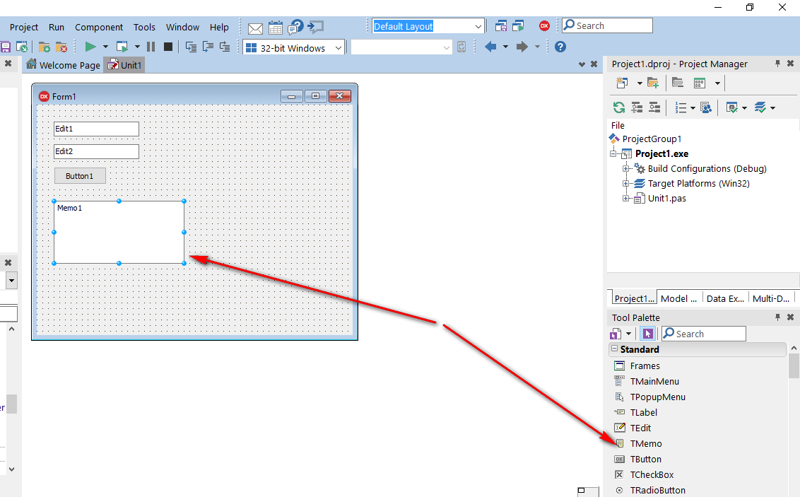

_Рисунок 8 — Добавление компонента TMemo_

В поле для вывода `Memo1` удалим первоначальное содержимое:

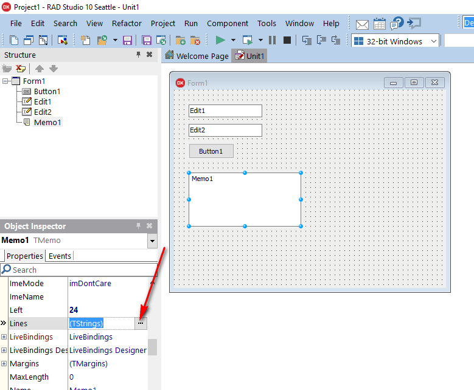

_Рисунок 9 — Свойство Lines компонента TMemo_

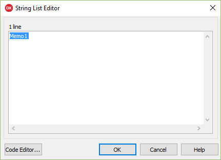

_Рисунок 10 — Первоначальное содержимое компонента TMemo_

Также в поля ввода `Edit1` и `Edit2` введем первоначальное значение:

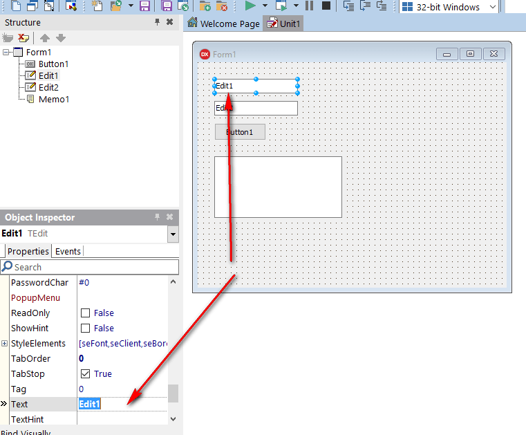

_Рисунок 11 — Свойство Text компонента TEdit_

## Написание кода

Теперь можно переходить к написанию кода.

Двойной клик по кнопке:

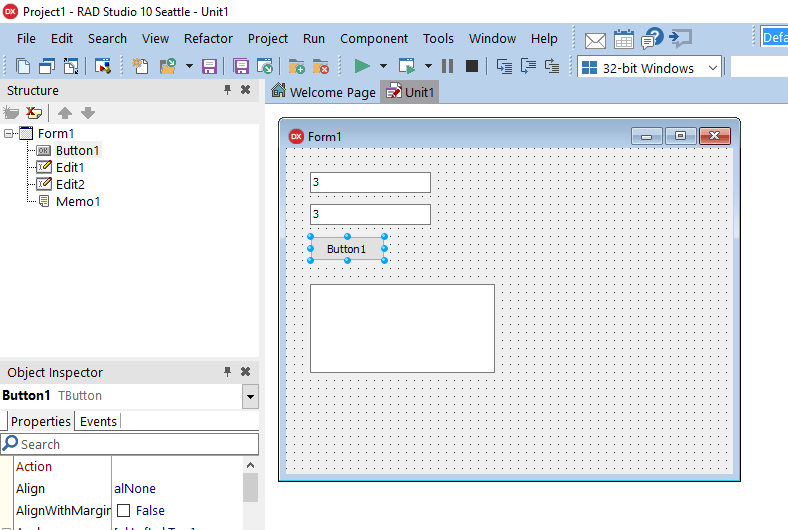

_Рисунок 12 — Двойной клик по кнопке_

И видим это:

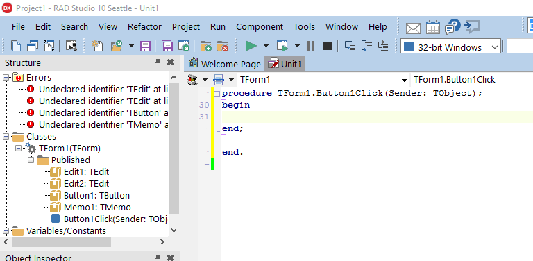

_Рисунок 13 — Метод обработки клика кнопки_

Добавьте переменные:

```pascal
a,b,c : Integer;
S1, S2: UnicodeString;
```

И вводим такой код:

```pascal
S1 := Edit1.Text;
S2 := Edit2.Text;

a := S1.ToInteger;
b := S2.ToInteger;

c := a + b;

Memo1.Lines.Add(IntToStr(a) + ' + ' + IntToStr(b) + ' = ' + IntToStr(c));:

```

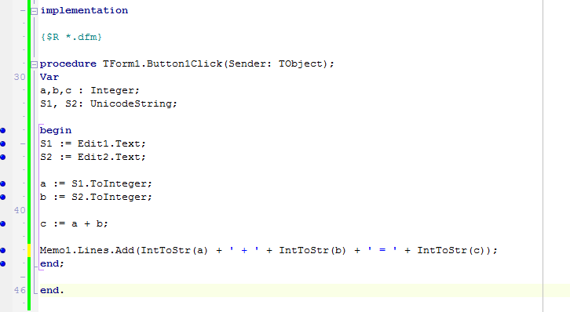

_Рисунок 14 — Код метода обработки клика кнопки_

Теперь сохраняем всё и запускаем приложение:

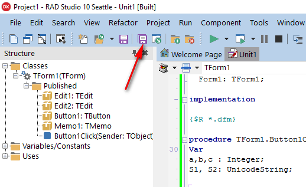

_Рисунок 15 — Запуск приложения_

При нажатию на кнопку вы получите результат:

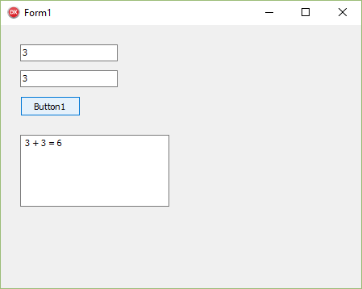

_Рисунок 16 — Результат выполнения кода программы_
