# Сложение двух чисел в Dev-C++

В статье рассказывается как создать консольное приложения сложения двух чисел Win32 в Dev-C++.

## Установка программы

Раньше программа скачивалась на сайте <https://sourceforge.net/projects/orwelldevcpp/>. Это можно сделать и сейчас, но программа не обновлялась там с 2015 года, поэтому возможности современного C++ не поддерживаются. Например, `to_string()` работать не будет.

К счастью Embarcadero (которая занимается Delphi и C++ Builder) подхватила проект и его поддерживает. Поэтому идем на сайт <https://www.embarcadero.com/ru/free-tools/dev-cpp/free-download>, где заполняем форму какими-нибудь данными:


Скачается архив, в котором после распаковки окажется установщик:

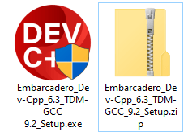

Под спойлером находится краткое описание установки программы.

---

**Установка Dev-C++** <!-- !details -->

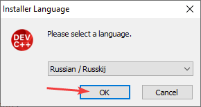

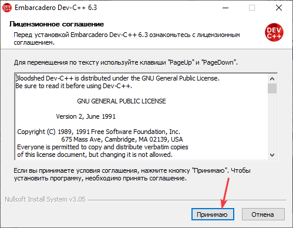

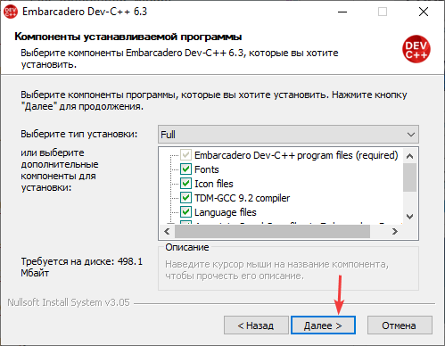

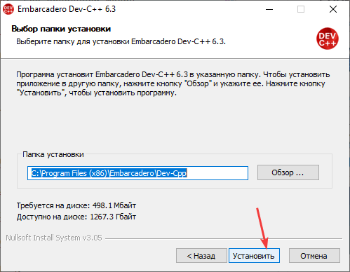

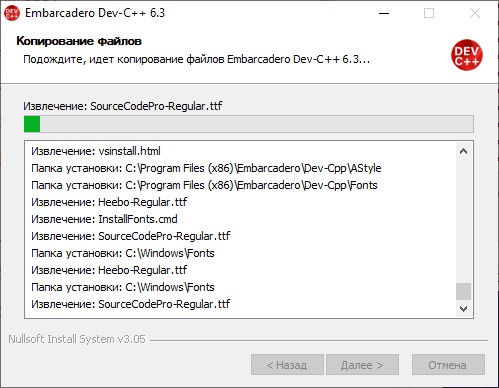

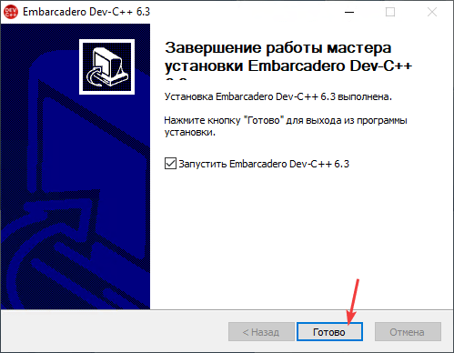

Запускаем программу и настройки делаем по своему вкусу:

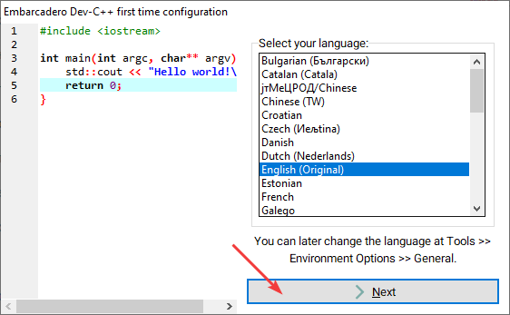

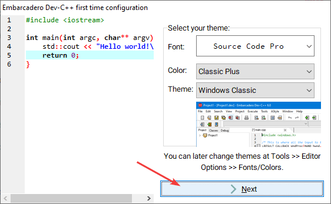

Лично я ставлю в качестве шрифта [JetBrains Mono](https://www.jetbrains.com/ru-ru/lp/mono/)

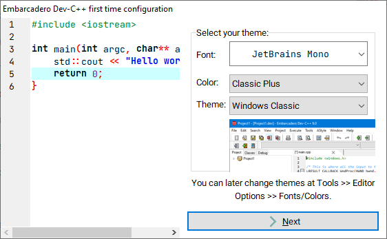

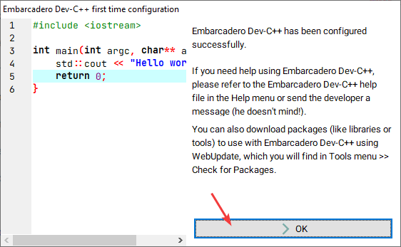

---

## Создание проекта

Если вы пользуетесь Dev C++ для обучения, то вам будет достаточно работать с одним файлом исходного кода.

Создайте файл исходного кода:

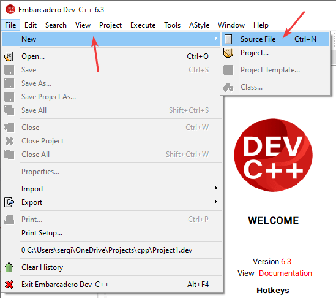

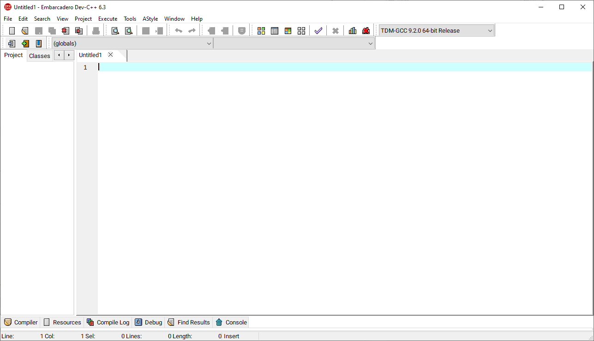

Напишите болванку приложения:

```cpp
#include <iostream>

using namespace std;

int main () {

  return 0;
}
```

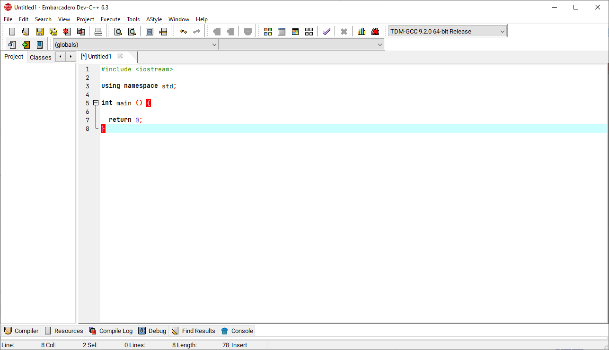

Сохраните где-нибудь файл:

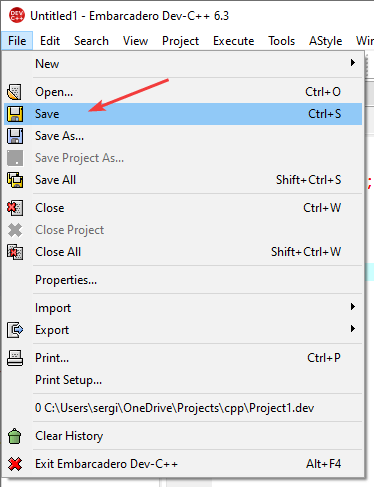

## Создание проекта (II способ)

Если вы хотите создавать проект полноценный с множеством файлов и так далее, то проект нужно создавать нормально. Об этом под спойлером.

---

**Установка Dev-C++** <!-- !details -->

Открываем программу `Dev-C++`:

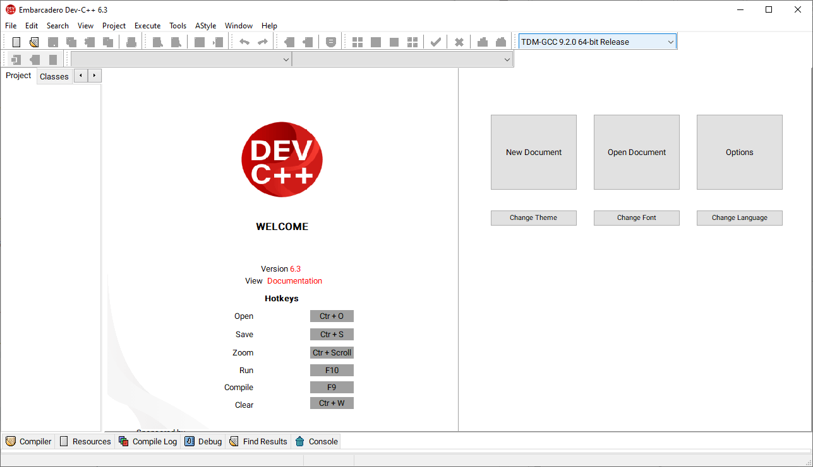

Создаем новый проект:

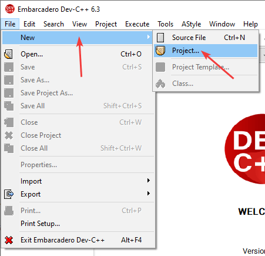

Выбираем консольное приложение и название проекта:

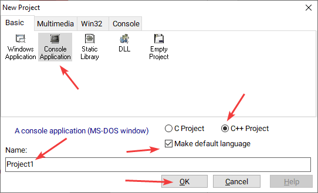

Выбираем место, где сохраним проект:

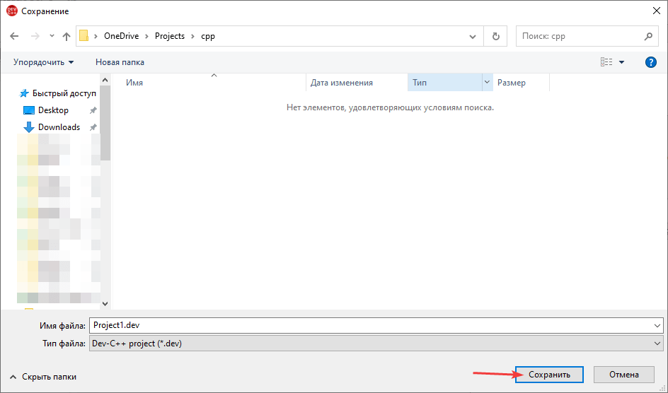

Появится вот такая болванка:

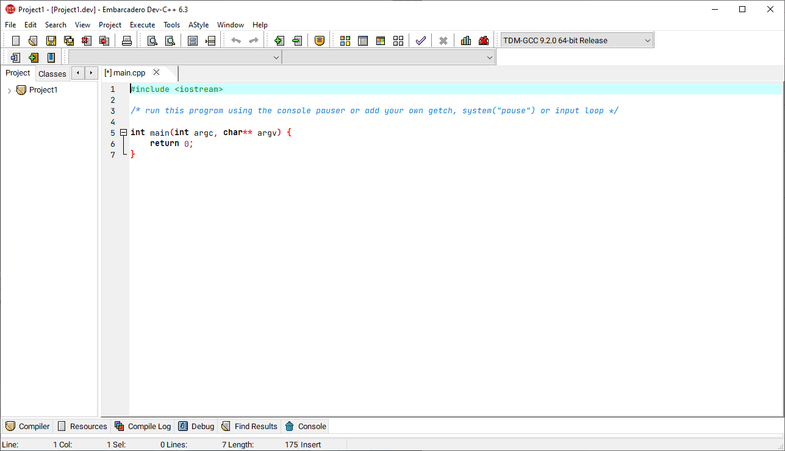

Если вам нужно закрыть проект, но не сам Dev C++, то закройте его так:

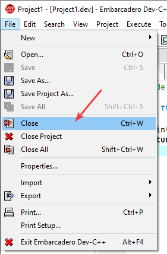

---

## Написание кода

Перейдем теперь к написанию программы сложения двух чисел.

В функции `main` добавьте код:

```cpp
int a, b, c;

cout << "Input first number" << endl;
cin >> a;

cout << "Input second number" << endl;
cin >> b;

c = a + b;

cout << "Sum " << c << endl;
```

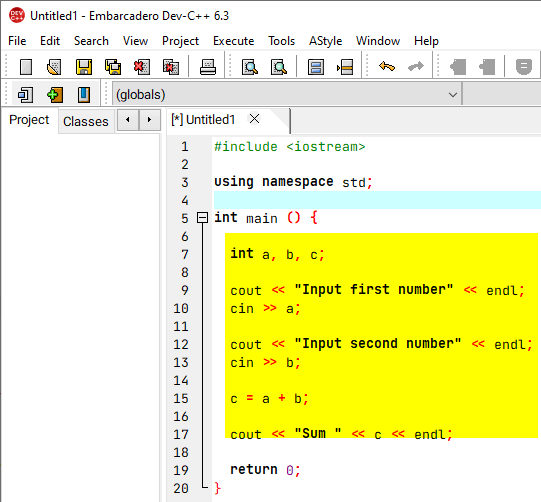

Полный вид программы будет такой:

```cpp
#include <iostream>

using namespace std;

int main () {

  int a, b, c;

  cout << "Input first number" << endl;
  cin >> a;

  cout << "Input second number" << endl;
  cin >> b;

  c = a + b;

  cout << "Sum " << c << endl;

  return 0;
}
```

На всякий случай упрощенный вариант программы:

```cpp
#include <iostream>

using namespace std;

int main () {

  int a, b, c;

  cin >> a >> b;
  c = a + b;

  cout << c;

  return 0;
}
```

Сохраните файл:


## Запуск программы

Вначале скомпилируем программу:

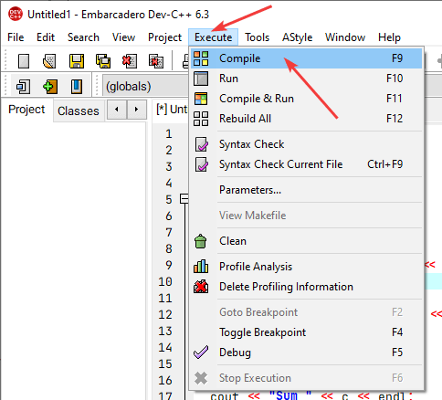

Компиляция должна пройти успешно:

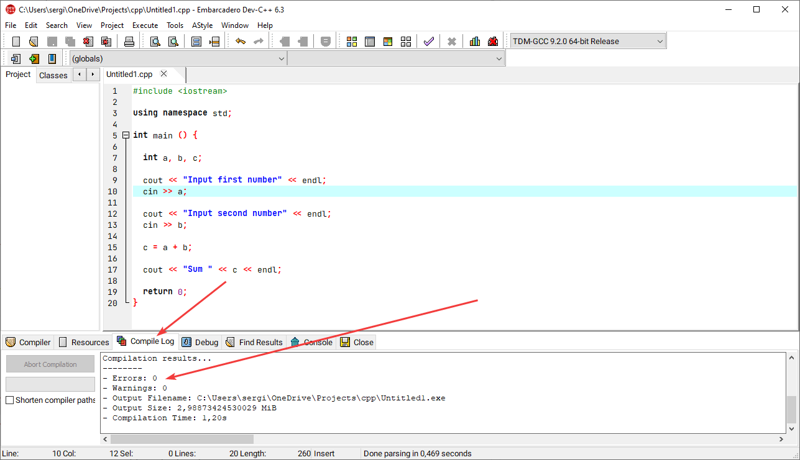

А теперь запустим программу:

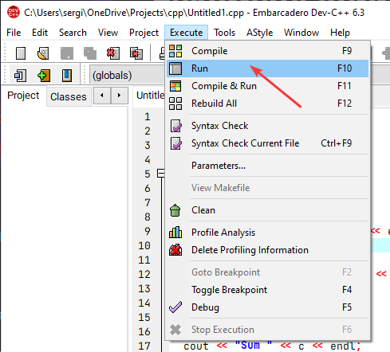

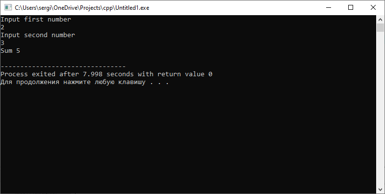

## Отличия от консольной программы Visual Studio

Вам в программе не надо будет писать строчки:

```cpp
#include "stdafx.h"
```

```cpp
#include <windows.h>
```

Не обязательно в конце программы писать эту строчку (если запускать программу через Dev C++):

```cpp
system("pause");
```

Название главной функции в Visual Studio выглядит так:

```cpp
int _tmain(int argc, _TCHAR* argv[])
```

Название главной функции в Dev C++ выглядит так (если создавать через проект):

```cpp
int main(int argc, char** argv)
```

Или название главной функции в Dev C++ может выглядеть так:

```cpp
int main()
```

## Русская кодировка в Embarcadero Dev C++

Embarcadero перешел на кодировку UTF-8 для работы с текстом. Что вызывает проблемы с работой русского текста в консоли.

Самый простой способ сохранять текст в ANSI кодировке, и при компиляции проекта не позволяйте перевести код в UTF-8:

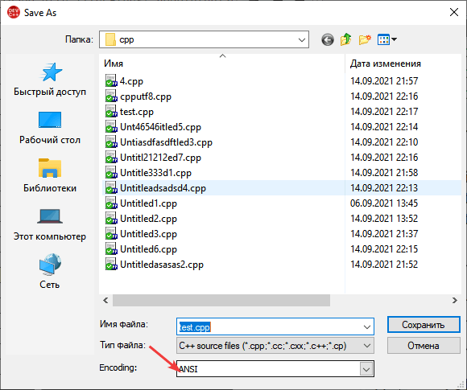

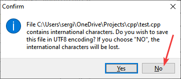

И используйте функции `SetConsoleCP` и `SetConsoleOutputCP`:

```cpp
#include <iostream>
#include <string>
#include <Windows.h>

using namespace std;

int main() {
    setlocale(LC_ALL, "RUSSIAN");
    SetConsoleCP(1251);
    SetConsoleOutputCP(1251);

    cout << "Пример текста"<< endl;

    string input;
    cin >> input;
    cout << "Вывод: "<< input << endl;

    return 0;
}
```

Если же вы хотите использовать кодировку UTF-8 или согласились на преобразование файла в UTF-8, то тогда вам будет нужен подобный код:

```cpp
#include <iostream>
#include <string>
#include <Windows.h>

using namespace std;

int main() {
    SetConsoleOutputCP(CP_UTF8);
    SetConsoleCP(CP_UTF8); // не работает

    cout << "Пример текста"<< endl;

    return 0;
}
```

Считывание русского языка из консоли в Windows 10 я победить не смог. Английский текст считывается прекрасно, а русский отказывается.
