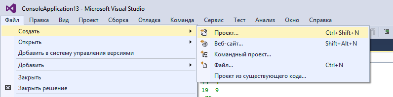
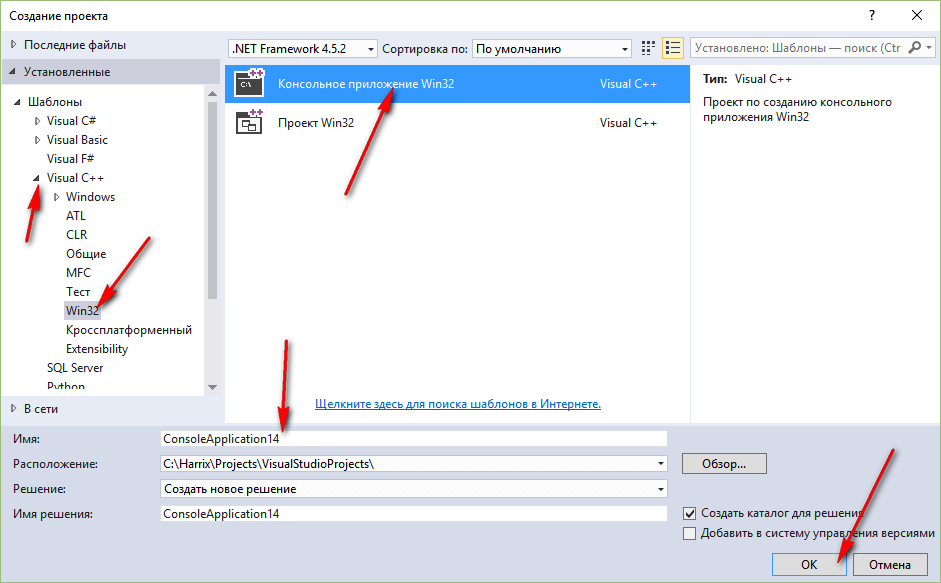
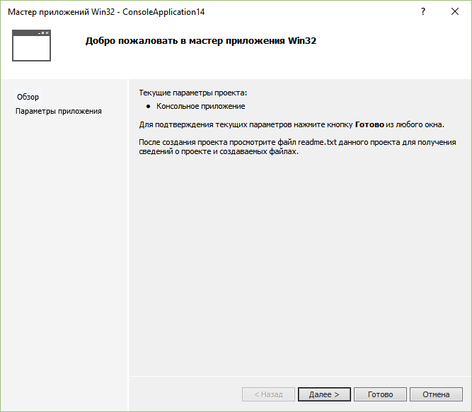
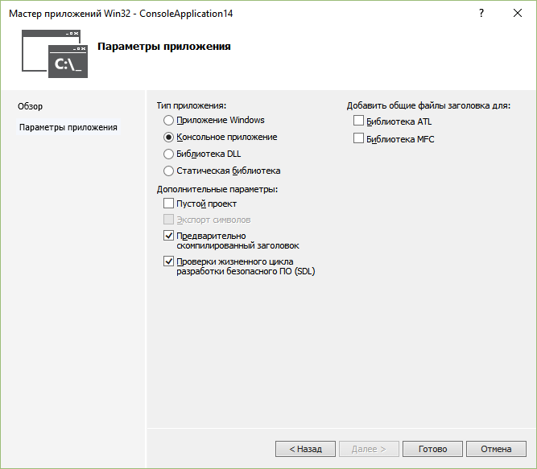
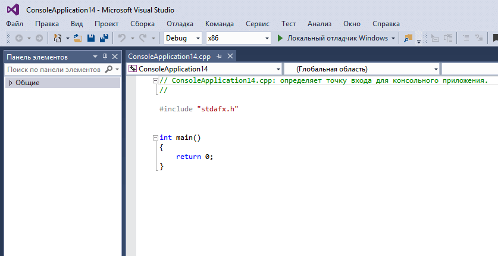
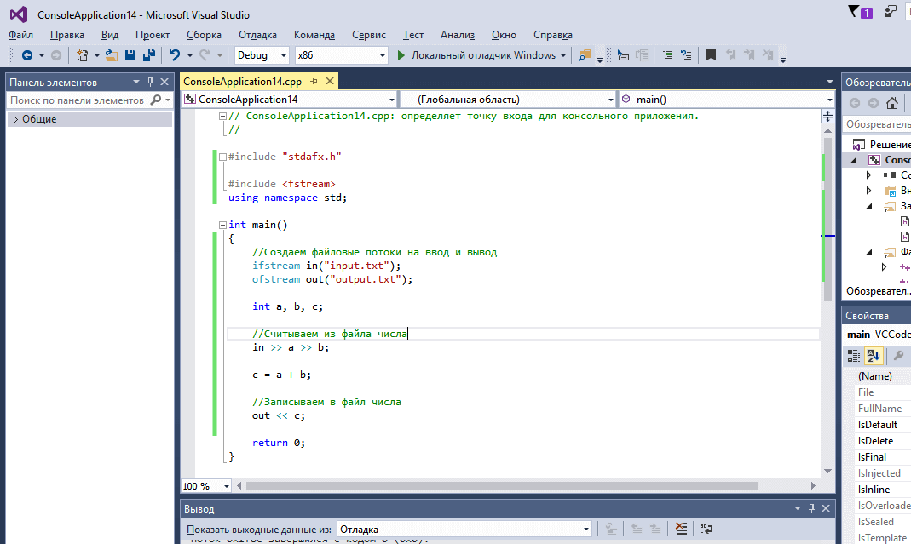
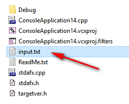
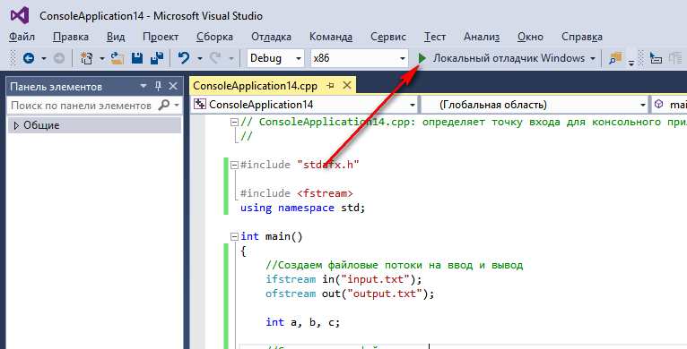
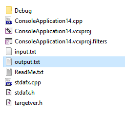

# Сложение двух чисел из файла в Visual Studio 2015 на C++ (консольное Win32 приложение)


В статье рассказывается как считать из файла два числа, сложить их, а результат записать в другой файл.

- [Создание проекта](#создание-проекта)
- [Код основной программы](#код-основной-программы)
- [Запуск программы](#запуск-программы)

## Создание проекта

<details>
<summary>Создание проекта</summary>



_Рисунок 1 — Выбор пункта меню для создания нового проекта_



_Рисунок 2 — Выбор типа нового проекта_



_Рисунок 3 — Первое окно мастера создания проекта_



_Рисунок 4 — Настройка параметров нового проекта_



_Рисунок 5 — Созданный проект_

</details>

## Код основной программы

Пропишите данные строчки:

```cpp
#include <fstream>
using namespace std;
```

А теле главной функции добавьте этот код:

```cpp
//Создаем файловые потоки на ввод и вывод
ifstream in("input.txt");
ofstream out("output.txt");

int a, b, c;

//Считываем из файла числа
in >> a >> b;

c = a + b;

//Записываем в файл числа
out << c;
```



_Рисунок 6 — Код C++ в редакторе_

## Запуск программы

Разместите в папку с исходным кодом программы файл `input.txt` со следующим содержимым:

```text
1 3
```



_Рисунок 7 — Файл с входными данными_

Запустите приложение:



_Рисунок 8 — Запуск приложения_

Черный экран появится и сразу исчезнет. При этом в папке с исходным кодом программы появится файл `output.txt` с содержимым:



_Рисунок 9 — Файл с выходными данными_

```text
4
```
