# Сложение двух чисел в Free Pascal IDE на Pascal (консольное приложение)


В статье рассказывается как создать консольное приложения сложения двух чисел в Free Pascal IDE.

<details>
<summary>📖 Содержание</summary>

- [Установка программы](#установка-программы)
- [Создаем проект](#создаем-проект)
- [Написание кода](#написание-кода)
- [Запуск программы](#запуск-программы)

</details>

## Установка программы

Под спойлером находится краткое описание установки программы.

<details>
<summary>Установка Free Pascal IDE</summary>

Скачиваем программу тут: <https://sourceforge.net/projects/freepascal/files/?source=navbar>:

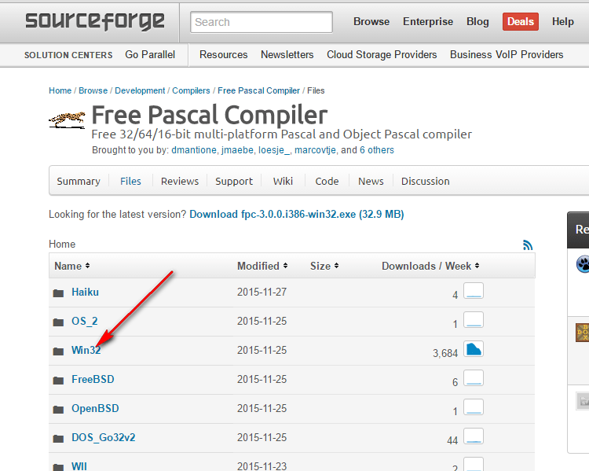

_Рисунок 1 — Выбор сборки под семейство операционной системы_

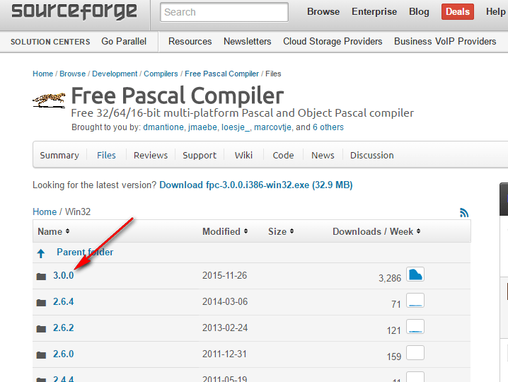

_Рисунок 2 — Выбор версии программы_


_Рисунок 3 — Скачивание установщика_

И устанавливаем:

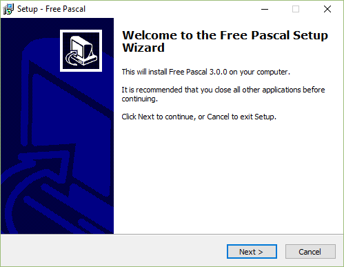

_Рисунок 4 — Первое окно установщика_

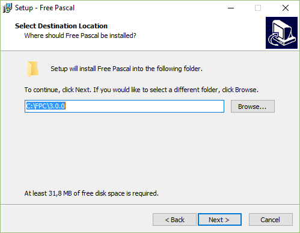

_Рисунок 5 — Выбор папки установки приложения_

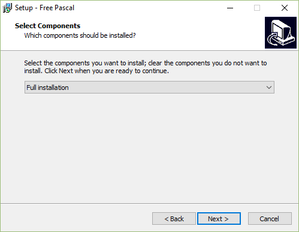

_Рисунок 6 — Выбор типа установки_

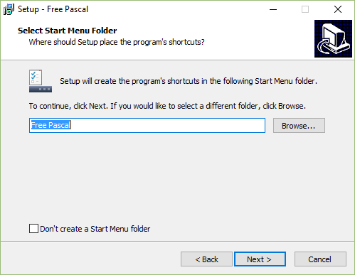

_Рисунок 7 — Выбор названия папки в главном меню_

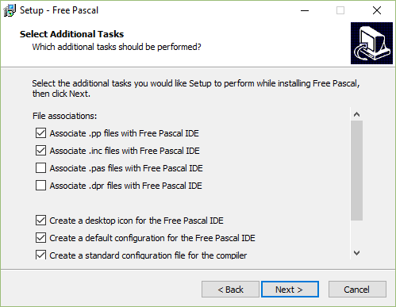

_Рисунок 8 — Дополнительные настройки_

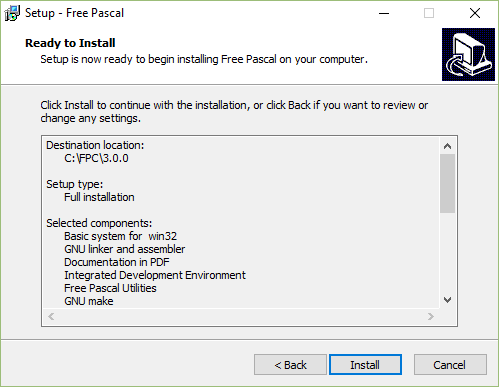

_Рисунок 9 — Окно перед установкой программы_

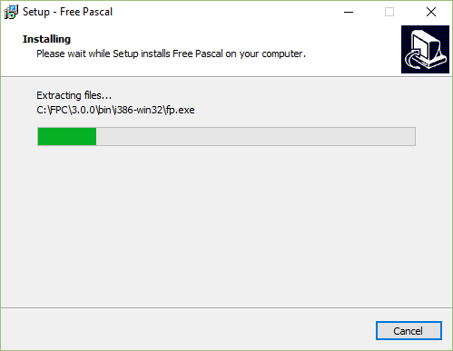

_Рисунок 10 — Установка программы_

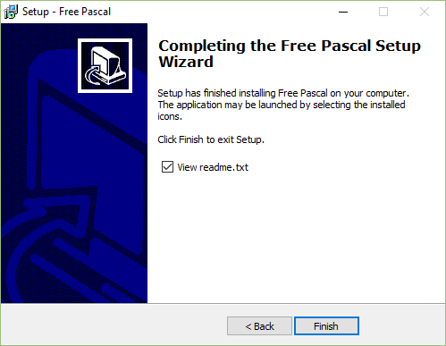

_Рисунок 11 — Завершение установки_

</details>

## Создаем проект

Создаем новый проект:

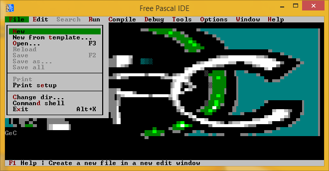

_Рисунок 12 — Создание нового проекта_

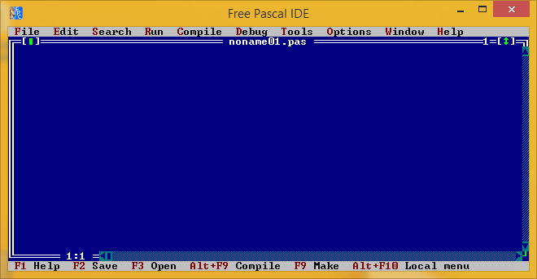

_Рисунок 13 — Созданный пустой файл исходного кода_

## Написание кода

Пропишите такой код:

```pascal
uses crt;
var
   a,b,c:integer;
begin
    clrscr;
    writeln('Input first number');
    readln(a);

    writeln('Input second number');
    readln(b);

    c := a + b;

    writeln('Sum ', c);

    readln();
end.
```

## Запуск программы

Вначале скомпилируем приложение:


_Рисунок 14 — Выбор команды компилирования проекта_

Перед компиляцией попросит сохранить файл:

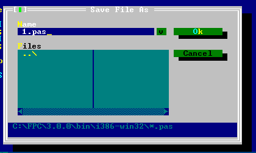

_Рисунок 15 — Сохранения файла исходного кода_

При успешном компилировании увидите вот такое окно:

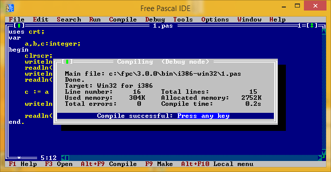

_Рисунок 16 — Окно успешного компилирования проекта_

И запустим приложение:

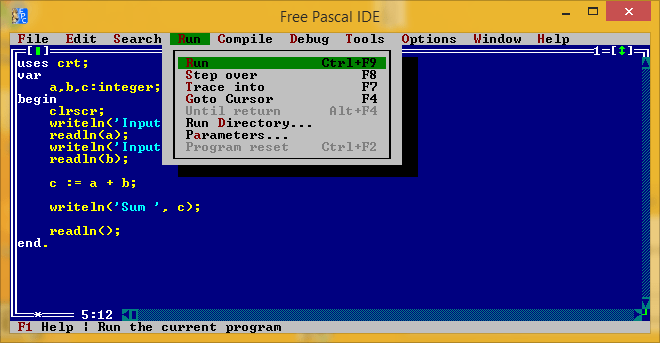

_Рисунок 17 — Запуск приложения_

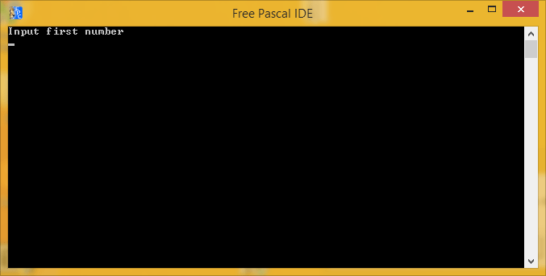

_Рисунок 18 — Запущенное приложение_

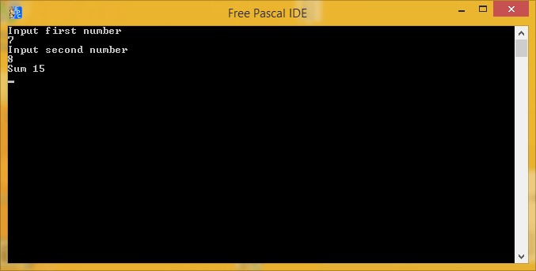

_Рисунок 19 — Результат выполнения программы_
