# Сложение двух чисел в PascalABC.NET на Pascal (консольное приложение)

В статье рассказывается как создать консольное приложения сложения двух чисел в PascalABC.NET.

## Установка программы

Под спойлером находится краткое описание установки программы.

---

**Установка PascalABC.NET** <!-- !details -->

Скачиваем программу на сайте <http://pascalabc.net/>:

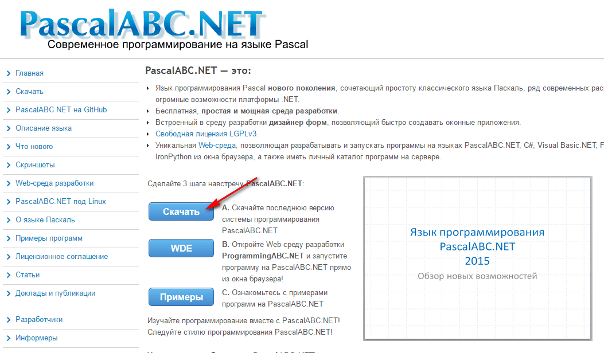

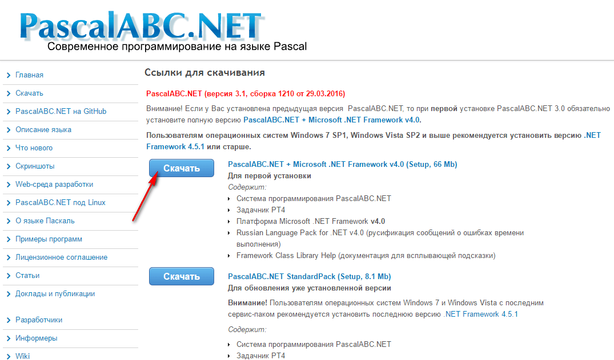

И устанавливаем:

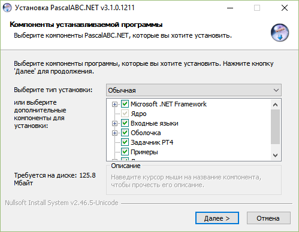

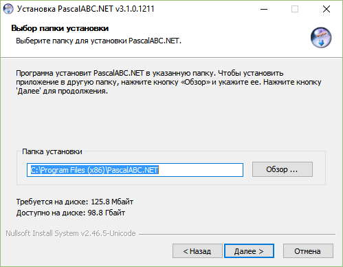

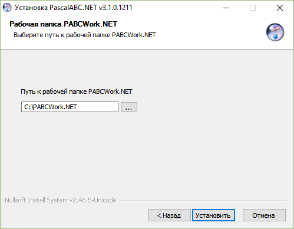

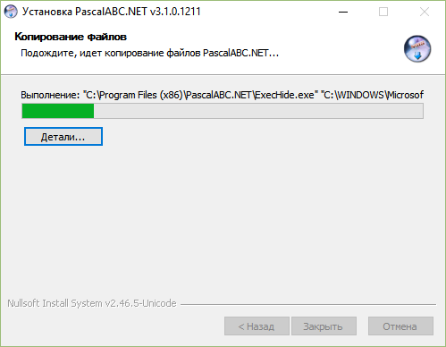

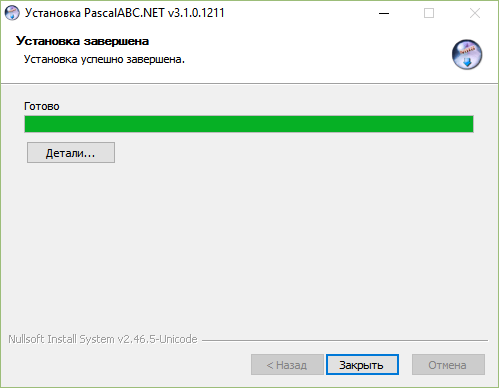

---

## Создаем проект

Открываем программу PascalABC.NET (программа открывается не очень быстро):

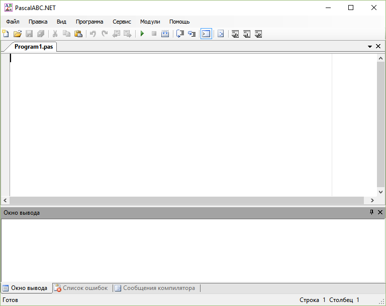

Создаем новый проект:

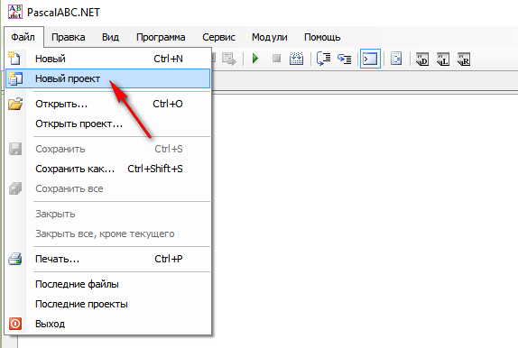

Выбираем консольное приложение и название проекта:

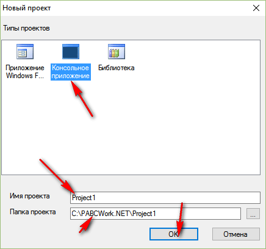

Появится вот такая болванка:

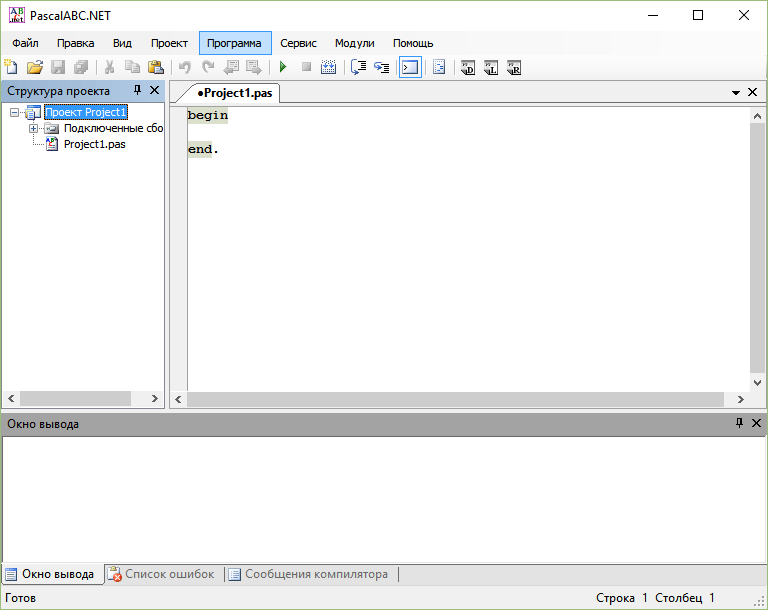

## Написание кода

Пропишите такой код:

```pascal
var
   a,b,c:integer;
begin
    writeln('Input first number');
    readln(a);

    writeln('Input second number');
    readln(b);

    c := a + b;

    writeln('Sum ', c);
end.
```

## Запуск программы

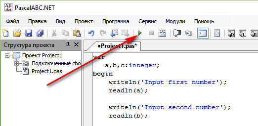

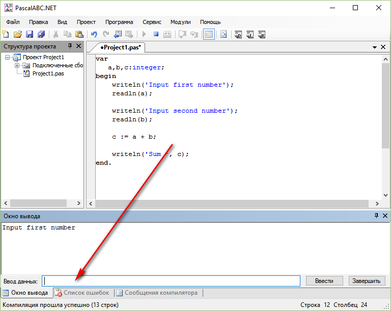

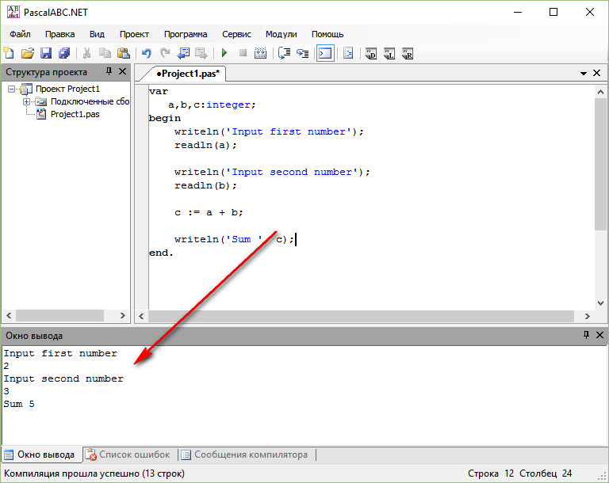
