# Сложение двух чисел в Qt на C++ (Qt Quick Controls)


В статье описывается создание приложения QML через Qt Quick Controls с выполнением кода на C++.

<details>
<summary>📖 Содержание</summary>

- [Подготовка](#подготовка)
- [Построение интерфейса](#построение-интерфейса)
- [C++ часть](#c-часть)

В качестве среды для разработки используется Qt 5.6.0 для Windows 64 bit под компилятором Visual Studio.

В [статье](https://github.com/Harrix/harrix.dev-articles-2016/blob/main/qt-quick-and-cpp/qt-quick-and-cpp.md) | [🡥](https://harrix.dev/ru/articles/2016/qt-quick-and-cpp/) приведена сокращенная версия данной статьи.

В отличии от [статье](https://github.com/Harrix/harrix.dev-articles-2016/blob/main/add-2-num-qt-quick/add-2-num-qt-quick.md) | [🡥](https://harrix.dev/ru/articles/2016/add-2-num-qt-quick/) в данной статьи рассматривается построение приложение не с использованием чистого QML, а с использованием QtQuick Controls, то есть компонентов, которые похожи на стандартные компоненты из Qt Widgets и вообще из стандартных приложений. Но получается всё равно QML приложение со всеми плюсами.

</details>

## Подготовка

Создадим Qt Quick приложение:


_Рисунок 1 — Создание нового проекта_

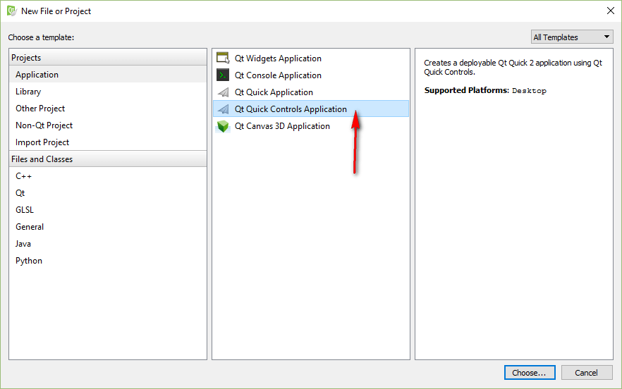

_Рисунок 2 — Выбор типа приложения_

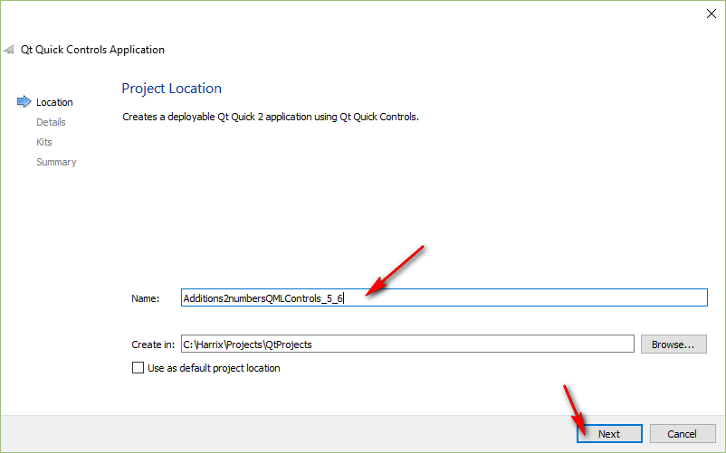

_Рисунок 3 — Выбор имени проекта и его месторасположения_

Не рекомендую выбирать `With ui.qml`. По крайней мере не все функции QML с таким файлом работали. Либо я что-то делал не то:

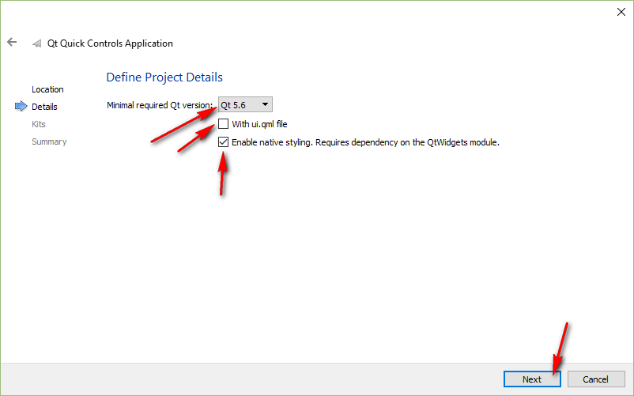

_Рисунок 4 — Выбор версии QML_

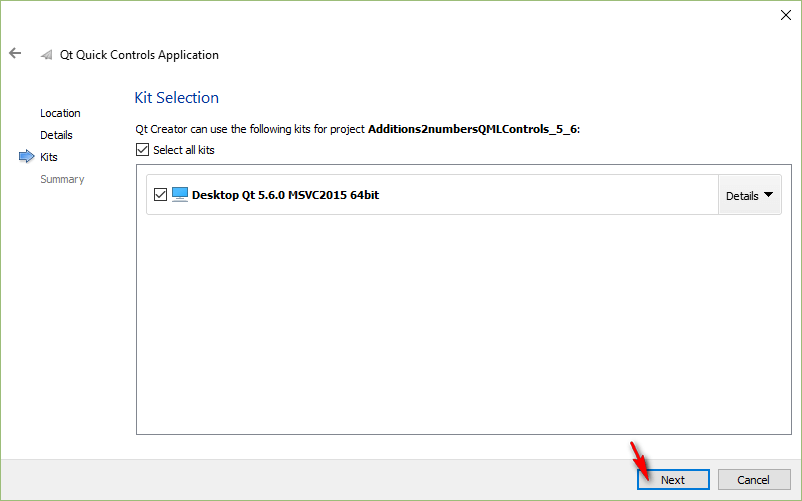

_Рисунок 5 — Выбор компилятора_

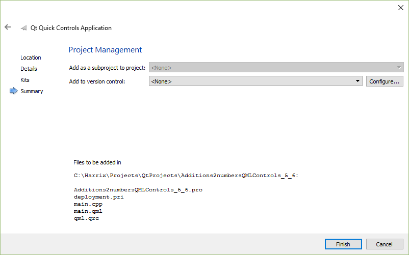

_Рисунок 6 — Настройка контроля версий для проекта_

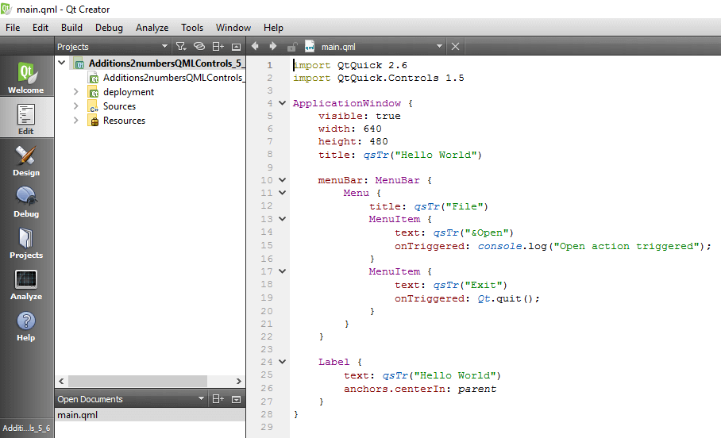

_Рисунок 7 — Созданное приложение_

И переведите разработку приложения в режим `Release`:

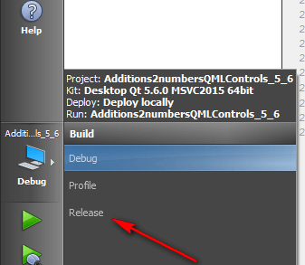

_Рисунок 8 — Перевод приложения в режим Release_

## Построение интерфейса

Откроем файл `main.qml`:


_Рисунок 9 — Файл main.qml_

Удалим элемент `menuBar` и `Label`. Они тут демонстрационные:

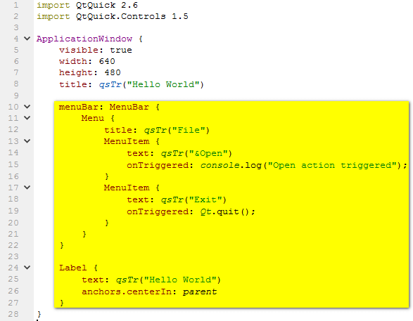

_Рисунок 10 — Удаление демонстрационных элементов_


_Рисунок 11 — Текущее состояние разметки_

Добавим в основной элемент `ApplicationWindow` следующую конструкцию:

```qml
ColumnLayout {
  anchors.centerIn: parent

  Button {
    id: button1
    text: qsTr("Сложить")
  }

  TextInput {
    id: textInput1
    objectName: "textInput1"
    width: 80
    height: 20
    text: qsTr("1")
    font.family: "Times New Roman"
    font.pixelSize: 12
  }

  TextInput {
    id: textInput2
    objectName: "textInput2"
    width: 80
    height: 20
    text: qsTr("1")
    font.pixelSize: 12
  }

  Text {
    id: memo
    objectName: "memo"
    text: qsTr("")
    font.pixelSize: 12
  }
}
```

Получим такой код файла `main.qml` (я еще добавил один `import`):

```qml
import QtQuick 2.6
import QtQuick.Controls 1.5
import QtQuick.Layouts 1.1

ApplicationWindow {
  visible: true
  width: 640
  height: 480
  title: qsTr("Hello World")

  property alias button1: button1

  ColumnLayout {
    anchors.centerIn: parent

    Button {
      id: button1
      text: qsTr("Сложить")
    }

    TextInput {
      id: textInput1
      objectName: "textInput1"
      width: 80
      height: 20
      text: qsTr("1")
      font.family: "Times New Roman"
      font.pixelSize: 12
    }

    TextInput {
      id: textInput2
      objectName: "textInput2"
      width: 80
      height: 20
      text: qsTr("1")
      font.pixelSize: 12
    }

    Text {
      id: memo
      objectName: "memo"
      text: qsTr("")
      font.pixelSize: 12
    }
  }
}
```

Обратите внимание, что для всех элементов, к которым вы потом захотите обращаться в C++, пропишите не только свойство `id`, но и свойство `objectName` со строковым значением совпадающим с `id`.

Если мы запустим приложение, то получим следующее:

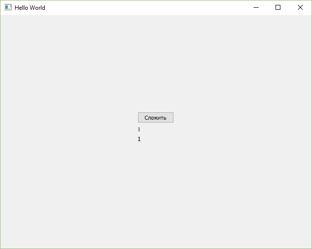

_Рисунок 12 — Запущенное приложение_

Итак, мы описали интерфейс нашей программы.

## C++ часть

При нажатии на кнопку пока ничего не происходит. Исправим это. Для начала установим взаимосвязь между QML моделью и C++ кодом. Для этого создадим класс, через которое будем осуществлять взаимодействие.

Правой кнопкой щелкнем по проекту и выбираем пункт `Add New…`:

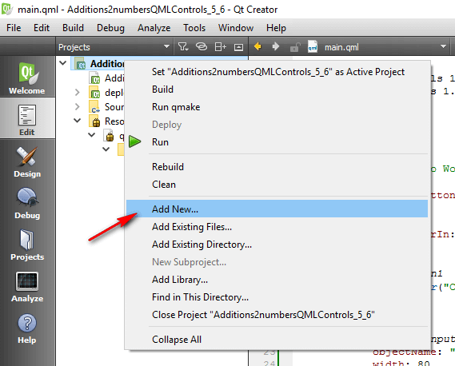

_Рисунок 13 — Создание нового элемента_

Там выбираем `C++ Class`:

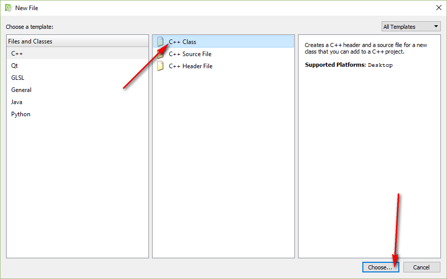

_Рисунок 14 — Создание нового класса_

Там вводим название нашего нового класса, например, `HandlerSignals`, также, добавив подключение заголовочного класса `QObject`, и базовым классом объявляем `QObject`:

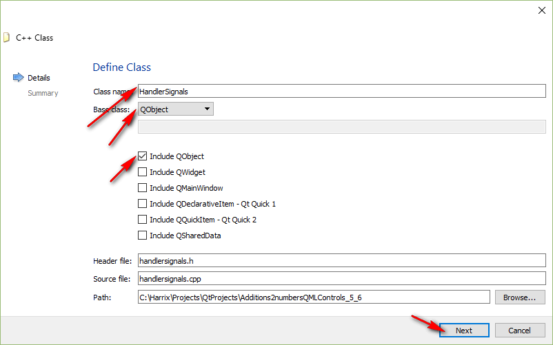

_Рисунок 15 — Ввод параметров нового класса_

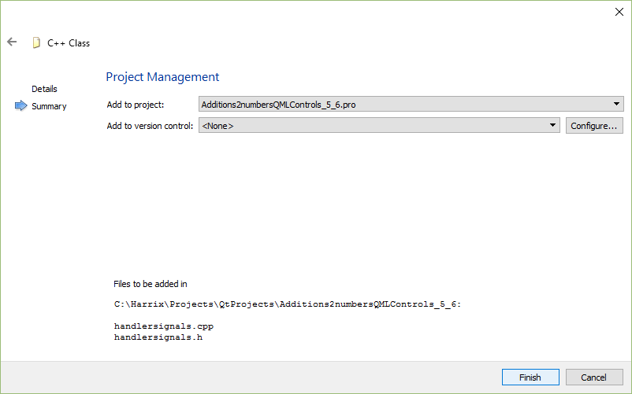

_Рисунок 16 — Ввод параметров класса в системе контроля версий_

В итоге получаем наш класс:

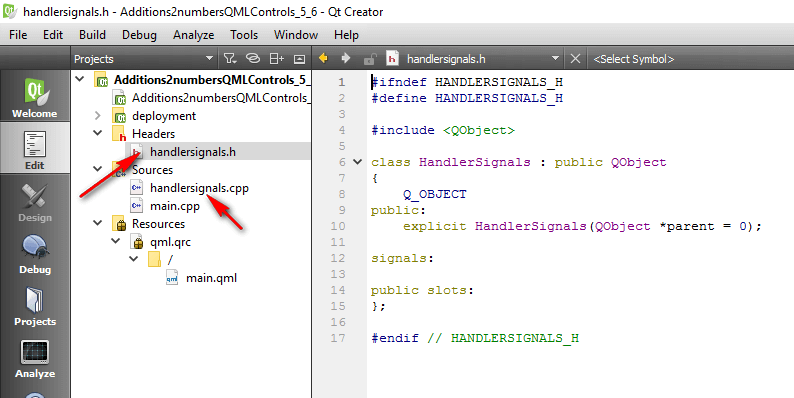

_Рисунок 17 — Созданный класс_

Начнем его редактирование. Перейдем вначале в заголовочный файл `handlersignals.h`.

Мы будем создавать экземпляр нашего объекта и передавать в качестве родителя сцену QML объектов.

Подключите файл `#include <QVariant>`.

Файл `handlersignals.h`:

```h
#ifndef HANDLERSIGNALS_H
#define HANDLERSIGNALS_H

#include <QObject>
#include <QVariant>

class HandlerSignals : public QObject
{
  Q_OBJECT
public:
  explicit HandlerSignals(QObject *parent = 0);

signals:

public slots:
};

#endif // HANDLERSIGNALS_H
```

Файл `handlersignals.cpp` (без изменений):

```cpp
#include "handlersignals.h"

HandlerSignals::HandlerSignals(QObject *parent) : QObject(parent)
{

}
```

Теперь можем добавить наш слот по обработке сигнала. Для примера мы передадим из сигнала текстовой фрагмент, который добавим в итоговое сообщение:

```cpp
void HandlerSignals::cppSlot(const QString &msg) {

  //Найдем строки ввода
  QObject* textinput1 = this->parent()->findChild<QObject*>("textInput1");
  QObject* textinput2 = this->parent()->findChild<QObject*>("textInput2");
  //Найдем поле вывода
  QObject* memo = this->parent()->findChild<QObject*>("memo");

  //Считаем информацию со строк ввода через свойство text
  QString str1=(textinput1->property("text")).toString();
  QString str2=(textinput2->property("text")).toString();

  int a = str1.toInt();//Переведем строку в число
  int b = str2.toInt();//Переведем строку в число

  int c = a + b; //Вычисления наши

  QString strResult=QString::number(c);//Переведем результат в строку

  //Ну и наконец выведем в поле вывода нашу информацию
  memo->setProperty("text", str1+" + "+str2+" = "+strResult+" "+msg);
}
```

Получим такие файлы:

Файл `handlersignals.h`:

```h
#ifndef HANDLERSIGNALS_H
#define HANDLERSIGNALS_H

#include <QObject>
#include <QVariant>

class HandlerSignals : public QObject
{
  Q_OBJECT
public:
  explicit HandlerSignals(QObject *parent = 0);

signals:

public slots:
  void cppSlot(const QString &msg);
};

#endif // HANDLERSIGNALS_H
```

Файл `handlersignals.cpp`:

```cpp
#include "handlersignals.h"

HandlerSignals::HandlerSignals(QObject *parent) : QObject(parent)
{

}

void HandlerSignals::cppSlot(const QString &msg) {

  //Найдем строки ввода
  QObject* textinput1 = this->parent()->findChild<QObject*>("textInput1");
  QObject* textinput2 = this->parent()->findChild<QObject*>("textInput2");
  //Найдем поле вывода
  QObject* memo = this->parent()->findChild<QObject*>("memo");

  //Считаем информацию со строк ввода через свойство text
  QString str1=(textinput1->property("text")).toString();
  QString str2=(textinput2->property("text")).toString();

  int a = str1.toInt();//Переведем строку в число
  int b = str2.toInt();//Переведем строку в число

  int c = a + b; //Вычисления наши

  QString strResult=QString::number(c);//Переведем результат в строку

  //Ну и наконец выведем в поле вывода нашу информацию
  memo->setProperty("text", str1+" + "+str2+" = "+strResult+" "+msg);
}
```

В прошлом варианте данного материала я регистрировал в QML экземпляр класса и вызывал методы-слоты класса. Но при этом QML становился привязан к C++ коду, что не есть хорошо. Поэтому сейчас поступим по другому. Мы в QML документе просто отправим сигнал, что нужно посчитать сумму двух чисел, а уже в C++ поймаем данный сигнал и отправим на обработку в класс.

Вначале отправим сигнал. В `main.qml` в головном элементе `ApplicationWindow` добавим сигнал:

```qml
signal qmlSignal(string msg)
```

Обратите внимание, что объявление сигнала надо добавлять именно в корневой элемент, иначе мы сигнал не найдем.

А в кнопке в области действия мыши пропишем уже отправку сигнала:

```qml
onClicked: qmlSignal("яблок")
```

В итоге получим файл `main.qml`:

```qml
import QtQuick 2.6
import QtQuick.Controls 1.5
import QtQuick.Layouts 1.1

ApplicationWindow {
  visible: true
  width: 640
  height: 480
  title: qsTr("Hello World")

  property alias button1: button1

  signal qmlSignal(string msg)

  ColumnLayout {
    anchors.centerIn: parent

    Button {
      id: button1
      text: qsTr("Сложить")
      onClicked: qmlSignal("яблок")
    }

    TextInput {
      id: textInput1
      objectName: "textInput1"
      width: 80
      height: 20
      text: qsTr("1")
      font.family: "Times New Roman"
      font.pixelSize: 12
    }

    TextInput {
      id: textInput2
      objectName: "textInput2"
      width: 80
      height: 20
      text: qsTr("1")
      font.pixelSize: 12
    }

    Text {
      id: memo
      objectName: "memo"
      text: qsTr("")
      font.pixelSize: 12
    }
  }
}
```

Запустите приложение. Конечно, у вас кнопка не сработает пока, но вы сможете проверить написали всё верно или нет.

Теперь, перейдем в файл `main.cpp`, чтобы прописать создание экземпляра класса и связать его с нужными объектами.

Добавим заголовочный файл:

```h
#include "handlersignals.h"
```

А в функции `main` после загрузки QML файла пропишем строчки:

```cpp
QObject* root = engine.rootObjects()[0];

HandlerSignals *handlerSignals= new HandlerSignals(root);

QObject::connect(root, SIGNAL(qmlSignal(QString)),
handlerSignals, SLOT(cppSlot(QString)));
```

В первой строчке мы находим корневой объект в QML модели. Во второй строчке создаем экземпляр нашего класса. И в третьей строчке связываем наш слот из класса и сигнал из QML файла.

Теперь `main.cpp` выглядит вот так:

```cpp
#include <QGuiApplication>
#include <QQmlApplicationEngine>

#include "handlersignals.h"

int main(int argc, char *argv[])
{
  QGuiApplication app(argc, argv);

  QQmlApplicationEngine engine;
  engine.load(QUrl(QStringLiteral("qrc:/main.qml")));

  QObject* root = engine.rootObjects()[0];

  HandlerSignals *handlerSignals= new HandlerSignals(root);

  QObject::connect(root, SIGNAL(qmlSignal(QString)),
                   handlerSignals, SLOT(cppSlot(QString)));

  return app.exec();
}
```

Если всё сделали правильно, то при запуск приложения и нажатия на кнопку получим следующее:

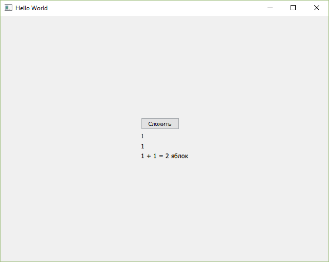

_Рисунок 18 — Результат выполнения приложения_
