# Сложение двух чисел в Qt на C++ (Qt Quick)


В статье описывается создание приложения QML через Qt Quick с выполнением кода на C++.

<details>
<summary>📖 Содержание</summary>

## Содержание

- [Подготовка](#подготовка)
- [Построение интерфейса](#построение-интерфейса)
- [C++ часть](#c-часть)

В качестве среды для разработки используется Qt 5.6.0 для Windows 64 bit под компилятором Visual Studio.

В [статье](https://github.com/Harrix/harrix.dev-articles-2016/blob/main/qt-quick-and-cpp/qt-quick-and-cpp.md) | [🡥](https://harrix.dev/ru/articles/2016/qt-quick-and-cpp/) приведена сокращенная версия данной статьи.

В [статье](https://github.com/Harrix/harrix.dev-articles-2016/blob/main/add-2-num-qt-quick-controls/add-2-num-qt-quick-controls.md) | [🡥](https://harrix.dev/ru/articles/2016/add-2-num-qt-quick-controls/) рассказывается о подобном приложении, но с использованием компонентов Qt Quick Controls.

</details>

## Подготовка

Создадим Qt Quick приложение:

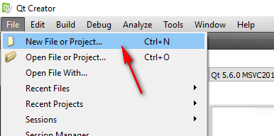

_Рисунок 1 — Создание нового проекта_

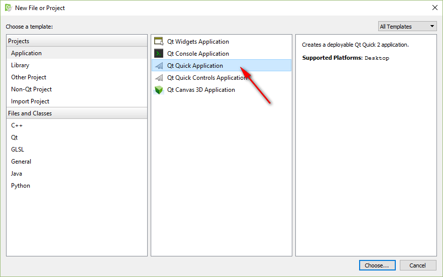

_Рисунок 2 — Создание Qt Quick приложения_

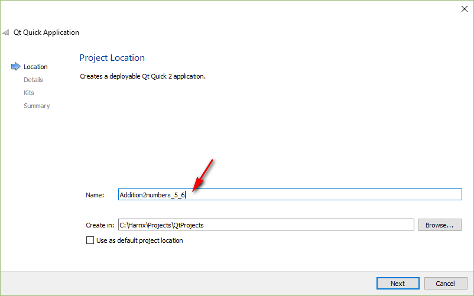

_Рисунок 3 — Ввод названия проекта_

Не рекомендую выбирать `With ui.qml`. По крайней мере не все функции QML с таким файлом работали. Либо я что-то делал не то:

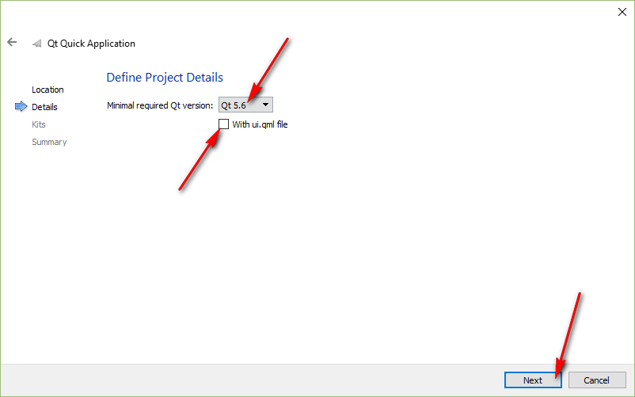

_Рисунок 4 — Выбор последней версии Qt Quick_

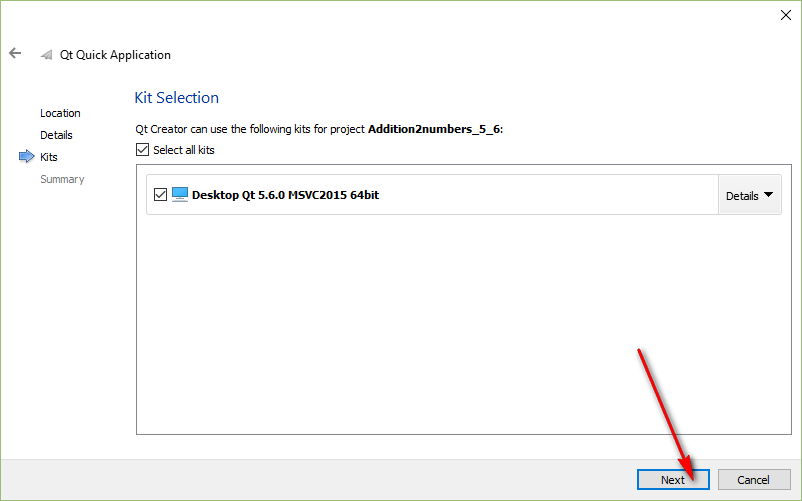

_Рисунок 5 — Выбор компилятора_

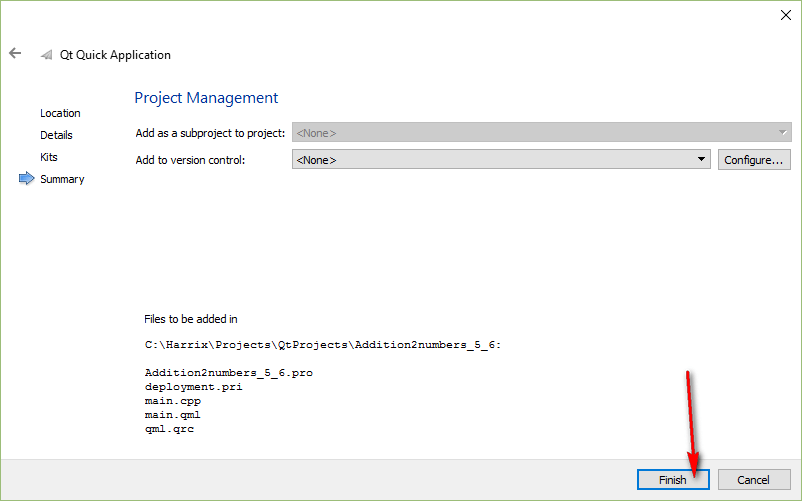

_Рисунок 6 — Выбор системы управления версиями_

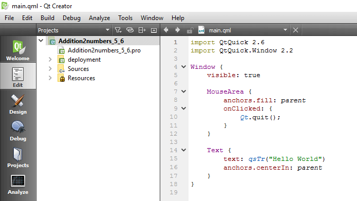

_Рисунок 7 — Созданный проект_

И переведите разработку приложения в режим `Release`:

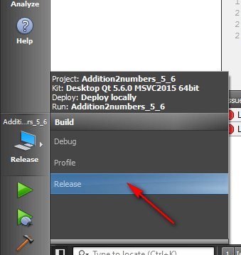

_Рисунок 8 — Перевод компилирования проекта в режим Release_

## Построение интерфейса

Откроем файл `main.qml`:

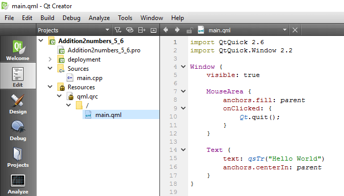

_Рисунок 9 — Файл main.qml_

Удалим элемент `MouseArea` и элемент `Text`. Они тут демонстрационные:

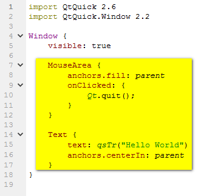

_Рисунок 10 — Удаляемый код_

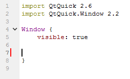

_Рисунок 11 — Очищенный QML файл_

Добавим в основной элемент `Window` следующую конструкцию:

```qml
Column {
  spacing: 5
  anchors.centerIn: parent;

  //Кнопка
  Rectangle {
    id: button //Имя кнопки

    //Размеры кнопки
    width: 100
    height: 30

    //Цвет кнопки
    color: "#0066ff"

    //Текст кнопки
    Text {
      id: buttonLabel
      text: "Сложить"
      color: "#ffffff";
      anchors.centerIn: parent;
    }

    //Действие мыши
    MouseArea {
      id: mouseArea1
      anchors.fill: parent
      hoverEnabled: true;
    }
  }

  //Строка ввода первого числа
  Rectangle {
    id: textinputRect1 //Имя строки ввода

    //Размеры строки ввода
    width: 100
    height: 18

    //цвет строки ввода
    color: "#ffffff"

    TextInput {
      id: textinput1
      objectName: "textinput1"
      color: "#0066ff";
      selectionColor: "blue"
      font.pixelSize: 12;
      width: parent.width-4
      anchors.centerIn: parent
      focus: true
      text:"1"
    }
  }

  //Строка ввода второго числа
  Rectangle {
    id: textinputRect2 //Имя строки ввода

    //Размеры строки ввода
    width: 100
    height: 18

    //цвет строки ввода
    color: "#ffffff"

    TextInput {
      id: textinput2
      objectName: "textinput2"
      color: "#0066ff";
      selectionColor: "blue"
      font.pixelSize: 12;
      width: parent.width-4
      anchors.centerIn: parent
      focus: true
      text:"1"
    }
  }

  //Поле вывода
  Rectangle {
    id: memoRect //Имя поля вывода

    //Размеры поле вывода
    width: 100
    height: 35

    //Цвет поля вывода
    color: "#ffffff"

    TextEdit{
      id: memo
      color: "#0066ff"
      objectName: "memo"
      wrapMode: TextEdit.Wrap
      width:parent.width;
      readOnly:true
    }
  }
}
```

Получим такой код файла `main.qml`:

```qml
import QtQuick 2.6
import QtQuick.Window 2.2

Window {
  visible: true
  Column {
    spacing: 5
    anchors.centerIn: parent;

    //Кнопка
    Rectangle {
      id: button //Имя кнопки

      //Размеры кнопки
      width: 100
      height: 30

      //Цвет кнопки
      color: "#0066ff"

      //Текст кнопки
      Text {
        id: buttonLabel
        text: "Сложить"
        color: "#ffffff";
        anchors.centerIn: parent;
      }

      //Действие мыши
      MouseArea {
        id: mouseArea1
        anchors.fill: parent
        hoverEnabled: true;
      }
    }

    //Строка ввода первого числа
    Rectangle {
      id: textinputRect1 //Имя строки ввода

      //Размеры строки ввода
      width: 100
      height: 18

      //цвет строки ввода
      color: "#ffffff"

      TextInput {
        id: textinput1
        objectName: "textinput1"
        color: "#0066ff";
        selectionColor: "blue"
        font.pixelSize: 12;
        width: parent.width-4
        anchors.centerIn: parent
        focus: true
        text:"1"
      }
    }

    //Строка ввода второго числа
    Rectangle {
      id: textinputRect2 //Имя строки ввода

      //Размеры строки ввода
      width: 100
      height: 18

      //цвет строки ввода
      color: "#ffffff"

      TextInput {
        id: textinput2
        objectName: "textinput2"
        color: "#0066ff";
        selectionColor: "blue"
        font.pixelSize: 12;
        width: parent.width-4
        anchors.centerIn: parent
        focus: true
        text:"1"
      }
    }

    //Поле вывода
    Rectangle {
      id: memoRect //Имя поля вывода

      //Размеры поле вывода
      width: 100
      height: 35

      //Цвет поля вывода
      color: "#ffffff"

      TextEdit{
        id: memo
        color: "#0066ff"
        objectName: "memo"
        wrapMode: TextEdit.Wrap
        width:parent.width;
        readOnly:true
      }
    }
  }
}
```

Обратите внимание, что для всех элементов, к которым вы потом захотите обращаться в C++, пропишите не только свойство `id`, но и свойство `objectName` со строковым значением, совпадающим с `id`.

Кратко пробежимся по коду, который у нас получился. Все компоненты мы расположили в главном корневом `Window`. В нем находится компонент `Column`, который располагает находящиеся в нем компоненты в столбик (вертикальная разметка компонентов):

```qml
Column {
  spacing: 5
  anchors.centerIn: parent;
  ...
}
```

Внутри него находится четыре компонента `Rectangle`.

Первый имеет `id` равное `button`, и это обычная кнопка, а точнее закрашенный прямоугольник с текстом внутри и областью для воздействия мышью с `id` равным `mouseArea1`:

```qml
//Кнопка
Rectangle {
  id: button //Имя кнопки

  //Размеры кнопки
  width: 100
  height: 30

  //Цвет кнопки
  color: "#0066ff"

  //Текст кнопки
  Text {
    id: buttonLabel
    text: "Сложить"
    color: "#ffffff";
    anchors.centerIn: parent;
  }

  //Действие мыши
  MouseArea {
    id: mouseArea1
    anchors.fill: parent
    hoverEnabled: true;
  }
}
```

Второй и третий `Rectangle` содержит компонент `TextInput`, то есть строку для ввода информации. В них будем записывать два наших числа:

```qml
//Строка ввода первого числа
Rectangle {
  id: textinputRect1 //Имя строки ввода

  //Размеры строки ввода
  width: 100
  height: 18

  //цвет строки ввода
  color: "#ffffff"

  TextInput {
    id: textinput1
    objectName: "textinput1"
    color: "#0066ff";
    selectionColor: "blue"
    font.pixelSize: 12;
    width: parent.width-4
    anchors.centerIn: parent
    focus: true
    text:"1"
  }
}

//Строка ввода второго числа
Rectangle {
  id: textinputRect2 //Имя строки ввода

  //Размеры строки ввода
  width: 100
  height: 18

  //цвет строки ввода
  color: "#ffffff"

  TextInput {
    id: textinput2
    objectName: "textinput2"
    color: "#0066ff";
    selectionColor: "blue"
    font.pixelSize: 12;
    width: parent.width-4
    anchors.centerIn: parent
    focus: true
    text:"1"
  }
}
```

В последнем четвертом `Rectangle` содержится поле `TextEdit` для вывода текста:

```qml
//Поле вывода
Rectangle {
  id: memoRect //Имя поля вывода

  //Размеры поле вывода
  width: 100
  height: 35

  //Цвет поля вывода
  color: "#ffffff"

  TextEdit{
    id: memo
    color: "#0066ff"
    objectName: "memo"
    wrapMode: TextEdit.Wrap
    width:parent.width;
    readOnly:true
  }
}
```

Если мы запустим приложение, то получим следующее:

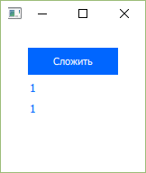

_Рисунок 12 — Запущенное приложение_

Итак, мы описали интерфейс нашей программы.

## C++ часть

При нажатии на кнопку пока ничего не происходит. Исправим это. Для начала установим взаимосвязь между QML моделью и C++ кодом. Для этого создадим класс, через которое будем осуществлять взаимодействие.

Правой кнопкой щелкнем по проекту и выбираем пункт `Add New…`:

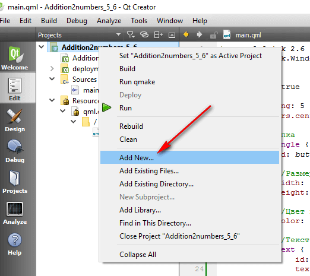

_Рисунок 13 — Добавление нового элемента в проекте_

Там выбираем `C++ Class`:

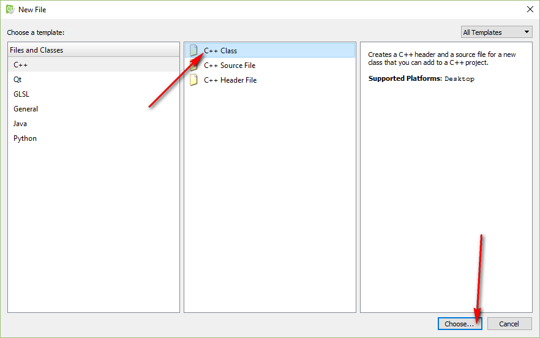

_Рисунок 14 — Создание нового класса_

Там вводим название нашего нового класса, например, `HandlerSignals`, также добавив подключение заголовочного файла `QObject` и базовым классом объявляем `QObject`:

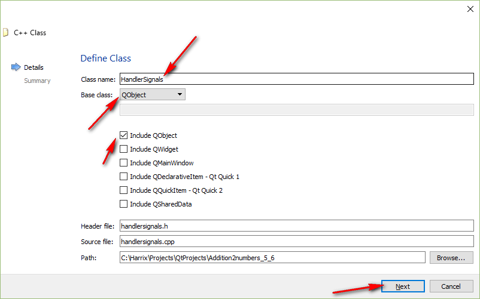

_Рисунок 15 — Установка настроек класса_

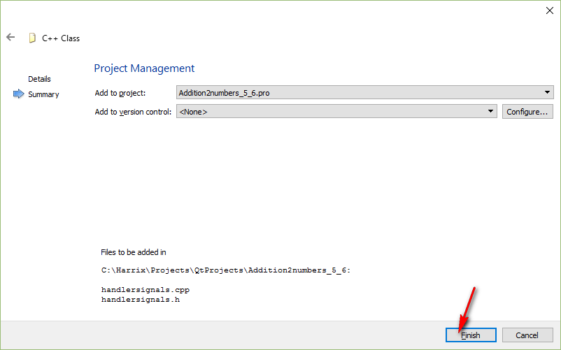

_Рисунок 16 — Настройка системы контроля версий для класса_

В итоге получаем наш класс:

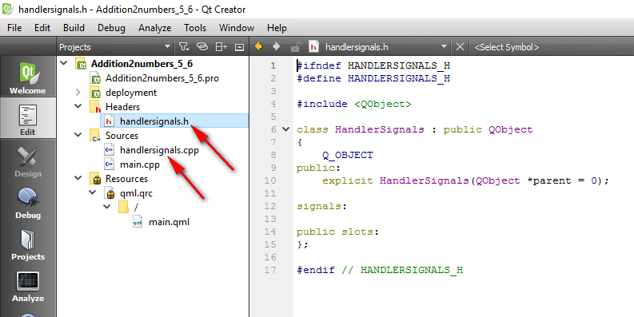

_Рисунок 17 — Созданный класс_

Начнем его редактирование. Перейдем вначале в заголовочный файл `handlersignals.h`.

Мы будем создавать экземпляр нашего объекта и передавать в качестве родителя сцену QML объектов.

Подключите файл `#include <QVariant>`.

Файл `handlersignals.h`:

```h
#ifndef HANDLERSIGNALS_H
#define HANDLERSIGNALS_H

#include <QObject>
#include <QVariant>

class HandlerSignals : public QObject
{
Q_OBJECT
public:
explicit HandlerSignals(QObject *parent = 0);

signals:

public slots:
};

#endif // HANDLERSIGNALS_H
```

Файл `handlersignals.cpp` (без изменений):

```cpp
#include "handlersignals.h"

HandlerSignals::HandlerSignals(QObject *parent) : QObject(parent)
{

}
```

Теперь можем добавить наш слот по обработке сигнала. Для примера мы передадим из сигнала текстовой фрагмент, который добавим в итоговое сообщение:

```cpp
void HandlerSignals::cppSlot(const QString &msg) {
  //Найдем строки ввода
  QObject* textinput1 = this->parent()->findChild<QObject*>("textinput1");
  QObject* textinput2 = this->parent()->findChild<QObject*>("textinput2");
  //Найдем поле вывода
  QObject* memo = this->parent()->findChild<QObject*>("memo");

  //Считаем информацию со строк ввода через свойство text
  QString str1=(textinput1->property("text")).toString();
  QString str2=(textinput2->property("text")).toString();

  int a = str1.toInt();//Переведем строку в число
  int b = str2.toInt();//Переведем строку в число

  int c = a + b; //Вычисления наши

  QString strResult=QString::number(c);//Переведем результат в строку

  //Ну и наконец выведем в поле вывода нашу информацию
  memo->setProperty("text", str1+" + "+str2+" = "+strResult+" "+msg);
}
```

Получим следующие файлы.

Файлы `handlersignals.h`:

```h
#ifndef HANDLERSIGNALS_H
#define HANDLERSIGNALS_H

#include <QObject>
#include <QVariant>

class HandlerSignals : public QObject
{
Q_OBJECT
public:
explicit HandlerSignals(QObject *parent = 0);

signals:

public slots:
void cppSlot(const QString &msg);
};

#endif // HANDLERSIGNALS_H
```

Файл `handlersignals.cpp`:

```cpp
#include "handlersignals.h"

HandlerSignals::HandlerSignals(QObject *parent) : QObject(parent)
{

}

void HandlerSignals::cppSlot(const QString &msg) {
  //Найдем строки ввода
  QObject* textinput1 = this->parent()->findChild<QObject*>("textinput1");
  QObject* textinput2 = this->parent()->findChild<QObject*>("textinput2");
  //Найдем поле вывода
  QObject* memo = this->parent()->findChild<QObject*>("memo");

  //Считаем информацию со строк ввода через свойство text
  QString str1=(textinput1->property("text")).toString();
  QString str2=(textinput2->property("text")).toString();

  int a = str1.toInt();//Переведем строку в число
  int b = str2.toInt();//Переведем строку в число

  int c = a + b; //Вычисления наши

  QString strResult=QString::number(c);//Переведем результат в строку

  //Ну и наконец выведем в поле вывода нашу информацию
  memo->setProperty("text", str1+" + "+str2+" = "+strResult+" "+msg);
}
```

В прошлом варианте данного материала (когда писал, например, для Qt 5.5.0) я регистрировал в QML экземпляр класса и вызывал методы-слоты класса. Но при этом QML становился привязан к C++ коду, что не есть хорошо. Поэтому сейчас поступим по-другому. Мы в QML документе просто отправим сигнал, что нужно посчитать сумму двух чисел, а уже в C++ поймаем данный сигнал и отправим на обработку в класс.

Вначале отправим сигнал. В `main.qml` в головном элементе `Window` добавим сигнал:

```qml
signal qmlSignal(string msg)
```

Обратите внимание, что объявление сигнала надо добавлять именно в корневой элемент, иначе мы сигнал не найдем.

А в кнопке в области действия мыши пропишем уже отправку сигнала:

```qml
//Действие мыши
MouseArea {
  id: mouseArea1
  anchors.fill: parent
  hoverEnabled: true;
  onClicked: {qmlSignal("яблок")}
}
```

В итоге получим файл `main.qml`:

```qml
import QtQuick 2.6
import QtQuick.Window 2.2

Window {
  visible: true

  signal qmlSignal(string msg)

  Column {
    spacing: 5
    anchors.centerIn: parent;

    //Кнопка
    Rectangle {
      id: button //Имя кнопки

      //Размеры кнопки
      width: 100
      height: 30

      //Цвет кнопки
      color: "#0066ff"

      //Текст кнопки
      Text {
        id: buttonLabel
        text: "Сложить"
        color: "#ffffff";
        anchors.centerIn: parent;
      }

      //Действие мыши
      MouseArea {
        id: mouseArea1
        anchors.fill: parent
        hoverEnabled: true;
        onClicked: {qmlSignal("яблок")}
      }
    }

    //Строка ввода первого числа
    Rectangle {
      id: textinputRect1 //Имя строки ввода

      //Размеры строки ввода
      width: 100
      height: 18

      //цвет строки ввода
      color: "#ffffff"

      TextInput {
        id: textinput1
        objectName: "textinput1"
        color: "#0066ff";
        selectionColor: "blue"
        font.pixelSize: 12;
        width: parent.width-4
        anchors.centerIn: parent
        focus: true
        text:"1"
      }
    }

    //Строка ввода второго числа
    Rectangle {
      id: textinputRect2 //Имя строки ввода

      //Размеры строки ввода
      width: 100
      height: 18

      //цвет строки ввода
      color: "#ffffff"

      TextInput {
        id: textinput2
        objectName: "textinput2"
        color: "#0066ff";
        selectionColor: "blue"
        font.pixelSize: 12;
        width: parent.width-4
        anchors.centerIn: parent
        focus: true
        text:"1"
      }
    }

    //Поле вывода
    Rectangle {
      id: memoRect //Имя поля вывода

      //Размеры поле вывода
      width: 100
      height: 35

      //Цвет поля вывода
      color: "#ffffff"

      TextEdit{
        id: memo
        color: "#0066ff"
        objectName: "memo"
        wrapMode: TextEdit.Wrap
        width:parent.width;
        readOnly:true
      }
    }
  }

}
```

Запустите приложение. Конечно, у вас кнопка не сработает пока, но вы сможете проверить написали всё верно или нет.

Теперь, перейдем в файл `main.cpp`, чтобы прописать создание экземпляра класса и связать его с нужными объектами.

Добавим заголовочный файл:

```h
#include "handlersignals.h"
```

А в функции `main` после загрузки QML файла пропишем строчки:

```cpp
QObject* root = engine.rootObjects()[0];

HandlerSignals *handlerSignals= new HandlerSignals(root);

QObject::connect(root, SIGNAL(qmlSignal(QString)),
handlerSignals, SLOT(cppSlot(QString)));
```

В первой строчке мы находим корневой объект в QML модели. Во второй строчке создаем экземпляр нашего класса. И в третьей строчке связываем наш слот из класса и сигнал из QML файла.

Теперь `main.cpp` выглядит вот так:

```cpp
#include <QGuiApplication>
#include <QQmlApplicationEngine>

#include "handlersignals.h"

int main(int argc, char *argv[])
{
  QGuiApplication app(argc, argv);

  QQmlApplicationEngine engine;
  engine.load(QUrl(QStringLiteral("qrc:/main.qml")));

  QObject* root = engine.rootObjects()[0];

  HandlerSignals *handlerSignals= new HandlerSignals(root);

  QObject::connect(root, SIGNAL(qmlSignal(QString)),
  handlerSignals, SLOT(cppSlot(QString)));

  return app.exec();
}
```

Если всё сделали правильно, то при запуске приложения и нажатия на кнопку получим следующее:

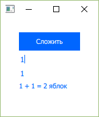

_Рисунок 18 — Результат выполнения программы_

Кстати, если у вас в QML используется компонент со своими сигналами, то связь вы устанавливаете с ним. Например:

```cpp
QObject* ob = root->findChild<QObject*>("flatButton");
QObject::connect(ob, SIGNAL(qmlSignalFlatButton(QString)),
handlerSignals, SLOT(cppSlot(QString)));
```

> [!WARNING]
> Если вы запускаете приложение в стандартном эмуляторе от Android Studio, то ссылки `http:\\` открываться не будут в отличии от `https:\\`. На реальном физическом устройстве будут открываться оба вида ссылок.
