# Сложение двух чисел в Visual Studio 2010 на C++ (CLR приложение)

В статье рассказывается как создать CLR приложение сложения двух чисел в Visual Studio 2010 на C++.

Обратите внимание на то, что данная инструкция работает для Visual Studio 2010. Для более поздних версий она не будет работать, так как там можно создавать лишь пустые CLR приложения, и там инструкция более сложная. Для поздних версий смотрите, например, [эту](https://github.com/Harrix/harrix.dev-blog-2015/blob/main/2015-02-15-add-2-num-vs-2013-clr/2015-02-15-add-2-num-vs-2013-clr.md) инструкцию.

## Создание проекта

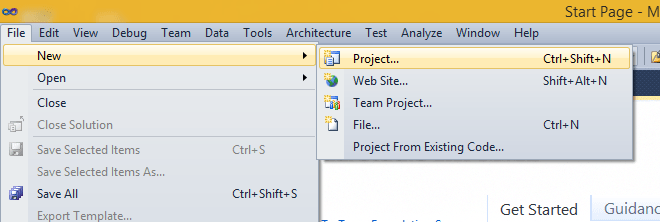

В Visual Studio 2010 есть пункт `Windows Form Application`:

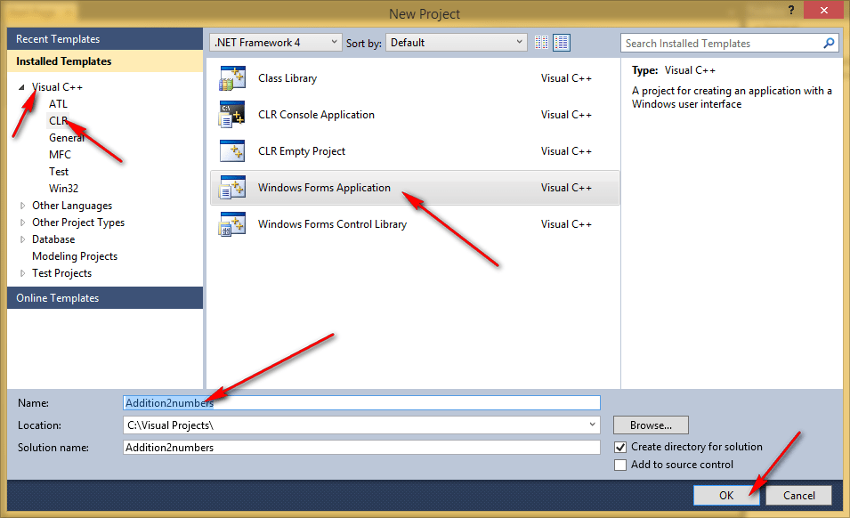

Появится вот такое окно:

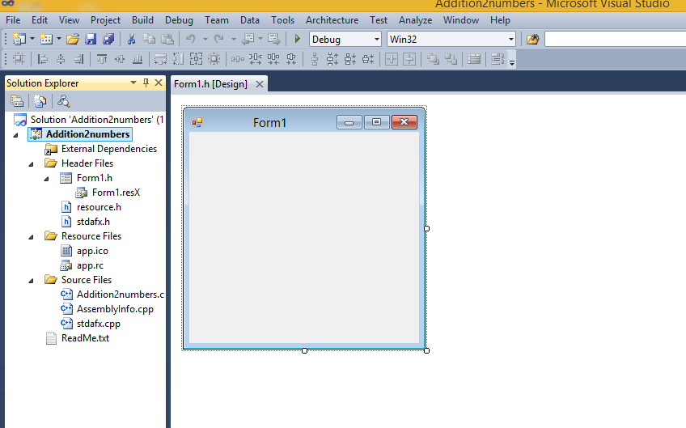

До того, как будете программировать, запустите это пустое приложение. Если оно запустится, то всё хорошо. Если нет, то вы установили Visual Studio неправильно или есть какие-то еще проблемы:

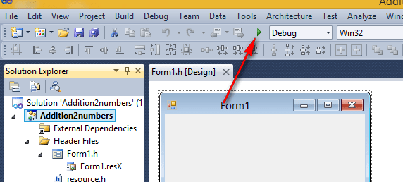

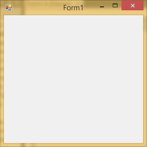

## Размещение элементов

Закинем два поля для ввода наши чисел:

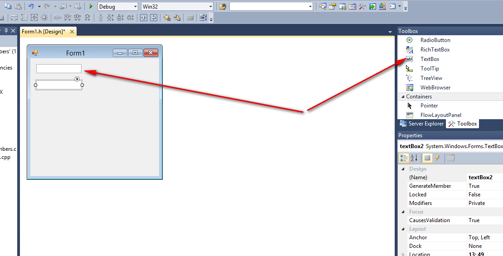

Кнопку добавим:

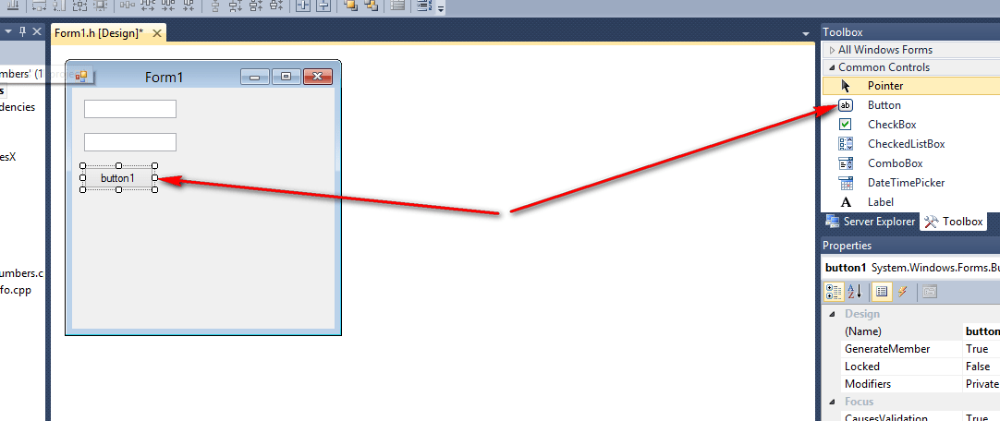

И добавим еще одно текстовое поле (как перед этим добавляли), в которое будем выводить результат. Поменяйте свойство `Multiline` на `true`. После этого вы поле сможете растянуть:

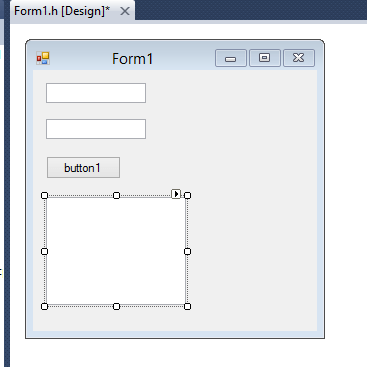

## Написание кода основной программы

Щелкнете по кнопке двойным кликом:

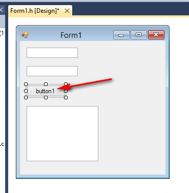

Мы получили метод, в котором прописываем реакцию на клик нашей мыши:

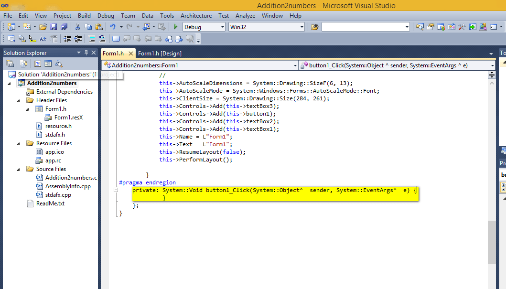

В фигурных скобках пропишем код нашей программы по считыванию двух чисел, их сложении и выводе результата:

```cpp
int x, y, z;

// Считаем значение из первого lineEdit
String^ S1 = textBox1->Text;
// Переведем значение в число
x = Convert::ToInt32(S1);

// Считаем значение из второго lineEdit
String^ S2 = textBox2->Text;
// Переведем значение в число
y = Convert::ToInt32(S2);

// Посчитаем сумму
z = x + y;

// Выведем результат
textBox3->Text = z.ToString();
```

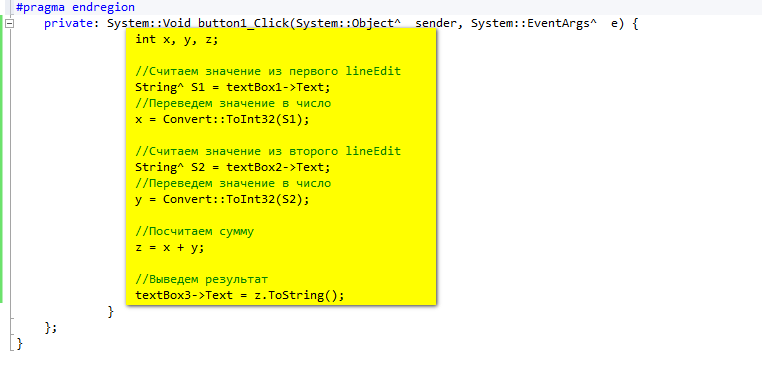

## Запуск программы


Получаем наше приложение:

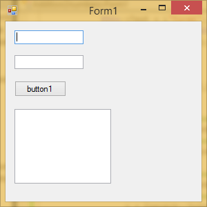

При вводе наших чисел получим вот это:

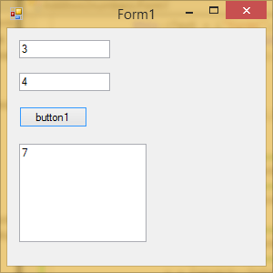
