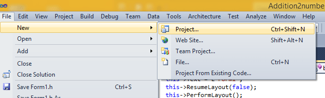
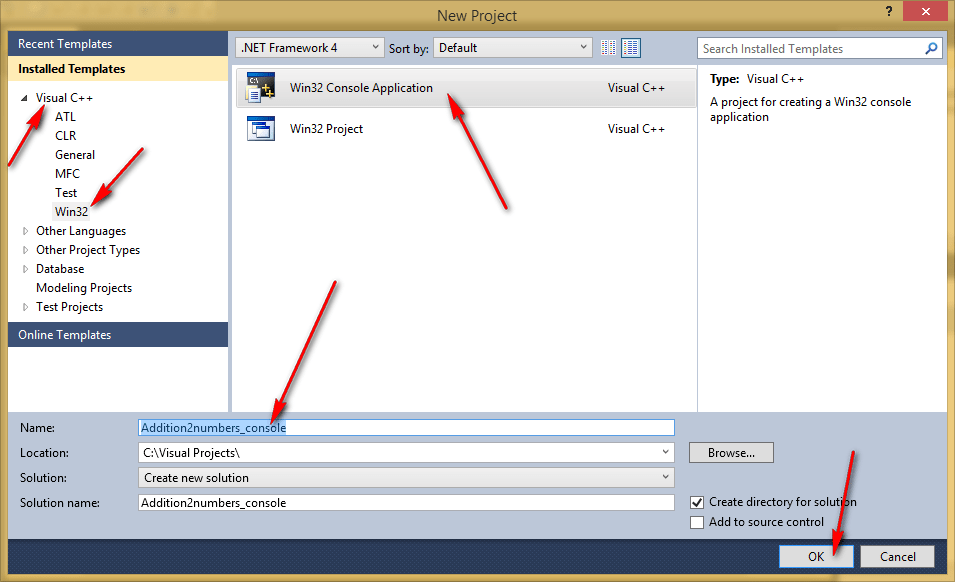
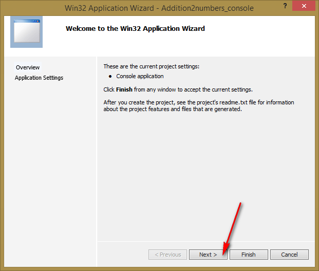
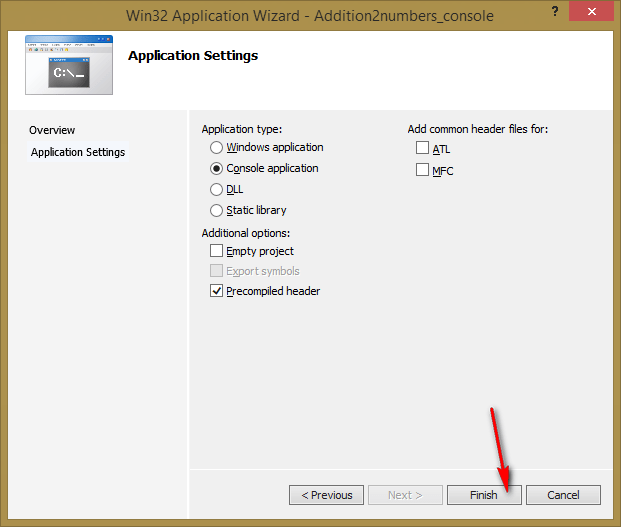
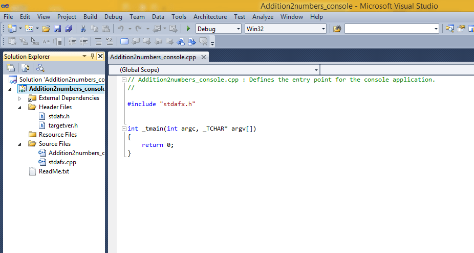
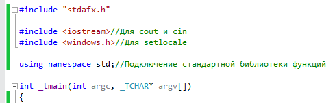
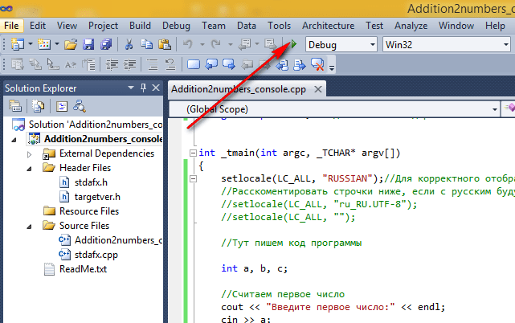
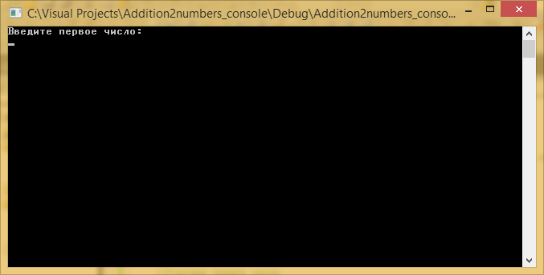
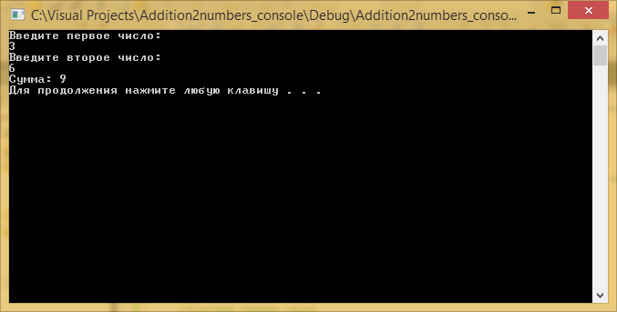

# Сложение двух чисел в Visual Studio 2010 (консольное Win32 приложение)


В статье рассказывается как создать консольное приложения сложения двух чисел Win32 в Visual Studio 2010.

<details>
<summary>📖 Содержание ⬇️</summary>

## Содержание

- [Создание проекта](#создание-проекта)
- [Болванка приложения C++](#болванка-приложения-c)
- [Написание кода основной программы](#написание-кода-основной-программы)
- [Запуск программы](#запуск-программы)

</details>

## Создание проекта



_Рисунок 1 — Создание нового проекта_



_Рисунок 2 — Выбор типа проекта_



_Рисунок 3 — Первоначальное окно мастера создания проекта_



_Рисунок 4 — Настройка проекта_

## Болванка приложения C++



_Рисунок 5 — Созданная болванка проекта_

Пропишем подключение библиотек:

```cpp
#include <iostream> // Для cout и cin
#include <windows.h> // Для setlocale
```

Пропишем пространство имен стандартной библиотеки, чтобы потом было меньше прописывать кода:

```cpp
using namespace std; // Подключение стандартной библиотеки функций
```



_Рисунок 6 — Подключение инклудов и пространства имен_

В функции `_tmain` пропишем строчки кода, чтобы русский язык отображался корректно:

```cpp
setlocale(LC_ALL, "RUSSIAN"); // Для корректного отображения русского языка
// Раскомментировать строчки ниже, если с русским будут проблемы
// setlocale(LC_ALL, "ru_RU.UTF-8");
// setlocale(LC_ALL, "");
```

В конце функции перед `return` пропишем функцию, чтобы программа автоматически не закрывалась:

```cpp
system("pause"); // Чтобы приложение не закрылось автоматически
```

В итоге получаем болванку программы на C++, которую потом удобно использовать для других приложений учебного толка:

```cpp
#include "stdafx.h"

#include <iostream> // Для cout и cin
#include <windows.h> // Для setlocale

using namespace std;//Подключение стандартной библиотеки функций

int _tmain(int argc, _TCHAR* argv[])
{
  setlocale(LC_ALL, "RUSSIAN"); // Для корректного отображения русского языка
  // Раскомментировать строчки ниже, если с русским будут проблемы
  // setlocale(LC_ALL, "ru_RU.UTF-8");
  // setlocale(LC_ALL, "");

  // Тут пишем код программы

  system("pause"); // Чтобы приложение не закрылось автоматически
  return 0;
}:

```

## Написание кода основной программы

А теперь пропишем основной код нашей программы, где через `cin` мы считываем в переменные наши числа, а через `cout` выводим текст в консоль:

```cpp
int a, b, c;

//Считаем первое число
cout << "Введите первое число:" << endl;
cin >> a;

//Считаем второе число
cout << "Введите второе число:" << endl;
cin >> b;

//Посчитаем сумму
c = a + b;

//Выведем результат
cout << "Сумма: " << c << endl;
```

На самом деле `cout` и `cin` обозначают потоки, но для начала это не важно.

Полная программа будет выглядеть так:

```cpp
#include "stdafx.h"

#include <iostream> // Для cout и cin
#include <windows.h> // Для setlocale

using namespace std; // Подключение стандартной библиотеки функций

int _tmain(int argc, _TCHAR* argv[])
{
  setlocale(LC_ALL, "RUSSIAN");// Для корректного отображения русского языка
  // Раскомментировать строчки ниже, если с русским будут проблемы
  // setlocale(LC_ALL, "ru_RU.UTF-8");
  // setlocale(LC_ALL, "");

  // Тут пишем код программы

  int a, b, c;

  // Считаем первое число
  cout << "Введите первое число:" << endl;
  cin >> a;

  // Считаем второе число
  cout << "Введите второе число:" << endl;
  cin >> b;

  // Посчитаем сумму
  c = a + b;

  // Выведем результат
  cout << "Сумма: " << c << endl;

  system("pause"); // Чтобы приложение не закрылось автоматически
  return 0;
}
```

## Запуск программы



_Рисунок 7 — Запуск программы_

Получаем наше приложение:



_Рисунок 8 — Запущенное приложение_

При вводе наших чисел получим вот это:



_Рисунок 9 — Результат выполнения программы_
