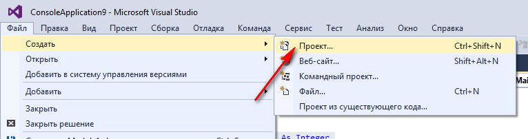
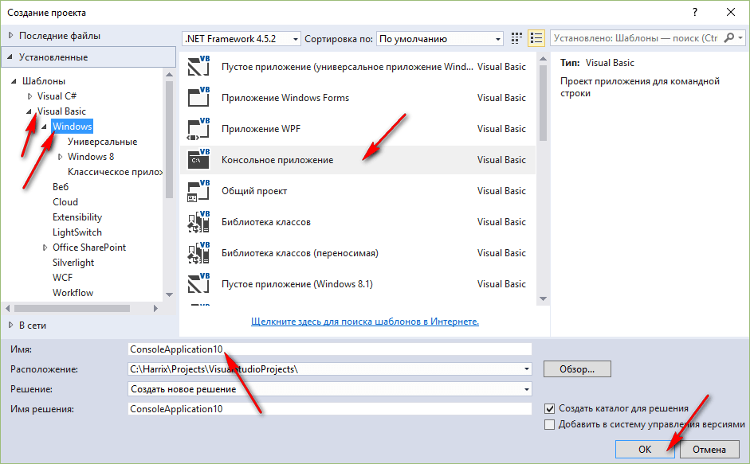
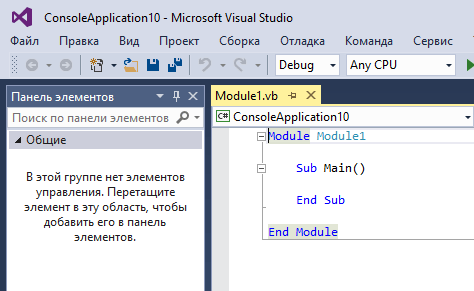
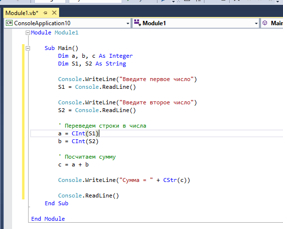
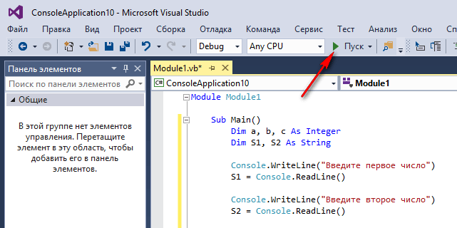
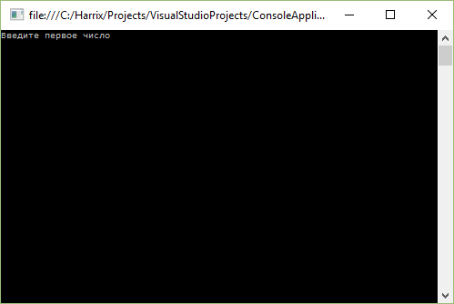
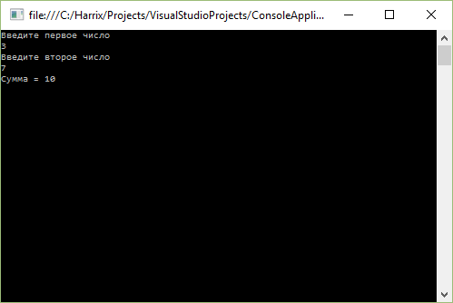

# Сложение двух чисел в Visual Studio 2015 на Basic (консольное приложение)

В статье рассказывается как создать консольное приложения сложения двух чисел на Basic в Visual Studio 2015.

## Создание проекта







## Написание кода основной программы

Пропишем в функции `Main` такой код:

```bas
Dim a, b, c As Integer
Dim S1, S2 As String

Console.WriteLine("Введите первое число")
S1 = Console.ReadLine()

Console.WriteLine("Введите второе число")
S2 = Console.ReadLine()

' Переведем строки в числа
a = CInt(S1)
b = CInt(S2)

' Посчитаем сумму
c = a + b

Console.WriteLine("Сумма = " + CStr(c))

Console.ReadLine()
```

Полная программа будет выглядеть так:

```bas
Module Module1

    Sub Main()
        Dim a, b, c As Integer
        Dim S1, S2 As String

        Console.WriteLine("Введите первое число")
        S1 = Console.ReadLine()

        Console.WriteLine("Введите второе число")
        S2 = Console.ReadLine()

        ' Переведем строки в числа
        a = CInt(S1)
        b = CInt(S2)

        ' Посчитаем сумму
        c = a + b

        Console.WriteLine("Сумма = " + CStr(c))

        Console.ReadLine()
    End Sub

End Module
```



## Запуск программы



Получаем наше приложение:




