# Сложение двух чисел в Visual Studio 2015 на Basic


В статье рассказывается как создать приложение сложения двух чисел в Visual Studio 2015 на Basic.

- [Создание проекта](#создание-проекта)
- [Интерфейс приложения](#интерфейс-приложения)
- [Написание кода основной программы](#написание-кода-основной-программы)
- [Запуск программы](#запуск-программы)

## Создание проекта

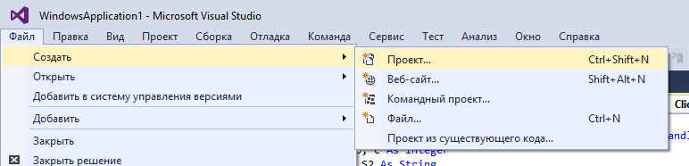

_Рисунок 1 — Создание нового проекта_

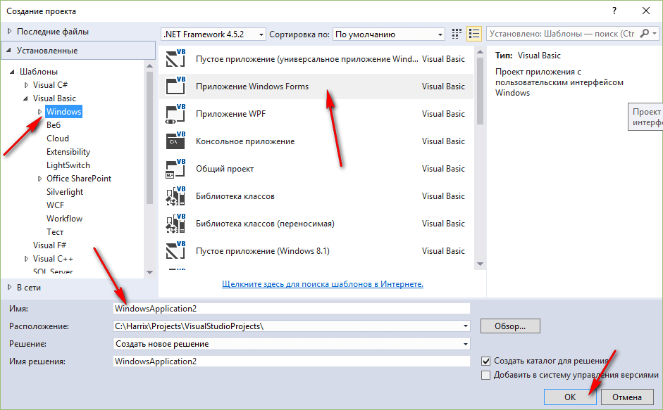

_Рисунок 2 — Выбор типа проекта под Basic_

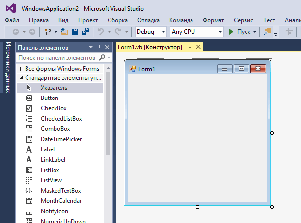

_Рисунок 3 — Созданный проект_

## Интерфейс приложения

Перетащите два `textBox` на форму, в которые будем записывать наши числа:

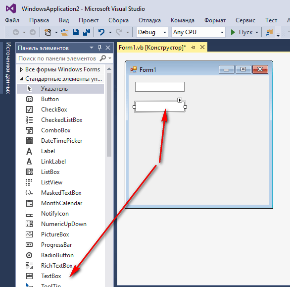

_Рисунок 4 — Поля ввода на форме приложения_

Перетащите кнопку на форму:

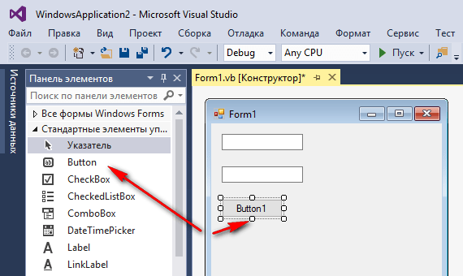

_Рисунок 5 — Кнопка на форме приложения_

Перетащите третий `textBox` на форму, в которую мы будем выводить информацию. Также поменяем значение `Multiline` на `true`, чтобы можно было писать многострочные тексты:

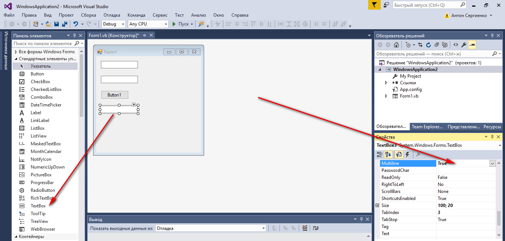

_Рисунок 6 — Изменение параметра Multiline_

Теперь мы можем его растянуть вниз:

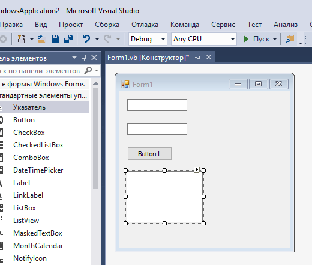

_Рисунок 7 — Растянутый контрол для вывода текста_

А в первых двух `textBox` поменяем начальное значение:

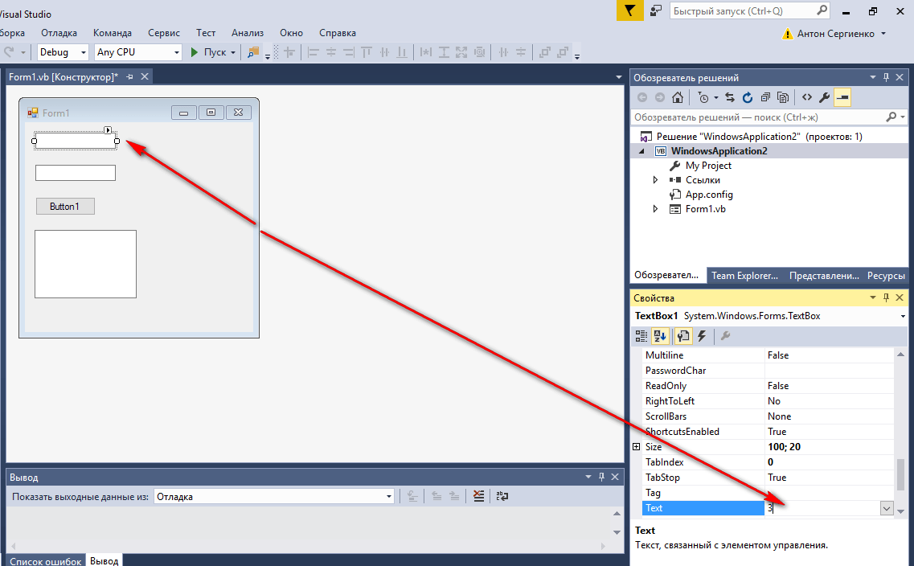

_Рисунок 8 — Изменение начального текста в контроле_

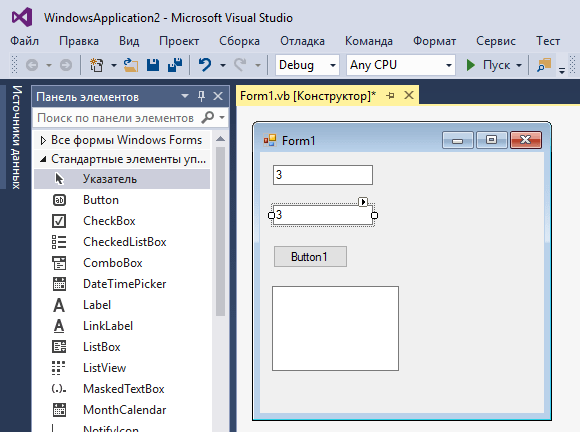

_Рисунок 9 — Внешний вид формы приложения_

## Написание кода основной программы

Щелкнете по кнопке двойным кликом:

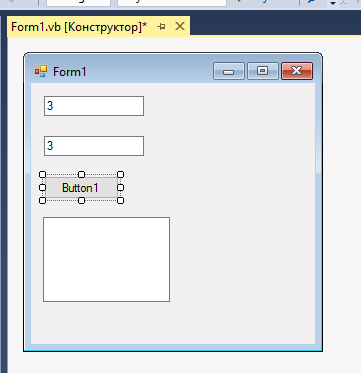

_Рисунок 10 — Двойной клик по кнопке_

Мы получили метод, в котором прописываем реакцию на клик нашей мыши:

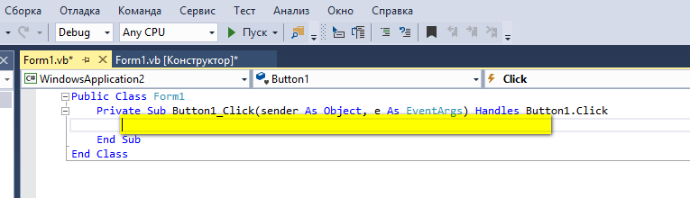

_Рисунок 11 — Метод обработки клика кнопки_

В фигурных скобках пропишем код нашей программы по считыванию двух чисел, их сложении и выводе результата:

```bas
Dim a, b, c As Integer
Dim S1, S2 As String

' Считаем значение из TextBox1
S1 = TextBox1.Text
' Считаем значение из TextBox2
S2 = TextBox2.Text

' Переведем строки в числа
a = CInt(S1)
b = CInt(S2)

' Посчитаем сумму
c = a + b

' Выведем результат
TextBox3.Text = CStr(c)
```

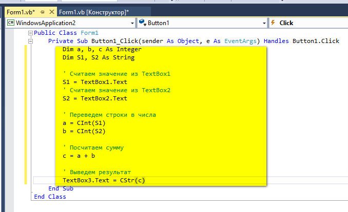

_Рисунок 12 — Код метода обработки клика кнопки_

## Запуск программы

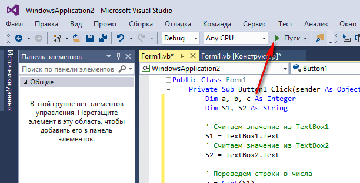

_Рисунок 13 — Запуск приложения_

Получаем наше приложение:

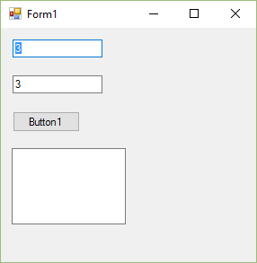

_Рисунок 14 — Запущенное приложение_

При вводе наших чисел получим вот это:

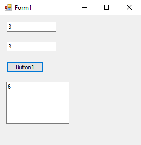

_Рисунок 15 — Результат выполнения приложения_
