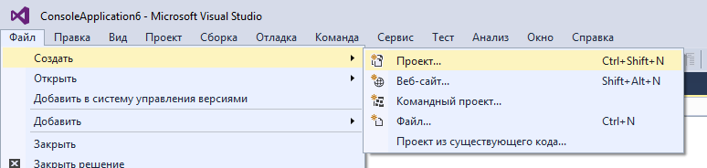
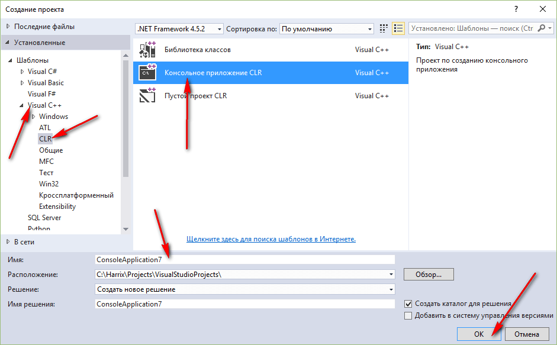
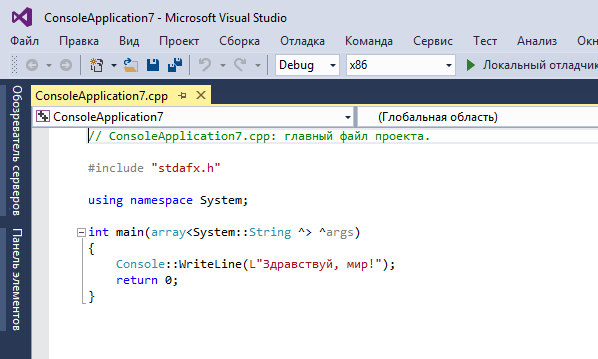
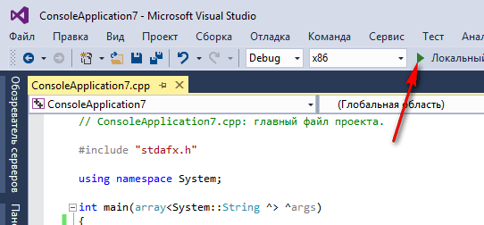
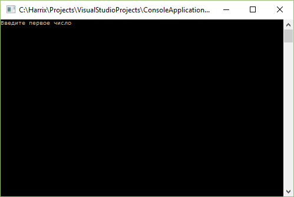
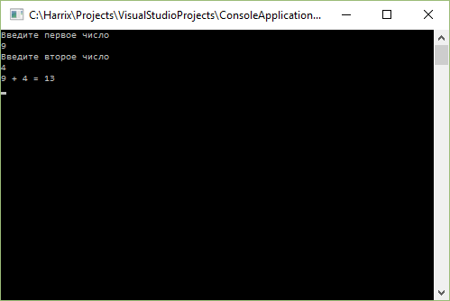

# Сложение двух чисел в Visual Studio 2015 на C++ (консольное CLR приложение)


В статье рассказывается как создать консольное приложения сложения двух чисел CLR в Visual Studio 2015.

## Создание проекта



_Рисунок 1 — Создание нового проекта_



_Рисунок 2 — Выбор типа нового проекта_



_Рисунок 3 — Созданный проект_

## Написание кода основной программы

Пропишем в функции `main` такой код:

```cpp
Console::WriteLine(L"Введите первое число");
String^ S1 = Console::ReadLine();
int a = int::Parse(S1);

Console::WriteLine(L"Введите второе число");
String^ S2 = Console::ReadLine();
int b = int::Parse(S2);

int c = a + b;

Console::WriteLine(a.ToString() + " + " + b.ToString() + " = " + c.ToString());

Console::ReadLine();
```

Полная программа будет выглядеть так:

```cpp
// ConsoleApplication7.cpp: главный файл проекта.

#include "stdafx.h"

using namespace System;

int main(array<System::String ^> ^args)
{
  Console::WriteLine(L"Введите первое число");
  String^ S1 = Console::ReadLine();
  int a = int::Parse(S1);

  Console::WriteLine(L"Введите второе число");
  String^ S2 = Console::ReadLine();
  int b = int::Parse(S2);

  int c = a + b;

    Console::WriteLine(a.ToString() + " + " + b.ToString() + " = " + c.ToString());

  Console::ReadLine();

    return 0;
}
```

## Запуск программы



_Рисунок 4 — Запуск программы_

Получаем наше приложение:



_Рисунок 5 — Запущенное приложение_



_Рисунок 6 — Результат выполнения программы_
