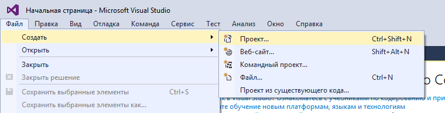
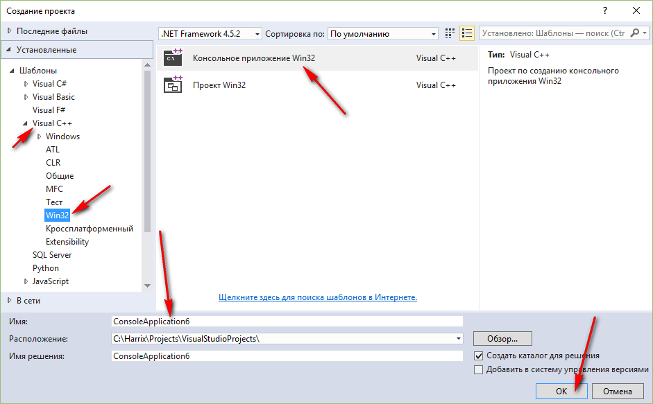
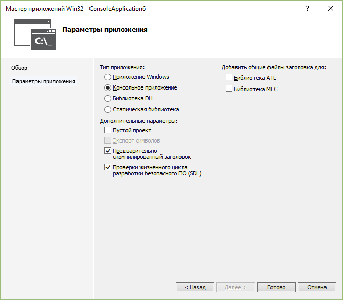
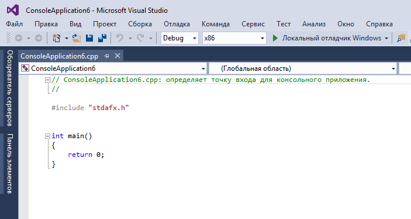
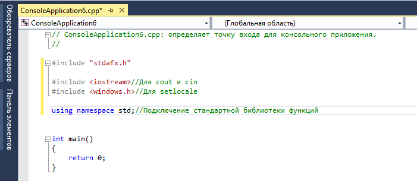
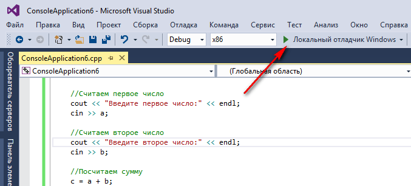
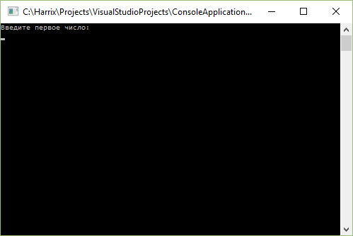
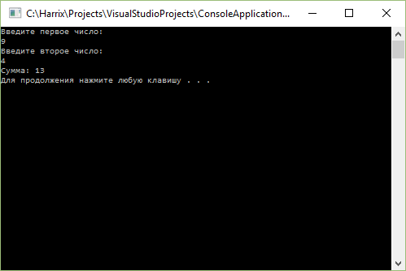

# Сложение двух чисел в Visual Studio 2015 на C++ (консольное Win32 приложение)


В статье рассказывается как создать консольное приложения сложения двух чисел Win32 в Visual Studio 2015.

---

**Внимание!** <!-- !important -->

Посмотрите более новую [статью](https://github.com/Harrix/harrix.dev-blog-2017/blob/main/add-2-num-vs-2015-console-2/add-2-num-vs-2015-console-2.md) <!-- https://harrix.dev/ru/blog/2017/add-2-num-vs-2015-console-2/ -->, где приводится пример приложения без использования `stdafx.h`.

---

## Создание проекта



_Рисунок 1 — Создание нового проекта_



_Рисунок 2 — Выбор консольного приложения Win32_


_Рисунок 3 — Приветственное окно мастера по созданию проекта_



_Рисунок 4 — Параметры приложения_



_Рисунок 5 — Созданный проект_

## Болванка приложения C++

Пропишем подключение библиотек:

```cpp
#include <iostream>
```

Пропишем пространство имен стандартной библиотеки, чтобы потом было меньше прописывать кода:

```cpp
using namespace std; // Подключение стандартной библиотеки функций
```



_Рисунок 6 — Болванка кода программы_

В функции `main` пропишем строчки кода, чтобы русский язык отображался корректно:

```cpp
setlocale(LC_ALL, "RUSSIAN"); // Для корректного отображения русского языка
// Раскомментировать строчки ниже, если с русским будут проблемы
// setlocale(LC_ALL, "ru_RU.UTF-8");
// setlocale(LC_ALL, "");
```

В конце функции перед `return` пропишем функцию, чтобы программа автоматически не закрывалась:

```cpp
system("pause"); // Чтобы приложение не закрылось автоматически
```

В итоге получаем болванку программы на C++, которую потом удобно использовать для других приложений учебного толка:

```cpp
// ConsoleApplication6.cpp: определяет точку входа для консольного приложения.
//

#include "stdafx.h"

#include <iostream>

using namespace std; // Подключение стандартной библиотеки функций

int main()
{
  setlocale(LC_ALL, "RUSSIAN"); // Для корректного отображения русского языка
  // Раскомментировать строчки ниже, если с русским будут проблемы
  // setlocale(LC_ALL, "ru_RU.UTF-8");
  // setlocale(LC_ALL, "");

  // Тут пишем код программы

  system("pause"); // Чтобы приложение не закрылось автоматически

    return 0;
}
```

## Написание кода основной программы

А теперь пропишем основной код нашей программы, где через `cin` мы считываем в переменные наши числа, а через `cout` выводим текст в консоль:

```cpp
int a, b, c;

// Считаем первое число
cout << "Введите первое число:" << endl;
cin >> a;

// Считаем второе число
cout << "Введите второе число:" << endl;
cin >> b;

// Посчитаем сумму
c = a + b;

// Выведем результат
cout << "Сумма: " << c << endl;
```

Полная программа будет выглядеть так:

```cpp
// ConsoleApplication6.cpp: определяет точку входа для консольного приложения.
//

#include "stdafx.h"

#include <iostream>

using namespace std; // Подключение стандартной библиотеки функций

int main()
{
  setlocale(LC_ALL, "RUSSIAN"); // Для корректного отображения русского языка
  // Раскомментировать строчки ниже, если с русским будут проблемы
  // setlocale(LC_ALL, "ru_RU.UTF-8");
  // setlocale(LC_ALL, "");

  int a, b, c;

  // Считаем первое число
  cout << "Введите первое число:" << endl;
  cin >> a;

  // Считаем второе число
  cout << "Введите второе число:" << endl;
  cin >> b;

  // Посчитаем сумму
  c = a + b;

  // Выведем результат
  cout << "Сумма: " << c << endl;

  system("pause"); // Чтобы приложение не закрылось автоматически

    return 0;
}
```

## Запуск программы



_Рисунок 7 — Запуск приложения_

Получаем наше приложение:



_Рисунок 8 — Окно программы после запуска_



_Рисунок 9 — Результат работы программы_
