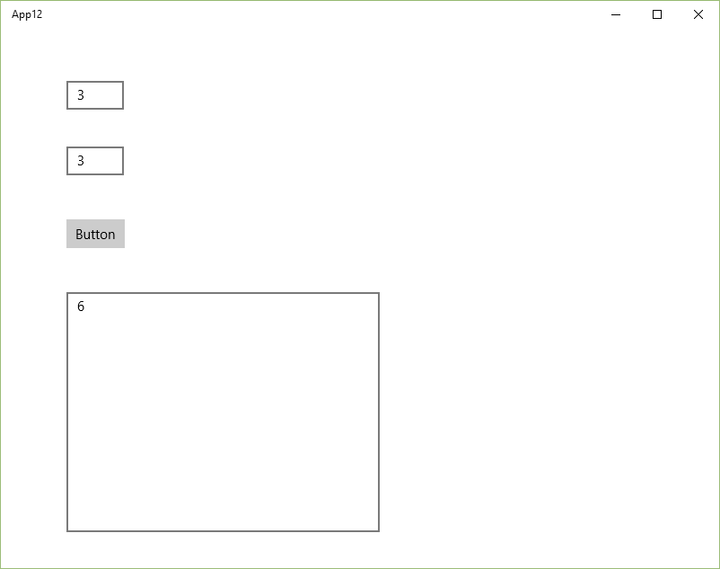

# Сложение двух чисел в Visual Studio 2015 на C++/CLI (Windows 10 UWP приложение)


В статье рассказывается как создать приложение сложения двух чисел в Visual Studio 2015 на C++/CLI в виде универсального приложения под Windows 10 или Metro приложения приложения.

## Подготовка

При создании приложения Windows попросит перевести устройство в режим разработчика:


_Рисунок 1 — Сообщение об необходимости включения режима разработчика_


_Рисунок 2 — Включение режима разработчика в Windows 10_


_Рисунок 3 — Подтверждение включения режима разработчика_

## Создание проекта


_Рисунок 4 — Создание нового проекта_


_Рисунок 5 — Выбор типа нового проекта_


_Рисунок 6 — Созданный проект_

## Интерфейс приложения

Откройте файл `MainPage.xaml`:


_Рисунок 7 — Открытие файла MainPage.xaml_

Если находитесь не в конструкторе, то перейдите в него. Конструктор открывается не очень быстро. В результате увидите это окно:


_Рисунок 8 — Конструктор формы приложения_

Пока мы не собираемся писать приложения под все платформы с адаптивным дизайном, поэтому в качестве платформы для конструктора выберете `Desktop`:


_Рисунок 9 — Выбор режима отображения формы приложения_

Перетащите два `textBox` на форму, в которые будем записывать наши числа:


_Рисунок 10 — Компоненты textBox_

И поменяйте значения в этих полях ввода:


_Рисунок 11 — Изменение начального значения в полях ввода_

Перетащите кнопку на форму:


_Рисунок 12 — Компонент кнопки на форме_

Перетащите третий `textBox` на форму, в которую мы будем выводить информацию, и растяните его:


_Рисунок 13 — Компонент textBox для вывода информации_

## Написание кода основной программы

Щелкнете по кнопке двойным кликом:


_Рисунок 14 — Двойной клик по кнопке_

Мы получили метод, в котором прописываем реакцию на клик нашей мыши:


_Рисунок 15 — Метод обработки клика кнопки_

В фигурных скобках пропишем код нашей программы по считыванию двух чисел, их сложении и выводе результата:

```cpp
int x, y, z;
// Считаем значение из первого textBox
String^ S1 = textBox->Text;
// Переведем значение в число
wstring ws1(S1->Data());
wstringstream convertor;
convertor << ws1;
convertor >> x;

// Считаем значение из второго textBox
String^ S2 = textBox1->Text;
// Переведем значение в число
wstring ws2(S2->Data());
wstringstream convertor2;
convertor2 << ws2;
convertor2 >> y;

// Посчитаем сумму
z = x + y;

// Выведем результат
textBox2->Text = z.ToString();
```


_Рисунок 16 — Код метода обработки клика кнопки_

Обратите внимание на то, что приходится вот таким страшным способом переводить строчки в числа, так как стандартные функции `int::Parse(S2);` не работают.

Также сейчас нужно в этом файле прописать строчку:

```cpp
using namespace std;
```


_Рисунок 17 — Подключение пространства имен стандартной библиотеки_

А также нужно перейти в файл `pch.h`:


_Рисунок 18 — Переход в заголовочный файл_

И там пропишите строчки:

```cpp
#include <stdlib.h>
#include <stdio.h>
#include <errno.h>
#include <iostream>
#include <sstream>
```


_Рисунок 19 — Подключенные библиотеки_

## Запуск программы


_Рисунок 20 — Запуск приложения_

Получаем наше приложение:


_Рисунок 21 — Запущенное приложение_

Чтобы не видеть служебной черной надписи вверху слева, то выберете режим не `Debug`, а `Release`:


_Рисунок 22 — Переключение сборки проекта в режим Release_


_Рисунок 23 — Запущенное приложение в режиме Release_

При вводе наших чисел и нажатии на кнопку получим вот это:



_Рисунок 24 — Результат выполнения программы_
