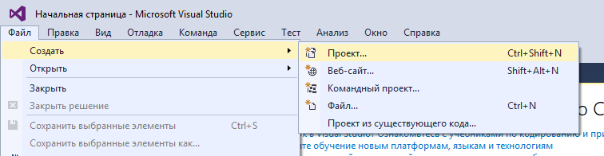
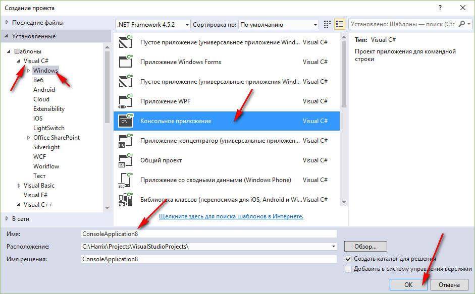
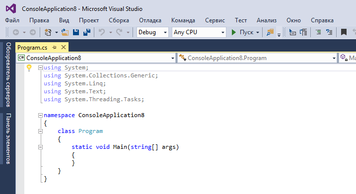
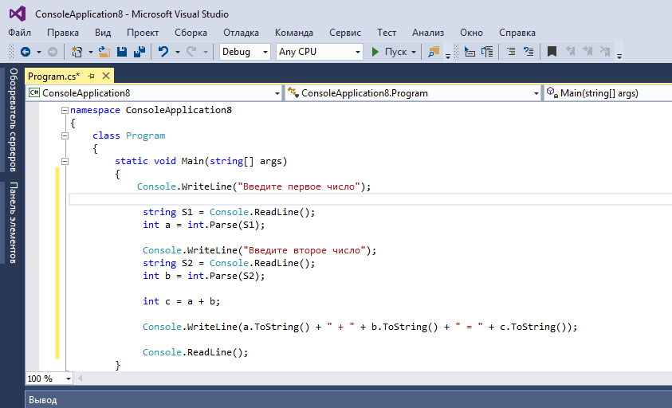
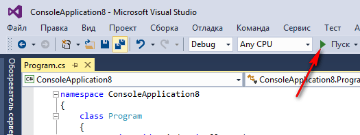
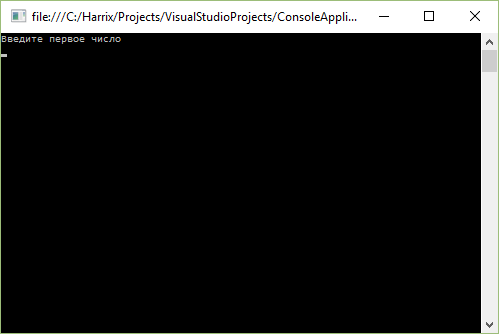
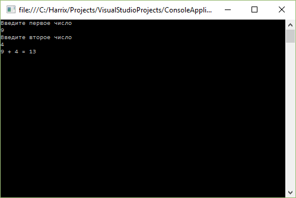

# Сложение двух чисел в Visual Studio 2015 на C# (консольное приложение)


В статье рассказывается как создать консольное приложения сложения двух чисел на C# в Visual Studio 2015.

- [Создание проекта](#создание-проекта)
- [Написание кода основной программы](#написание-кода-основной-программы)
- [Запуск программы](#запуск-программы)

## Создание проекта



_Рисунок 1 — Создание нового проекта_



_Рисунок 2 — Выбор типа проекта_



_Рисунок 3 — Созданный проект_

## Написание кода основной программы

Пропишем в методе `Main` основного класса такой код:

```cs
Console.WriteLine("Введите первое число");

string S1 = Console.ReadLine();
int a = int.Parse(S1);

Console.WriteLine("Введите второе число");
string S2 = Console.ReadLine();
int b = int.Parse(S2);

int c = a + b;

Console.WriteLine(a.ToString() + " + " + b.ToString() + " = " + c.ToString());

Console.ReadLine();
```

Полная программа будет выглядеть так:

```cs
using System;
using System.Collections.Generic;
using System.Linq;
using System.Text;
using System.Threading.Tasks;

namespace ConsoleApplication8
{
    class Program
    {
        static void Main(string[] args)
        {
            Console.WriteLine("Введите первое число");

            string S1 = Console.ReadLine();
            int a = int.Parse(S1);

            Console.WriteLine("Введите второе число");
            string S2 = Console.ReadLine();
            int b = int.Parse(S2);

            int c = a + b;

            Console.WriteLine(a.ToString() + " + " + b.ToString() + " = " + c.ToString());

            Console.ReadLine();
        }
    }
}
```



_Рисунок 4 — Код программы в редакторе_

## Запуск программы



_Рисунок 5 — Запуск программы_

Получаем наше приложение:



_Рисунок 6 — Запущенное приложение_



_Рисунок 7 — Результат выполнения программы_
