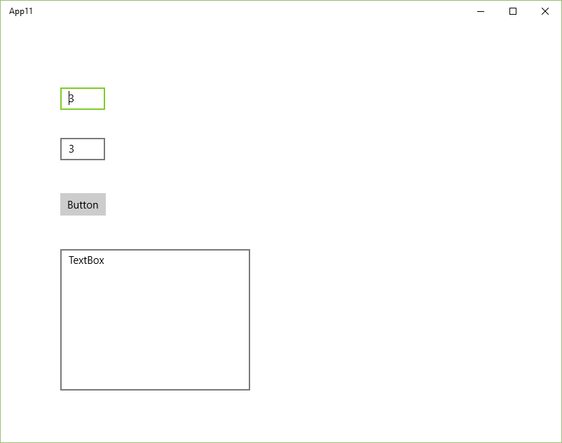

# Сложение двух чисел в Visual Studio 2015 на C# (Windows 10 UWP приложение)

В статье рассказывается как создать приложение сложения двух чисел в Visual Studio 2015 на C# в виде универсального приложения под Windows 10 или Metro приложения приложения.

## Подготовка

Если вы впервые хотите знаться созданием подобных приложений в Visual Studio, то скорее всего данный модуль не будет установлен.

Плюс также при создании приложения Windows попросит перевести устройство в режим разработчика:


## Создание проекта


## Интерфейс приложения

Откройте файл `MainPage.xaml`:


Если находитесь не в конструкторе, то перейдите в него. Конструктор открывается не очень быстро. В результате увидите это окно:


Пока мы не собираемся писать приложения под все платформы с адаптивным дизайном, поэтому в качестве платформы для конструктора выберете `Desktop`:


Перетащите два `textBox` на форму, в которые будем записывать наши числа:


И поменяйте значения в этих полях ввода:


Перетащите кнопку на форму:


Перетащите третий `textBox` на форму, в которую мы будем выводить информацию, и растяните его:


## Написание кода основной программы

Щелкнете по кнопке двойным кликом:


Мы получили метод, в котором прописываем реакцию на клик нашей мыши:


В фигурных скобках пропишем код нашей программы по считыванию двух чисел, их сложении и выводе результата:

```cs
int x, y, z;

// Считаем значение из первого lineEdit
string S1 = textBox.Text;
// Переведем значение в число
x = Convert.ToInt32(S1);

// Считаем значение из второго lineEdit
string S2 = textBox1.Text;
// Переведем значение в число
y = Convert.ToInt32(S2);

// Посчитаем сумму
z = x + y;

// Выведем результат
textBox2.Text = z.ToString();
```


## Запуск программы


Получаем наше приложение:


Чтобы не видеть служебной черной надписи вверху слева, то выберете режим не `Debug`, а `Release`:




При вводе наших чисел и нажатии на кнопку получим вот это:


