# Сложение двух чисел в Visual Studio 2015 на C# (консольное приложение)


В статье рассказывается как создать приложение сложения двух чисел в Visual Studio 2015 на C#.

- [Создание проекта](#создание-проекта)
- [Интерфейс приложения](#интерфейс-приложения)
- [Написание кода основной программы](#написание-кода-основной-программы)
- [Запуск программы](#запуск-программы)

## Создание проекта

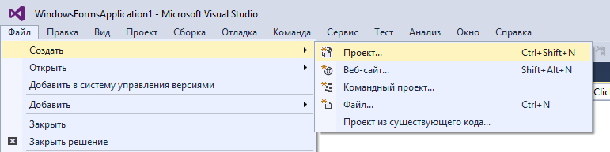

_Рисунок 1 — Создание нового проекта_

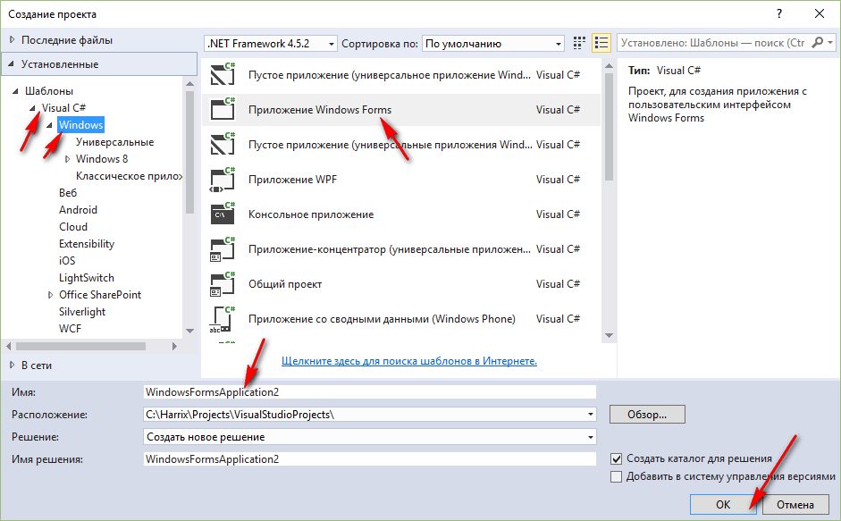

_Рисунок 2 — Выбор типа нового проекта_

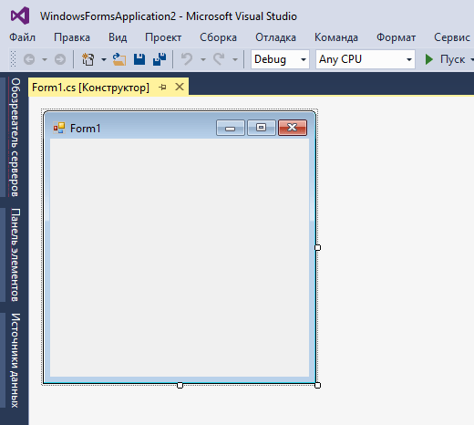

_Рисунок 3 — Созданный проект_

## Интерфейс приложения

Перетащите два `textBox` на форму, в которые будем записывать наши числа:

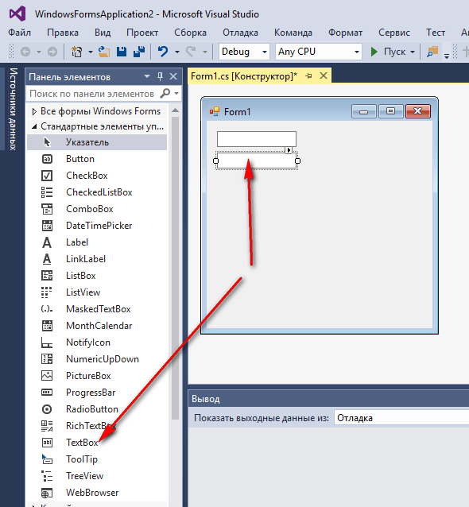

_Рисунок 4 — Поля ввода на форме приложения_

Перетащите кнопку на форму:

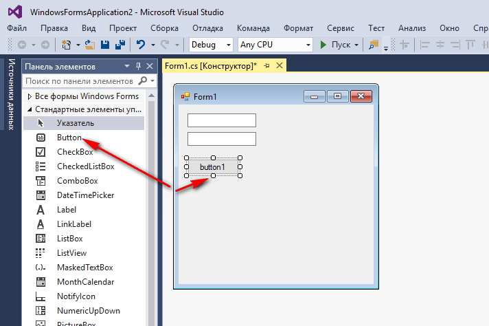

_Рисунок 5 — Кнопка на форме приложения_

Перетащите третий `textBox` на форму, в которую мы будем выводить информацию. Также поменяем значение `Multiline` на `true`, чтобы можно было писать многострочные тексты:

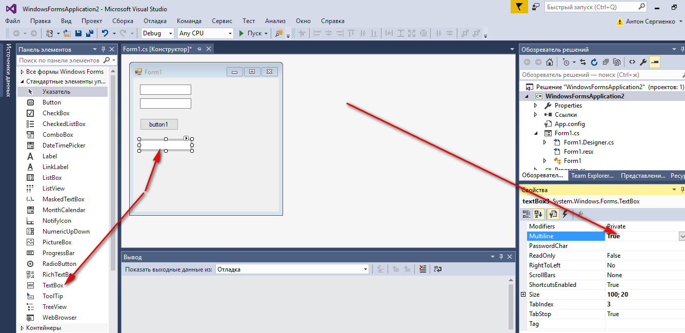

_Рисунок 6 — Параметр Multiline поля вывода_

Теперь мы можем его растянуть вниз:

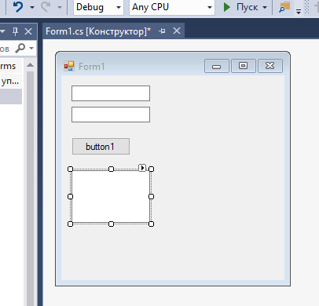

_Рисунок 7 — Растянутый контрол_

А в первых двух `textBox` поменяем начальное значение:

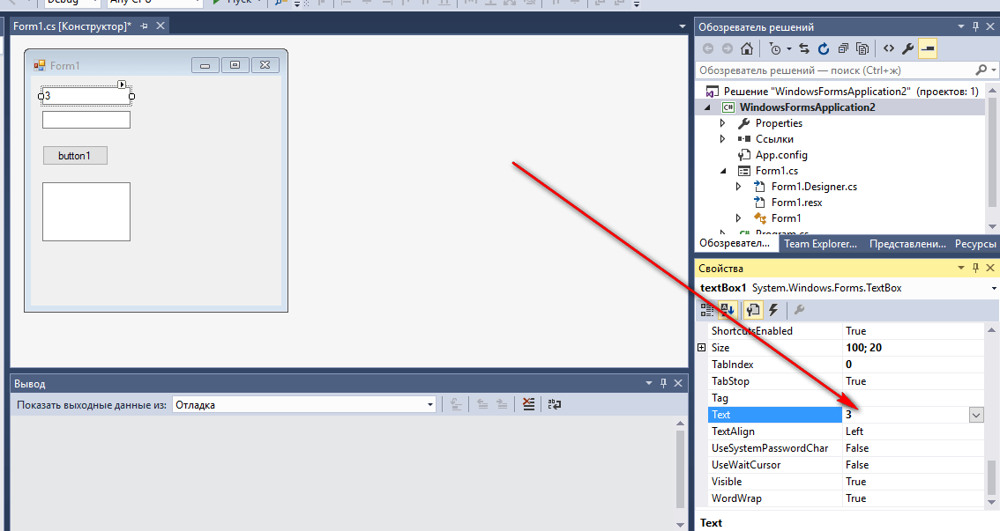

_Рисунок 8 — Изменение начального текста в полях ввода_

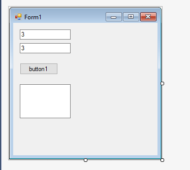

_Рисунок 9 — Текущий вид формы_

## Написание кода основной программы

Щелкнете по кнопке двойным кликом:

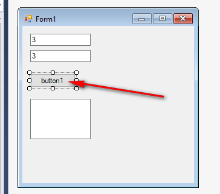

_Рисунок 10 — Клик по кнопке_

Мы получили метод, в котором прописываем реакцию на клик нашей мыши:

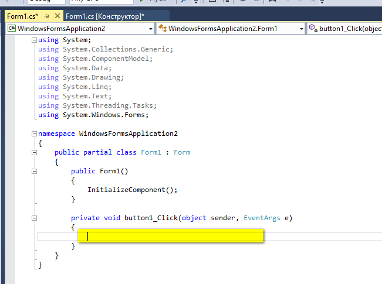

_Рисунок 11 — Метод обработки клика кнопки_

В фигурных скобках пропишем код нашей программы по считыванию двух чисел, их сложении и выводе результата:

```cs
int x, y, z;

// Считаем значение из первого lineEdit
string S1 = textBox1.Text;
// Переведем значение в число
x = Convert.ToInt32(S1);

// Считаем значение из второго lineEdit
string S2 = textBox2.Text;
// Переведем значение в число
y = Convert.ToInt32(S2);

// Посчитаем сумму
z = x + y;

// Выведем результат
textBox3.Text = z.ToString();
```

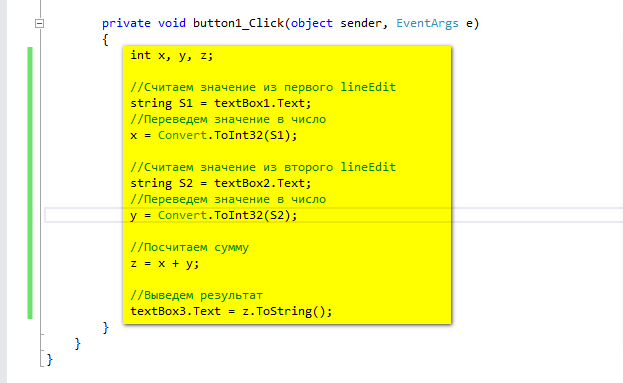

_Рисунок 12 — Код метода обработки клика кнопки_

## Запуск программы

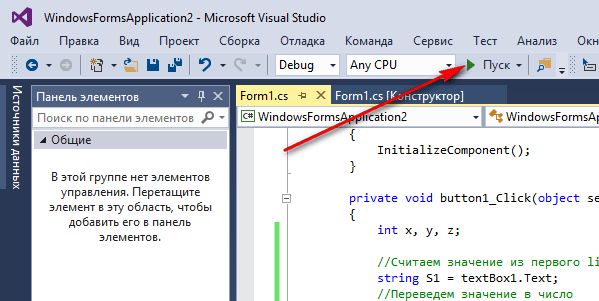

_Рисунок 13 — Запуск программы_

Получаем наше приложение:

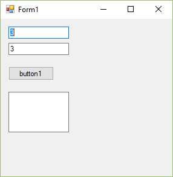

_Рисунок 14 — Запущенная программа_

При вводе наших чисел получим вот это:

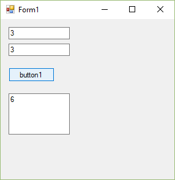

_Рисунок 15 — Результат выполнения программы_
