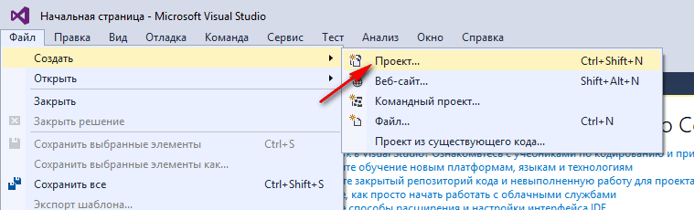
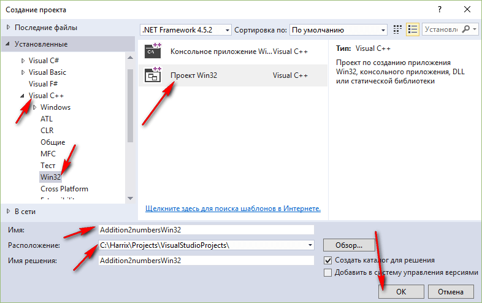
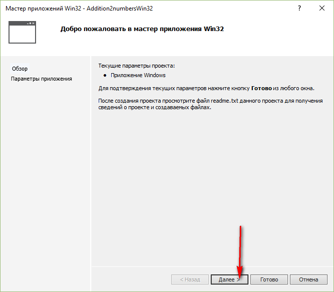
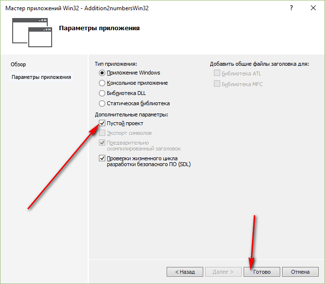
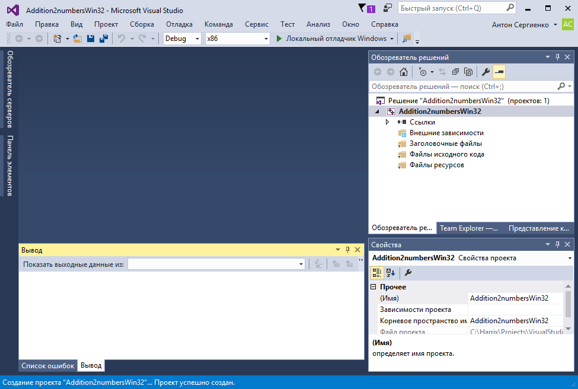
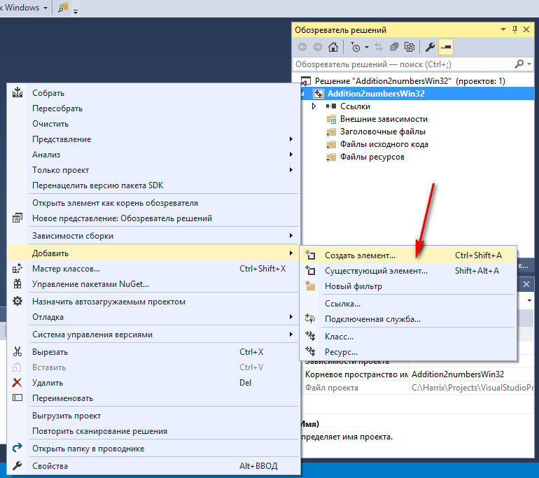
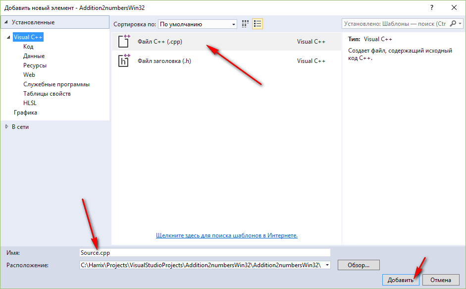
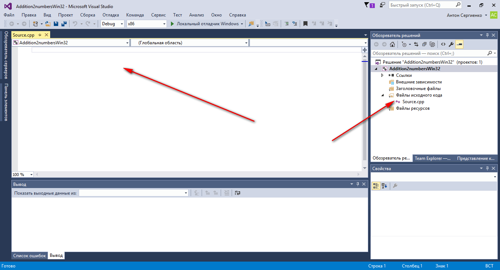
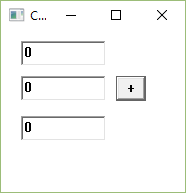
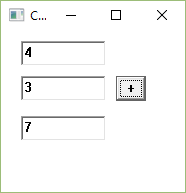

# Сложение двух чисел в Visual Studio 2015 на C++ (Win32 WinAPI приложение)


В статье рассказывается как создать Win32 приложение сложения двух чисел в Visual Studio 2015 на C++.

<details>
<summary>📖 Содержание ⬇️</summary>

## Содержание

- [Создание проекта](#создание-проекта)
- [Добавление файла](#добавление-файла)
- [Написание кода основной программы](#написание-кода-основной-программы)

</details>

Чтоб я еще когда-нибудь связался с этими Win32 приложениями! После опыта написания приложения прекрасно понимаю, почему никто не любит так программировать. Использовал, в частности, материал статей [этой](https://www.instructables.com/id/Making-a-simple-application-using-the-Win32-API/) и [этой](<https://docs.microsoft.com/en-us/previous-versions/bb384843(v=vs.140)>).

## Создание проекта

Создадим `пустой` проект:



_Рисунок 1 — Создание нового проекта_



_Рисунок 2 — Выбор типа проекта Win32_



_Рисунок 3 — Приветственное окно_



_Рисунок 4 — Выбор пункта «Пустой проект»_



_Рисунок 5 — Созданный пустой проект_

## Добавление файла

Мы создали пустой проект, поэтому нужно самим добавить файл `cpp`:



_Рисунок 6 — Пункт меню для создание нового элемента_



_Рисунок 7 — Выбор создания нового файла C++_



_Рисунок 8 — Созданный пустой файл_

## Написание кода основной программы

Вначале подключим инклуды и пропишем главную функцию:

```cpp
#include <windows.h>
#include <tchar.h>

//Главная функция
int WINAPI WinMain(HINSTANCE hInstance,
  HINSTANCE hPrevInstance,
  LPSTR lpCmdLine,
  int nCmdShow)
{
}
```

Нам потребуются глобальные переменные:

```cpp
// Глобальные переменные
static TCHAR szWindowClass[] = _T("win32app"); // Имя класса главного окна
static TCHAR szTitle[] = _T("Сложение двух чисел"); // Заголовок окна
```

Теперь в функции можем прописать описание нашего окна:

```cpp
// Определим внешний вид окна
WNDCLASSEX wcex;
wcex.cbSize = sizeof(WNDCLASSEX);
wcex.style = CS_HREDRAW | CS_VREDRAW;
wcex.lpfnWndProc = WndProc; // Тут прописана та функция, в которой прописан главный функционал
wcex.cbClsExtra = 0;
wcex.cbWndExtra = 0;
wcex.hInstance = hInstance;
wcex.hIcon = LoadIcon(hInstance, MAKEINTRESOURCE(IDI_APPLICATION));
wcex.hCursor = LoadCursor(NULL, IDC_ARROW);
wcex.hbrBackground = (HBRUSH)(COLOR_WINDOW + 1);
wcex.lpszMenuName = NULL;
wcex.lpszClassName = szWindowClass;
wcex.hIconSm = LoadIcon(wcex.hInstance, MAKEINTRESOURCE(IDI_APPLICATION));:
```

Обратите внимание на строчку `wcex.lpfnWndProc = WndProc;`. Тут прописана функция, в которой мы пропишем основной функционал. Её пропишем далее.

Далее можем зарегистрировать класс нашего окна:

```cpp
// Зарегистрируем наше окно
if (!RegisterClassEx(&wcex))
{
  MessageBox(NULL,
    _T("Call to RegisterClassEx failed!"),
    _T("Win32 Guided Tour"),
    NULL);

  return 1;
}
```

Теперь создадим наше окно:

```cpp
// Создадим окно
HWND hWnd = CreateWindow(
  szWindowClass,
  szTitle,
  WS_OVERLAPPEDWINDOW,
  CW_USEDEFAULT, CW_USEDEFAULT,
  200, 200,//Размеры окна
  NULL,
  NULL,
  hInstance,
  NULL
  );
if (!hWnd)
{
  MessageBox(NULL,
    _T("Создать окно не получилось"),
    _T("Ошибка"),
    NULL);

  return 1;
}
```

Запустим его:

```cpp
// Теперь можем запустить наше окно
ShowWindow(hWnd,
  nCmdShow);
UpdateWindow(hWnd);
```

Жесть! Сколько уже кода написано!

Ну, а потом начнем слушать сообщения от операционной системы Windows:

```cpp
// Слушаем сообщения от ОС
MSG msg;
while (GetMessage(&msg, NULL, 0, 0))
{
  TranslateMessage(&msg);
  DispatchMessage(&msg);
}

return (int)msg.wParam;
```

Пропишем болванку функции `WndProc`, о которой мы уже говорили выше:

```cpp
// Главный функционал
LRESULT CALLBACK WndProc(HWND hWnd, UINT message, WPARAM wParam, LPARAM lParam)
{
 return 0;
}
```

Сейчас код программы выглядит так:

```cpp
#include <windows.h>
#include <tchar.h>

// Глобальные переменные
static TCHAR szWindowClass[] = _T("win32app"); // Имя класса главного окна
static TCHAR szTitle[] = _T("Сложение двух чисел"); // Заголовок окна

// Список функций
LRESULT CALLBACK WndProc(HWND, UINT, WPARAM, LPARAM);

// Главная функция
int WINAPI WinMain(HINSTANCE hInstance,
  HINSTANCE hPrevInstance,
  LPSTR lpCmdLine,
  int nCmdShow)
{
  // Определим внешний вид окна
  WNDCLASSEX wcex;
  wcex.cbSize = sizeof(WNDCLASSEX);
  wcex.style = CS_HREDRAW | CS_VREDRAW;
  wcex.lpfnWndProc = WndProc; // Тут прописана та функция, в которой прописан главный функционал
  wcex.cbClsExtra = 0;
  wcex.cbWndExtra = 0;
  wcex.hInstance = hInstance;
  wcex.hIcon = LoadIcon(hInstance, MAKEINTRESOURCE(IDI_APPLICATION));
  wcex.hCursor = LoadCursor(NULL, IDC_ARROW);
  wcex.hbrBackground = (HBRUSH)(COLOR_WINDOW + 1);
  wcex.lpszMenuName = NULL;
  wcex.lpszClassName = szWindowClass;
  wcex.hIconSm = LoadIcon(wcex.hInstance, MAKEINTRESOURCE(IDI_APPLICATION));

  // Зарегистрируем наше окно
  if (!RegisterClassEx(&wcex))
  {
    MessageBox(NULL,
      _T("Call to RegisterClassEx failed!"),
      _T("Win32 Guided Tour"),
      NULL);

    return 1;
  }

  // Создадим окно
  HWND hWnd = CreateWindow(
    szWindowClass,
    szTitle,
    WS_OVERLAPPEDWINDOW,
    CW_USEDEFAULT, CW_USEDEFAULT,
    200, 200,//Размеры окна
    NULL,
    NULL,
    hInstance,
    NULL
    );
  if (!hWnd)
  {
    MessageBox(NULL,
      _T("Создать окно не получилось"),
      _T("Ошибка"),
      NULL);

    return 1;
  }

  // Теперь можем запустить наше окно
  ShowWindow(hWnd,
    nCmdShow);
  UpdateWindow(hWnd);

  // Слушаем сообщения от ОС
  MSG msg;
  while (GetMessage(&msg, NULL, 0, 0))
  {
    TranslateMessage(&msg);
    DispatchMessage(&msg);
  }

  return (int)msg.wParam;
}

LRESULT CALLBACK WndProc(HWND hWnd, UINT message, WPARAM wParam, LPARAM lParam)
{
  return 0;
}
```

У нас будет два поля для ввода текста, одно поле для вывода и кнопка. Для каждого контрола создадим свой идентификатор уникальный. По нему потом будем искать нужен контрол:

```cpp
// Идентификаторы наших контролов: полей ввода и кнопки
#define EDIT1  110
#define EDIT2  111
#define EDIT3  112
#define BUTTON 113
```

Теперь в функции `WndProc` создадим нужные контролы:

```cpp
LRESULT CALLBACK WndProc(HWND hWnd, UINT message, WPARAM wParam, LPARAM lParam)
{
  switch (message)
  {
  case WM_CREATE:
    // Первое число
    CreateWindowEx(WS_EX_CLIENTEDGE, TEXT("EDIT"), TEXT("0"),
      WS_CHILD | WS_VISIBLE | ES_AUTOHSCROLL | WS_TABSTOP,
      20, 10, 85, 25, hWnd, HMENU(EDIT1), GetModuleHandle(NULL), NULL);

    // Второе число
    CreateWindowEx(WS_EX_CLIENTEDGE, TEXT("EDIT"),
      TEXT("0"), WS_CHILD | WS_VISIBLE | ES_AUTOHSCROLL | WS_TABSTOP,
      20, 45, 85, 25, hWnd, HMENU(EDIT2), GetModuleHandle(NULL), NULL);

    // Сюда будем выводить результат
    CreateWindowEx(WS_EX_CLIENTEDGE, TEXT("EDIT"), TEXT("0"),
      WS_CHILD | WS_VISIBLE | ES_AUTOHSCROLL | WS_TABSTOP,
      20, 85, 85, 25, hWnd, HMENU(EDIT3), GetModuleHandle(NULL), NULL);

    // Кнопка сложения
    CreateWindowEx(NULL, TEXT("BUTTON"), TEXT("+"),
      WS_CHILD | WS_VISIBLE | BS_DEFPUSHBUTTON | WS_TABSTOP,
      115, 45, 30, 25, hWnd, HMENU(BUTTON), GetModuleHandle(NULL), NULL);

    break;
  case WM_DESTROY:
    PostQuitMessage(0);
    break;
  default:
    return DefWindowProc(hWnd, message, wParam, lParam);
    break;
  }

  return 0;
}
```

Обратите внимание, где мы используем идентификаторы вроде такого `HMENU(EDIT1)`.

При запуске программы мы увидим вот такое приложение:



_Рисунок 9 — Запущенное приложение_

Но пока кнопка не работает. В нашу функцию `WndProc` добавим отслеживание нажатия на кнопку:

```cpp
case WM_COMMAND:
  switch (LOWORD(wParam))
  {
  case BUTTON:
    //Тут наш код
    return 1;
  }
  break;
```

Функция примет вид:

```cpp
LRESULT CALLBACK WndProc(HWND hWnd, UINT message, WPARAM wParam, LPARAM lParam)
{
  switch (message)
  {
  case WM_CREATE:
    // Первое число
    CreateWindowEx(WS_EX_CLIENTEDGE, TEXT("EDIT"), TEXT("0"),
      WS_CHILD | WS_VISIBLE | ES_AUTOHSCROLL | WS_TABSTOP,
      20, 10, 85, 25, hWnd, HMENU(EDIT1), GetModuleHandle(NULL), NULL);

    // Второе число
    CreateWindowEx(WS_EX_CLIENTEDGE, TEXT("EDIT"),
      TEXT("0"), WS_CHILD | WS_VISIBLE | ES_AUTOHSCROLL | WS_TABSTOP,
      20, 45, 85, 25, hWnd, HMENU(EDIT2), GetModuleHandle(NULL), NULL);

    // Сюда будем выводить результат
    CreateWindowEx(WS_EX_CLIENTEDGE, TEXT("EDIT"), TEXT("0"),
      WS_CHILD | WS_VISIBLE | ES_AUTOHSCROLL | WS_TABSTOP,
      20, 85, 85, 25, hWnd, HMENU(EDIT3), GetModuleHandle(NULL), NULL);

    // Кнопка сложения
    CreateWindowEx(NULL, TEXT("BUTTON"), TEXT("+"),
      WS_CHILD | WS_VISIBLE | BS_DEFPUSHBUTTON | WS_TABSTOP,
      115, 45, 30, 25, hWnd, HMENU(BUTTON), GetModuleHandle(NULL), NULL);

    break;
  case WM_DESTROY:
    PostQuitMessage(0);
    break;
  case WM_COMMAND:
    switch (LOWORD(wParam))
    {
    case BUTTON:
      //Тут наш код
      return 1;
    }
    break;
  default:
    return DefWindowProc(hWnd, message, wParam, lParam);
    break;
  }

  return 0;
}
```

Чтобы не захламлять код вынесем обработку клика кнопки в отдельную функцию:

```cpp
// Функция сложения двух чисел
void Addition(HWND hWnd)
{
  BOOL success = false;
  int a = GetDlgItemInt(hWnd, EDIT1, &success, true);
  if (!success) {
    MessageBox(hWnd, TEXT("В первом поле не целое число"), TEXT("Ошибка"), MB_OK);
  }
  int b = GetDlgItemInt(hWnd, EDIT2, &success, true);
  if (!success) {
    MessageBox(hWnd, TEXT("Во втором поле не целое число"), TEXT("Ошибка"), MB_OK);
  }
  int c = a + b;
  SetDlgItemInt(hWnd, EDIT3, c, true);
}
```

И в итоге получим вот такой полный код нашего приложения:

```cpp
#include <windows.h>
#include <tchar.h>

// Идентификаторы наших контролов: полей ввода и кнопки
#define EDIT1  110
#define EDIT2  111
#define EDIT3  112
#define BUTTON 113

// Глобальные переменные
static TCHAR szWindowClass[] = _T("win32app");//Имя класса главного окна
static TCHAR szTitle[] = _T("Сложение двух чисел");//Заголовок окна

// Список функций
LRESULT CALLBACK WndProc(HWND, UINT, WPARAM, LPARAM);
void Addition(HWND hWnd);

// Главная функция
int WINAPI WinMain(HINSTANCE hInstance,
  HINSTANCE hPrevInstance,
  LPSTR lpCmdLine,
  int nCmdShow)
{
  // Определим внешний вид окна
  WNDCLASSEX wcex;
  wcex.cbSize = sizeof(WNDCLASSEX);
  wcex.style = CS_HREDRAW | CS_VREDRAW;
  wcex.lpfnWndProc = WndProc; // Тут прописана та функция, в которой прописан главный функционал
  wcex.cbClsExtra = 0;
  wcex.cbWndExtra = 0;
  wcex.hInstance = hInstance;
  wcex.hIcon = LoadIcon(hInstance, MAKEINTRESOURCE(IDI_APPLICATION));
  wcex.hCursor = LoadCursor(NULL, IDC_ARROW);
  wcex.hbrBackground = (HBRUSH)(COLOR_WINDOW + 1);
  wcex.lpszMenuName = NULL;
  wcex.lpszClassName = szWindowClass;
  wcex.hIconSm = LoadIcon(wcex.hInstance, MAKEINTRESOURCE(IDI_APPLICATION));

  // Зарегистрируем наше окно
  if (!RegisterClassEx(&wcex))
  {
    MessageBox(NULL,
      _T("Call to RegisterClassEx failed!"),
      _T("Win32 Guided Tour"),
      NULL);

    return 1;
  }

  // Создадим окно
  HWND hWnd = CreateWindow(
    szWindowClass,
    szTitle,
    WS_OVERLAPPEDWINDOW,
    CW_USEDEFAULT, CW_USEDEFAULT,
    200, 200,//Размеры окна
    NULL,
    NULL,
    hInstance,
    NULL
    );
  if (!hWnd)
  {
    MessageBox(NULL,
      _T("Создать окно не получилось"),
      _T("Ошибка"),
      NULL);

    return 1;
  }

  // Теперь можем запустить наше окно
  ShowWindow(hWnd,
    nCmdShow);
  UpdateWindow(hWnd);

  // Слушаем сообщения от ОС
  MSG msg;
  while (GetMessage(&msg, NULL, 0, 0))
  {
    TranslateMessage(&msg);
    DispatchMessage(&msg);
  }

  return (int)msg.wParam;
}

// Функция сложения двух чисел
void Addition(HWND hWnd)
{
  BOOL success = false;
  int a = GetDlgItemInt(hWnd, EDIT1, &success, true);
  if (!success) {
    MessageBox(hWnd, TEXT("В первом поле не целое число"), TEXT("Ошибка"), MB_OK);
  }
  int b = GetDlgItemInt(hWnd, EDIT2, &success, true);
  if (!success) {
    MessageBox(hWnd, TEXT("Во втором поле не целое число"), TEXT("Ошибка"), MB_OK);
  }
  int c = a + b;
  SetDlgItemInt(hWnd, EDIT3, c, true);
}

LRESULT CALLBACK WndProc(HWND hWnd, UINT message, WPARAM wParam, LPARAM lParam)
{
  switch (message)
  {
  case WM_CREATE:
    // Первое число
    CreateWindowEx(WS_EX_CLIENTEDGE, TEXT("EDIT"), TEXT("0"),
      WS_CHILD | WS_VISIBLE | ES_AUTOHSCROLL | WS_TABSTOP,
      20, 10, 85, 25, hWnd, HMENU(EDIT1), GetModuleHandle(NULL), NULL);

    // Второе число
    CreateWindowEx(WS_EX_CLIENTEDGE, TEXT("EDIT"),
      TEXT("0"), WS_CHILD | WS_VISIBLE | ES_AUTOHSCROLL | WS_TABSTOP,
      20, 45, 85, 25, hWnd, HMENU(EDIT2), GetModuleHandle(NULL), NULL);

    // Сюда будем выводить результат
    CreateWindowEx(WS_EX_CLIENTEDGE, TEXT("EDIT"), TEXT("0"),
      WS_CHILD | WS_VISIBLE | ES_AUTOHSCROLL | WS_TABSTOP,
      20, 85, 85, 25, hWnd, HMENU(EDIT3), GetModuleHandle(NULL), NULL);

    // Кнопка сложения
    CreateWindowEx(NULL, TEXT("BUTTON"), TEXT("+"),
      WS_CHILD | WS_VISIBLE | BS_DEFPUSHBUTTON | WS_TABSTOP,
      115, 45, 30, 25, hWnd, HMENU(BUTTON), GetModuleHandle(NULL), NULL);

    break;
  case WM_DESTROY:
    PostQuitMessage(0);
    break;
  case WM_COMMAND:
    switch (LOWORD(wParam))
    {
    case BUTTON:
      Addition(hWnd);
      return 1;
    }
    break;
  default:
    return DefWindowProc(hWnd, message, wParam, lParam);
    break;
  }

  return 0;
}
```

Ну, и монстр получился! Зато теперь всё работает:



_Рисунок 10 — Результат выполнения программы_

Вот наше приложение и написано. Пока всё)

P.S. До этого WinAPI я никогда не занимался, и надеюсь, что в дальнейшим не придется! Так что помочь в каких-нибудь вопросах не смогу.
