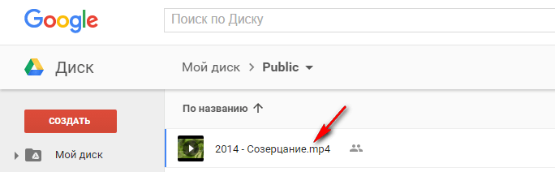
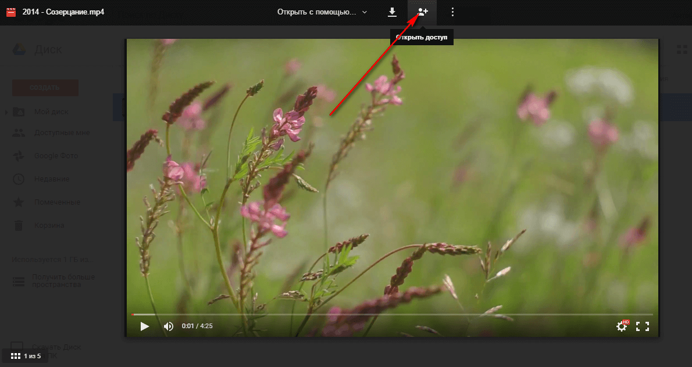
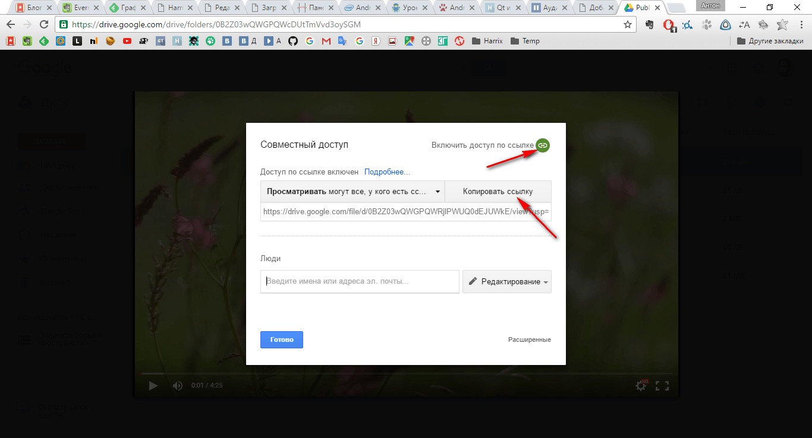
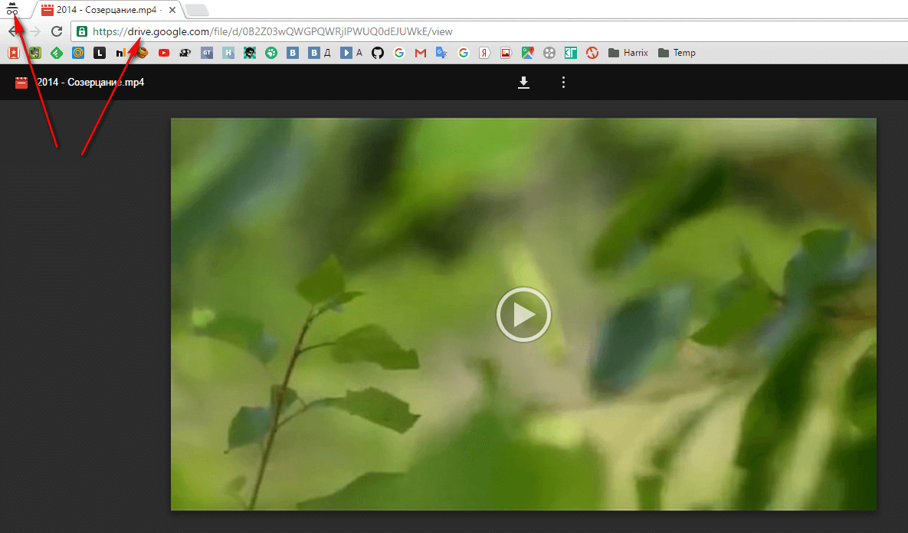
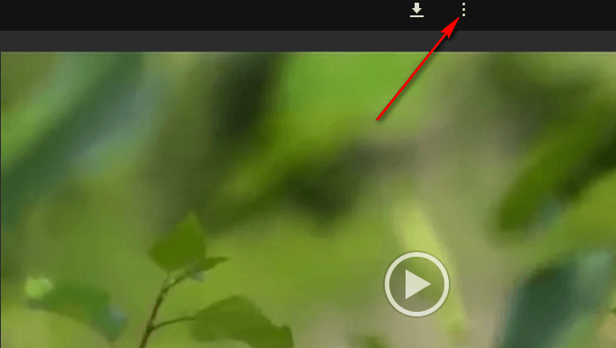
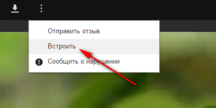
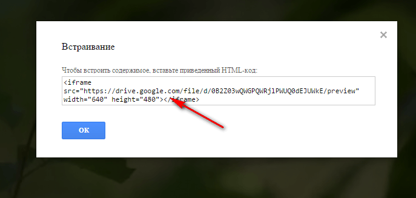

# Как добавить на сайт видео из Google Drive


Как добавить на сайт видео из Google Drive, например в Wordpress.

Данная инструкция работает в марте 2016 года. Зная, как любит Google менять команды и настройки, то в момент прочтения вами статьи, инструкция может не работать.

Зайдите в Google Drive и найдите там свой файл:



_Рисунок 1 — Файл в Google Drive_

Двойным кликом откройте видеофайл. И там перейдите в раздел открытия доступа к файлу:



_Рисунок 2 — Открытый файл_

Включайте доступ по ссылке и копируйте ссылку:



_Рисунок 3 — Получение доступа к файлу по ссылке_

Потом перейдите по этой ссылке. Лучше всего откройте новую вкладку в режиме инкогнито:



_Рисунок 4 — Открытие ссылки файла_

Там выбирайте кнопку в виде трех точек:



_Рисунок 5 — Переход к командам_

И выбирайте команду `Встроить`:



_Рисунок 6 — Команда «Встроить»_

И копируйте код вставки вашего видео:



_Рисунок 7 — Код встраивания_

Теперь можете вставлять в ваш сайт данный код (например, в новой записи Wordpress в режиме «Текст»).

Обратите внимание, что рекомендую изменить ширину видео на 100% (но можно этого и не делать).

Также, если вы хотите, чтобы вы могли на полный экран видео растянуть, то пропишите:

```html
allowfullscreen="true"
```

Например, у меня получился такой код для вставки:

```html
<iframe
  src="https://drive.google.com/file/d/0B2Z03wQWGPQWRjlPWUQ0dEJUWkE/preview"
  allowfullscreen="true"
  width="100%"
  height="480"
></iframe>
```
