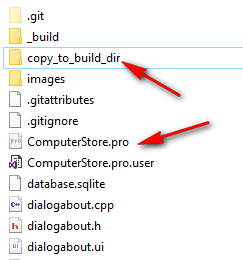
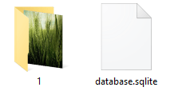
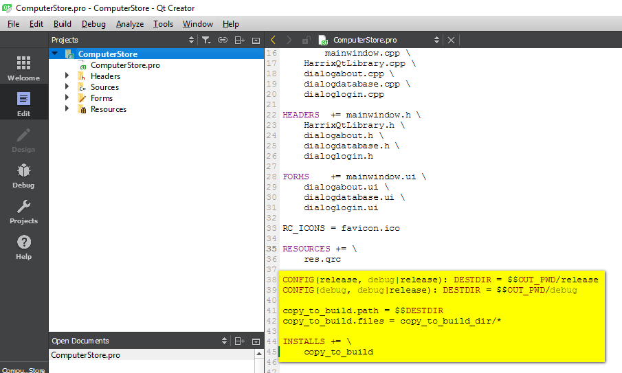
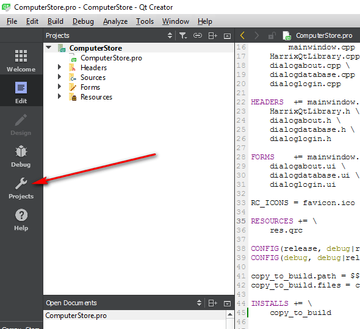
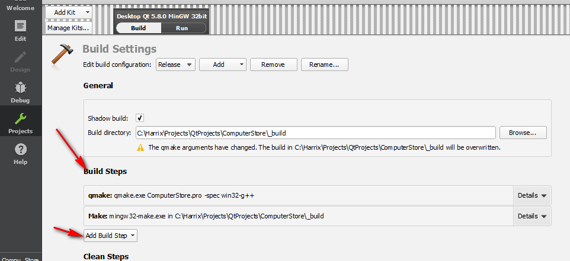
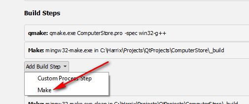
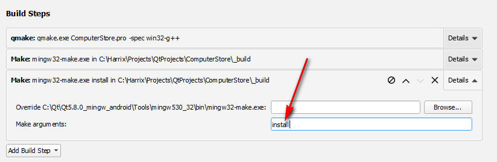
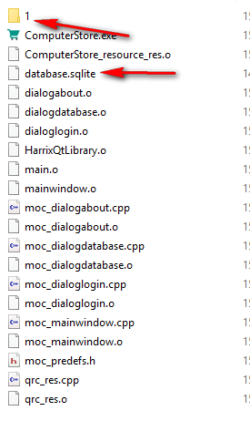

# Копирование файлов в build папку при компиляции проекта в Qt


У вас есть некоторый проект в среде `Qt`. При компиляции проекта в соответствующей папке `release` или `debug` появляется скомпилированный EXE файл, который и запускается, например, через `Qt Creator`. Очень часто требуется, чтобы в папке с скомпилированным EXE файлом были какие-то служебные файлы: картинки, MP3 файлы, служебные директории и др.

<details>
<summary>📖 Содержание</summary>

- [Постановка задачи](#постановка-задачи)
- [Решение](#решение)

В чем проблема? Берем и копируем в эту папку нужные файлы и всё. Но, представим, что мы наш проект ведем с помощью Git. И в нашем репозитории есть файл `.gitignore`, который игнорирует папки с скомпилированным проектом. Кстати, это очень даже хорошо и правильно.

Но при этом в Git не будут сохраняться эти дополнительные файлы, которые Qt не генерируют, но которые нужны для корректной работы EXE проекта (так как они находятся в игнорируемой папке).

Поэтому было бы полезно иметь специальную папку в папке проекта, из которой файлы будут автоматически копироваться в папку с скомпилированным EXE файлом при построении проекта.

Это позволит, например, в Git вести контроль за этими файлами, которые автоматически будут копироваться в папку с EXE файлом.

</details>

## Постановка задачи

Имеется папка `project` с проектом Qt (там находится `.pro` файл).

В этой папке есть папка `copy_to_build_dir`, в которой находятся те файлы, которые мы будем копировать в папку с скомпилированным проектом:



_Рисунок 1 — Папка с нужными файлами_

Допустим там находится такое барахло:



_Рисунок 2 — Содержимое папки с файлами_

Есть папка `build` (у разных людей она может называться по-разному и находится в разных местах), в которой есть папки `release` и `debug`, в одной из которых находится скомпилированный EXE файл.

Нужно при компиляции проекта все файлы и папки из папки `copy_to_build_dir` скопировать в папку `release` и `debug`, где находится EXE файл.

## Решение

В файле проекта `.pro` добавим следующие строки:

```text
CONFIG(release, debug|release): DESTDIR = $$OUT_PWD/release
CONFIG(debug, debug|release): DESTDIR = $$OUT_PWD/debug

copy_to_build.path = $$DESTDIR
copy_to_build.files = copy_to_build_dir/*

INSTALLS += \
    copy_to_build
```



_Рисунок 3 — Файл PRO проекта_

Фактически это все изменения, которые нужно произвести в проекте. Но, если мы скомпилируем проект, то нужные нам файлы не скопируются. Дело в том, что команда `INSTALLS` сработает при запуске `qmake` с параметром `install`.

Если вы пользуйтесь Qt Creator, то вряд ли вы вручную запускаете утилиту `qmake`.

Идем в раздел `Projects`:



_Рисунок 4 — Раздел Projects_

В разделе `Build Steps` щелкаем по пункту `Add Build Step`:



_Рисунок 5 — Кнопка Add Build Step_

Выбираем пункт `Make`:



_Рисунок 6 — Пункт Make_

В пункте `Make arguments` пишем `install`:



_Рисунок 7 — Значение параметра Make arguments_

Всё. Теперь можем скомпилировать проект, и в папке с EXE файлом появится содержимое папки `copy_to_build_dir`:



_Рисунок 8 — Результат компиляции проекта_

Обратите внимание на то, что при переключении режима компилировании с `Release` на `Debug` и наоборот эту процедуру в разделе `Projects` надо будет повторить.

При удалении файла `.pro.user` (он тоже игнорируется в `.gitignore` для Qt, что правильно) процедуру в разделе `Projects` тоже надо будет повторить.
