# Создание SQLite базы данных в DB Browser for SQLite

Базы данных [SQLite](https://ru.wikipedia.org/wiki/SQLite) очень удобны для работы с небольшими объемами данных как в Windows приложениях, так и в Android приложениях. В статье говорится, как создавать и подготавливать базы данных заранее.

## Содержание

- [Установка DB Browser for SQLite](#установка-db-browser-for-sqlite)
- [Создание базы данных](#создание-базы-данных)

Особенно SQLite удобен тем, что не нужно поднимать сервер СУБД перед использованием в приложениях.

## Установка DB Browser for SQLite

Итак, скачиваем версию без установщика `DB Browser for SQLite` (`SQLiteBrowser`): <http://sqlitebrowser.org>:

_Рисунок 1 — Скачивание установщика_

Просто распаковываем архив. В нем будет два EXE файла:

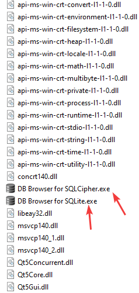

_Рисунок 2 — Файлы в распакованной папке_

Файл `DB Browser for SQLite.exe` представляет обычную версию программы, а файл `DB Browser for SQLCipher.exe` позволяет работать с зашифрованными базами данных. И во второй программе есть вот такой пункт:

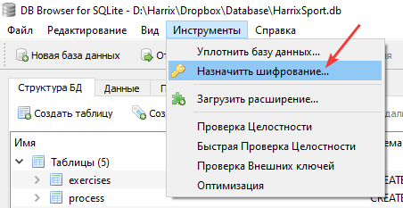

_Рисунок 3 — Возможность шифрования базы данных_

Окно программы:

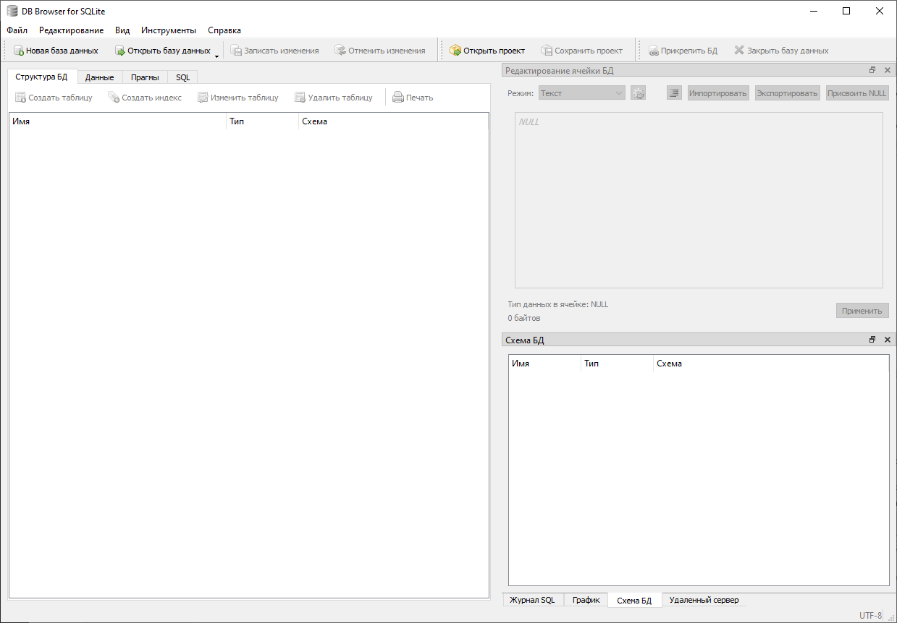

_Рисунок 4 — Окно программы_

## Создание базы данных

Создадим простую базу данных `database` с одной таблицей и тремя столбцами:

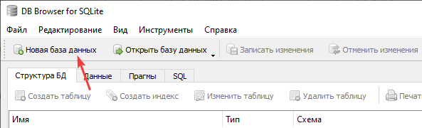

_Рисунок 5 — Создание новой базы данных_

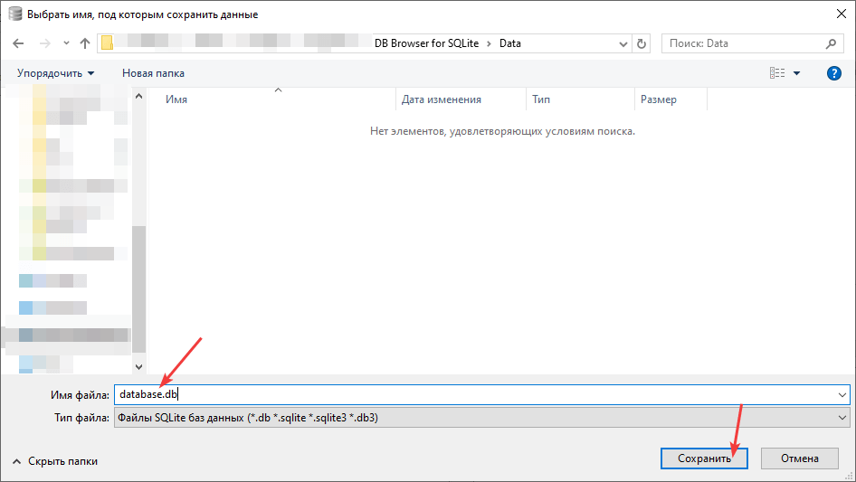

_Рисунок 6 — Выбор имени файла новой базы данных_

Появится окно создания таблицы в программе:

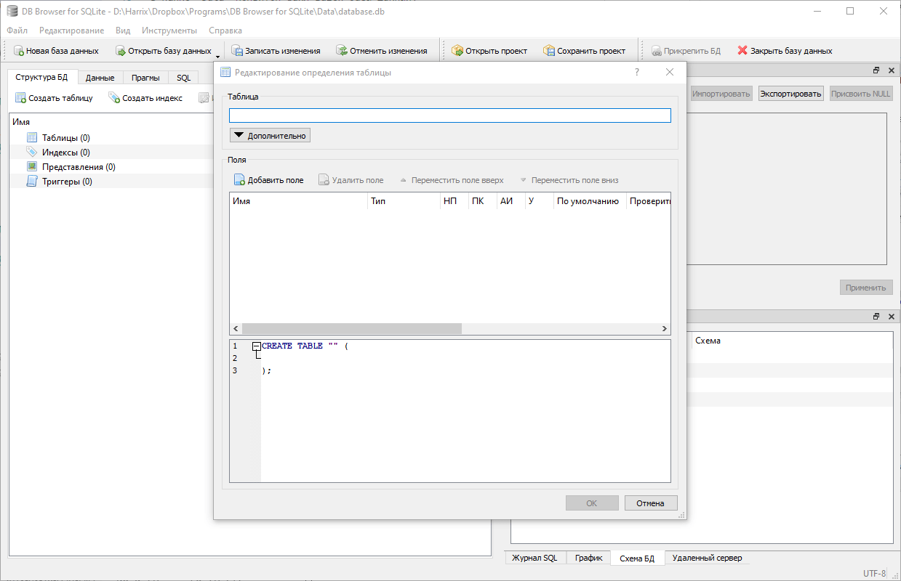

_Рисунок 7 — Открытая база данных_

Создадим таблицу `People`:

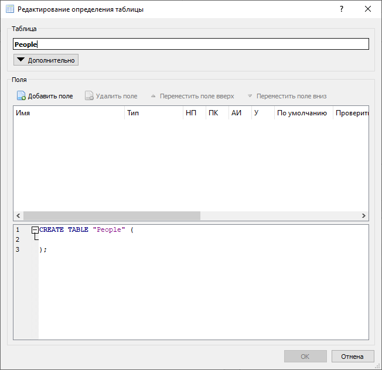

_Рисунок 8 — Создание таблицы People_

Ввиду того, что вдруг база данных будет использоваться в Android, то первым полем задавайте идентификатор по имени `_id`:

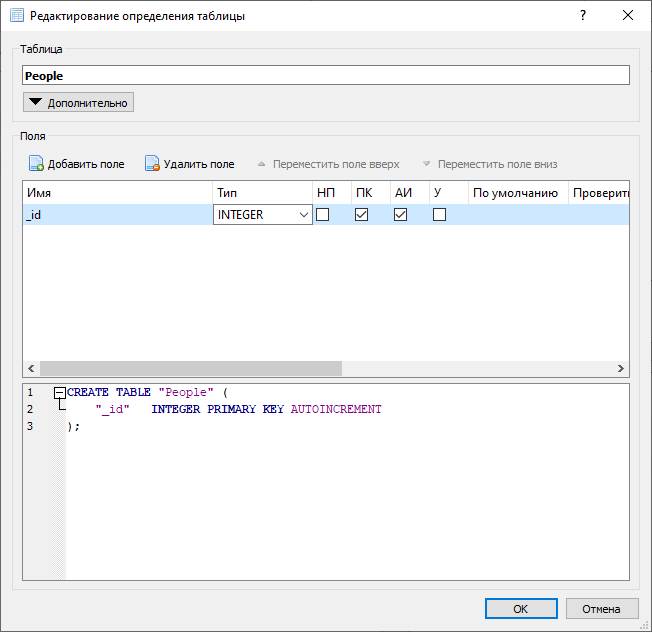

_Рисунок 9 — Создание поля_

Добавим, например, поля `Name` и `Age`:

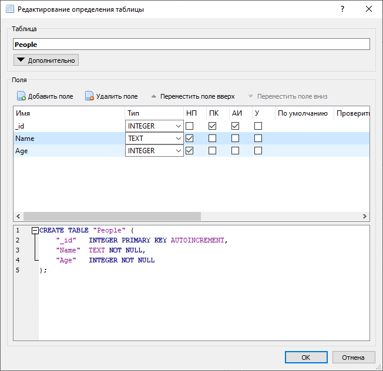

_Рисунок 10 — Создание полей базы данных_

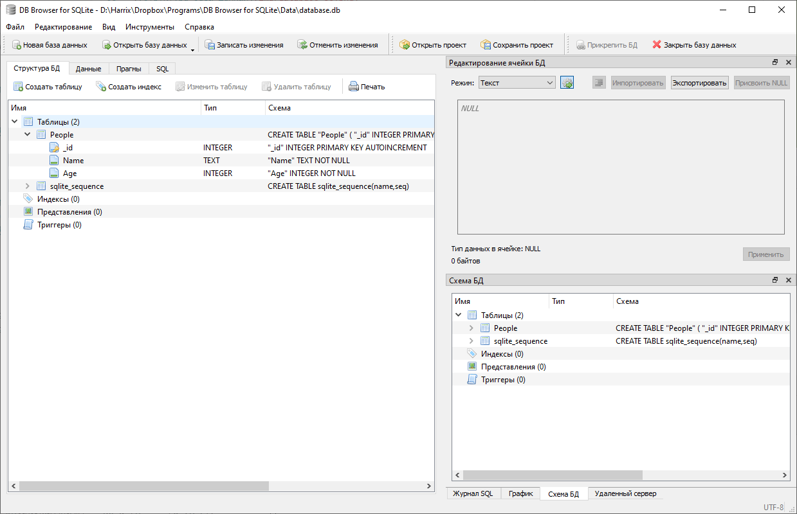

_Рисунок 11 — Структура базы данных_

Во вкладке `Данные` можем вносить данные:

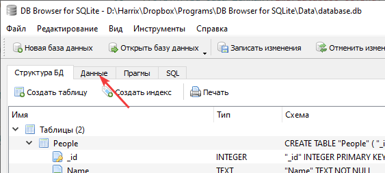

_Рисунок 12 — Вкладка Данные_

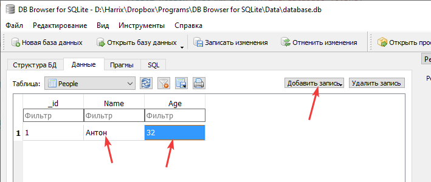

_Рисунок 13 — Ввод первой строчки данных_

Сохраним изменения:

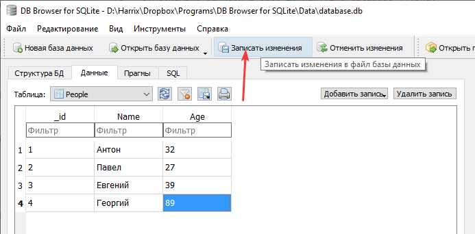

_Рисунок 14 — Сохранение базы данных_

У вас есть готовая база данных SQLite, которую можете использовать, где вам нужно:

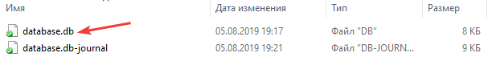

_Рисунок 15 — Сохраненный файл базы данных_
