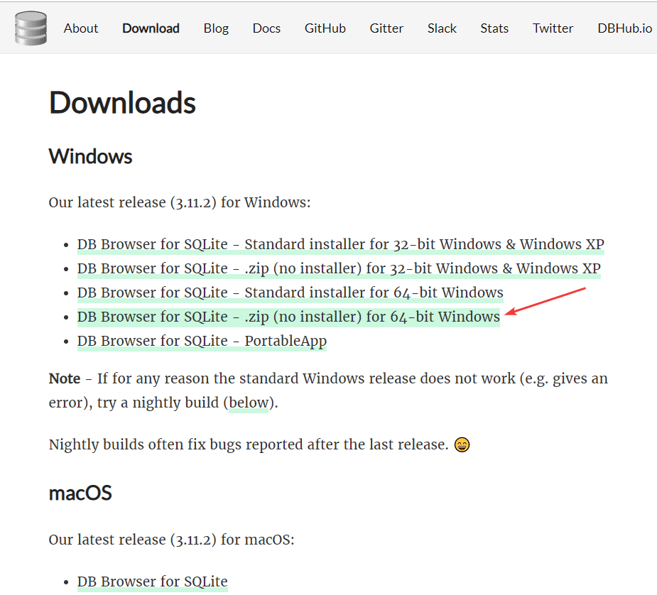

# Создание SQLite базы данных в DB Browser for SQLite

Базы данных [SQLite](https://ru.wikipedia.org/wiki/SQLite) очень удобны для работы с небольшими объемами данных как в Windows приложениях, так и в Android приложениях. В статье говорится, как создавать и подготавливать базы данных заранее.

Особенно SQLite удобен тем, что не нужно поднимать сервер СУБД перед использованием в приложениях.

## Установка DB Browser for SQLite

Итак, скачиваем версию без установщика `DB Browser for SQLite` (`SQLiteBrowser`): <http://sqlitebrowser.org>:

Просто распаковываем архив. В нем будет два EXE файла:

Файл `DB Browser for SQLite.exe` представляет обычную версию программы, а файл `DB Browser for SQLCipher.exe` позволяет работать с зашифрованными базами данных. И во второй программе есть вот такой пункт:

Окно программы:

## Создание базы данных

Создадим простую базу данных `database` с одной таблицей и тремя столбцами:

Появится окно создания таблицы в программе:

Создадим таблицу `People`:

Ввиду того, что вдруг база данных будет использоваться в Android, то первым полем задавайте идентификатор по имени `_id`:

Добавим, например, поля `Name` и `Age`:

Во вкладке `Данные` можем вносить данные:

Сохраним изменения:

У вас есть готовая база данных SQLite, которую можете использовать, где вам нужно:

