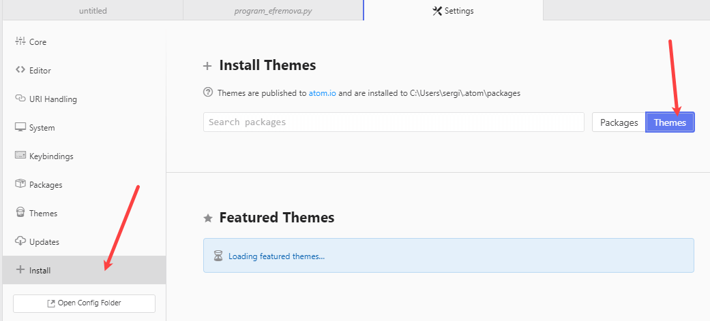
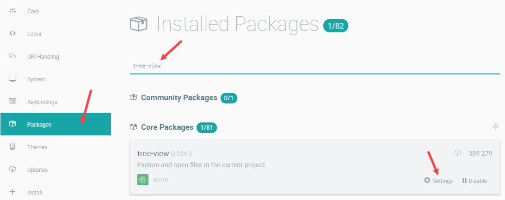

# Настройка Atom


Обновленная в 2018 году статья по настройке Atom.

## Введение

Первым продвинутым блокнотом, которым я начал активно пользоваться, был [Notepad++](https://github.com/Harrix/harrix.dev-blog-2013/blob/main/faq-notepad-plus-plus/faq-notepad-plus-plus.md) <!-- https://harrix.dev/ru/blog/2013/faq-notepad-plus-plus/ --> (до сих пор им часто пользуюсь), потом пытался перейти на [Sublime Text](https://github.com/Harrix/harrix.dev-blog-2013/blob/main/faq-sublime-text-2/faq-sublime-text-2.md) <!-- https://harrix.dev/ru/blog/2013/faq-sublime-text-2/ -->. А потом пробовал перейти на Atom, про который говорится в этой статье.

И да. Потом я всё равно перешел на Visual Studio Code.

## Установка

Скачиваем либо официальную последнюю версию с [сайта](https://atom.io/), либо текущую последнюю версию y в [GitHub](https://github.com/atom/atom/releases):


_Рисунок 1 — Скачивание программы_

Запускаем скаченный файл, и он автоматически запустит установку без всяких диалоговых окон, но Windows может поругаться (но мы скачивали с официального репозитория):


_Рисунок 2 — Предупреждение от Windows_


_Рисунок 3 — Предупреждение от Windows_


_Рисунок 4 — Установка Atom_

После установки откроется редактор, где снимаем галочку, чтобы при каждом старте не показывалось приветственное окно, а также соглашаемся, чтобы правильно открывались ссылки `atom:\\`:


_Рисунок 5 — Редактор Atom_

## Первоначальная настройка

Перейдем в настройки приложения `File` → `Settings`:


_Рисунок 6 — Настройки программы_

Снимаем галочку с пункта `Open Empty Editor On Start` в разделе `Core`, чтобы при запуске программы открывались последние открытые файлы:


_Рисунок 7 — Изменение параметра «Open Empty Editor On Start»_

Также в разделе `Core` можно указать папку ваши основных проектов:


_Рисунок 8 — Выбор папки с проектами_

В разделе `Editor` включаем переносы строк `Soft Wrap`:


_Рисунок 9 — Включение переноса строк_

В этом же разделе можно указать сколько пробелов будет ставиться при нажатии на табуляцию:


_Рисунок 10 — Выбор количества пробелов для табуляции_

## Открытие файлов и каталогов через контекстное меню

Идем `File` → `Settings`.

В разделе `System` добавляем в контекстном меню возможность открывать файлы и папки с помощью Atom:


_Рисунок 11 — Настройка контекстного меню_

Сейчас в 2018 году всё работает отлично, но раньше в 2016 году у меня эта команда не помогла, поэтому добавлял вручную в реестр Windows 10. Поэтому, если у вас не работает, то читайте ниже:

Для этого создайте текстовой файл расширения `.reg` (например, `open-w-atom.reg`) с подобным содержанием:

```reg
Windows Registry Editor Version 5.00

; when you right click a file
[HKEY_CLASSES_ROOT\*\shell\Atom KI ext]
""="Open File in Atom"
"Icon"="C:\\Users\\sensor\\AppData\\Local\\atom\\app-1.11.0-beta5\\atom.exe"

[HKEY_CLASSES_ROOT\*\shell\Atom KI ext\command]
""="C:\\Users\\sensor\\AppData\\Local\\atom\\app-1.11.0-beta5\\atom.exe \"%1\""

; when you right click a folder
[HKEY_CLASSES_ROOT\Directory\shell\Atom KI ext]
""="Open Folder in Atom"
"Icon"="C:\\Users\\sensor\\AppData\\Local\\atom\\app-1.11.0-beta5\\atom.exe"

[HKEY_CLASSES_ROOT\Directory\shell\Atom KI ext\command]
""="C:\\Users\\sensor\\AppData\\Local\\atom\\app-1.11.0-beta5\\atom.exe \"%1\""

; when you right click a folder while holding shift
[HKEY_CLASSES_ROOT\Directory\Background\shell\Atom KI ext]
""="Open Folder in Atom"
"Icon"="C:\\Users\\sensor\\AppData\\Local\\atom\\app-1.11.0-beta5\\atom.exe"

[HKEY_CLASSES_ROOT\Directory\Background\shell\Atom KI ext\command]
""="C:\\Users\\sensor\\AppData\\Local\\atom\\app-1.11.0-beta5\\atom.exe \"%V\""

; when you right click the background, not on a particular file or folder.
[HKEY_CLASSES_ROOT\LibraryFolder\Background\shell\Atom KI ext]
""="Open Folder in Atom"
"Icon"="C:\\Users\\sensor\\AppData\\Local\\atom\\app-1.11.0-beta5\\atom.exe"

[HKEY_CLASSES_ROOT\LibraryFolder\Background\shell\Atom KI ext\command]
""="C:\\Users\\sensor\\AppData\\Local\\atom\\app-1.11.0-beta5\\atom.exe \"%V\""
```

Везде текст `C:\\Users\\sensor\\AppData\\Local\\atom\\app-1.11.0-beta5\\atom.exe` поменяйте на путь к программе на вашем компьютере. Он будет обязательно другой у вас. И обратите внимание, что в пути у вас должны быть двойные слэши.

После этого запустите сохраненный файл и внесите изменения в реестр. После этого у вас в контекстном меню у файлов и папок появятся такие подобные пункты:


_Рисунок 12 — Контекстное меню для директории_


_Рисунок 13 — Контекстное меню для файла_

## Выбор темы оформления (Material Design)

Идем `File` → `Settings`. И там идет в раздел `Themes`:


_Рисунок 14 — Раздел с настройками тем_

Там можно выбрать тему для оформления интерфейса Atom, а также для отображения непосредственно текста в документах:


_Рисунок 15 — Выбор тем_

Вот не люблю я темные темы для текстовых редакторов. Поэтому выбирал светлые темы:


_Рисунок 16 — Светлые темы_

Вот так будет выглядеть редактор с такими темами:


_Рисунок 17 — Внешний вид редактора со светлыми темами_

Если вы хотите найти и установить другие темы, то перейдите в раздел установки, а там выберете `Themes` для перехода в поиск тем:



_Рисунок 18 — Установка новых тем_

Например, популярны темы в стиле `Material Design`:


_Рисунок 19 — Пример поиска тем_

Выбранные темы можно установить.

Я себе установил `atom-material-ui` и `atom-material-syntax-light`.

И они потом появятся в выборе тем:


_Рисунок 20 — Установленные темы_

Темы также имеют варианты настроек:


_Рисунок 21 — Переход к настройкам темы_

Я поменял основной цвет темы:


_Рисунок 22 — Выбор основного цвета темы_

Сделал компактный вид панели вкладок:


_Рисунок 23 — Вкладки становятся компактными_

После этих настроек редактор выглядит так:


_Рисунок 24 — Внешний вид редактора_

## Проверка орфографии на английском и русском языках

Идем `File` → `Settings`. Там идет в пакеты `Packages`.

В поиске установленных пакетов выбираем `spell`.

И в пакете `spell-checker` переходим в настройки:


_Рисунок 25 — Настройки проверки орфографии_

И в разделе `Locales` напишите `en-US, ru-RU`:


_Рисунок 26 — Выбор языков для проверки орфографии_

После этого появится проверка орфографии одновременно английского и русского языка в документах (обратите внимание, что в Windows должны быть установлены соответствующие языки, так как базу Atom берет оттуда):


_Рисунок 27 — Пример проверки орфографии_

Также в настройках поставьте галочку около `Add Known Words`. Тогда вам будет предлагаться добавлять новые слова в словарь:


_Рисунок 28 — Выбор пункта «Add Known Words»_

Вызов подсказок о том, как можно исправить слово, делается через `Ctrl` + `Shift` + `:`:


_Рисунок 29 — Подсказки для исправления слова_

Не для всех расширений файлов включается проверка орфографии. Чтобы подключить проверку в орфографии для файлов нового расширения, вызовете консоль `Ctrl` + `Shift` + `P`, находясь в файле. Там пропишите `Editor: Log Cursor Scope` и выберете этот пункт. И вы увидите внизу справа уведомление с одним или несколькими пунктами текста. Один из них будет означать тип документа. Копируем этот тип и закрываем уведомление. Потом идем в настройки нашего пакета проверки орфографии. И в разделе `Grammars` дописываем наш тип файлов:


_Рисунок 30 — Список проверяемых типов файлов_

## Установка пакетов

Идем `File` → `Settings`. И там идет в раздел `Install`, и там выбираем `Packages`:


_Рисунок 31 — Окно установки пакетов_

Пишем название пакета, который нам нужен, нажимаем `Enter`. И после появление списка плагинов устанавливаете тот, что вам нужен:


_Рисунок 32 — Установка пакета_

Установленный пакет появится в списке пакетов:


_Рисунок 33 — Установленный пакет_

## Настройка предустановленных пакетов

Идем `File` → `Settings`. И там идет в раздел `Packages`.

Находим там пакет `tree-view`. И переходим в настройки его:



_Рисунок 34 — Пакет tree-view_

И там ставим галочку около `Hide Ignored Names`. Например, чтобы в дереве папок не показывалась папка `.git`, которая нам не понабиться:


_Рисунок 35 — Включение параметра «Hide Ignored Names»_

А в пакете `autosave` можно включить автоматическое сохранение документов, когда Atom теряет фокус. Это не касается документов, которые были созданы, но еще ни разу не сохранялись. В общем полезная вещь:


_Рисунок 36 — Включение автосохранения_

## Установленные пакеты у меня

Список тех пакетов, которые я дополнительно установил.

- [minimap](https://atom.io/packages/minimap) — карта документа справа от документа с возможностью прокрутки документа:


_Рисунок 37 — Пакет minimap_

- [pigments](https://atom.io/packages/pigments) — для отображения цветов там, где мы их обозначаем в коде:


_Рисунок 38 — Пакет pigments_

- [color-picker](https://atom.io/packages/color-picker) — теперь цвет можно менять через пипетку `Ctrl` + `Alt` + `C`:


_Рисунок 39 — Пакет color-picker_

- [file-icons](https://atom.io/packages/file-icons) — иконки для файлов в списке файлов:


_Рисунок 40 — Пакет file-icons_

- [language-qml](https://atom.io/packages/language-qml) — подсветка синтаксиса для файлов `.qml`:


_Рисунок 41 — Пакет language-qml_

- [language-ini](https://atom.io/packages/language-ini) — подсветка синтаксиса для файлов `.ini`.

- [language-latex](https://atom.io/packages/language-latex) — для отображения LaTeX кода:


_Рисунок 42 — Пакет language-latex_

- [highlight-selected](https://atom.io/packages/highlight-selected) — Если выделили слово, то в других местах это же слово будет подсвечиваться:


_Рисунок 43 — Пакет highlight-selected_

- [minimap-highlight-selected](https://atom.io/packages/minimap-highlight-selected) — дополнение к предыдущему пакету. Теперь подсветка выделяемого слова будет и в карте документа справа:


_Рисунок 44 — Пакет minimap-highlight-selected_

- [sort-lines](https://atom.io/packages/sort-lines) — сортировка текста по `F5`. А если войти в консоль `Ctrl` + `Shift` + `P` и там набрать `Sort`, то увидите, что есть еще команды для работы с текстом по сортировке:


_Рисунок 45 — Пакет sort-lines_

Команда `Sort lines: Natural` сортирует числа как числа:


_Рисунок 46 — Сортировка чисел_

- [export-html](https://atom.io/packages/export-html) — печать документа с подсветкой синтаксиса. Переходим в консоль и там набираем `export` и выбираем нашу команду:


_Рисунок 47 — Пакет export-html_


_Рисунок 48 — Печать документа с подсветкой синтаксиса_

- [pdf-view](https://atom.io/packages/pdf-view) — для просмотра PDF документов:


_Рисунок 49 — Пакет pdf-view_

- [svg-preview](https://atom.io/packages/svg-preview) — превью SVG файлов:


_Рисунок 50 — Пакет svg-preview_

- [atom-beautify](https://atom.io/packages/atom-beautify) — красиво расставляет отступы в коде по сочетанию `Ctrl` + `Alt` + `B`.

Было:


_Рисунок 51 — Код HTML до преобразований_

Стало:


_Рисунок 52 — Код HTML после преобразований_

Плагин поддерживает много разных языков, но для поддержки некоторых нужно пошаманить. Например, для C++ программа выдает такое предупреждение: `Could not find 'uncrustify'. The program may not be installed.`:


_Рисунок 53 — Сообщение об ошибке_

Вам нужно установить программу `uncrustify`.

Для этого идете по адресу <https://sourceforge.net/projects/uncrustify/>.

Скачивайте файл, разархивируйте проект. Там найдете файл `uncrustify.exe`.

Теперь нужно, чтобы в глобальной переменной `PATH` в Windows был путь к данному файлу. Самое простое — это скопировать файл в папку Windows (`C:\Windows`).

После этого поддержка C++ в Atom будет осуществлена.

Было:


_Рисунок 54 — Код C++ до преобразований_

Стало:


_Рисунок 55 — Код C++ после преобразований_

Подробно посмотреть на список поддерживаемых языков и того, что может пригодится, можно тут: <https://atom.io/packages/atom-beautify>.

- [simple-drag-drop-text](https://atom.io/packages/simple-drag-drop-text) — позволяет перетаскивать текст, как в любом другом редакторе:

[Пакет simple-drag-drop-text](img/simple-drag-drop-text.mp4)

- [multi-wrap-guide](https://atom.io/packages/multi-wrap-guide) — по умолчанию в редакторе стоит вертикальная линия обозначающая 80 символов в строке. Но сейчас много где (например, в Qt) используется длина строки в 120 символов. С помощью этого плагина можно добавить еще вертикальные линии:


_Рисунок 56 — Пакет multi-wrap-guide_

- [indent-guide-improved](https://atom.io/packages/indent-guide-improved) — подсвечивает блоки кода, чтобы можно было понять, где вы сейчас находитесь.

Правда для моей темы черная линия выглядит не сильно красиво, поэтому в настройках перейдем в ручное управление настройками:


_Рисунок 57 — Настройки Atom_

Там открываем `styles.less`:


_Рисунок 58 — Файл настроек внешнего вида Atom_

И там добавляем такой текст, например:

```less
.indent-guide-improved {
  background-color: #eef1f2;
  &.indent-guide-stack {
    background-color: #19a5a5;
    &.indent-guide-active {
      background-color: #19a5a5;
    }
  }
}
```


_Рисунок 59 — Код оформления линий из пакета indent-guide-improved_

Сохраняем файл.

В итоге получаем вот такое:


_Рисунок 60 — Пакет indent-guide-improved_

- [advanced-open-file](https://atom.io/packages/advanced-open-file) — через `Ctrl` + `Alt` + `O` открываем файлы и их создаем, открываем папки без диалоговых системных окон:


_Рисунок 61 — Пакет advanced-open-file_

- [open-in-browsers](https://atom.io/packages/open-in-browsers) — люблю в Notepad++ открывать HTML файлы прямо из редактора. Здесь это решается этим плагином:


_Рисунок 62 — Пакет open-in-browsers_

- [auto-encoding](https://atom.io/packages/auto-encoding) — автоматически определяет кодировку файла. Крайне полезная вещь в мире, где еще не все текстовые файлы находятся в кодировке Юникод:


_Рисунок 63 — Пакет auto-encoding_

- [split-diff](https://atom.io/packages/split-diff) — позволяет сравнивать два файла.

- [minimap-split-diff](https://atom.io/packages/minimap-split-diff) — дополнение к предыдущему пакету, чтобы изменения отображались и на миникарте.

Итак, как производить сравнения файлов. Один из двух файлов отправляем во вторую панель:


_Рисунок 64 — Открытие второй панели открытия файлов_

В первой вкладке открываем второй файл:


_Рисунок 65 — Открытие первого файла_

Вызываем консоль `Ctrl` + `Shift` + `P`. Там пишем `Split`.

Выбираем команду `Split Diff: Enabled`:


_Рисунок 66 — Выбор команды «Split Diff: Enabled»_

У нас синхронизировались две панели и показываются изменения файлов:


_Рисунок 67 — Результат сравнения двух файлов_

- [tab-switcher](https://atom.io/packages/tab-switcher) — переключение между вкладками с помощью `Alt` + `[` и `Alt` + `]`:


_Рисунок 68 — Пакет tab-switcher_

- [fold-lines](https://atom.io/packages/fold-lines) — при сворачивании блока показывает заметную линию:


_Рисунок 69 — Пакет fold-lines_

- [path-copy](https://atom.io/packages/path-copy) — в контекстном меню во вкладке появляется возможность скопировать путь к файлу, имени файлу и так далее. В Notepad++ постоянно этим пользовался:


_Рисунок 70 — Пакет path-copy_

- [markdown-writer](https://atom.io/packages/markdown-writer) команды для работы с markdown файлами:


_Рисунок 71 — Пакет markdown-writer_

- [tool-bar](https://atom.io/packages/tool-bar) — панель инструментов. Сам по себе данный плагин ничего не делает, а предназначен для других плагинов, которые создают панель инструментов. Так как кнопок будет много, то размер кнопок выставим маленькими:


_Рисунок 72 — Настройки пакета tool-bar_

- [flex-tool-bar](https://atom.io/packages/flex-tool-bar) — данный плагин служит для настройки предыдущего плагина, где вы можете гибко создать свою панель инструментов.

При установке плагина появляется пустая панель инструментов с одной кнопкой, которая открывает файл, в котором будем прописывать наши кнопки:


_Рисунок 73 — Пакет flex-tool-bar_

Я прописал вот такие кнопки:

```js
# This file is used by Flex Tool Bar to create buttons on your Tool Bar.
# For more information how to use this package and create your own buttons,
#   read the documentation on https://atom.io/packages/flex-tool-bar

[
    {
        type: "button"
        icon: 'file-tree'
        iconset: 'mdi'
        callback: "tree-view:toggle"
        tooltip: "Toggle Sidebar"
    }
    {
        type: "button"
        icon: 'file-outline'
        iconset: 'mdi'
        callback: "application:new-file"
        tooltip: "New File"
    }
    {
        type: "button"
        icon: 'file'
        iconset: 'mdi'
        callback: "advanced-open-file:toggle"
        tooltip: "Open File"
    }
    {
        type: "button"
        icon: 'content-save'
        iconset: 'mdi'
        callback: "core:save"
        tooltip: "Save File"
    }
    {
        type: "button"
        icon: 'content-save-all'
        iconset: 'mdi'
        callback: "window:save-all"
        tooltip: "Save All"
    }
    {
        type: "button"
        icon: 'printer'
        iconset: 'mdi'
        callback: "export-html:export"
        tooltip: "Print"
    }
    {
        type: "button"
        icon: 'magnify'
        iconset: 'mdi'
        callback: "find-and-replace:toggle"
        tooltip: "Find"
    }
    {
        type: "button"
        icon: 'folder-multiple-outline'
        iconset: 'mdi'
        callback: "project-find:show"
        tooltip: "Find In Project"
    }
    {
        type: "button"
        icon: 'auto-fix'
        iconset: 'mdi'
        callback: "atom-beautify:beautify-editor"
        tooltip: "Beautify"
    }
    {
        type: "button"
        icon: 'image-filter-hdr'
        iconset: 'mdi'
        callback: "svg-preview:toggle"
        tooltip: "SVG Preview"
    }
    {
        type: "button"
        icon: 'google-chrome'
        iconset: 'mdi'
        callback: "open-in-browsers:Chrome"
        tooltip: "Open in Chrome"
    }
    {
        type: "button"
        icon: 'eyedropper-variant'
        iconset: 'mdi'
        callback: "color-picker:open"
        tooltip: "Color Picker"
    }
    {
        type: "button"
        icon: 'function'
        iconset: 'mdi'
        callback: "symbols-view:toggle-file-symbols"
        tooltip: "Functions"
    }
    {
        type: "button"
        icon: 'code-equal'
        iconset: 'mdi'
        callback: "split-diff:enable"
        tooltip: "Split Diff"
    }
    {
        type: "button"
        icon: 'format-textdirection-l-to-r'
        iconset: 'mdi'
        callback: "window:toggle-invisibles"
        tooltip: "Show All Characters"
    }
    {
        type: "button"
        icon: 'sort-alphabetical'
        iconset: 'mdi'
        callback: "sort-lines:sort"
        tooltip: "Sort"
    }
    {
        type: "button"
        icon: 'sort-numeric'
        iconset: 'mdi'
        callback: "sort-lines:natural"
        tooltip: "Sort Natural"
    }
    {
        type: "button"
        icon: 'arrow-up-bold'
        iconset: 'mdi'
        callback: "editor:upper-case"
        tooltip: "Upper Case"
    }
    {
        type: "button"
        icon: 'arrow-down-bold'
        iconset: 'mdi'
        callback: "editor:lower-case"
        tooltip: "Lower Case"
    }
    {
        type: "button"
        icon: 'spellcheck'
        iconset: 'mdi'
        callback: "spell-check:correct-misspelling"
        tooltip: "Correct Misspelling"
    }
    {
        type: "button"
        icon: 'lock'
        iconset: 'mdi'
        callback: "editor:toggle-line-comments"
        tooltip: "Commenting Out Code"
    }
    {
        type: "button"
        icon: 'console'
        iconset: 'mdi'
        callback: "command-palette:toggle"
        tooltip: "Command Palette"
    }
    {
        type: "spacer"
    }
    {
        type: "button"
        icon: 'markdown'
        iconset: 'mdi'
        callback: "markdown-preview:toggle"
        tooltip: "Markdown Preview"
    }
    {
        type: "button"
        icon: 'code-tags'
        iconset: 'mdi'
        callback: "markdown-writer:toggle-codeblock-text"
        tooltip: "Code"
    }
    {
        type: "button"
        icon: 'link-variant'
        iconset: 'mdi'
        callback: "markdown-writer:insert-link"
        tooltip: "Insert Link"
    }
    {
        type: "button"
        icon: 'image'
        iconset: 'mdi'
        callback: "markdown-writer:insert-image"
        tooltip: "Insert Image"
    }
    {
        type: "button"
        icon: 'format-bold'
        iconset: 'mdi'
        callback: "markdown-writer:toggle-bold-text"
        tooltip: "Bold"
    }
    {
        type: "button"
        icon: 'format-italic'
        iconset: 'mdi'
        callback: "markdown-writer:toggle-italic-text"
        tooltip: "Italic"
    }
    {
        type: "button"
        icon: 'format-list-bulleted'
        iconset: 'mdi'
        callback: "markdown-writer:toggle-ul"
        tooltip: "Unordered List"
    }
    {
        type: "button"
        icon: 'format-list-numbers'
        iconset: 'mdi'
        callback: "markdown-writer:toggle-ol"
        tooltip: "Ordered List"
    }
    {
        type: "button"
        icon: 'format-header-1'
        iconset: 'mdi'
        callback: "markdown-writer:toggle-h1"
        tooltip: "Heading 1"
    }
    {
        type: "button"
        icon: 'format-header-2'
        iconset: 'mdi'
        callback: "markdown-writer:toggle-h2"
        tooltip: "Heading 2"
    }
    {
        type: "button"
        icon: 'format-header-3'
        iconset: 'mdi'
        callback: "markdown-writer:toggle-h3"
        tooltip: "Heading 3"
    }
    {
        type: "button"
        icon: 'table'
        iconset: 'mdi'
        callback: "markdown-writer:insert-table"
        tooltip: "Insert Table"
    }
    {
        type: "button"
        icon: 'table-edit'
        iconset: 'mdi'
        callback: "markdown-writer:format-table"
        tooltip: "Format Table"
    }
]
```


_Рисунок 74 — Полная панель команд_

Панель у меня получилась большой. Скорее всего многие команды вам не понадобятся. Также многие команды не будут запускаться, если вы не установили некоторые плагины (список плагинов, что тут написан — полный).

Разумеется, что вы можете прописать свои команды, какие вам будут нужны.

Обратите внимание на то, что многие команды пакетов доступны и из главного меню:


_Рисунок 75 — Команды пакетов_

## Как вызвать командную строку Atom

Через `Ctrl` + `Shift` + `P`:


_Рисунок 76 — Командная строка_

## Как поменять язык подсветки синтаксиса кода

Внизу справа имеется возможность поменять подсветку синтаксиса:


_Рисунок 77 — Выбор языка подсветки синтаксиса_

## Как найти файл в папке проекта по его имени

Через `Ctrl` + `P`:


_Рисунок 78 — Список файлов_

## Как второй документ отобразить рядом с первым документом

Эта функция часто используется в Notepad++. Тут она тоже есть: правая кнопка по вкладке с документом и выбираем, куда продублировать документ. Единственный минус, что в первой области документ остается открытым тоже, но его там можно просто закрыть:


_Рисунок 79 — Разделить на две области_


_Рисунок 80 — Файл отображается во второй области справа_

## Как сворачивать код

Подведите курсор на номера строк. И там появятся стрелочки, нажимая на которые, код свернется:


_Рисунок 81 — Несвернутый код_


_Рисунок 82 — Свернутый код_

## Как найти что-то в файле

Делается через стандартное сочетание клавиш `Ctrl` + `F`. Также там отображается число найденных мест:


_Рисунок 83 — Панель поиска_

## Как заменить что-то в файле

Аналогично через `Ctrl` + `F`:


_Рисунок 84 — Функции по замещению текста в панели поиска_

## Как найти в файлах всей папки

Делается через сочетание клавиш `Shift` + `Ctrl` + `F`. Замена во всех файлах проекта также делается:


_Рисунок 85 — Поиск в директории_

Можно также там задавать фильтр для файлов, по которым производится поиск:


_Рисунок 86 — Поле для фильтра поиска_

## Как показать невидимые символы

Входим в консоль `Ctrl` + `Shift` + `P` и там набираем `invisibles` (или часть строки) и выбираем команду `Window: Toggle Invisibles` и её выбираем.

Отмена показа невидимых символов осуществляется аналогичным способом:


_Рисунок 87 — Показ невидимых символов_

## Как продублировать текущую строку

Через `Ctrl` + `Shift` + `D`:


_Рисунок 88 — Дублирование строки_

## Как закомментировать выделенные строчки

Через `Ctrl` + `/`:


_Рисунок 89 — Комментирование строк_

## Как объединить выделенные строки в одну

Через `Ctrl` + `J`:


_Рисунок 90 — Отмеченные строки в коде_

## Как вызвать автодополнение принудительно

Через `Ctrl` + `Space`:


_Рисунок 91 — Автодополнение кода_

## Как сделать все буквы заглавными/маленькими в выделенном тексте

Через `Ctrl` + `K` + `U`, чтоб все буквы стали большими:


_Рисунок 92 — Приведение букв к верхнему регистру_

Через `Ctrl` + `K` + `L`, чтоб все буквы стали маленькими:


_Рисунок 93 — Приведение букв к нижнему регистру_

## Как перейти к соответствующей скобке (открывающейся/закрывающейся)

Через `Ctrl` + `M`:


_Рисунок 94 — Переход к соответствующей скобке_

## Как посмотреть превью markdown файла

Превью появляется после комбинации клавиш `Ctrl` + `Shift` + `M`:


_Рисунок 95 — Превью markdown файла_

## Как открыть несколько проектов (папок)


_Рисунок 96 — Добавление новой папки_

И у вас будет открыто несколько папок:


_Рисунок 97 — Несколько открытых папок_

## Как полностью удалить Atom

Вначале удаляем как обычное приложение через `Программы и компоненты` в панели управления.

А потом в папке `C:\Users\[Пользователь]` удаляем папку `.atom`:


_Рисунок 98 — Папка .atom_

Также возможно придется полазить в реестре и поудалять упоминания об Atom:


_Рисунок 99 — Поиск в реестре_


_Рисунок 100 — Ввод поискового запроса_

И какие-то файлы могут остаться в папке ``C:\Users\[Пользователь]\AppData\Local`в папке`atom`:


_Рисунок 101 — Папка atom_

## Набор горячих клавиш

Клавиатурные сокращения можно посмотреть тут:


_Рисунок 102 — Клавиатурные сокращения_

Ниже представлен список горячих клавиш, которые я использую.

`Ctrl` + `S` — сохранить файл.

`Ctrl` + `Shift` + `P` — открыть консоль Atom.

`Ctrl` + `Alt` + `C` — выбор цвета с помощью плагина color-picker.

`Ctrl` + `Shift` + `T` — открытие последней закрытой вкладки.

`Ctrl` + `Alt` + `O` — добавляет список функций в файле для быстрого перехода между ними в плагине symbols-tree-view.

`F5` — сортировка.

`Ctrl` + `P` — поиск файла в проекте по имени.

`Ctrl` + `F` — поиск и замена.

`Shift` + `Ctrl` + `F` — поиск по всем файлам проекта.

`Ctrl` + `Shift` + `D` — продублировать строку.

`Ctrl` + `/` — закомментировать строки.

`Ctrl` + `J` — объединить строки в одну.

`Ctrl` + `Alt` + `F2` — поставить метку около строчки.

`F2` — перемещение между метками строк.

`Ctrl` + `Space` — вызов автодополнения.

`Ctrl` + `K` + `U` — все буквы заглавными.

`Ctrl` + `K` + `L` — все буквы маленькими.

`Ctrl` + `M` — перейти к соответствующей скобке (открывающейся/закрывающейся).

`Ctrl` + `Shift` + `M` — превью markdown файла.

`Ctrl` + `Shift` + `:` — вызов подсказок, как исправить слово.

`Ctrl` + `Alt` + `V` — превью SVG файлов.

`Ctrl` + `Alt` + `B` — расставляем отступы в коде.

`Ctrl` + `Shift` + `I` — нужно нажать два раза, чтобы вызвать Developer Tools.

`Ctrl` + `Alt` + `O` — открытие файлов, папок, их создание с помощью плагина advanced-open-file.

`Ctrl` + `Alt` + `Down` — можно редактировать несколько строк одновременно.

`Alt` + `[` и `Alt` + `]` — переключение между вкладками с помощью пакета tab-switcher.
