# Крякозябры в Qt под Visual Studio


Итак, если вы используете версию Qt под компилятор Visual Studio, то в консоли, где появляются сообщения об ошибках и предупреждениях, вместо русских букв будут появляться крякозябры. Будем это лечить.

## Крякозябры

Вот так выглядят крякозябры:

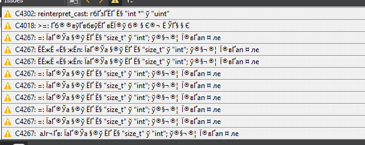

_Рисунок 1 — Крякозябры_

Данная проблема возникает, если использовать русскую версию Visual Studio, ввиду разных кодировок в консолях. В Qt нам нужна кодировка `cp1251`.

Вся проблема, кроется в том, что специальная утилита `jom`, неправильно задает кодировку. Мы в ней исправим это и перекомпилируем утилиту самим же Qt.

## Новый способ решения проблемы

Вот только несколько дней назад всё работало на **Visual Studio 2017** и **Qt 5.11.1**. И старый способ с перестраиванием jom проекта работал, но обновил обе программы, и способ работать перестал. Чьё обновление виновато — не знаю.

Поэтому придется обойтись без переделки jom. Алгоритм решения: переводим Visual Studio на английский язык и удаляем русский пакет полностью. И сообщения компилятора будут приходить не крякозябрами, а в виде нормальных английских сообщений.

Сейчас нет возможности проверить, но в прошлом (пару лет назад) при переводе Visual Studio на английский язык после установки Qt возникали проблемы с компиляцией. Так что лучше перевести на английский язык Visual Studio, а потом установить Qt (как у меня сейчас), но может быть уже всё пофиксили.

Итак, меняем язык интерфейса Visual Studio на английский (сообщения компилятора всё равно будут приходить на русском в виде крякозябр):


_Рисунок 2 — Переход в настройки Visual Studio_

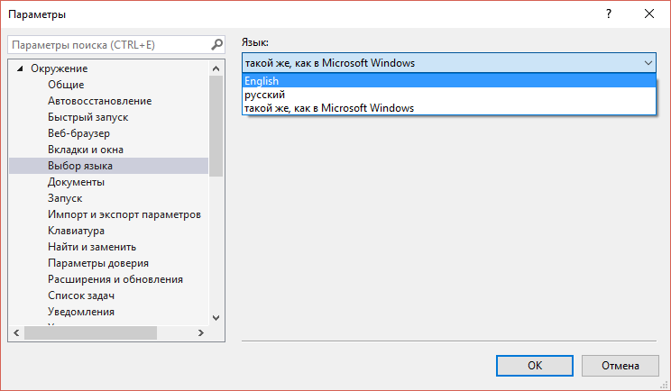

_Рисунок 3 — Изменение языка интерфейса_

Запускаем установщик Visual Studio Installer:

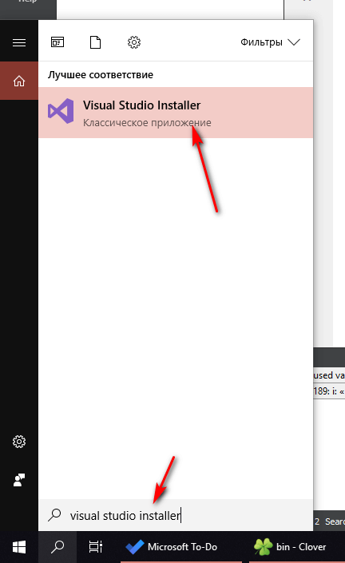

_Рисунок 4 — Запуск Visual Studio Installer_

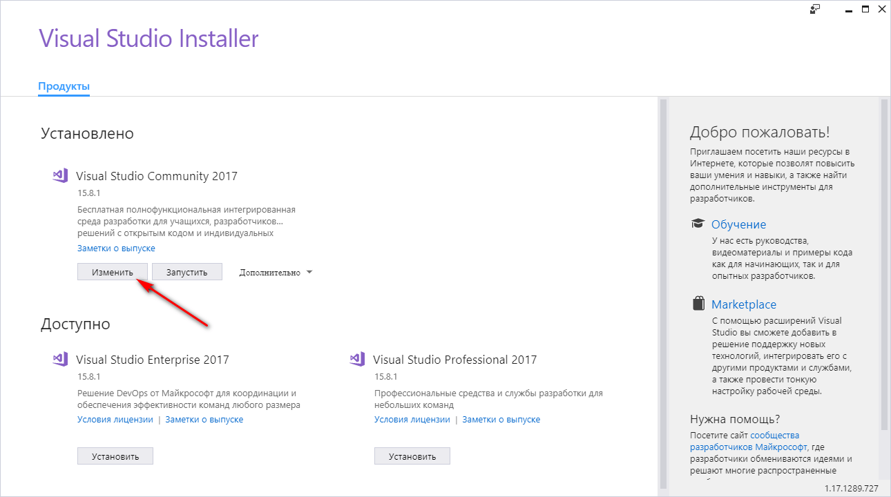

_Рисунок 5 — Выбор изменения пакетов Visual Studio_

И в разделе `Языковые пакеты` снимаем галочку с русского пакета:

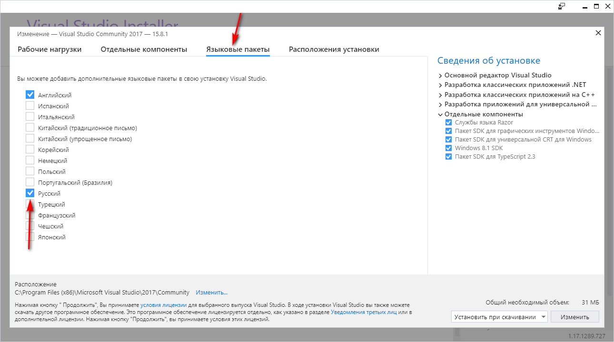

_Рисунок 6 — Снятие галочки у русского пакета_

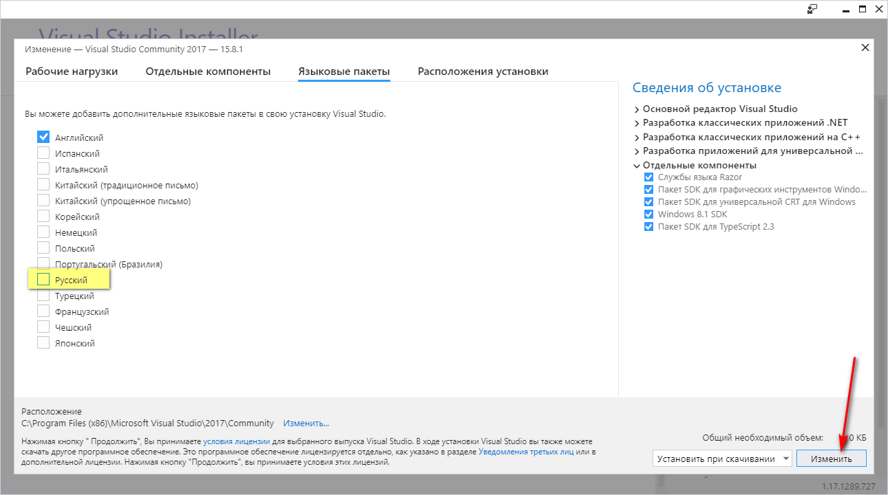

_Рисунок 7 — Применение изменений_

Ждем, когда Visual Studio всё удалит и, скорее всего, установит какие-то свои обновления. После этого перезапускаем Qt Creator. Теперь при компиляции сообщения будут приходить нормальными, но на английском:

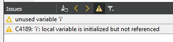

_Рисунок 8 — Английские сообщения от компилятора_

P.S. Правда после этого приложения под UWP перестали компилироваться и выдают ошибку вроде этой:

```text
13:44:39: Could not start process "windeployqt.exe" D:\Harrix\Projects\QtProjects\untitled12\_build\release\untitled12.exe --qmldir D:\Harrix\Projects\QtProjects\untitled12
Error while building/deploying project untitled12 (kit: Qt 5.11.1 for UWP 64bit (MSVC 2017))
The kit Qt 5.11.1 for UWP 64bit (MSVC 2017) has configuration issues which might be the root cause for this problem.
When executing step "Run windeployqt"
```

## Старый способ решения проблемы

Может потом старый способ заработает, так что оставлю его в статье.

Всё описанное ниже проводилось на Windows 10. Были установлены **Visual Studio 2015 Community**, **Qt 5.8.0** под Visual Studio.

### Выкачка исходных кодов jom

Выкачать можно с помощью консоли Git:

```console
git clone https://github.com/qt-labs/jom
```

Если вы не знаете как выполнить эту команду, то перейдите по адресу <https://github.com/qt-labs/jom> и скачайте исходные коды программы с сайта:

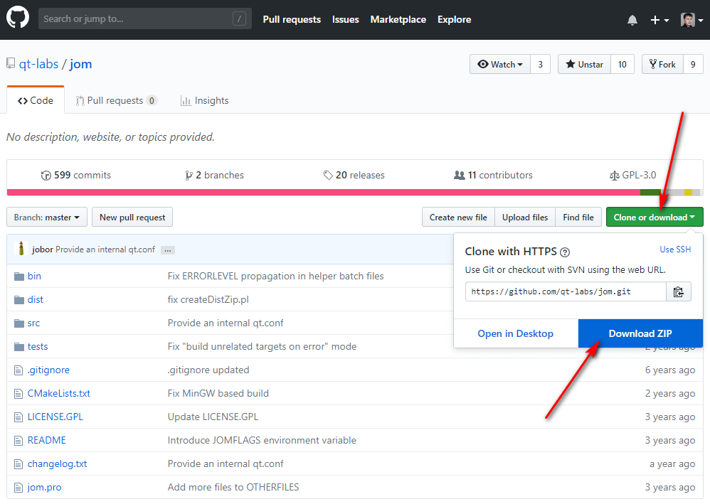

_Рисунок 9 — Скачивание исходников с сайта_

### Изменение jom

Открываем **Qt Creator**. И там переходим к пункту открытия проекта:

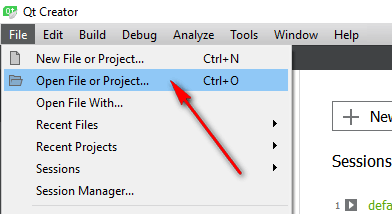

_Рисунок 10 — Выбор пункта меню для открытия проекта_

И в папке с исходниками `jom` находим файл `jom.pro` и открываем его:

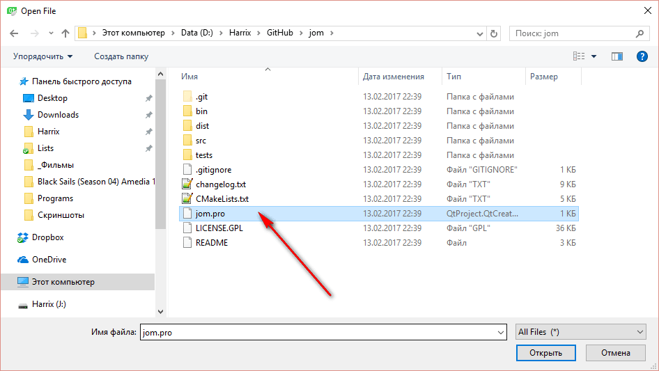

_Рисунок 11 — Нахождение файла проекта_

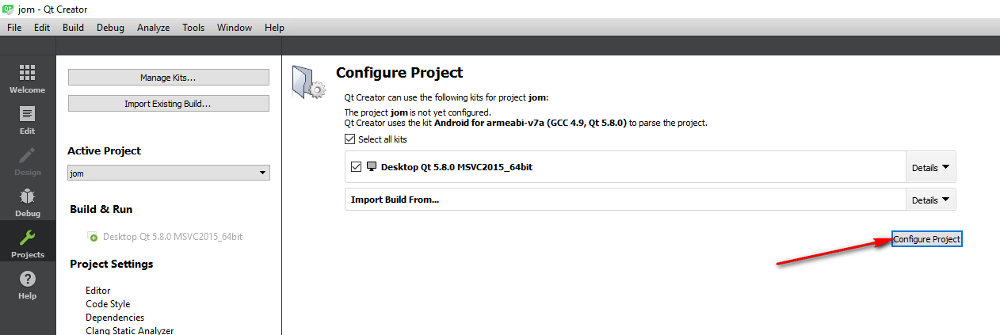

_Рисунок 12 — Выбор компилятора Visual Studio_

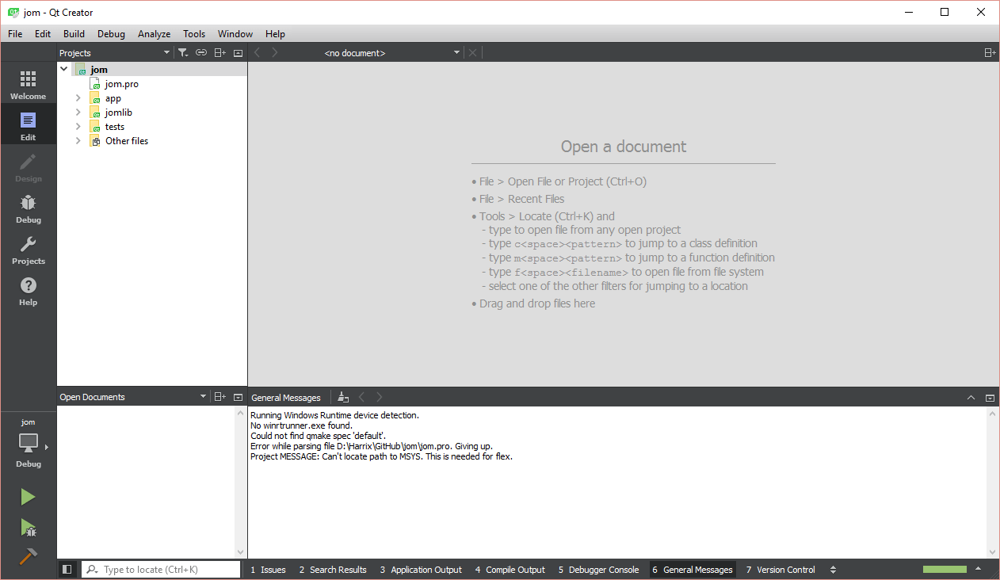

_Рисунок 13 — Открытый проект_

В подпроекте `app` находим файл `main.cpp`:

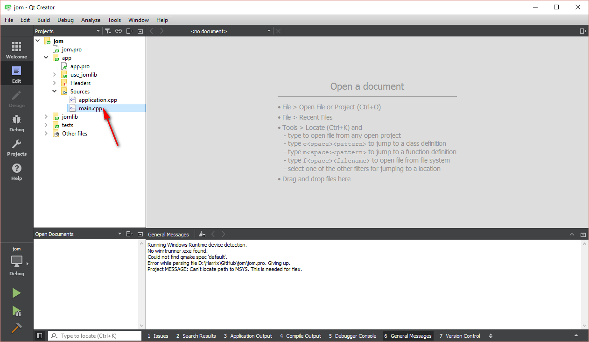

_Рисунок 14 — Нахождение файла main.cpp_

Находим так функцию `main`:

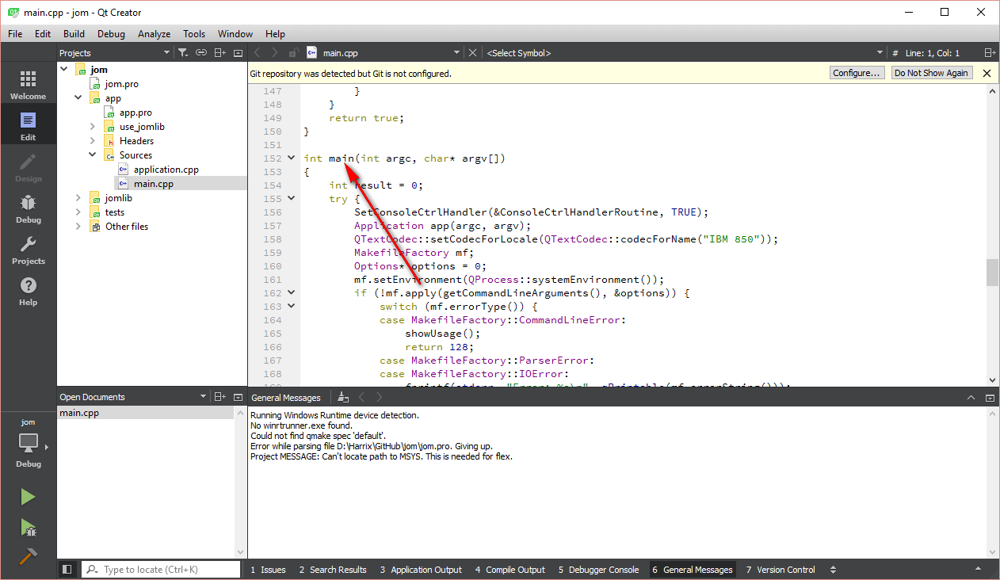

_Рисунок 15 — Функция main_

И там в самом начале этой функции добавляем строчки:

```cpp
SetConsoleCP(1251);
SetConsoleOutputCP(1251);
```

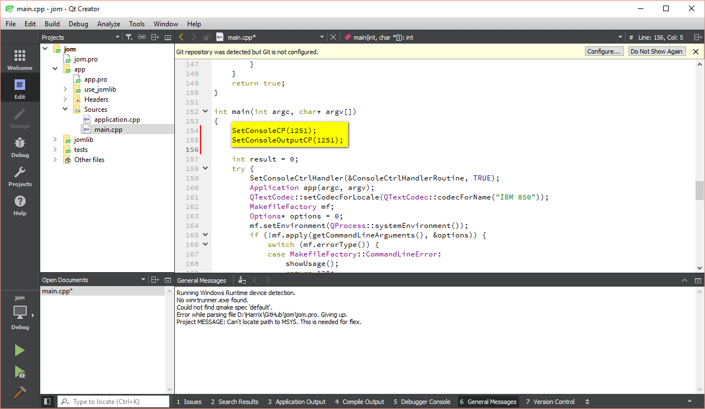

_Рисунок 16 — Добавленные строчки_

Сохраняем изменения `Ctrl` + `S`.

Компилировать будем в режиме `Release`:

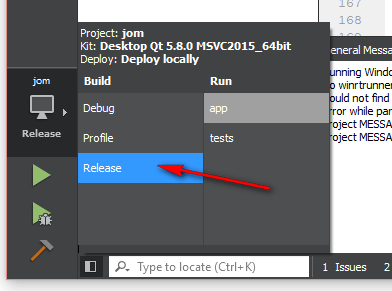

_Рисунок 17 — Выбор режима Release_

И компилируем наш проект:

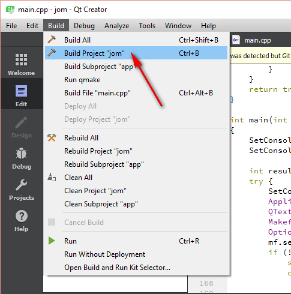

_Рисунок 18 — Компилирование проекта_

В процессе компиляции вы увидим несколько предупреждений. Это ничего страшного. Главное, чтобы ошибок не было.

Кстати, предупреждения будут с крякозябрами:

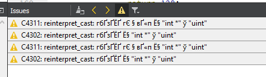

_Рисунок 19 — Предупреждения в виде крякозябр_

Через некоторое время серый треугольник запуска проекта опять станет зеленым. Значит, проект скомпилировался:

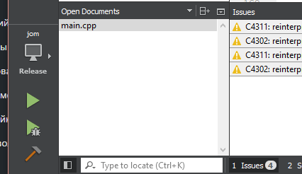

_Рисунок 20 — Треугольник запуска опять зеленый_

### Находим скомпилированный jom файл

Закройте Qt.

Перейдите в папку, где у вас находятся скомпилированные файлы Qt.

По умолчанию, если у вас проект, например, называется `HarrixTesting`, то в папке `HarrixTesting`, где находится папка, появится папка наподобие такой: `build-HarrixTesting-Desktop_Qt_5_5_0_MinGW_32bit-Release` (это под MinGW компилятор пример):

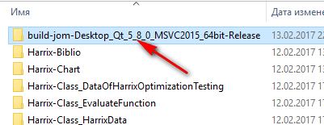

_Рисунок 21 — Папка с скомпилированным проектом_

В этой папке меня интересует папка `bin`:

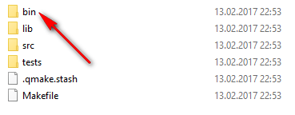

_Рисунок 22 — Папка bin_

Там должен быть файл `jom.exe`:


_Рисунок 23 — Файл jom.exe_

### Замена jom файла

Переходим в папку, где находится файл `qtcreator.exe`. У меня это папка `C:\Qt\Qt5.8.0\Tools\QtCreator\bin`:

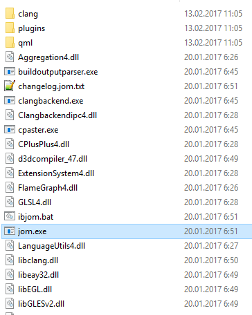

_Рисунок 24 — Папка с родным jom.exe_

Переименуйте его, чтобы на всякий случай не потерять, если что пойдет не так:

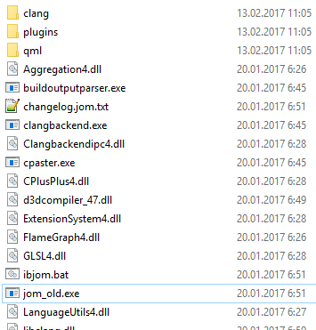

_Рисунок 25 — Переименование родного файла_

И вставьте сюда скомпилированный `jom.exe` файл:

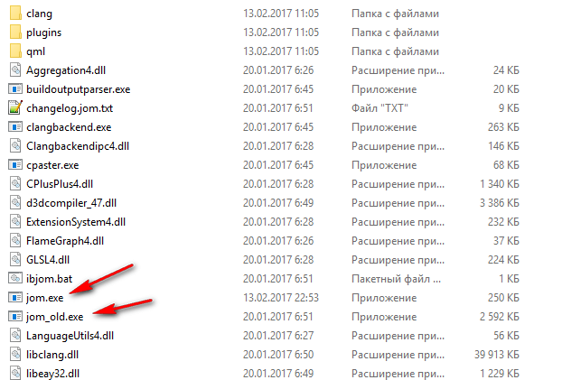

_Рисунок 26 — Копирование измененного файла_

Всё. Теперь можете запускать Qt и проверять крякозябры. У меня они ушли:

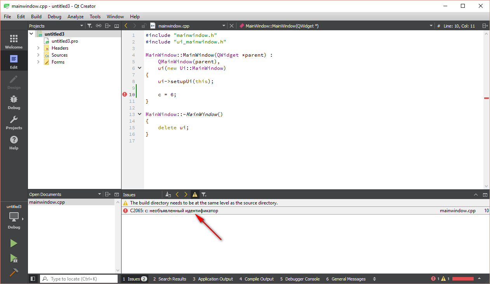

_Рисунок 27 — Теперь крякозябр нет_

Сейчас у меня стоит Qt, поставленный через онлайн установщик. И кроме основной версии Qt Creator у меня стоят **Preview** версии Qt Creator. Поэтому измененный файл кидаю и в эти папки, например, `C:\Qt\Tools\Preview\Qt Creator 4.7.0-rc1\bin`.
