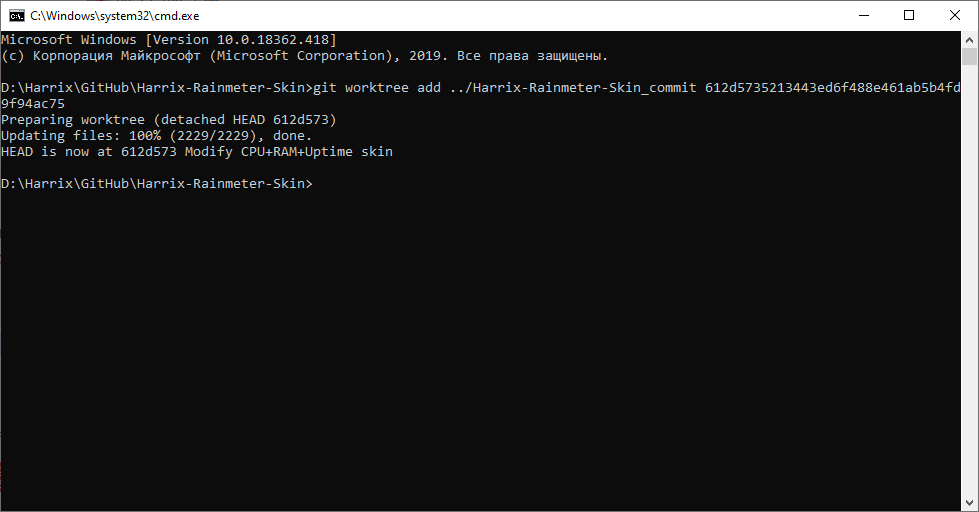

# Вынесение проекта в момент конкретного коммита в отдельную папку

Всем Git хорошо, но некоторые вещи, которые мне бы хотелось там увидеть, не всегда очевидны. Вот ведете вы какой-то проект, делаете коммиты. И в какой-то момент, вам нужно посмотреть на проект в момент какого-то коммита. Желательно, чтобы вы смогли выгрузить данную прошлую версию проекта куда-нибудь в другое место, а не в основную ветку.

Оказывается, что есть команда, которая именно это и делает:

```console
git worktree add ../[NewFolder] [commit]
```

Как я ею пользуюсь.

Открываю консоль нужного репозитория в `GitHub Desktop`:


После этого нахожу в истории нужный коммит и копирую его SHA через нажатие правой кнопки по коммиту в истории:


Создаю в папке, где все репозитории находятся, папку с именем `[Имя репозитория]_commit`:


И в консоли вызываю подобную команду:

```console
git worktree add ../Harrix-Rainmeter-Skin_commit 612d5735213443ed6f488e461ab5b4fd9f94ac75
```



Всё. Теперь в папке `Harrix-Rainmeter-Skin_commit` находится образ проекта в момент конкретного коммита. При этом основная папка с проектом нетронута. Очень удобно.

Когда мне этот кусок будет не нужен, то папку можно очистить, а в папке `.git` основной ветки удалить папку `worktrees`.
