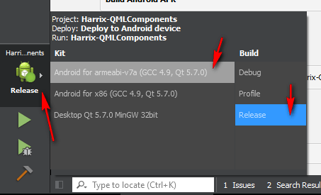

# Как добавить иконку в приложение Qt под Android

Чтобы добавить иконку в приложение, например, под Windows в Qt нужно просто добавить ICO файл и прописать его в PRO файле. C Android так не прокатит, так как там иконки надо прописывать через создание `AndroidManifest.xml`.

Итак, у нас есть какой-то Qt проект. Я буду рассматривать на примере приложения под Qt Quick Controls 2 на Qt 5.7, но для других случаев будет то же самое. Предполагаю, что вы уже [запускали приложение Qt под Android](https://github.com/Harrix/harrix.dev-blog-2018/blob/main/install-qt-advanced/install-qt-advanced.md) и у вас всё работает. Просто иконка стандартная, а не такая, какая вам нужно.

Проверяем, что приложение у нас будет компилироваться под `Release` режимом под ту платформу, что вам нужно:

Заходите в раздел `Projects`:

Там заходите в детали разделе `Build Android APK`:

И там нажимаете `Create Templates`:

Можно выбрать папку, куда в проекте будут сохранятся все новые сгенерированные файлы:

В итоге, в проекте появился файл `AndroidManifest.xml` и другие файлы:

И тут вы можете добавить свои иконки (какого размера иконки нужно добавлять можно посмотреть [тут](https://material.io/design/iconography/#grid-keyline-shapes)):

После этого сохраняете изменения, и можно запускать программу:

И в Android устройстве появится приложение с установленной иконкой:

Кстати, в папке `android\res` можно вручную добавить папку `drawable-xhdpi`, куда поместить иконку большего размера:

К тому же вы можете в созданный AndroidManifest.xml вносить те изменения, которые вам нужны еще. Например, можно указать имя пакета, версию и так далее.

P.S. У меня почему-то нормально компилируется проект под Android и нормально на нем запускается наверно раза с третьего иногда. Имейте это ввиду.
