# Установка Visual Studio 2015 Community

В статье приведена инструкция по установке бесплатной версии Visual Studio 2015 Community на Windows 10 для программирования на C++.

**Внимание!** Вышла Visual Studio 2019. [Читайте](https://github.com/Harrix/harrix.dev-blog-2021/blob/main/install-visual-studio-2019/install-visual-studio-2019.md) более новую статью.

Если вам нужна именно версия 2015 года, то читайте эту статью: [Скачивание старых версий Visual Studio](https://github.com/Harrix/harrix.dev-blog-2018/blob/main/download-old-versions-vs/download-old-versions-vs.md).

Далее идет старая инструкция, как устанавливать Visual Studio 2015 после скачивания инсталлятора.

## Установка

Запускаем скаченный файл:

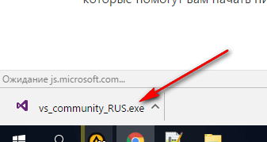

Windows начнет автоматически что-то скачивать и это нормально:

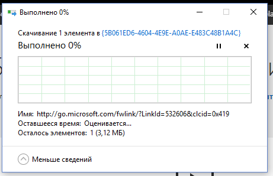

И после этого будет предложено запустить установку Visual Studio. Жмем `Запустить`:

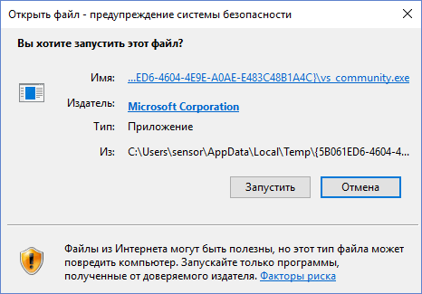

После этого некоторое время будет висеть окно с логотипом студии:

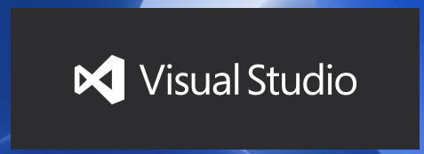

Параметры установки выбираем по умолчанию:

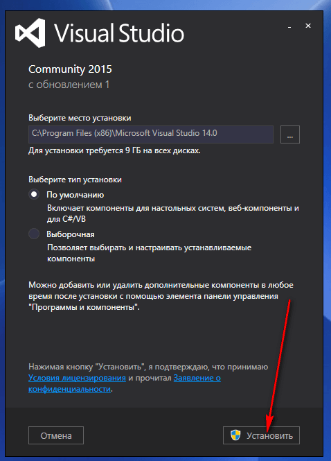

`Внимание!` Если вы разбираетесь в теме, то можно выбрать выборочную установку и сократить себе шаги, описанные ниже. О параметрах выборочной установки под спойлером.

---

**Выборочная установка** <!-- !details -->

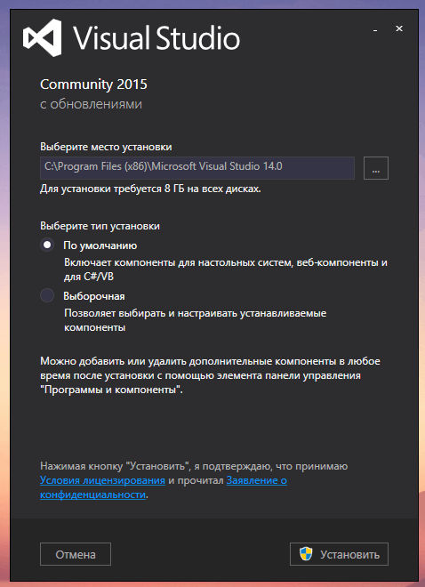

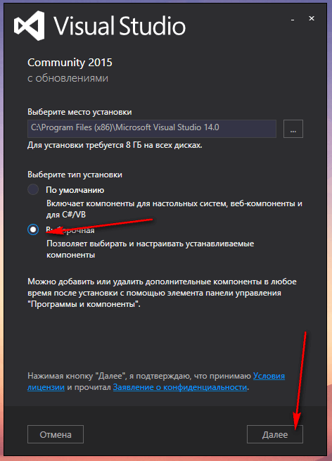

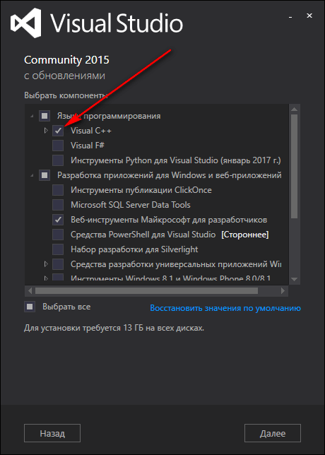

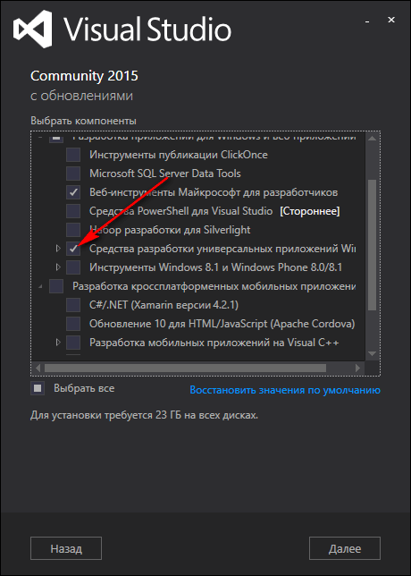

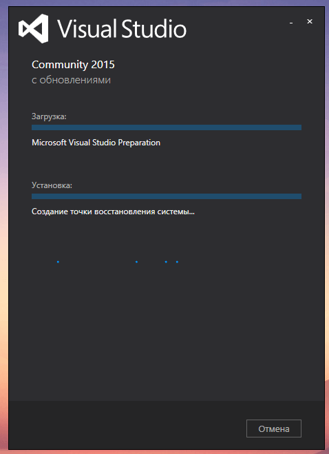

---

И установка началась:

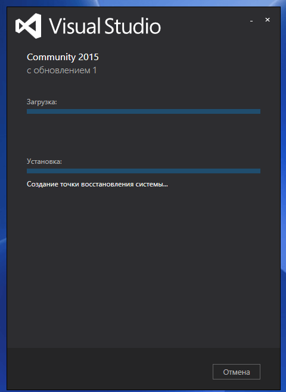

Скачиваться будет долго.

После завершения установки перезагрузите компьютер.

После этого запускаете Visual Studio. Но не найдетесь, что на этом всё.

При запуске вас попросят зайти под учеткой Microsoft. Если у вас её нет, то создайте на их сайте <https://www.microsoft.com/ru-ru/>.

Введите потом в Visual Studio электронную почту, на которую заведена учетка Microsoft:

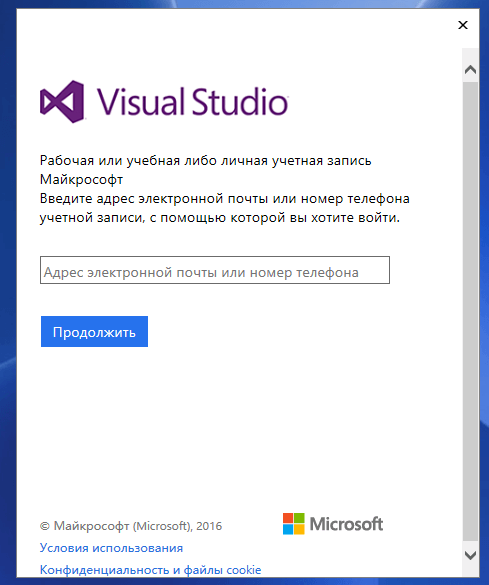

Можно потом выбрать чья это учетка: ваша личная или вы работаете где-то:

Вводите данные своей учетки:

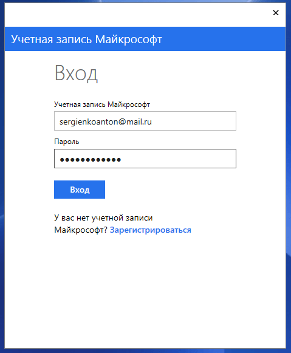

Может вылететь такая ошибка — ничего страшного:

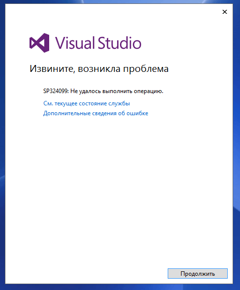

И напоследок при первом запуске студии вас попросят выбрать тему оформления:

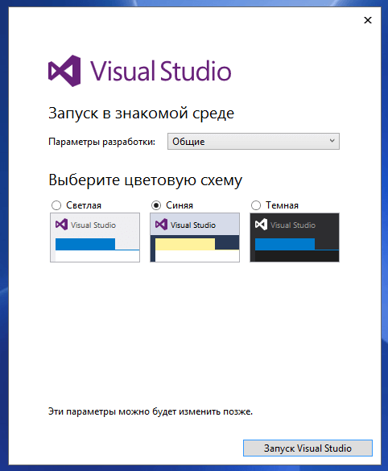

И Visual Studio запустилась! Но, к сожалению, еще не всё. Если вы создадите пустой проект на C++, то увидите, что пакеты для приложений на C++ не установились по умолчанию:

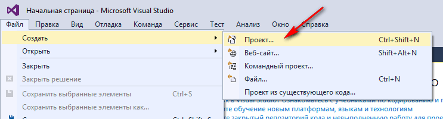

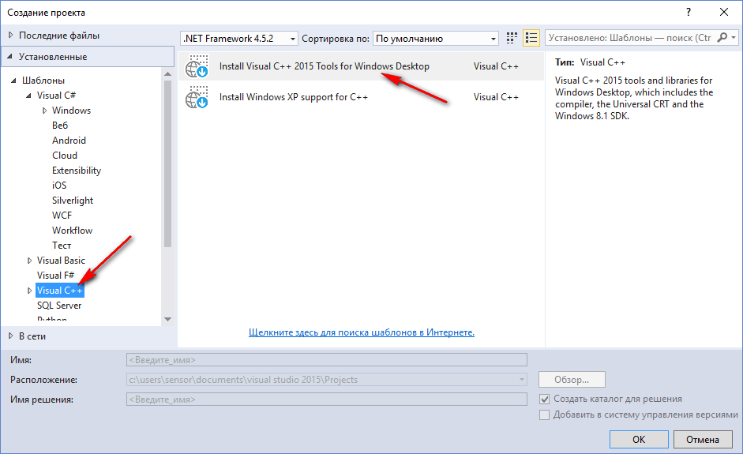

Поэтому жмем на `Install Visual C++ Tools for Windows Desktop`:

В появившемся окне жмем `Установить`:

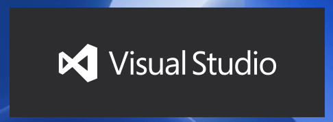

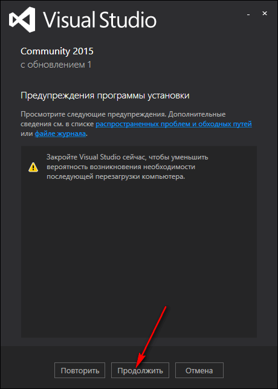

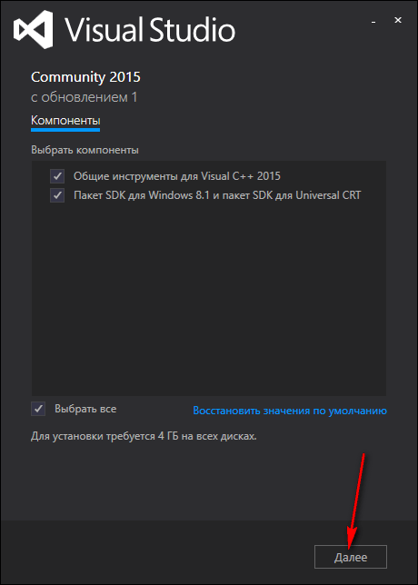

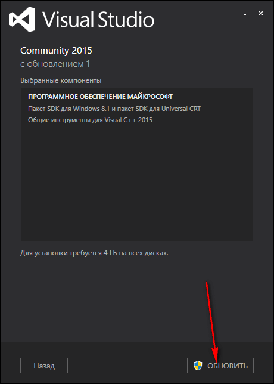

Установка тоже может длиться долго:

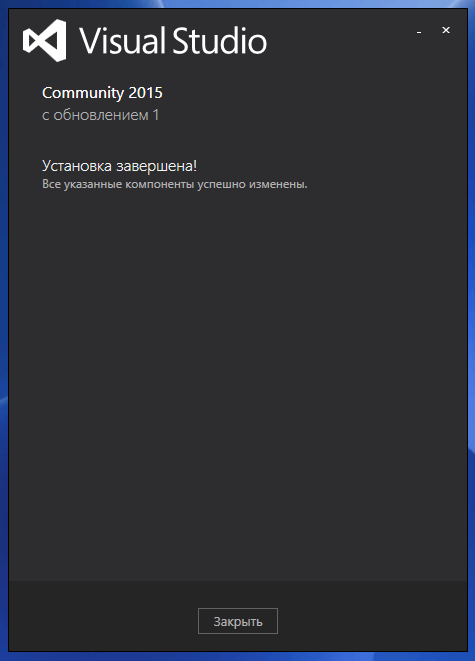

Теперь при создании проекта вы увидите привычные проекты для C++.

Можете попробовать создать простое консольное приложение по уроку:

[Создание консольного приложения сложения двух чисел Win32 в Visual Studio 2013](https://github.com/Harrix/harrix.dev-blog-2015/blob/main/add-2-num-vs-2013-console/add-2-num-vs-2013-console.md).
