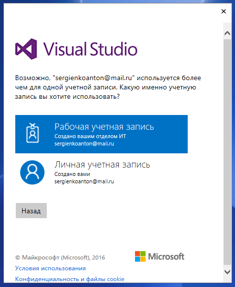

# Установка Visual Studio 2015 Community

В статье приведена инструкция по установке бесплатной версии Visual Studio 2015 Community на Windows 10 для программирования на C++.

**Внимание!** Вышла Visual Studio 2019. [Читайте](https://github.com/Harrix/harrix.dev-blog-2021/blob/main/install-visual-studio-2019/install-visual-studio-2019.md) более новую статью.

Если вам нужна именно версия 2015 года, то читайте эту статью: [Скачивание старых версий Visual Studio](https://github.com/Harrix/harrix.dev-blog-2018/blob/main/download-old-versions-vs/download-old-versions-vs.md).

Далее идет старая инструкция, как устанавливать Visual Studio 2015 после скачивания инсталлятора.

## Установка

Запускаем скаченный файл:

_Рисунок 1 — Запуск файла_

Windows начнет автоматически что-то скачивать и это нормально:

_Рисунок 2 — Автоматическое скачивание_

И после этого будет предложено запустить установку Visual Studio. Жмем `Запустить`:

_Рисунок 3 — Запуск установки_

После этого некоторое время будет висеть окно с логотипом студии:

_Рисунок 4 — Начальное окно установки_

Параметры установки выбираем по умолчанию:

_Рисунок 5 — Параметры по умолчанию_

`Внимание!` Если вы разбираетесь в теме, то можно выбрать выборочную установку и сократить себе шаги, описанные ниже. О параметрах выборочной установки под спойлером.

---

**Выборочная установка** <!-- !details -->

_Рисунок 6 — Выбор типа установки_

_Рисунок 7 — Выбор выборочной установки_

_Рисунок 8 — Выбор настроек_

_Рисунок 9 — Выбор настроек_

_Рисунок 10 — Процесс установки_

---

И установка началась:

_Рисунок 11 — Процесс установки_

Скачиваться будет долго.

После завершения установки перезагрузите компьютер.

После этого запускаете Visual Studio. Но не найдетесь, что на этом всё.

При запуске вас попросят зайти под учеткой Microsoft. Если у вас её нет, то создайте на их сайте <https://www.microsoft.com/ru-ru/>.

Введите потом в Visual Studio электронную почту, на которую заведена учетка Microsoft:

_Рисунок 12 — Ввод email_

Можно потом выбрать чья это учетка: ваша личная или вы работаете где-то:

_Рисунок 13 — Выбор типа учетки_

Вводите данные своей учетки:

_Рисунок 14 — Ввод пароля_

Может вылететь такая ошибка — ничего страшного:

_Рисунок 15 — Ошибка_

И напоследок при первом запуске студии вас попросят выбрать тему оформления:

_Рисунок 16 — Выбор темы_

И Visual Studio запустилась! Но, к сожалению, еще не всё. Если вы создадите пустой проект на C++, то увидите, что пакеты для приложений на C++ не установились по умолчанию:

_Рисунок 17 — Новый проект_

_Рисунок 18 — Отсутствие типов проектов_

Поэтому жмем на `Install Visual C++ Tools for Windows Desktop`:

В появившемся окне жмем `Установить`:

_Рисунок 19 — Начальное окно установки_

_Рисунок 20 — Начало установки_

_Рисунок 21 — Выбор компонентов для установки_

_Рисунок 22 — Запуск установки_

Установка тоже может длиться долго:

_Рисунок 23 — Конец установки_

Теперь при создании проекта вы увидите привычные проекты для C++.

Можете попробовать создать простое консольное приложение по уроку:

[Создание консольного приложения сложения двух чисел Win32 в Visual Studio 2013](https://github.com/Harrix/harrix.dev-blog-2015/blob/main/add-2-num-vs-2013-console/add-2-num-vs-2013-console.md).
