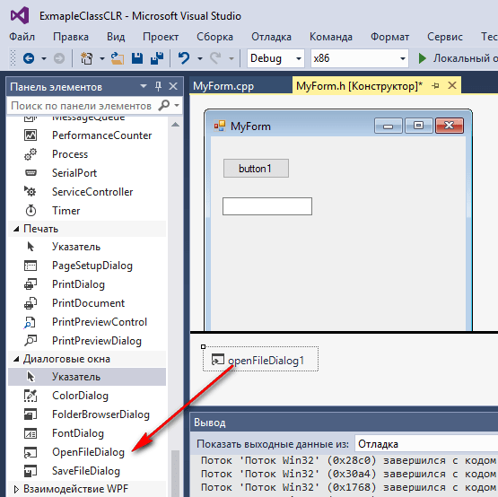

# Создание своего класса в CLR приложении в Visual Studio 2015 на C++/CLI

Учебный пример, для демонстрации создания своего класса, который бы взаимодействовал с формой приложения CLR приложении в Visual Studio 2015 на C++/CLI.

## Постановка задачи

Надо написать класс, который внутри себя имеет только одну строковую переменную. Класс получает из кнопки имя файла, а возвращает расширение файла в виде строки.

## Болванка приложения

Итак, создайте пустое приложение CLR с формой. Это можно сделать по [статье](https://github.com/Harrix/harrix.dev-blog-2016/blob/main/add-2-num-vs-2015-clr/add-2-num-vs-2015-clr.md) дойдя в ней до пункта «Интерфейс приложения».

## Интерфейс программы

Перетащите на форму кнопку и текстовое поле:


А также диалоговое окно открытия файла:



## Создание своего класса

Правый клик по проекту, и создаем новый элемент:


Создаем `ExampleClass.h`:


И в новом файле добавляем такой код:

```cpp
using namespace System;
using namespace System::IO;
using namespace System::Xml;

ref class ExampleClass {
public:
  ExampleClass();
  ExampleClass(String^ fileName);
  void setFileName(String^ fileName);
  String^ getFileExtension();
private:
  String^ fileName;
};
ExampleClass::ExampleClass() {
  fileName = "1.txt";
}
ExampleClass::ExampleClass(String^ fileName) {
  this->fileName = fileName;
}
void ExampleClass::setFileName(String^ fileName) {
  this->fileName = fileName;
}
String^ ExampleClass::getFileExtension() {
  int i = fileName->LastIndexOf(".");
  String^ Ext = fileName->Substring(i);
  return Ext;
}
```


Обратите внимание на тот факт, что нам перед словом `class` нужно еще написать `ref`, чтобы мы могли использовать тип `String^`.

Также я подключил `System::IO`, `System::Xml`. Просто данная статья будет использоваться теми, кому эти два пространства имен будут нужны. Но вы можете их удалить.

## Использование класса

Перейдем в файл `MyForm.h`:


Двойной клик по кнопке:


Там пишем код:

```cpp
if (openFileDialog1->ShowDialog() == System::Windows::Forms::DialogResult::OK)
{
  String^ fileName = openFileDialog1->FileName;
  ExampleClass a(fileName);

  String^ Ext = a.getFileExtension();
  textBox1->Text = Ext;
}
```


Не забываем вверху файла `MyForm.h` подключить наш файл класса:

```cpp
#include "ExampleClass.h"
```


## Запуск программы

Запускаем программу:


Нажимаем на кнопку:


Выбираем файл:


В текстовом поле видите расширение файла:


