# Обзор PVS-Studio


PVS-Studio — программа, которая ищет в исходных кодах проектов на C++, C# ошибки, которые компилятор не видит, но программист в этих местах скорее всего накосячил.

<details>
<summary>📖 Содержание</summary>

## Содержание

- [Введение](#введение)
- [Установка](#установка)
- [О том, как ничего не получилось](#о-том-как-ничего-не-получилось)
- [О том, как всё получилось](#о-том-как-всё-получилось)
- [Разбор ошибок](#разбор-ошибок)
- [Вердикт](#вердикт)
  - [Минусы](#минусы)
  - [Плюсы](#плюсы)

</details>

## Введение

На меня вышли люди из PVS-Studio с вопросом о сотрудничестве. О данной программе наслышан много со страниц [Хабрахабра](https://habr.com/ru/company/pvs-studio/), но никогда этим продуктом не пользовался. И я предложил такой вариант: они мне дают лицензия на продукт, и я проверяю свои программы и пишу обзор на ней: о том, как пользовался, как проверял коды и так далее. Они согласились.

Итак, в данной статье вы увидите, как сейчас модно говорить, честный обзор без всяких приукрашиваний с точки зрения рядового среднего программиста, который больше работает в области «научного» программирования, чем в области прикладного. В общем, я там не какой-то гуру из крупной компании со сложными проектами, который умеет работать с массой служебных программ, знает, как внедрять оптимизацию в компиляторы и так далее.

Второй момент. Еще несколько лет назад был приверженцем процедурного программирования, не любил ООП, не использовал пространства имен, напридумывал много велосипедов и так далее. Сейчас тот период вспоминаю как страшный сон и многие свои программы активно переписываю, но проверять там пока мало что есть. Поэтому для проверки возьму те проекты (все есть на GitHub) из того периода. Хоть там и процедурщина правит, но я тщательно подходил к написанию программ, тестированию, документации — я думаю, что серьезных ошибок там быть не должно.

Итак, вперед.

## Установка

С установкой проблем не возникло. На [главной странице](https://www.viva64.com/ru/pvs-studio/) есть большая кнопка «Скачать», которая ведет на страницу с видной ссылкой на скачивание:

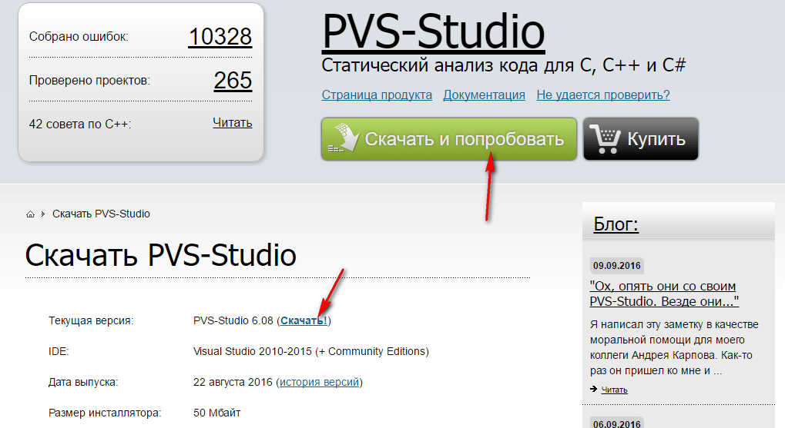

_Рисунок 1 — Кнопка скачивания программы_

Установка абсолютно стандартная, там даже ничего выбирать особо нельзя. Но я в своих статьях всегда стараюсь приводить даже самые понятные шаги. Так что под спойлером скрины:

<details>
<summary>Установка PVS-Studio</summary>

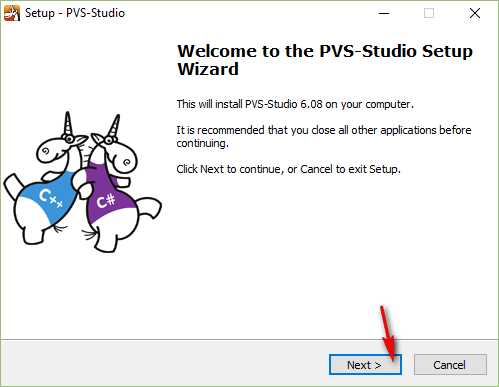

_Рисунок 2 — Первое окно программы установки_

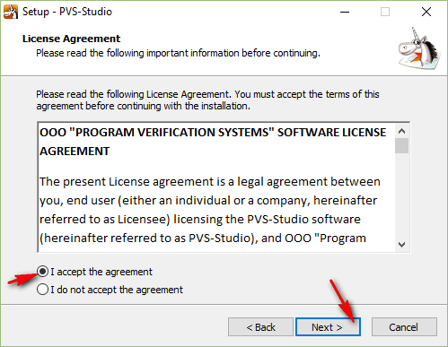

_Рисунок 3 — Соглашение с лицензией_

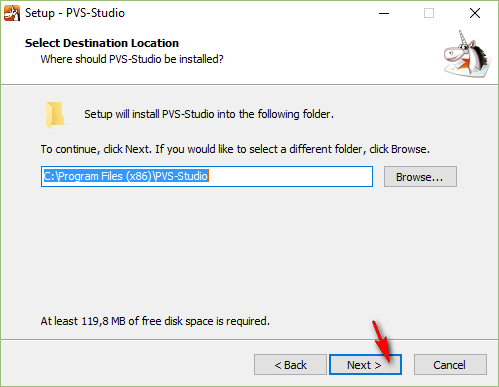

_Рисунок 4 — Выбор папки для установки программы_

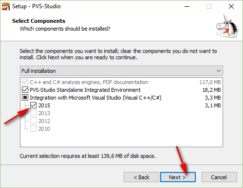

_Рисунок 5 — Выбор компонентов для установки_

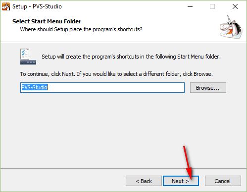

_Рисунок 6 — Выбор папки в главном меню_

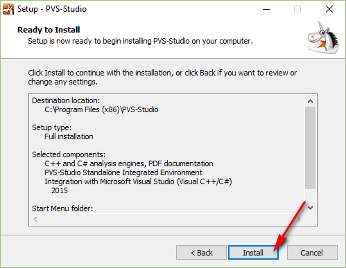

_Рисунок 7 — Окно перед процессом установки программы_

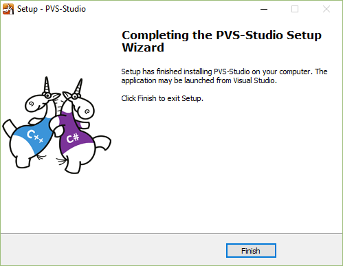

_Рисунок 8 — Окончание установки_

</details>

## О том, как ничего не получилось

Сразу говорю, что никакую документацию вначале не читал. Установил программу. Что дальше? В «Пуске» появились следующие пункты:

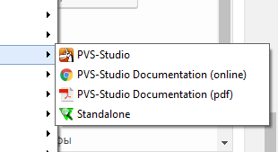

_Рисунок 9 — Пункты в меню Пуск_

Интуиция подсказывает, что нужный пункт совпадает с названием программы. Щелкаем. И тут меня обломали. Выскочило вот такое сообщение:

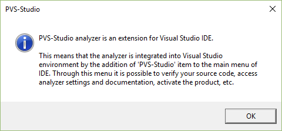

_Рисунок 10 — Сообщении при открытии программы_

Если честно, то я сильно напрягся: я-то работаю в основном в Qt, а Visual Studio скорее держу как обучающую программу для студентов.

Ладно. Может быть мне поможет другой пункт в меню `Standalone`:

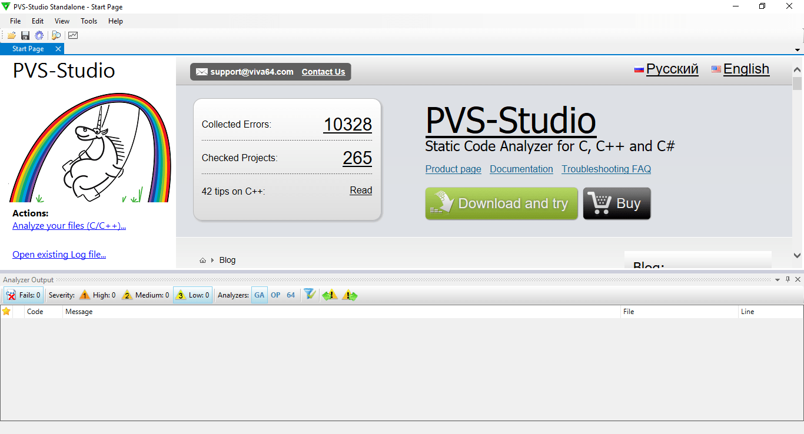

_Рисунок 11 — Открытая программа Standalone_

Вот это уже интереснее. Теперь важное замечание. Мой **предполагаемый** механизм работы программы: в программе я открываю исходники проекта, и программа находит мне ошибки в коде. Как потом оказалось, что программа работает совсем по-другому. Но об этом позже.

Итак, вначале я попытался открыть какой-нибудь свой файл (меня напряг факт, что можно выбрать только один файл, а не несколько):

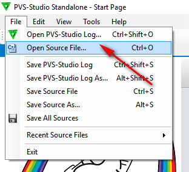

_Рисунок 12 — Команда открытия файла исходного кода_

Открыл. А дальше что? Никаких больших или ярких кнопок нет:

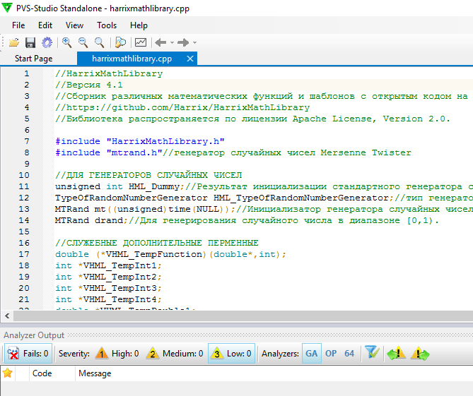

_Рисунок 13 — Открытый файл исходного кода_

В главном меню нашел только один пункт, который похож на то, что мне нужно:

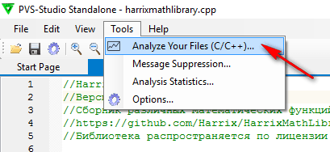

_Рисунок 14 — Пункт меню с анализом файла_

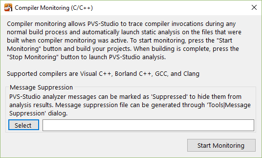

_Рисунок 15 — Сообщение при вызове команды_

Вот тут я сглупил. Я не стал читать этот текст, а сразу стал тыкать кнопки. В `Select` меня попросили выбрать какие-то `*.suppress` файлы. Явно не то, что нужно. Глаз зацепился за слово `Compiler`. Значит, запускаем `Start Monitoring`:

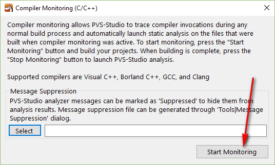

_Рисунок 16 — Запуск Start Monitoring_

Лично я подумал, что программа ищет компиляторы на компе, так что процесс может быть долгим. И процесс реально оказался долгим (я ждал несколько часов). Но меня радовало, что что-то он начал находить:

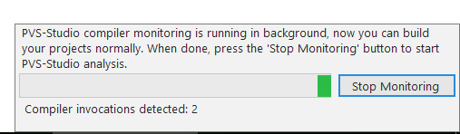

_Рисунок 17 — Процесс работы программы_

Уже потом я выяснил, что дело в том, что я во время мониторинга спокойно работал со своими проектами и их компилировал.

После пару часов я решил, что хватит мне найденных компиляторов и решил остановить поиск. Но, к сожалению, программа мне ничего не выдала. Что в таком случае делать? Блин, придется читать документацию.

Вот не на самом видном месте оказался нужный мне кусок:

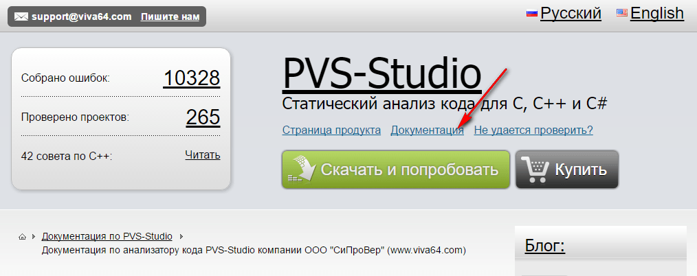

_Рисунок 18 — Документация на сайте_

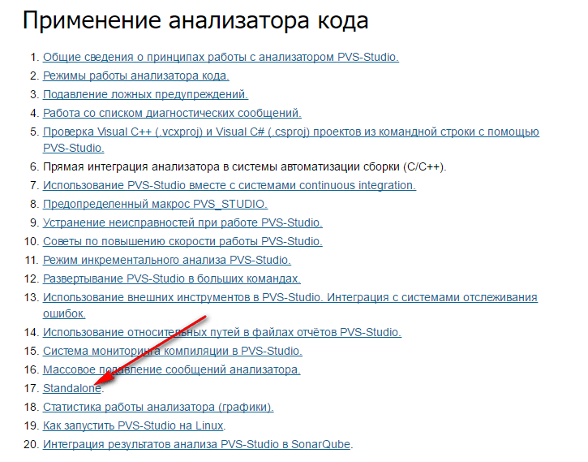

_Рисунок 19 — Список статей документации_

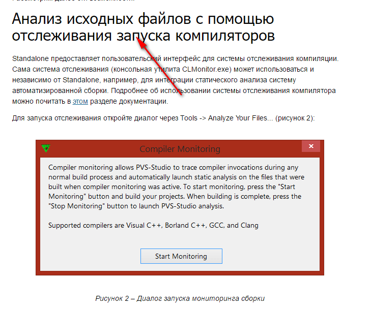

_Рисунок 20 — Документация на Standalone_

Но вот после прочтения статьи я наконец-то понял, что мне нужно делать.

## О том, как всё получилось

**Настоящий** принцип работы программы, а не предполагаемый.

Запускаю мониторинг в PVS-Studio, а потом запускаю свой компилятор со своим проектом. После компиляции останавливаю мониторинг, и программа через некоторое время выдает мне ошибки в проекте.

Покажу на примере тестового приложения Qt 5.7 под MinGW, которое будет использовать мою библиотеку [Harrix MathLibrary](https://github.com/Harrix/Harrix-MathLibrary).

Открываю раздел анализа:

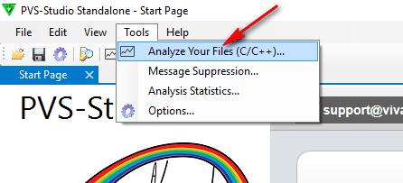

_Рисунок 21 — Пункт меню с анализом файла_

Запускаю мониторинг запусков компиляторов:


_Рисунок 22 — Запуск Start Monitoring_

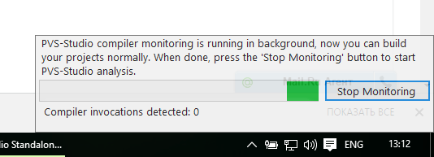

_Рисунок 23 — Поиск компиляторов_

Запускаю компиляцию проекта:

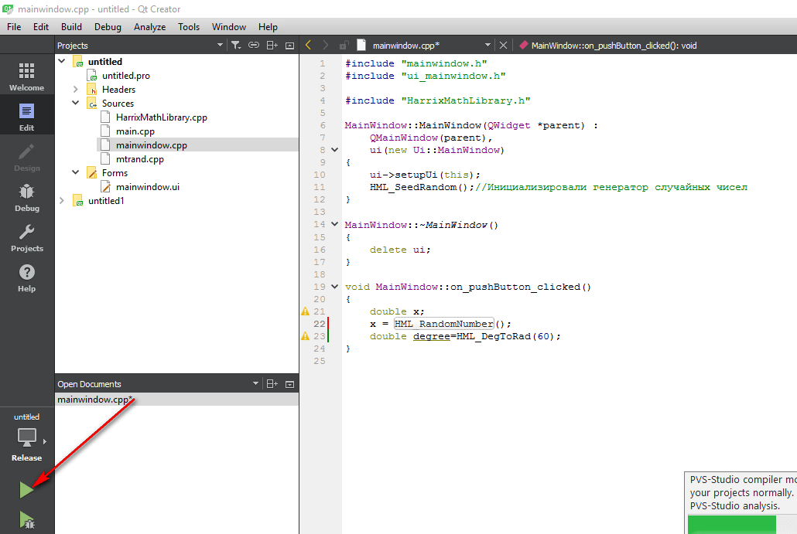

_Рисунок 24 — Запуск приложения в Qt_

PVS-Studio нашла запуск нашего компилятора:

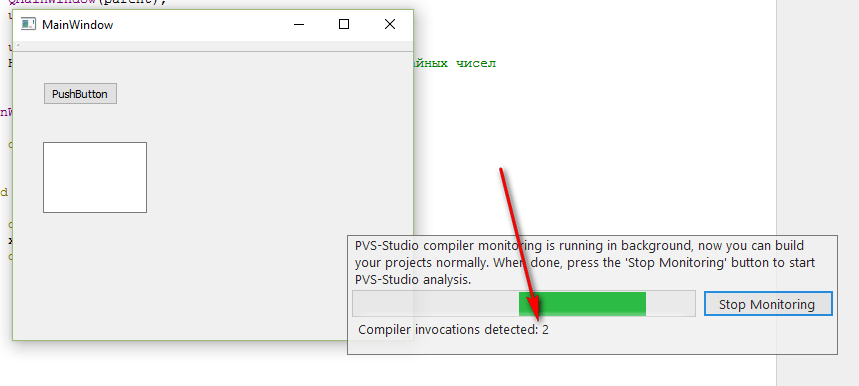

_Рисунок 25 — Найденные компиляторы_

Останавливаем мониторинг:

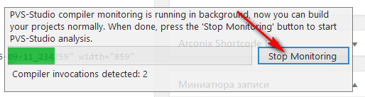

_Рисунок 26 — Остановка мониторинга_

И PVS-Studio нашла кучу замечаний. Блин. А я-то надеялся:

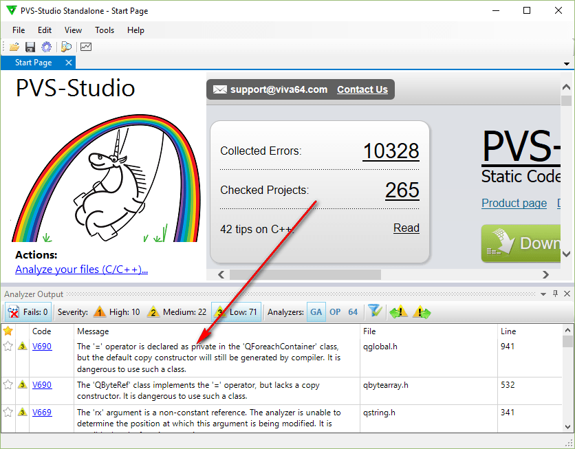

_Рисунок 27 — Найденные замечания и ошибки_

Двойной щелчок по ошибке, и программа открывает нам файл исходного кода с ошибкой:

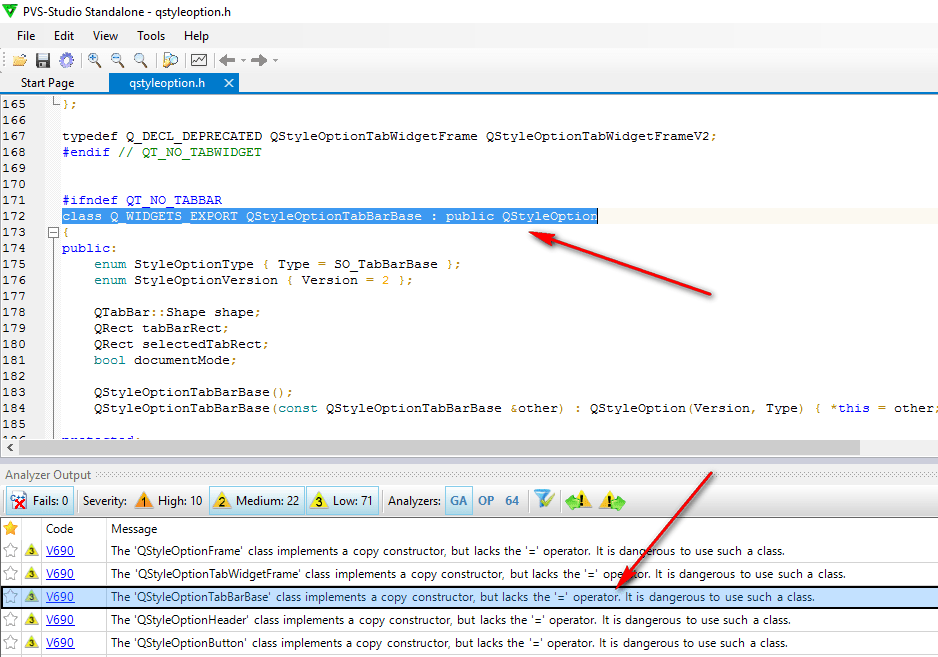

_Рисунок 28 — Код с ошибкой_

Когда наконец понимаешь принцип работы программы, то в дальнейшем всё становится просто. Однако для новичка это не совсем интуитивно.

Ну, а теперь посмотрим, а что за ошибки найдены. Может это и не ошибки вовсе?

**Замечание.** При запуске компилятора перестраиваете весь проект. Вот только что я расстроился из-за того, что мне нашли `71` замечаний. Я очистил проект и полностью перестроил проект. Теперь мне нашли более `1900` замечаний:

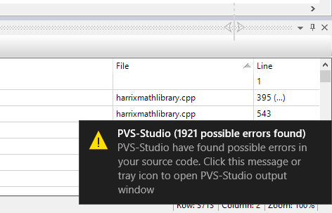

_Рисунок 29 — Нахождение 1900 ошибок и замечаний_

Вот тут мне уже хочется материться.

## Разбор ошибок

Мы рассмотрели путь моего восхождения по использованию программы, поняли, как ею пользоваться. Теперь посмотрим на результат работы программы.

Ошибки, найденные в самом Qt меня особо не интересуют — это пусть останется на совести соответствующих разработчиков:

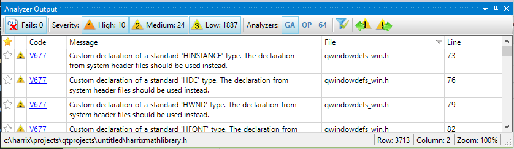

_Рисунок 30 — Ошибки, найденные в Qt_

Посмотрим, где я накосячил.

Подавляющее большинство из более 1900 замечаний — это замечание `V550`:

```text
> V550. An odd precise comparison. It's probably better to use a comparison with defined precision: fabs(A - B) < Epsilon or fabs(A - B) Epsilon
```

И в большинстве случаев я склонен с этим согласиться. Например, в данном примере (`F[i]==F[i+1]`) может возникнуть проблема:

```cpp
//для одинаковых элементов ранги делаем одинаковыми как среднее арифметическое
for (i=0;i<VHML_N-1;i++)
 {
 if (F[i]==F[i+1])
  {
  j=i+1;
  while ((F[i]==F[j])&&(j<VHML_N)) j++;
  Sn=HML_SumOfArithmeticalProgression(i+1,1,j-i);
  Sn/=double(j-i);
  for (k=0;k<VHML_N;k++)
   if (Fitness[k]==F[i]) VHML_ResultVector[k]=Sn;
  i=j-1;
  }
 }
```

И тем более в страшном коде модели маятника Максвелла крайние положения маятника лучше так не проверять:

```cpp
if (((x==R)&&(v<0))||((x==l)&&(v>0))) v=-v*(1.-k);//если маятник находится в крайних точках,
```

А в следующем коде вылетело следующее предупреждение:

```cpp
//Найдем среднее арифметические двух выборок
xn=HML_Mean(x,VHML_N);
yn=HML_Mean(x,VHML_N);
```

```text
> V656 Variables 'xn', 'yn' are initialized through the call to the same function. It's probably an error or un-optimized code. Consider inspecting the 'HML_Mean(x, VHML_N)' expression. Check lines: 3712, 3713. harrixmathlibrary.h 3713
```

Очень досадная ошибка. Судя по всему, скопировал и не всё поменял.

Далее идет еще одна глупая ошибка:

```cpp
int VHML_Result=0;
if (VHML_N1==VHML_N2)
    for (int i=0;i<VHML_N1;i++)
        if (a[i]!=b[i]) VHML_Result=-1;
        else
            VHML_Result=-1;
```

```text
> V523 The 'then' statement is equivalent to the 'else' statement. harrixmathlibrary.h 695
```

Данная функция всегда будет выдавать, что решение есть. Я так и не понял, что мною двигало, чтобы я в конце работы функции перечеркнул все вычисления переменной `solutions`:

```cpp
double HML_LineTwoPoint(double x, double x1, double y1, double x2, double y2, int *solutions)
{
/*
Функция представляет собой уравнение прямой по двум точкам.
Возвращается значение y для x.
Входные параметры:
 x - значение точки для которой считаем значение прямой;
 x1 - абсцисса первой точки;
 y1 - ордината первой точки;
 x2 - абсцисса второй точки;
 y2 - ордината второй точки;
 solutions - сюда возвращается результат решения задачи:
  0 - решения нет;
  1 - решение есть;
  2 - любое число является решением (прямая параллельна оси Oy).
Возвращаемое значение:
 Значение y прямой для данного x.
*/
double y=0;

if ((x1==x2)&&(y1==y2))
{
    //это одна и та же точка, так что выдадим любое решение
    y=y1;
    *solutions=2;
}
else
{
    if (y1==y2)
    {
     // это прямая параллельна оси Ox
        y=y1;
        *solutions=1;
    }
    else
    {
        if (x1==x2)
        {
            //это прямая параллельная оси Oy
            if (x==x1)
            {
                y=y1;
                *solutions=2;
            }
            else
            {
                y=0;
                *solutions=0;
            }
        }
        else
        {
            y=(x-x1)*(y2-y1)/(x2-x1)+y1;
        }
    }
}

*solutions=1;
return y;
}
```

```text
> V519 The '* solutions' variable is assigned values twice successively. Perhaps this is a mistake. Check lines: 1788, 1821. harrixmathlibrary.cpp 1821
```

В следующем примере скорее не ошибка, а излишняя предосторожность: на всякий случай обнулять вначале итоговую переменную:

```cpp
if (VHML_N>0) VHML_Result=0;
...

//Посчитаем значение целевой функции вещественного вектора
VHML_Result=VHML_TempFunction(VHML_TempDouble3,RealLength);

return VHML_Result;
```

```text
> V519 The 'VHML_Result' variable is assigned values twice successively. Perhaps this is a mistake. Check lines: 385, 395. harrixmathlibrary.cpp 395
```

PVS-Studio также нашла одинаковые функции в моем коде (тогда я еще не любил `std`). Кроме этих он нашел еще несколько одинаковых функций. А эта крайне полезно, если проект большой и в нем много функций. Не всегда вспомнишь: а такая функция была или нет:

```cpp
template <class T> void HML_Swap(T &a, T &b)
{
/*
Функция меняет местами значения двух чисел.
Входные параметры:
 a - первое число;
 b - второе число.
Возвращаемое значение:
 Отсутствует.
*/
T x;
x = b;
b = a;
a = x;
}

template <class T> void HML_NumberInterchange(T &a, T &b)
{
/*
Функция меняет местами значения двух чисел.
Входные параметры:
 a - первое число;
 b - второе число.
Возвращаемое значение:
 Отсутствует.
*/
T x;
x = b;
b = a;
a = x;
}
```

```text
> V524 It is odd that the body of 'HML_Swap' function is fully equivalent to the body of 'HML_NumberInterchange' function. harrixmathlibrary.h 2349
```

А тут классическая ошибка отсутствия приведения типов:

```cpp
double HML_TestFunction_HyperEllipsoid(double *x, int VHML_N)
{
/*
Функция многих переменных: Гипер-эллипсоид.
Тестовая функция вещественной оптимизации.
Входные параметры:
 x - указатель на исходный массив;
 VHML_N - размер массива x.
Возвращаемое значение:
 Значение тестовой функции в точке x.
*/
double VHML_Result=0;

for (int i=0;i<VHML_N;i++)
  VHML_Result += (i+1)*(i+1)*x[i]*x[i];

return VHML_Result;
}
```

```text
> V636 The '(i + 1) * (i + 1)' expression was implicitly cast from 'int' type to 'double' type. Consider utilizing an explicit type cast to avoid overflow. An example: double A = (double)(X) * Y;. harrixmathlibrary.cpp 10509
```

А вот тут программа выдала ошибочное предупреждение, так как `HML_ProportionalSelectionV2` возвращает случайное значение:

```cpp
NumberOfParent1=HML_ProportionalSelectionV2(VectorOfProbability,PopulationSize);
NumberOfParent2=HML_ProportionalSelectionV2(VectorOfProbability,PopulationSize);
```

```text
> V656 Variables 'NumberOfParent1', 'NumberOfParent2' are initialized through the call to the same function. It's probably an error or un-optimized code. Check lines: 1106, 1107. harrixmathlibrary.cpp 1107
```

В библиотеке [Harrix QtLibrary](https://github.com/Harrix/Harrix-QtLibrary) было также найдено несколько замечаний.

Например, там была функция разбиения строки на слоги. И там хорошая подсказка вылезла, что условия неплохо было бы объединить:

```cpp
//«Х-»
if ((i>=1)&&(i!=N-1))
{
    if ((HQt_GetTypeCharRus(S.at(i-1))==3)&&(HQt_GetTypeCharRus(S.at(i))!=0)&&(HQt_GetTypeCharRus(S.at(i+1))!=0))
        cut=true;
}

//«Г-Г»
if ((i>=1)&&(i!=N-1))
{
    if ((HQt_GetTypeCharRus(S.at(i-1))==1)&&(HQt_GetTypeCharRus(S.at(i))==1)&&(HQt_GetTypeCharRus(S.at(i+1))!=0))
        cut=true;
}
```

```text
> V581 The conditional expressions of the 'if' operators situated alongside each other are identical. Check lines: 1140, 1147. harrixqtlibrary.cpp 1147
```

А в цикле из нижеследующего куска кода булевская переменная `in` всегда будет равна `true`:

```cpp
int VHQt_Result = -1;
bool in=false;
int i=0;

while ((i<StringList.count())&&(in!=true))
{
    if (StringList.at(i)==String)
        VHQt_Result=i;
    i++;
}

return VHQt_Result;
```

```text
> V560 A part of conditional expression is always true: (in != true). harrixqtlibrary.cpp 2342
```

Встречаются случаи, когда в заполнении модели элементами встречаются повторы:

```cpp
item = new QStandardItem(QString("HML_RealGeneticAlgorithmTournamentSelectionWithReturn"));
model->appendRow(item);

item = new QStandardItem(QString("HML_RealGeneticAlgorithmTournamentSelectionWithReturn"));
model->appendRow(item);:
```

```text
> V760 Two identical blocks of text were found. The second block begins from line 86. mainwindow.cpp 83
```

## Вердикт

### Минусы

- Программа не интуитивно понятна. С ходу понять, как с ней работать сложно. Если бы я просто зашел к ним на сайт, скачал пробную версию и решил бы посмотреть, что это за зверь, то я скорее всего, не разобравшись, удалил программу.
- «Старомодный» дизайн приложения.
- Подсветка синтаксиса похожа на таковую в Notepad++ (и это хорошо). Но, например, я привык, что в Notepad++ при выделении слова выделяются такие же слова, а при выделении открывающейся скобки подсвечивается закрывающаяся.

### Плюсы

- Программа отлично справляется со задачей, а это самое главное. Программа находит много скрытых ошибок или замечаний в коде, которые разработчик скорее всего сам не увидит.
- Когда разбираешься в программе, то работать с ней становится удобно и легко.
- Поддерживает несколько компиляторов, в том числе и те, кто используются в сборках Qt.

**Общий итог**: данная программа относится к разряду **must have**. Очень удобный инструмент по контролю своего кода.

P.S. А я надеялся, что ошибок не будет.

P.S.S. 1900 с лишим замечаний!
