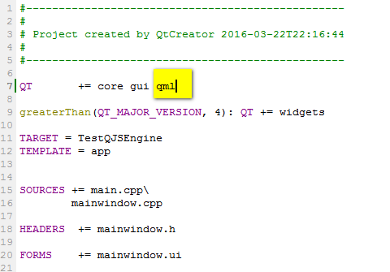
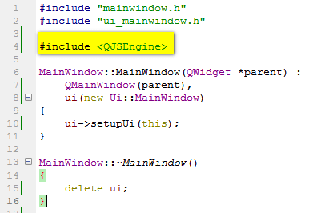
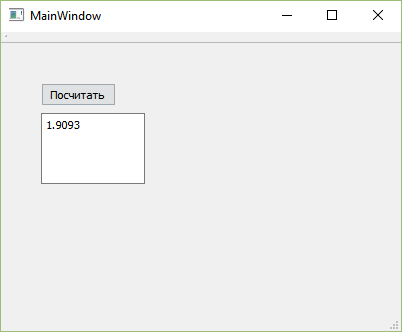
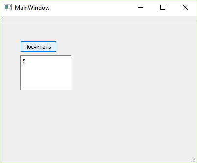

# Интерпретатор функций в Qt — QJSEngine


Стандартный интерпретатор в Qt (QtScript) устарел. Теперь вместо него QJSEngine. В статье рассказывается, как с ним работать при вычислении выражений.

## Содержание

- [Процесс](#процесс)
- [Вычисление простого выражения](#вычисление-простого-выражения)

Статья по содержанию совпадает со статьей [Интерпретатор функции в Qt — QtScript](https://github.com/Harrix/harrix.dev-articles-2014/blob/main/qtscript/qtscript.md) | [🡥](https://harrix.dev/ru/articles/2014/qtscript/), где рассказывается про QtScript.

Мы будем рассматривать простые математические пользовательские функции с одной и двумя переменными. По аналогии с ними вы сможете модифицировать код под себя.

**Постановка задачи:** У нас в переменной типа QString записан код пользовательской функции: $y(x)=sin(x)+1$. Надо посчитать значение функции в этой точке.

Для объяснения буду использовать простое приложение в Qt на Qt Widgets.

## Процесс

Вначале нужно прописать в файле проекта `.pro` факт подключения QML через добавления слова `qml`. Без этого не будут подключаться заголовочные файлы:

```cpp
QT += core gui qml
```



_Рисунок 1 — Добавление модуля «qml»_

В файле `mainwindow.cpp` или в том, что вам нужно пропишите подключение библиотеки:

```cpp
#include <QJSEngine>
```



_Рисунок 2 — Подключение QJSEngine_

А в кнопке пропишите такой код:

```cpp
 //Подготовка
double x=2;//в какой точки ищем значение функции
QString CodeFunction="r = Math.sin(x);r = r + 1;";

//Необходимые переменные
double result;
QJSEngine myEngine;
QJSValueList args;

//подготовка движка
QJSValue fun = myEngine.evaluate("(function fun(x) { var r=0;"+CodeFunction+" return r;})");

//Закидываем аргументы функции
args << x;

//Вычисление значения функции в точке
QJSValue value = fun.call(args);

result = value.toNumber();

ui->textEdit->insertPlainText(QString::number(result)+"\n");
```

При запуске приложения и нажатии на кнопку получите вот это:



_Рисунок 3 — Результат выполнения программы_

Для функции с двумя аргументами (например, $z(x,y)=x+y$) код будет немного отличаться:

```cpp
 //Подготовка
double x=2, y=3;//в какой точки ищем значение функции
QString CodeFunction="r = x + y;";

//Необходимые переменные
double result;
QJSEngine myEngine;
QJSValueList args;

//подготовка движка
QJSValue fun = myEngine.evaluate("(function fun(x,y) { var r=0;"+CodeFunction+" return r;})");

//Закидываем аргументы функции
args << x << y;

//Вычисление значения функции в точке
QJSValue value = fun.call(args);

result = value.toNumber();

ui->textEdit->insertPlainText(QString::number(result)+"\n");
```

При запуске получим вот это:



_Рисунок 4 — Результат выполнения программы_

## Вычисление простого выражения

Если же вам нужно вычислить значение простого выражения без всяких переменных, то всё гораздо проще. Например, вы хотите вычислить пример $2+2\cdot2$. Тогда код будет выглядеть так:

```cpp
QString CodeFunction="2+2*2";

QJSEngine myEngine;

QJSValue value = myEngine.evaluate(CodeFunction);

double result = value.toNumber();

ui->textEdit->insertPlainText(QString::number(result)+"\n");
```

Вот и всё пока) вы можете спокойно вводить тексты функций на языке JavaScript через файлы, поля ввода и использовать как функции в своих вычислениях. Конечно, скорость работы таких функций будет поменьше, чем у обычных C++ функций, но это и естественно.

Более подробную информацию по классу можно узнать в <https://doc.qt.io/qt-5/qjsengine.html>.
