# Подключение базы данных SQLite в Qt


В статье рассказывается о том, как можно подключить SQLite в Qt.

<details>
<summary>📖 Содержание</summary>

## Содержание

- [Подготовка базы данных](#подготовка-базы-данных)
- [Создание Qt приложения](#создание-qt-приложения)
- [Подключение базы данных](#подключение-базы-данных)

В данной статье рассмотрен лишь самый простой пример. Более подробный материал смотрите как в [документации](https://doc.qt.io/qt-5/sql-driver.html), так и в статьях других авторов (например, <http://www.prog.org.ru/topic_26665_0.html>).

</details>

## Подготовка базы данных

В [статье](https://github.com/Harrix/harrix.dev-articles-2016/blob/main/db-browser-for-sqlite/db-browser-for-sqlite.md) | [🡥](https://harrix.dev/ru/articles/2016/db-browser-for-sqlite/) рассказывается, как создавать базы данных заранее и заполнять их в специальной программе (одной из многих).

В данной статье будем придерживаться именно этой идеологии: проектирование базы данных и её создание мы осуществляем не в Qt.

Итак, допустим у нас есть небольшая [база данных](files/database.zip), в которой есть одна таблица и три столбца:

```sql
CREATE TABLE `People` (
`_id`  INTEGER PRIMARY KEY AUTOINCREMENT,
`Name`  TEXT NOT NULL,
`Age`  INTEGER NOT NULL
)
```

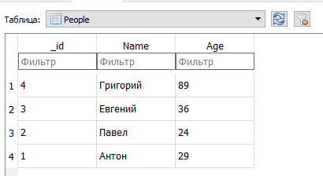

_Рисунок 1 — Таблица базы данных_

Предположим, что база данных находится в папке `C:\`.

## Создание Qt приложения

Под спойлером показывается процесс создания простого приложения. Получим вот такую картинку:

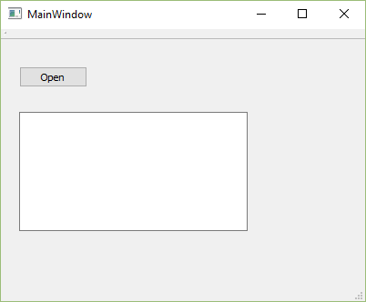

_Рисунок 2 — Внешниё вид приложения_

<details>
<summary>Создание приложения</summary>

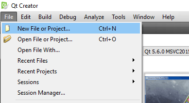

_Рисунок 3 — Пункт меню для создания нового проекта_

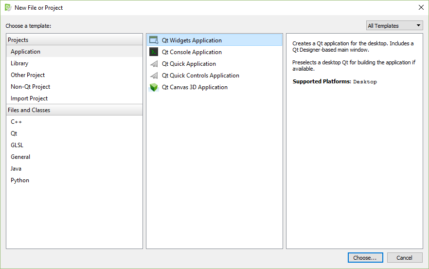

_Рисунок 4 — Выбор типа проекта_

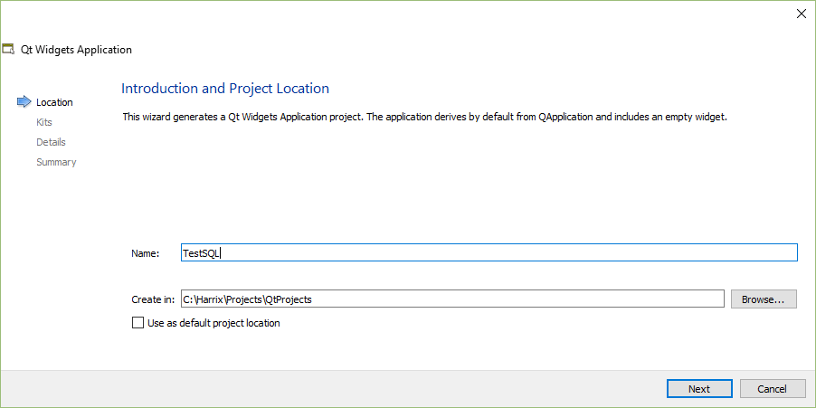

_Рисунок 5 — Выбор названия проекта и его расположения_

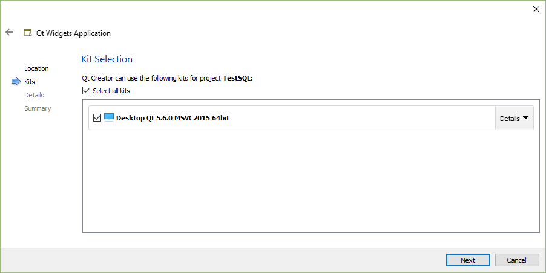

_Рисунок 6 — Выбор компилятора_

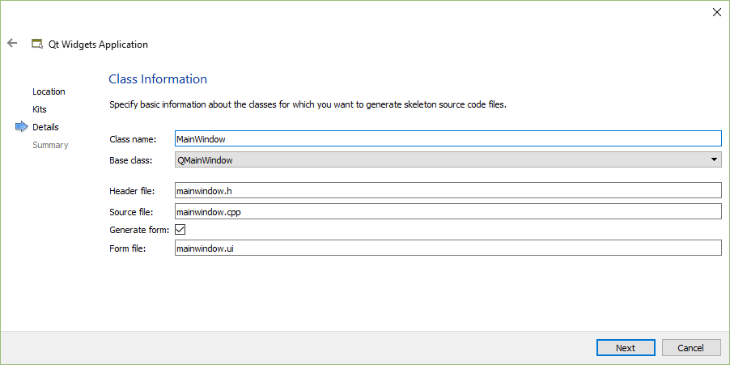

_Рисунок 7 — Выбор названия главного класса_

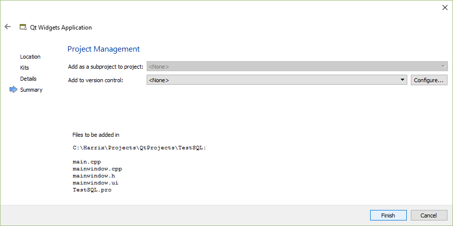

_Рисунок 8 — Настройка системы контроля версий_

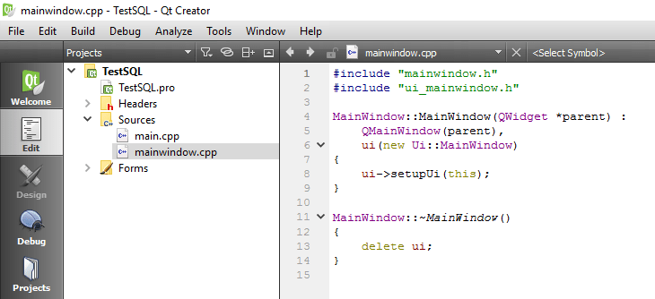

_Рисунок 9 — Окно Qt Creator с созданным проектом_

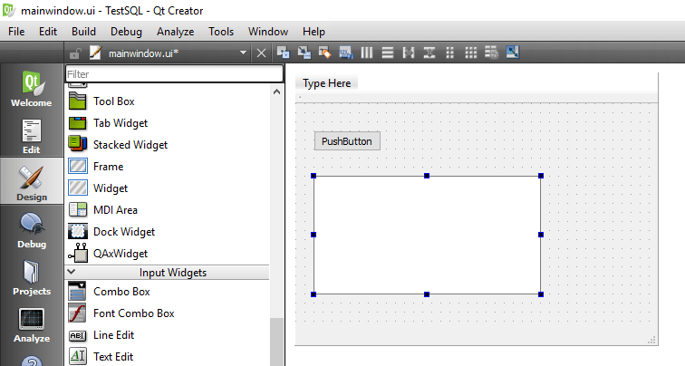

_Рисунок 10 — Элементы на форме приложения_

</details>

## Подключение базы данных

В файле `.pro` пропишите подключение блока `sql`.

Было:

```text
QT += core gui
```

Стало:

```text
QT += core gui sql
```

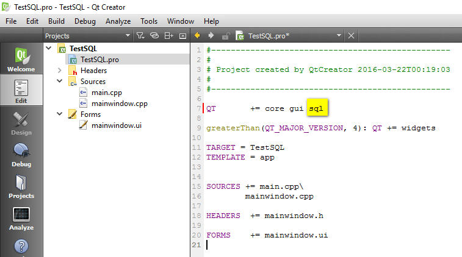

_Рисунок 11 — Измененный PRO файл_

Подключите инклуды:

```h
#include "QtSql/QSqlDatabase"
#include "QSqlQuery"
```

И в клике кнопки (или где вы хотите) пропишем код:

```cpp
// Подключаем базу данных
QSqlDatabase db;
db = QSqlDatabase::addDatabase("QSQLITE");
db.setDatabaseName("C:\\database.db3");
db.open();

// Осуществляем запрос
QSqlQuery query;
query.exec("SELECT _id, name, age FROM People");

// Выводим значения из запроса
while (query.next()) {
  QString _id = query.value(0).toString();
  QString name = query.value(1).toString();
  QString age = query.value(2).toString();
  ui->textEdit->insertPlainText(_id+" "+name+" "+age+"\n");
  }
```

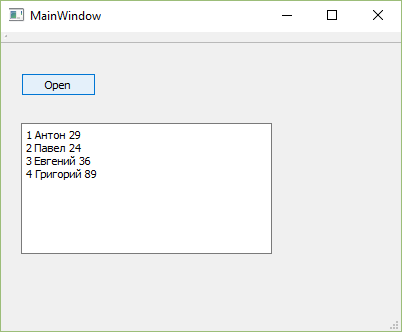

_Рисунок 12 — Результат работы программы_

P.S. В [статье](https://github.com/Harrix/harrix.dev-articles-2014/blob/main/output-data-to-qtableview/output-data-to-qtableview.md) | [🡥](https://harrix.dev/ru/articles/2014/output-data-to-qtableview/) рассказывается, как закидывать данные в таблицу в компонент `QTableView`.
