# Qt WebEngine в Qt Widgets приложении для просмотра веб-страниц

В статье рассказывается, как в подключить Qt WebEngine в Qt Widgets приложении в виде примера открытия сайтов с помощью данного компонента.

В версии Qt 5.6.0 выпилили `QWebKit`. Вместо него теперь `Qt WebEngine`. Так что придется теперь работать с ним. Обратите внимание, что новый компонент пока работает только для версии Qt под компилятором Visual Studio.

В `Design` режиме в Qt 5.6.0 еще нет данного компонента (возможно потом добавят). Поэтому нужно будет либо его нужно будет вручную добавить в файл формы, либо «скоммуниздить» из какого-нибудь примера. Пойдем вторым способом.

Перейдем в режим примеров:

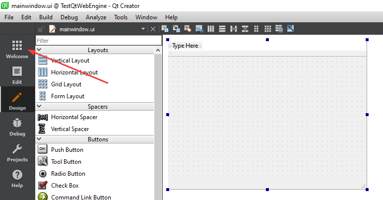

Например, нужный нам компонент есть в приложении `WebEngine Markdown Editor Example`. Щелкаем по нему:

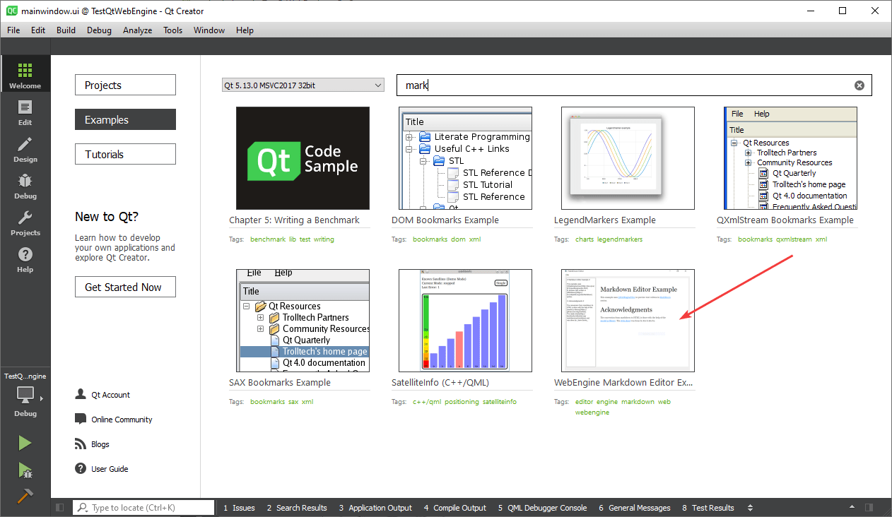

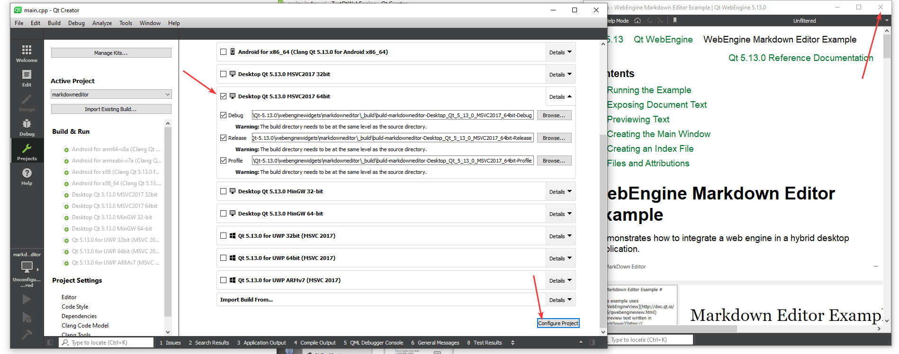

Переходим на форму приложения:

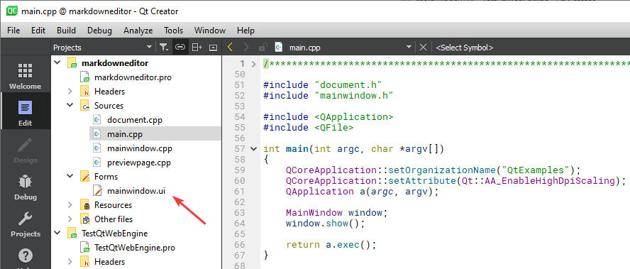

И там копируем компонент типа `QWebEngineView`:

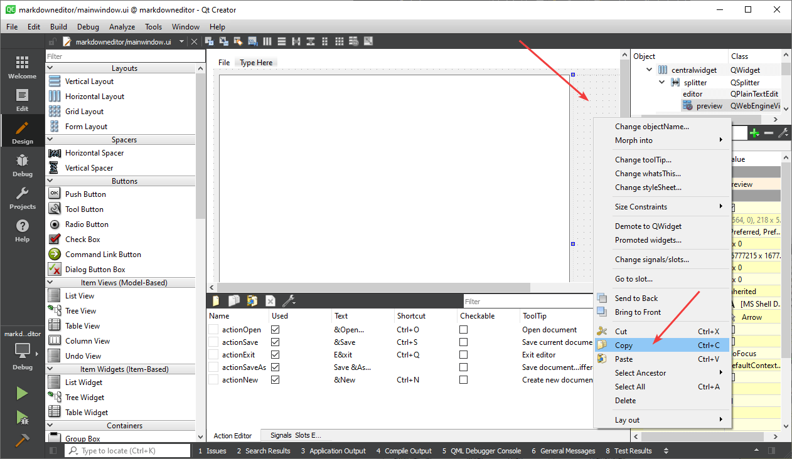

И вставляем его на форму нашего приложения:

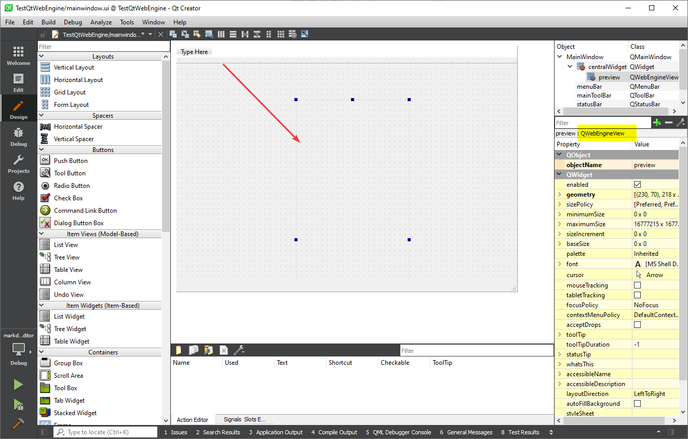

Я еще добавил на форму обычную кнопку и сделал компоновку по вертикали:

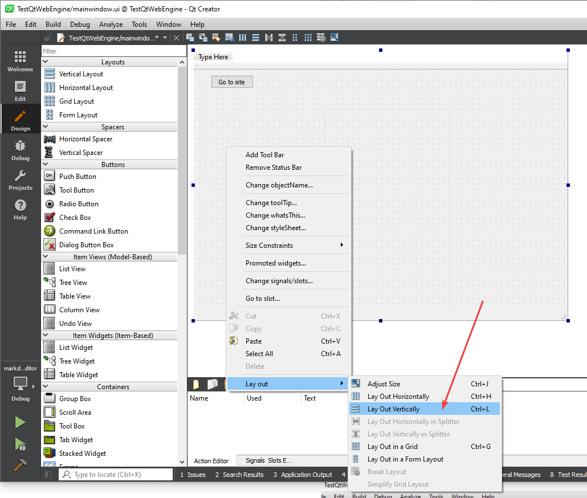

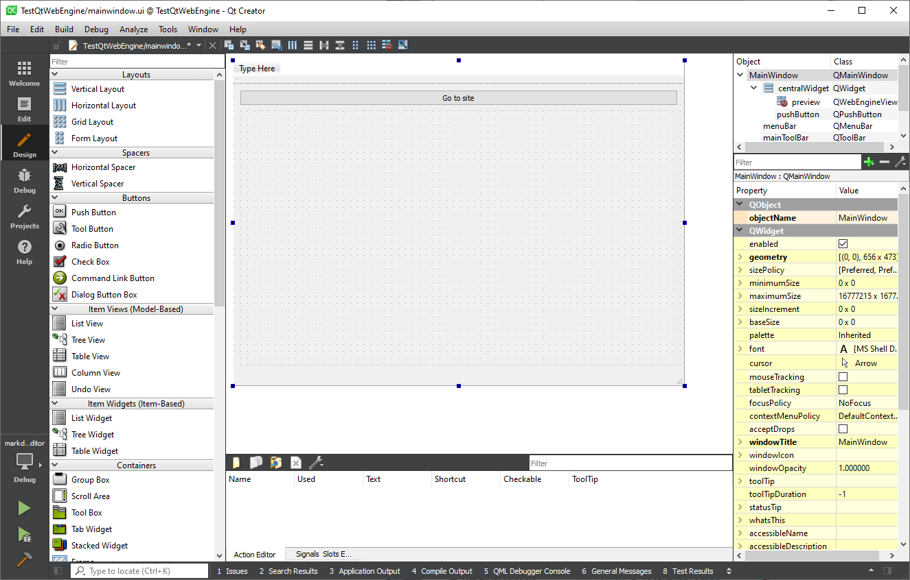

В `.pro` файле добавьте `webenginewidgets`:

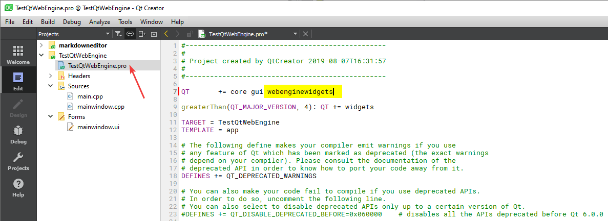

В слоте клика кнопки напишите такой код, не забыв подключить `#include <QUrl>`:

```cpp
ui->preview->load(QUrl("http://www.google.com/"));
ui->preview->show();
```

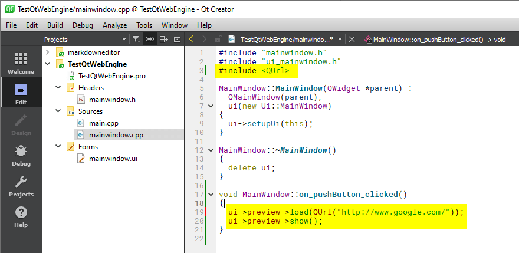

Теперь при старте программы и клике на кнопку (при наличии интернета) отобразится мой сайт:

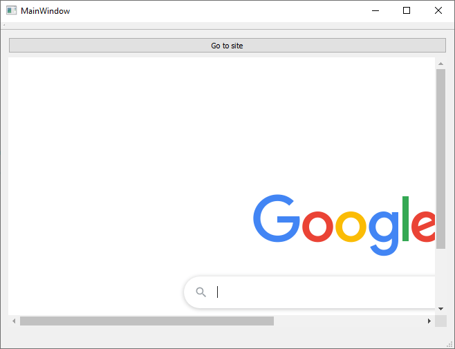

Кстати, если вам нужно открыть локальный файл, то вместо первой строчки в последнем коде может быть такая:

```cpp
ui->preview->load(QUrl::fromLocalFile("C:\\index.html"));
```
