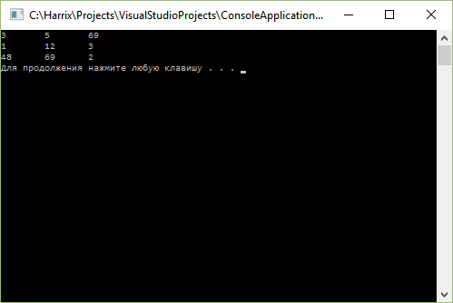

# Считывание матрицы из файла на C++


Пример кода на C++ с считыванием двумерного массива из целых чисел, разделенных пробелом, на C++.

Для того, чтобы считать из простого текстового файла матрицу, можно пойти несколькими путями. В примере ниже рассмотрен вариант, когда мы используем для хранения в программе классический динамический двумерный массив, а в файле не хранятся размеры матрицы в отдельной строке.

Принцип работы такой:

- Вначале обходим весь файл и считыванием через поток все целые числа. Тем самым узнаем число чисел в матрице.
- Затем посчитаем число пробелов до первого знака перевода на новую строку. Значит, число столбцов будет равно числу пробелов +1.
- Теперь мы знаем размеры матрицы и можем создать массив, и пройти по файлу, считывая данные в матрицу.

Программа является обучающим примером и содержит ряд недостатков, таких как:

- Можно сократить обход файла до одного, если, например, использовать списки.
- Считается, что между числами есть один пробел, а в конце строки пробела нет. А если будут лишние пробелы?
- Предполагаем, что в других строчках число чисел такое же, как и в первой.

Вот код самой программы:

```cpp
#include <fstream>
#include <iostream>
using namespace std;

int main()
{
  setlocale(LC_ALL, "RUSSIAN");

  //Создаем файловый поток и связываем его с файлом
  ifstream in("input.txt");

  if (in.is_open())
  {
    //Если открытие файла прошло успешно

    //Вначале посчитаем сколько чисел в файле
    int count = 0;// число чисел в файле
    int temp;//Временная переменная

    while (!in.eof())// пробегаем пока не встретим конец файла eof
    {
      in >> temp;//в пустоту считываем из файла числа
      count++;// увеличиваем счетчик числа чисел
    }

    //Число чисел посчитано, теперь нам нужно понять сколько
    //чисел в одной строке
    //Для этого посчитаем число пробелов до знака перевода на новую строку

    //Вначале переведем каретку в потоке в начало файла
    in.seekg(0, ios::beg);
    in.clear();

    //Число пробелов в первой строчке вначале равно 0
    int count_space = 0;
    char symbol;
    while (!in.eof())//на всякий случай цикл ограничиваем концом файла
    {
      //теперь нам нужно считывать не числа, а посимвольно считывать данные
      in.get(symbol);//считали текущий символ
      if (symbol == ' ') count_space++;//Если это пробел, то число пробелов увеличиваем
      if (symbol == '\n') break;//Если дошли до конца строки, то выходим из цикла
    }
    //cout << count_space << endl;

    //Опять переходим в потоке в начало файла
    in.seekg(0, ios::beg);
    in.clear();

    //Теперь мы знаем сколько чисел в файле и сколько пробелов в первой строке.
    //Теперь можем считать матрицу.

    int n = count / (count_space + 1);//число строк
    int m = count_space + 1;//число столбцов на единицу больше числа пробелов
    double **x;
    x = new double*[n];
    for (int i = 0; i<n; i++) x[i] = new double[m];

    //Считаем матрицу из файла
    for (int i = 0; i < n; i++)
      for (int j = 0; j < m; j++)
        in >> x[i][j];

    //Выведем матрицу
    for (int i = 0; i < n; i++)
    {
      for (int j = 0; j < m; j++)
        cout << x[i][j] << "\t";
      cout << "\n";
    }

    for (int i = 0; i<n; i++) delete[] x[i];
    delete[] x;

    in.close();//под конец закроем файла
  }
  else
  {
    //Если открытие файла прошло не успешно
    cout << "Файл не найден.";
  }

  system("pause");
  return 0;
}
```

Если у нас такой файл `input.txt`:

```text
3 5 69
1 12 3
48 69 2
```

То получим вот такое при запуске программы:



_Рисунок 1 — Результат работы программы_
